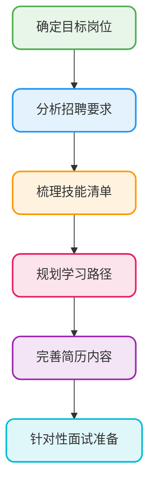
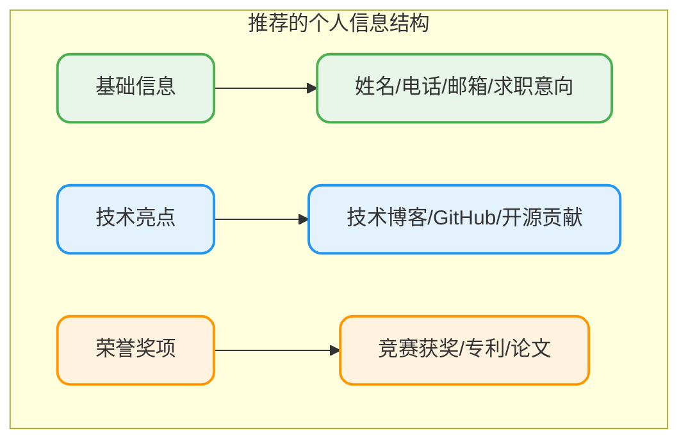
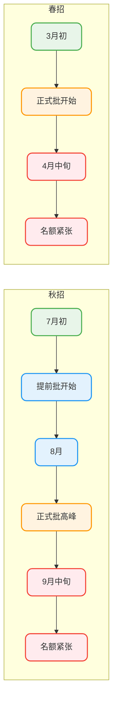
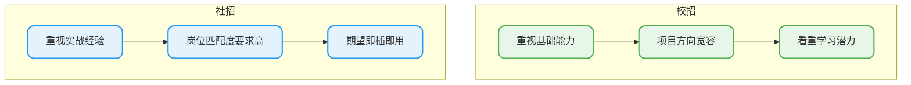

# 面试准备全攻略

## 面试的本质与心态建设

首选大家一定一定要知道程序员面试绝对不是单纯的技术面试！不是说你技术好面试就一定通过，而是要看你的综合能力，甚至有时运气也是一方面的。

有的人做的东西很牛，但是面试时就是说不出来，让面试官觉得你做的东西也就一般般，没什么亮点。而有的人虽然做的内容一般，但是能说的一套一套的，能包装好自己的亮点，面试成功率非常的高。

对于面试来说，我们要做到的是让自己的综合能力提升上来，如果你是一名普通的开发，没有很牛的背景，那么对于现在这种"面试造火箭，工作拧螺丝"的现实情况，那就只能把自己准备的扎实了，才能在面试中脱颖而出。

但是，准备面试绝不是抱有侥幸心理，**打铁还需自身硬**，必须静下心来深入学习。

### 面试考察的核心维度

面试官通常从四个维度评估候选人：

| 维度 | 考察方式 | 典型问题 |
|------|----------|----------|
| **基础扎实** | 八股文 + 算法题 | Java集合原理、JVM调优、多线程并发 |
| **问题解决能力** | 项目深挖 + 场景题 | 线上故障排查、性能优化方案 |
| **发展潜力** | 通用问题 + 软素质 | 职业规划、学习方法、团队协作 |
| **价值观** | 你对公司的看法 | 是否接收加班、领导的安排 |

## 一定要以工作为目标进行学习

我发现很多的小伙伴在学习技术的时候，自己没有计划，就单纯跟着大学课程学习，讲到哪学到哪，这对于现在的找工作来说是绝对不行的！

大学的课程只是个基础，如果想找到实习和以后的春/秋招，那么一定一定要学习工作用到的东西！



### 如何学好技术

大家一定对培训班并不陌生，像一些“某谷”、“某马”，说实话，这些机构有的课程讲的确实不错，为了应对市场推出了各种技术课程，很多人也是收益良多。

但是并不是只学习这些就够了，计算机的基础同样也不能落下。

计算机技术就像是武林秘籍一样，“操作系统、计算机组成原理、计算机网络”这些基础理论就像是内功心法，而市场用的技术就像外功招式，心法不牢，招式再多也没用。

虽然小伙伴要学习工作时的技术，但**绝不意味着放弃计算机基础课程**。操作系统、计算机组成原理、计算机网络这些看似"纯理论"的知识，在面试和工作中都极其重要。

而且字节跳动、腾讯等大厂的技术面试肯定是必考这些基础理论的。

## 简历优化要点

简历是面试的敲门砖，**至少要花2-3天时间专门打磨**。以下是常见的简历问题及改进建议。

### 个人信息模块

**问题**：信息堆砌，缺乏亮点

**改进方案**：突出技术相关信息



### 项目经历模块

**问题**：描述过于简略，无法体现技术深度

**改进方案**：采用STAR法则描述项目

| 要素 | 说明 | 示例 |
|------|------|------|
| **Situation** | 项目背景 | 某电商平台日均订单量增长到50万 |
| **Task** | 承担任务 | 负责订单系统的性能优化 |
| **Action** | 采取行动 | 引入消息队列削峰、优化SQL索引 |
| **Result** | 取得成果 | 系统QPS提升3倍，响应时间降低60% |

### 技能介绍模块

**常见问题**：
1. 技术名词大小写不规范（如 java → Java，spring boot → Spring Boot）
2. 技能罗列太杂，没有重点
3. 熟悉程度表述模糊

**改进示例**：

```
✅ 正确写法
- 精通 Java 核心技术，深入理解 JVM 原理，具备线上调优经验
- 熟练使用 Spring Boot、Spring Cloud 微服务架构
- 熟悉 MySQL 性能优化，掌握索引设计与慢查询分析

❌ 错误写法
- 了解 java、spring boot、mybatis 等技术
- 会用各种数据库
```

## 把握投递简历的黄金时间

招聘市场有明显的季节性特征，错过黄金期可能面临HC（招聘名额）不足的困境。

### 校招时间线



**核心建议**：
- **秋招**：7月开始关注提前批，尽量在9月中旬前完成主要投递
- **春招**：3月初就要行动，4月中旬后机会锐减
- 大厂面试通常3-5轮，预留充足时间

### 社招时间线

社招相对灵活，但同样存在"金三银四"、"金九银十"的高峰期。这两个时段企业招聘需求旺盛，建议提前1-2个月开始准备。

## 获取招聘信息的有效渠道

### 主要招聘渠道对比

| 渠道类型 | 适用场景 | 优势 | 注意事项 |
|----------|----------|------|----------|
| **企业官网/公众号** | 校招为主 | 信息最权威及时 | 需要逐个关注 |
| **招聘网站** | 社招为主 | 信息聚合便捷 | 注意筛选虚假信息 |
| **技术社区** | 校招/社招 | 有面经分享 | 信息时效性需关注 |
| **内推渠道** | 校招/社招 | 通过率高 | 需要人脉积累 |
| **校园宣讲会** | 校招 | 可现场沟通 | 仅限部分高校 |

### 内推的价值

内推是获取面试机会的高效途径，不仅可以提高简历通过率，还能获得内部人员的针对性建议。寻找内推的方式：
- 熟悉的学长学姐、同学朋友
- 技术社区的内推信息
- 技术公众号发布的招聘信息

:::tip 温馨提示
一般情况下同一公司只能投递一个岗位，如果第一个岗位面试失败，可能会影响同公司其他岗位的投递结果。
:::

## 岗位匹配度分析

### 校招与社招的差异



### 社招匹配度建议

社招时，HR筛选简历会重点关注：
- **工作经历**：是否有相关行业经验
- **项目经历**：是否有类似业务场景
- **技术栈**：是否与岗位要求匹配

如果跨领域求职（如从电商转金融），需要在简历中突出**可迁移能力**：
- 高并发处理经验
- 分布式系统设计能力
- 复杂业务抽象能力

## 减少抱怨，积极行动

面对"内卷"的求职环境，抱怨改变不了任何事情。你不准备，但其他人在准备——这就是现实。

与其抱怨面试太难，不如：
- 制定切实可行的复习计划
- 每天坚持刷算法题
- 系统梳理技术知识点
- 多做模拟面试练习

**记住**：焦虑来自于未知，而准备能消除未知。当你准备充分时，自信自然而来。

### 📚 想要更系统地备战面试？

**JavaUp技术星球** 提供全方位的面试支持：超级八股文系列（100万+字技术知识库）、面试经验分享、面经总结、面试问题答疑、简历优化服务，帮助你系统化地掌握面试必备知识。

👉 [了解星球服务详情](/how-to-study/intro/full-service)