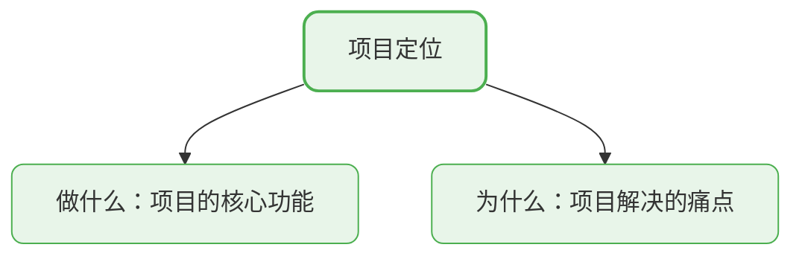
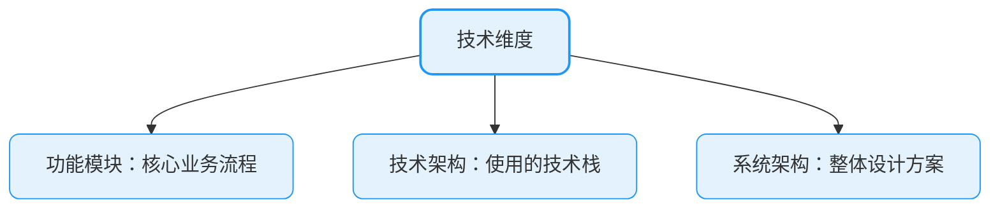
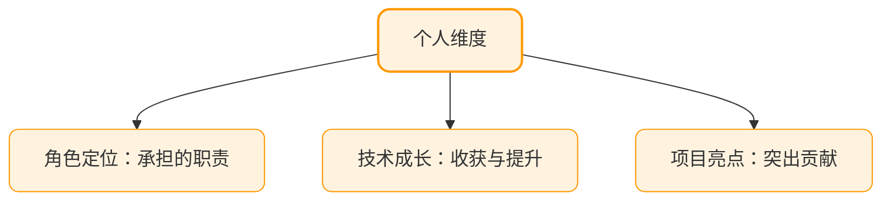
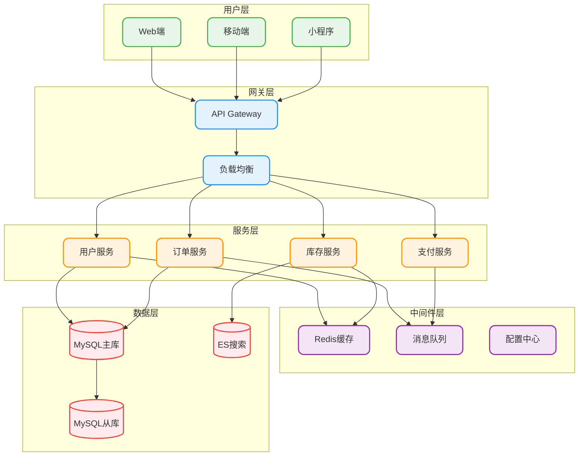
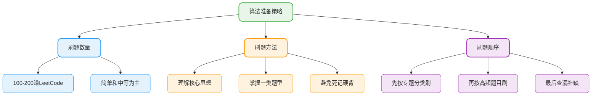
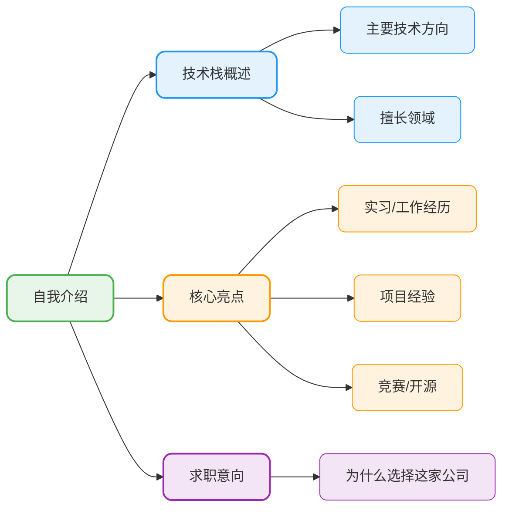

# 项目介绍与技术面试准备

## 项目介绍的重要性

项目介绍往往是技术面试的**开门题**，面试官通过这个问题考察你的概述能力和全局视野。很多人抱怨日常工作只是"堆业务"没有成长，这话说的太片面了。

需求分析能力、沟通协作能力、产品思维、抽象建模能力都是在业务开发中积累的硬实力。

### 项目介绍的九个关键点

一个完整的项目介绍应该涵盖以下维度：







### 项目介绍的结构化模板

| 维度 | 要点 | 参考话术 |
|------|------|----------|
| **项目定位** | 一句话说清楚项目是什么 | "这是一个面向XX用户的XX系统" |
| **项目价值** | 解决了什么问题 | "解决了XX场景下的XX痛点" |
| **功能模块** | 核心业务功能 | "主要包含XX、XX、XX几个核心模块" |
| **技术选型** | 使用的技术栈 | "技术栈采用XX + XX + XX" |
| **个人角色** | 你的职责 | "我负责XX模块的设计与开发" |
| **整体架构** | 系统设计 | "系统采用XX架构" |
| **项目亮点** | 突出贡献 | "我主导了XX优化，提升了XX%" |
| **优化思考** | 改进空间 | "如果重新设计，我会考虑XX" |
| **技术成长** | 个人收获 | "通过这个项目，我深入掌握了XX" |

## 项目准备的深度挖掘

面试官会围绕项目进行深度提问，需要提前准备以下方面：

### 系统演进与架构设计

准备一张清晰的系统架构图，能够讲清楚：



### 技术选型的思考

面试官经常会问"为什么选择这个技术而不是其他的"，需要提前准备对比分析：

**示例：消息队列选型**

```java
/**
 * 消息队列选型示例 - 订单延迟取消场景
 * 选择RocketMQ而非Kafka的原因：
 * 1. 支持延迟消息，适合订单超时取消场景
 * 2. 事务消息支持，保证订单状态一致性
 * 3. 消息轨迹追踪，方便问题排查
 */
@Service
public class OrderDelayService {
    
    @Autowired
    private RocketMQTemplate rocketMQTemplate;
    
    /**
     * 创建订单后发送延迟消息
     * 30分钟后检查订单状态，未支付则自动取消
     */
    public void sendOrderDelayCheck(Long orderId) {
        Message<Long> message = MessageBuilder.withPayload(orderId).build();
        // RocketMQ延迟级别：1s 5s 10s 30s 1m 2m 3m 4m 5m 6m 7m 8m 9m 10m 20m 30m 1h 2h
        // 16 对应 30分钟
        rocketMQTemplate.syncSend("order-delay-topic", message, 3000, 16);
    }
    
    @RocketMQMessageListener(
        topic = "order-delay-topic",
        consumerGroup = "order-delay-consumer-group"
    )
    public class OrderDelayConsumer implements RocketMQListener<Long> {
        
        @Autowired
        private OrderService orderService;
        
        @Override
        public void onMessage(Long orderId) {
            // 检查订单状态，未支付则取消
            Order order = orderService.getById(orderId);
            if (order != null && order.getStatus() == OrderStatus.UNPAID) {
                orderService.cancelOrder(orderId, "订单超时未支付，系统自动取消");
            }
        }
    }
}
```

### 线上问题处理经验

这是体现你实战能力的关键点，需要准备：
- **问题背景**：什么场景下发现的问题
- **定位过程**：如何分析和定位问题
- **解决方案**：采取了什么措施
- **总结复盘**：如何避免类似问题

## 技术面试的准备策略

### 八股文的正确认知

很多人觉得八股文无意义，但事实恰恰相反——**基础知识在日常开发中经常用到**。

**示例：线程池配置不当导致的生产事故**

```java
/**
 * 错误示例：不理解线程池原理导致的问题
 */
// ❌ 危险配置：无界队列 + 默认拒绝策略
ExecutorService dangerousPool = new ThreadPoolExecutor(
    2,                              // 核心线程数
    4,                              // 最大线程数
    60L, TimeUnit.SECONDS,
    new LinkedBlockingQueue<>()     // 无界队列，可能导致OOM
);

/**
 * 正确示例：合理配置线程池参数
 */
// ✅ 安全配置：有界队列 + 合理拒绝策略
ExecutorService safePool = new ThreadPoolExecutor(
    Runtime.getRuntime().availableProcessors(),     // CPU密集型任务
    Runtime.getRuntime().availableProcessors() * 2, // 最大线程数
    60L, TimeUnit.SECONDS,
    new ArrayBlockingQueue<>(1000),                 // 有界队列
    new ThreadPoolExecutor.CallerRunsPolicy()       // 调用者运行策略
);
```

如果不理解线程池的工作原理（核心线程、最大线程、队列、拒绝策略的关系），很容易在生产环境踩坑。

### 面试准备的优先级

| 优先级 | 内容 | 说明 |
|--------|------|------|
| **P0** | 项目经历 | 必问，需要能讲30分钟以上 |
| **P0** | Java核心 | 集合、并发、JVM是重点 |
| **P1** | 框架原理 | Spring、MyBatis等框架原理 |
| **P1** | 数据库 | MySQL索引、事务、锁机制 |
| **P2** | 中间件 | Redis、MQ、ES等 |
| **P2** | 分布式 | 分布式事务、一致性等 |
| **P3** | 系统设计 | 高级别岗位必考 |

## 算法面试准备

### 算法的重要性

校招面试对算法要求越来越高，尤其是字节、腾讯等大厂。笔试AC率过低基本直接淘汰。社招虽然更看重工程能力，但算法同样会考察。

### 刷题策略



### 必刷算法专题

| 专题 | 典型题目 | 核心思想 |
|------|----------|----------|
| **数组/字符串** | 两数之和、三数之和 | 双指针、哈希 |
| **链表** | 反转链表、合并链表 | 指针操作 |
| **二叉树** | 遍历、最近公共祖先 | 递归、DFS |
| **动态规划** | 背包问题、最长子序列 | 状态转移 |
| **回溯** | 全排列、子集 | 递归回溯 |
| **BFS/DFS** | 岛屿数量、课程表 | 图的遍历 |
| **滑动窗口** | 最长无重复子串 | 双指针 |

## 自我介绍的技巧

### 自我介绍的核心要素

自我介绍是面试的第一印象，需要在1-2分钟内突出你的亮点：



### 社招自我介绍示例

> 面试官您好，我叫张三，目前有3年Java后端开发经验。我熟练使用Spring Cloud微服务架构，在分布式系统设计和性能优化方面有较深的积累。
>
> 在上一家公司，我负责了核心交易系统的技术架构升级，主导完成了单体应用到微服务的改造，系统日均处理订单从10万提升到50万。其中，我设计的分布式锁方案成功解决了库存超卖问题，该方案已经稳定运行一年多。
>
> 业余时间我喜欢研究开源项目，在GitHub上开源了一个轻量级RPC框架，目前获得了1k+ Star。我也经常在技术社区分享文章，是某平台的认证作者。
>
> 我一直很关注贵公司的技术发展，对贵公司的XX业务非常感兴趣，希望能有机会加入团队，一起创造价值。

### 校招自我介绍示例

> 面试官您好，我叫李四，是XX大学计算机专业的应届硕士。研究生期间，我主要学习了Java后端开发和分布式系统。
>
> 在校期间，我参与了导师的XX项目，负责了数据处理模块的设计与开发，使用Spring Boot和Kafka实现了实时数据处理流水线，日均处理数据量达到千万级。
>
> 我还在XX公司实习了6个月，参与了用户画像系统的开发，独立完成了标签计算引擎的优化，将计算效率提升了40%。
>
> 另外，我参加过XX编程竞赛，获得了全国二等奖。平时喜欢在LeetCode刷题，目前已经刷了300+道题目。
>
> 我对贵公司的技术氛围非常向往，希望能够加入团队，在实践中不断成长。

## 架构设计准备

### 5年以上必备能力

资深开发者的面试会重点考察架构设计能力：

| 考察点 | 说明 | 准备要点 |
|--------|------|----------|
| **系统设计** | 从0设计一个系统 | 需求分析、技术选型、架构设计 |
| **DDD思想** | 领域驱动设计 | 领域模型、聚合根、领域事件 |
| **高可用设计** | 容灾、降级、限流 | 熔断器、限流算法、灾备方案 |
| **高性能设计** | 缓存、异步、分库分表 | 多级缓存、读写分离、分片策略 |

### 项目管理能力

对于技术负责人岗位，还会考察项目管理能力：
- 跨团队协作的经验
- 项目风险识别和应对
- 进度把控和资源协调
- 技术决策的权衡过程

## 向面试官提问的技巧

面试结尾通常会问"你有什么想问的"，这是展示你思考深度的机会：

**推荐问题**：
- 这个岗位的日常工作内容是什么？
- 团队目前面临的最大技术挑战是什么？
- 公司对新人的培养机制是怎样的？
- 这个项目未来的技术规划是什么？

**不推荐问题**：
- 薪资待遇（HR面再问）
- 加班情况（除非你真的很在意）
- 过于宽泛的问题


### 📚 需要更多面试备战资源？

**JavaUp技术星球** 提供超级八股文系列（100万+字技术知识库）、五大实战项目、面试经验分享与面经总结，帮助你系统掌握面试必备知识，轻松应对项目介绍和技术深挖。

👉 [了解星球服务详情](/how-to-study/intro/full-service)
