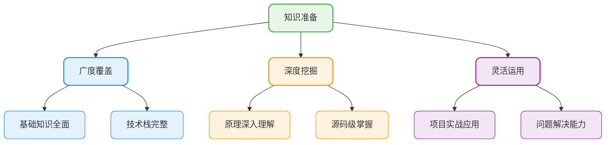
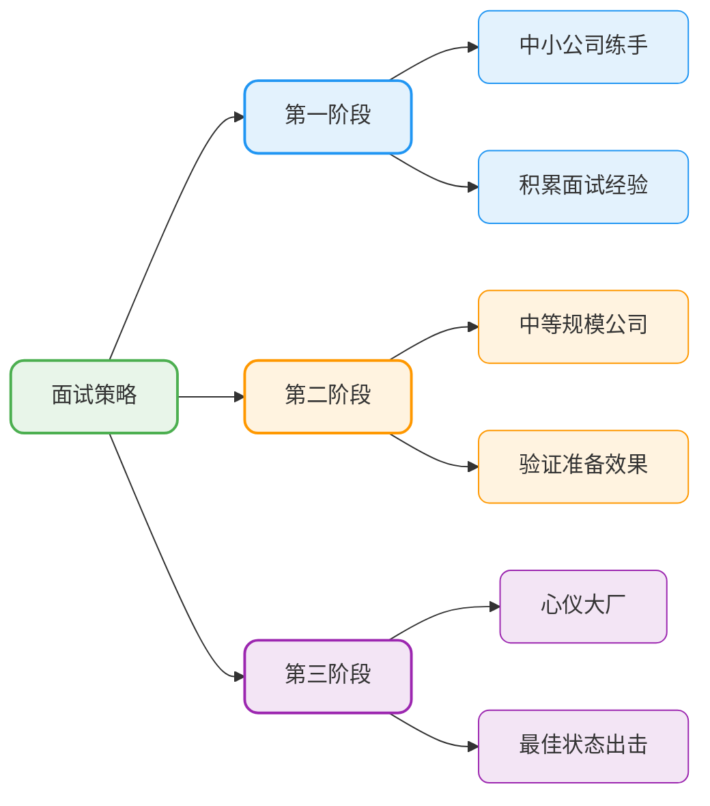
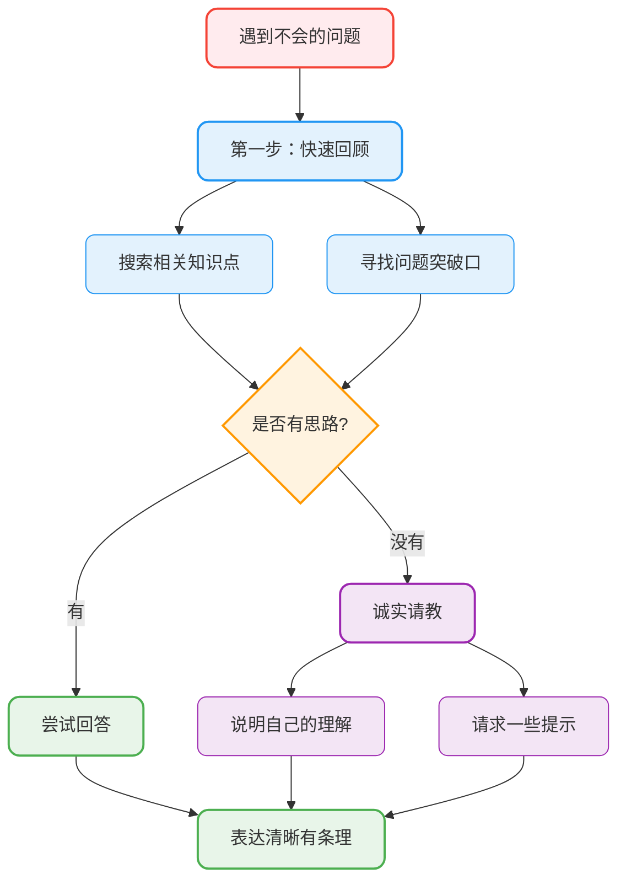
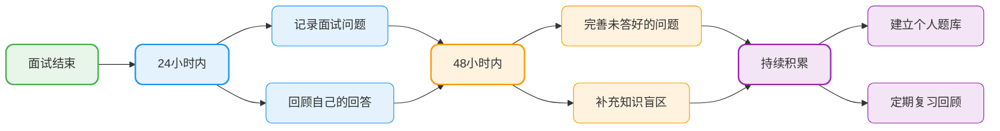

# 面试与复盘技巧

## 用充分准备消除不确定性

**不确定性越多，越容易紧张。** 如果能在面试前做充分准备，那自然会自信很多了，紧张的情绪自然就会减轻了。

### 知识准备的三个层次



### 项目经历的深度梳理

认真思考简历上的项目（重点准备前两个项目），针对以下方面提前准备：

| 准备维度 | 具体内容 | 准备深度 |
|----------|----------|----------|
| **项目概述** | 背景、目标、成果 | 能讲3-5分钟 |
| **技术难点** | 遇到的挑战及解决方案 | 能深入讨论15分钟 |
| **架构设计** | 系统架构图、技术选型 | 能画图讲解 |
| **个人贡献** | 你具体做了什么 | 有数据支撑 |
| **深挖问题** | 技术栈的原理细节 | 源码级理解 |

### 多说多练，提升表达

很多人准备时只是"在心里想"，但**想的和说的往往不一样**。

**实践方法**：
- 对着镜子练习自我介绍和项目介绍
- 找朋友进行模拟面试
- 录制自己的回答，回放检查
- 参加在线模拟面试平台

### 渐进式面试策略



**先小厂后大厂**的策略优势：
- 熟悉面试流程和节奏
- 发现知识盲区并及时补充
- 积累回答经验，提升自信
- 以较好的状态迎接重要面试

## 应对面试中的突发状况

### 遇到不会的问题怎么办

在一场面试中，尤其是大厂，不太可能每个问题都能轻松回答。遇到不会的问题很正常了，这时你要做的是：



**应对策略**：

1. **先思考，不要急于回答**：可以说"让我思考一下"
2. **尝试关联已有知识**：从相关概念出发，尝试推导
3. **诚实表达困惑**：可以说"这个问题我之前没有深入研究过，能给一些提示吗？"
4. **展示思考过程**：即使不会，也要说出你的思路

**最忌讳的做法**：
- ❌ 乱回答一通
- ❌ 沉默不语
- ❌ 表现出明显的慌张

### 应对压力面试

有些面试官会故意施压，测试你的抗压能力：

- 保持冷静，不要被情绪影响
- 理解这是一种测试方式
- 专注于问题本身，而非面试官的态度
- 用专业的回答展示你的素质

## 面试复盘的重要性

很多人关注面试前的准备，却忽略了面试后的复盘。**复盘是提升最快的方式**。

### 复盘的时机与方法



### 复盘的三个维度

**1. 记录面试中的问题**

无论回答得好坏，都要把问题记录下来：

```markdown
## 面试记录模板

**公司**：XXX科技
**岗位**：Java后端开发
**日期**：2024-XX-XX
**面试轮次**：一面（技术面）

### 技术问题
1. HashMap的底层原理？
   - 我的回答：...
   - 完善后的答案：...

2. 如何排查线上OOM问题？
   - 我的回答：...
   - 完善后的答案：...

### 项目问题
1. 项目中的分布式事务是怎么处理的？
   - 我的回答：...
   - 需要补充的点：...

### 反思总结
- 表现好的地方：...
- 需要改进的地方：...
- 下次面试的改进方向：...
```

**2. 反思自己的表现**

| 反思维度 | 思考问题 |
|----------|----------|
| **知识掌握** | 是否有知识盲区？哪些点没准备到？ |
| **表达能力** | 回答是否清晰有条理？有没有词不达意？ |
| **临场反应** | 是否过于紧张？思维是否敏捷？ |
| **时间控制** | 回答是否冗长或过于简短？ |
| **互动沟通** | 是否理解了面试官的问题意图？ |

**3. 完善个人知识库**

把新遇到的问题补充到个人知识库，不断拓展知识面：

```java
/**
 * 面试复盘示例 - 补充之前没掌握的知识点
 * 
 * 问题：ThreadLocal会导致内存泄漏吗？如何避免？
 */
public class ThreadLocalDemo {
    
    // ❌ 可能导致内存泄漏的写法
    private static final ThreadLocal<byte[]> CACHE = new ThreadLocal<>();
    
    public void processRequest() {
        try {
            // 存储大对象
            CACHE.set(new byte[1024 * 1024]);
            // 业务处理
            doProcess();
        } finally {
            // ✅ 必须在finally中清理，避免内存泄漏
            CACHE.remove();
        }
    }
    
    private void doProcess() {
        byte[] data = CACHE.get();
        // 处理逻辑...
    }
}
```

### 📚 需要更多面试经验和备战资源？

**JavaUp技术星球** 提供丰富的面试经验分享、面经总结、面试问题答疑服务，帮助你更好地复盘和改进。同时还有超级八股文系列（100万+字）和五大实战项目，助你系统化备战。

👉 [了解星球服务详情](/how-to-study/intro/full-service)