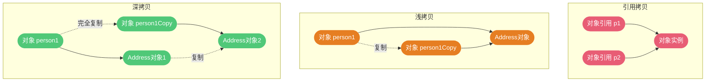
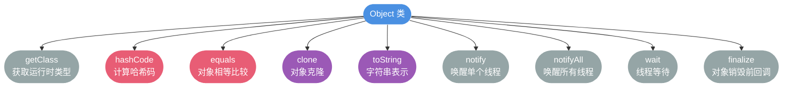
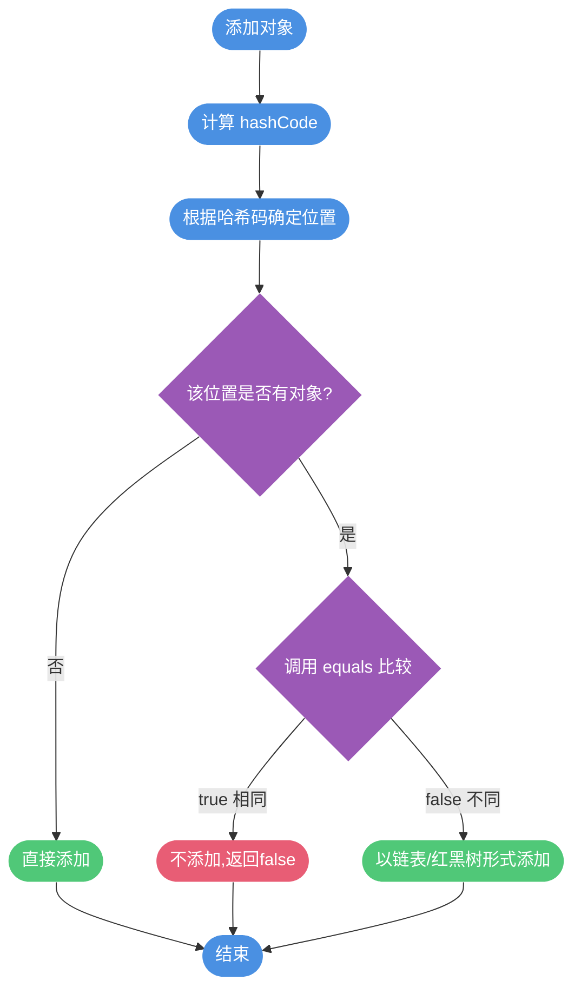

# 面向对象核心概念

## 面向对象与面向过程编程的差异

**面向过程编程(POP)**:将问题分解为一系列步骤(函数),通过函数调用解决问题。

**面向对象编程(OOP)**:将问题抽象为对象,通过对象间的协作解决问题。

```java
// 面向过程:计算圆的属性
public class ProcedureDemo {
    public static void main(String[] args) {
        double radius = 5.0;
        double area = 3.14 * radius * radius;
        double circumference = 2 * 3.14 * radius;
        System.out.println("面积:" + area);
        System.out.println("周长:" + circumference);
    }
}

// 面向对象:计算圆的属性  
public class Circle {
    private double radius;
    
    public Circle(double radius) {
        this.radius = radius;
    }
    
    public double getArea() {
        return Math.PI * radius * radius;
    }
    
    public double getCircumference() {
        return 2 * Math.PI * radius;
    }
    
    public static void main(String[] args) {
        Circle circle = new Circle(5.0);
        System.out.println("面积:" + circle.getArea());
        System.out.println("周长:" + circle.getCircumference());
    }
}
```

**OOP 的优势**:
1. **易维护**:良好的封装性,修改局部不影响整体
2. **易复用**:通过继承实现代码复用
3. **易扩展**:多态机制使系统扩展灵活

> 性能对比是常见误区:两种范式的性能差异主要取决于具体实现,而非范式本身。现代语言通常同时支持两种范式。

### 对象的创建与引用

使用 `new` 运算符创建对象:

```java
Student stu = new Student("张三", 20);
```

**对象实体 vs 对象引用**:
- **对象实体**:存储在堆内存中的实际数据
- **对象引用**:存储在栈内存中的地址

```java
Student s1 = new Student("张三", 20);  // s1 指向对象 A
Student s2 = s1;                      // s2 也指向对象 A
Student s3 = new Student("张三", 20); // s3 指向新对象 B

System.out.println(s1 == s2);  // true (引用相等)
System.out.println(s1 == s3);  // false (引用不等)
```

类比:对象像气球,引用像绳子
- 一条绳子可以不系气球(null)
- 一条绳子只能系一个气球
- 多条绳子可以系同一个气球

### 对象相等 vs 引用相等

```java
String str1 = "Java";
String str2 = new String("Java");
String str3 = "Java";

// 引用相等:比较内存地址
System.out.println(str1 == str2);  // false (不同对象)
System.out.println(str1 == str3);  // true (字符串常量池)

// 对象相等:比较内容
System.out.println(str1.equals(str2));  // true
System.out.println(str1.equals(str3));  // true
```

**规则**:
- 基本类型用 `==` 比较值
- 引用类型用 `==` 比较地址,用 `equals()` 比较内容

### 构造方法详解

如果类没有声明构造方法,编译器会自动添加无参构造方法:

```java
public class Product {
    private String name;
    
    // 编译器自动添加
    // public Product() { }
}

// 可以正常使用
Product p = new Product();
```

**重要提示**:一旦手动定义了任何构造方法,编译器就不再提供默认构造方法:

```java
public class Product {
    private String name;
    
    public Product(String name) {
        this.name = name;
    }
}

// Product p = new Product();  // 编译错误:找不到无参构造
Product p = new Product("手机");  // 正确
```

**最佳实践**:即使不用,也建议保留无参构造方法

```java
public class Product {
    private String name;
    
    // 显式定义无参构造
    public Product() { }
    
    public Product(String name) {
        this.name = name;
    }
}
```

**构造方法特点**:
- 方法名与类名完全相同
- 没有返回值类型(连 void 也不写)
- 对象创建时自动调用
- 可以重载,不能重写
- 不能被 static/final/abstract 修饰

## 面向对象三大特征

### 1. 封装(Encapsulation)

将对象的状态隐藏,只对外暴露必要的接口:

```java
public class BankAccount {
    private double balance;  // 隐藏余额
    
    public double getBalance() {
        return balance;
    }
    
    public void deposit(double amount) {
        if (amount > 0) {
            balance += amount;
        }
    }
    
    public boolean withdraw(double amount) {
        if (amount > 0 && balance >= amount) {
            balance -= amount;
            return true;
        }
        return false;
    }
}
```

**好处**:
- 隐藏实现细节
- 提高安全性
- 便于修改实现

### 2. 继承(Inheritance)

子类继承父类的属性和方法,实现代码复用:

```java
class Employee {
    protected String name;
    protected double salary;
    
    public Employee(String name, double salary) {
        this.name = name;
        this.salary = salary;
    }
    
    public void work() {
        System.out.println(name + " 正在工作");
    }
}

class Programmer extends Employee {
    private String language;
    
    public Programmer(String name, double salary, String language) {
        super(name, salary);  // 调用父类构造方法
        this.language = language;
    }
    
    @Override
    public void work() {
        System.out.println(name + " 正在用 " + language + " 编程");
    }
    
    public void debug() {
        System.out.println(name + " 正在调试代码");
    }
}
```

**继承要点**:
- 子类拥有父类所有属性和方法(包括 private,但无法直接访问)
- 子类可以扩展新的属性和方法
- 子类可以重写父类的方法

### 3. 多态(Polymorphism)

同一个行为具有多种不同表现形式:

```java
class Animal {
    public void makeSound() {
        System.out.println("动物发出声音");
    }
}

class Dog extends Animal {
    @Override
    public void makeSound() {
        System.out.println("汪汪汪");
    }
}

class Cat extends Animal {
    @Override
    public void makeSound() {
        System.out.println("喵喵喵");
    }
}

public class PolymorphismDemo {
    public static void main(String[] args) {
        Animal animal1 = new Dog();  // 向上转型
        Animal animal2 = new Cat();
        
        animal1.makeSound();  // 输出:汪汪汪
        animal2.makeSound();  // 输出:喵喵喵
        
        // 多态性:同样的方法调用,不同的执行结果
    }
}
```

**多态的必要条件**:
1. 存在继承关系
2. 子类重写父类方法
3. 父类引用指向子类对象

**多态的特点**:
- 编译时类型与运行时类型可以不一致
- 调用哪个方法在运行时确定
- 不能调用子类特有的方法

## 接口与抽象类对比

### 共同点
- 都不能直接实例化
- 都可以包含抽象方法
- 都用于抽象和解耦

### 核心差异

| 特性 | 接口(Interface) | 抽象类(Abstract Class) |
|------|----------------|----------------------|
| 设计目的 | 定义行为规范 | 提供通用实现 |
| 继承/实现 | 类可实现多个接口 | 类只能继承一个抽象类 |
| 成员变量 | 只能是 public static final | 可以有任意修饰符 |
| 方法 | Java 8+ 可有 default/static 方法 | 可有抽象和非抽象方法 |
| 构造方法 | 不能有 | 可以有 |

```java
// 接口:定义飞行能力
interface Flyable {
    void fly();
    
    default void land() {  // Java 8+ 默认方法
        System.out.println("降落");
    }
}

// 抽象类:定义鸟的通用特征
abstract class Bird {
    protected String name;
    
    public Bird(String name) {
        this.name = name;
    }
    
    // 抽象方法
    public abstract void eat();
    
    // 具体方法
    public void sleep() {
        System.out.println(name + " 正在睡觉");
    }
}

// 既继承抽象类,又实现接口
class Eagle extends Bird implements Flyable {
    public Eagle(String name) {
        super(name);
    }
    
    @Override
    public void eat() {
        System.out.println(name + " 吃肉");
    }
    
    @Override
    public void fly() {
        System.out.println(name + " 在天空翱翔");
    }
}
```

**使用场景**:
- 接口:定义规范,如 Serializable, Comparable
- 抽象类:提供基础实现,如 InputStream, HttpServlet

## 深拷贝与浅拷贝

### 引用拷贝
两个引用指向同一对象:

```java
Person p1 = new Person("张三", 20);
Person p2 = p1;  // 引用拷贝
p2.setAge(25);
System.out.println(p1.getAge());  // 25 (p1 也变了)
```

### 浅拷贝
创建新对象,但内部引用类型属性共享:

```java
class Address {
    String city;
    public Address(String city) { this.city = city; }
}

class Person implements Cloneable {
    String name;
    Address address;
    
    public Person(String name, Address address) {
        this.name = name;
        this.address = address;
    }
    
    @Override
    protected Person clone() throws CloneNotSupportedException {
        return (Person) super.clone();
    }
}

// 测试
Person p1 = new Person("张三", new Address("北京"));
Person p2 = p1.clone();

System.out.println(p1 == p2);                // false (不同对象)
System.out.println(p1.address == p2.address); // true (地址对象共享)

p2.address.city = "上海";
System.out.println(p1.address.city);  // 上海 (p1 的地址也变了)
```

### 深拷贝
完全复制所有对象,包括引用类型属性:

```java
class Address implements Cloneable {
    String city;
    public Address(String city) { this.city = city; }
    
    @Override
    protected Address clone() throws CloneNotSupportedException {
        return (Address) super.clone();
    }
}

class Person implements Cloneable {
    String name;
    Address address;
    
    @Override
    protected Person clone() throws CloneNotSupportedException {
        Person person = (Person) super.clone();
        person.address = address.clone();  // 深拷贝地址
        return person;
    }
}

// 测试
Person p1 = new Person("张三", new Address("北京"));
Person p2 = p1.clone();

System.out.println(p1.address == p2.address); // false (地址对象独立)

p2.address.city = "上海";
System.out.println(p1.address.city);  // 北京 (p1 不受影响)
```

**三者对比图**:



## Object 类核心方法

### Object 类核心方法

Object 是所有类的父类,提供 11 个基础方法:



```java
// 1. 获取运行时类型
public final native Class<?> getClass()

// 2. 计算哈希码
public native int hashCode()

// 3. 对象相等性比较  
public boolean equals(Object obj)

// 4. 对象克隆
protected native Object clone() throws CloneNotSupportedException

// 5. 对象的字符串表示
public String toString()

// 6. 唤醒单个等待线程
public final native void notify()

// 7. 唤醒所有等待线程
public final native void notifyAll()

// 8. 线程等待
public final native void wait(long timeout) throws InterruptedException
public final void wait(long timeout, int nanos) throws InterruptedException
public final void wait() throws InterruptedException

// 9. 对象销毁前回调
protected void finalize() throws Throwable
```

### == 与 equals() 的区别

**`==` 的行为**:
- 基本类型:比较值
- 引用类型:比较内存地址

```java
int a = 100;
int b = 100;
System.out.println(a == b);  // true (值相等)

Integer x = 100;
Integer y = 100;
System.out.println(x == y);  // true (缓存池内)

Integer m = 1000;
Integer n = 1000;
System.out.println(m == n);  // false (超出缓存)
```

**`equals()` 的行为**:

Object 类的默认实现:
```java
public boolean equals(Object obj) {
    return (this == obj);  // 默认比较引用
}
```

String 类的重写实现:
```java
public boolean equals(Object anObject) {
    if (this == anObject) return true;
    
    if (anObject instanceof String) {
        String anotherString = (String) anObject;
        int n = value.length;
        if (n == anotherString.value.length) {
            char v1[] = value;
            char v2[] = anotherString.value;
            int i = 0;
            while (n-- != 0) {
                if (v1[i] != v2[i]) return false;
                i++;
            }
            return true;
        }
    }
    return false;
}
```

### hashCode() 的作用

`hashCode()` 返回对象的哈希码,用于哈希表中快速定位对象。

**HashSet 添加元素流程**:



```java
public class Student {
    private String name;
    private int age;
    
    @Override
    public int hashCode() {
        return Objects.hash(name, age);
    }
    
    @Override
    public boolean equals(Object o) {
        if (this == o) return true;
        if (o == null || getClass() != o.getClass()) return false;
        Student student = (Student) o;
        return age == student.age && Objects.equals(name, student.name);
    }
}
```

**HashSet 添加元素流程**:
1. 计算对象的 `hashCode()`
2. 根据哈希码确定存储位置
3. 如果该位置已有对象,用 `equals()` 判断是否相同
4. 相同则不添加,不同则以链表/红黑树形式存储

**为什么需要 hashCode()?**

提高效率!如果只用 `equals()`,添加 n 个元素需要比较 O(n²) 次;有了 `hashCode()`,只需比较少量冲突的对象。

### 为什么重写 equals() 必须重写 hashCode()?

**Java 规范要求**:
- 如果 `equals()` 返回 true,两个对象的 `hashCode()` 必须相同
- 如果 `hashCode()` 相同,`equals()` 可以返回 false(哈希冲突)

**违反规范的后果**:

```java
class Student {
    String name;
    
    public Student(String name) { this.name = name; }
    
    @Override
    public boolean equals(Object o) {
        if (this == o) return true;
        if (o == null || getClass() != o.getClass()) return false;
        Student student = (Student) o;
        return Objects.equals(name, student.name);
    }
    
    // 忘记重写 hashCode()
}

// 问题演示
Set<Student> set = new HashSet<>();
Student s1 = new Student("张三");
Student s2 = new Student("张三");

set.add(s1);
set.add(s2);

System.out.println(set.size());      // 2 (应该是 1)
System.out.println(s1.equals(s2));   // true
System.out.println(set.contains(s2)); // 可能是 false
```

**正确实现**:
```java
@Override
public int hashCode() {
    return Objects.hash(name);  // 使用工具类
}
```
