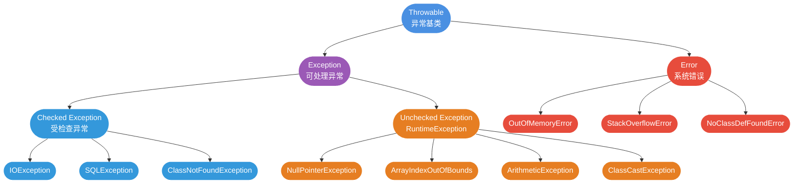
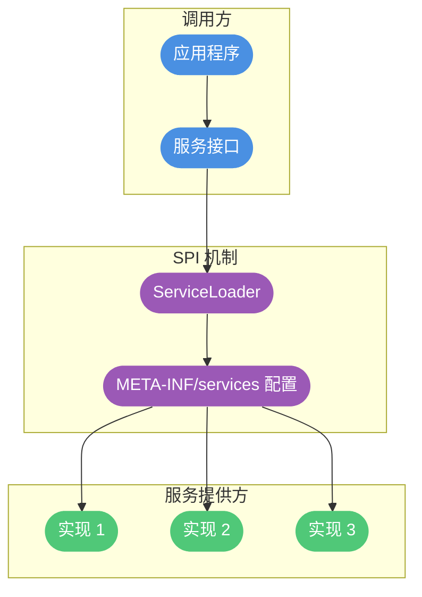
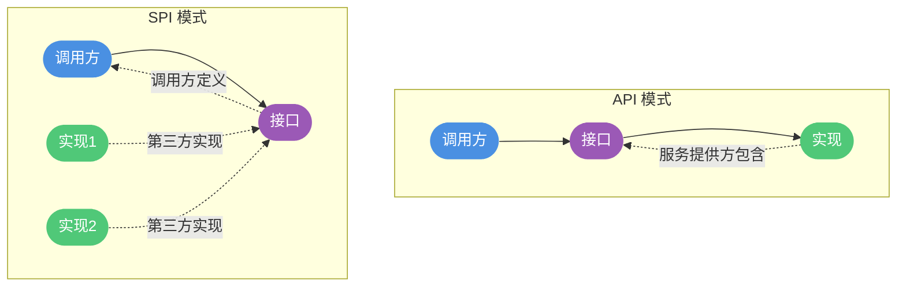
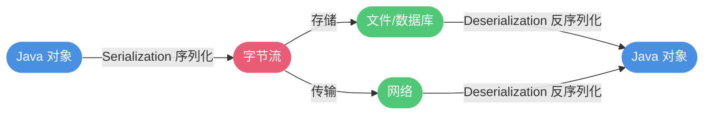
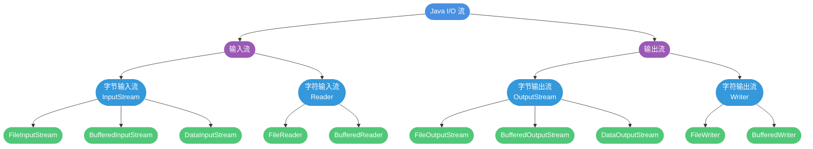

# 基础面经总结-3

## 异常处理

### 异常类层次结构



所有异常的共同祖先是 `Throwable`,分为两大类:

**1. Exception(可处理异常)**
- **Checked Exception**(受检查异常):编译时必须处理
  - IOException
  - SQLException  
  - ClassNotFoundException

- **Unchecked Exception**(非受检查异常):编译时可不处理
  - RuntimeException 及其子类
  - NullPointerException
  - ArrayIndexOutOfBoundsException
  - ArithmeticException

**2. Error(系统错误)**
- JVM 运行错误,程序无法处理
- OutOfMemoryError
- StackOverflowError
- NoClassDefFoundError

### Exception 与 Error 的差异

```java
// Exception:可以捕获并处理
try {
    int result = 10 / 0;
} catch (ArithmeticException e) {
    System.out.println("除数不能为 0");
}

// Error:不建议捕获,应该避免发生
public class StackOverflowDemo {
    public static void main(String[] args) {
        recursion();  // 递归无出口,最终导致 StackOverflowError
    }
    
    public static void recursion() {
        recursion();
    }
}
```

### Checked Exception 与 Unchecked Exception

**Checked Exception(受检查异常)**:编译器强制要求处理

```java
// 必须处理,否则编译不通过
public void readFile(String path) throws IOException {
    FileReader reader = new FileReader(path);  // 可能抛 FileNotFoundException
    // ...
}

// 处理方式 1: try-catch
public void method1() {
    try {
        readFile("test.txt");
    } catch (IOException e) {
        e.printStackTrace();
    }
}

// 处理方式 2: throws 声明
public void method2() throws IOException {
    readFile("test.txt");
}
```

**Unchecked Exception(非受检查异常)**:编译器不强制处理

```java
// RuntimeException 及其子类,可以不处理
public int divide(int a, int b) {
    return a / b;  // 可能抛 ArithmeticException,但编译通过
}

public String getName(User user) {
    return user.getName();  // 可能抛 NullPointerException
}

// 常见的 RuntimeException
public class CommonExceptions {
    public static void main(String[] args) {
        // 1. NullPointerException
        String str = null;
        // str.length();  // NPE
        
        // 2. ArrayIndexOutOfBoundsException
        int[] arr = {1, 2, 3};
        // int x = arr[5];  // 数组越界
        
        // 3. ClassCastException
        Object obj = "Hello";
        // Integer num = (Integer) obj;  // 类型转换异常
        
        // 4. NumberFormatException
        // int num = Integer.parseInt("abc");  // 数字格式异常
        
        // 5. IllegalArgumentException
        // setAge(-5);  // 参数非法
    }
    
    public static void setAge(int age) {
        if (age < 0) {
            throw new IllegalArgumentException("年龄不能为负数");
        }
    }
}
```

### 异常处理最佳实践

默认使用 **Unchecked Exception**,只在必要时用 Checked Exception:

```java
// 推荐:用 RuntimeException 表示代码 Bug
public class UserService {
    public User findById(Long id) {
        if (id == null) {
            throw new IllegalArgumentException("ID 不能为 null");  // 非受检查
        }
        // ...
        return null;
    }
}

// 只在业务逻辑必须处理时用 Checked Exception
public class PaymentService {
    // 余额不足是正常业务分支,强制调用者处理
    public void pay(double amount) throws InsufficientBalanceException {
        if (balance < amount) {
            throw new InsufficientBalanceException("余额不足");
        }
        // 执行支付
    }
}
```

### try-catch-finally 用法

```java
try {
    // 可能抛异常的代码
    int result = riskyOperation();
    System.out.println("结果:" + result);
} catch (SpecificException e) {
    // 处理特定异常
    System.out.println("处理特定异常:" + e.getMessage());
} catch (Exception e) {
    // 处理其他异常
    System.out.println("处理通用异常:" + e.getMessage());
} finally {
    // 无论是否发生异常,都会执行
    // 通常用于资源清理
    System.out.println("清理资源");
}
```

**注意**:不要在 finally 中使用 return,会屏蔽 try 中的 return

```java
public int badExample() {
    try {
        return 1;
    } finally {
        return 2;  // 不好!将覆盖 try 中的返回值
    }
}

// 返回 2,而不是 1
```

### finally 一定会执行吗?

**大多数情况下会**,但有例外:

```java
// 1. System.exit() 终止 JVM
try {
    System.exit(0);  // JVM 退出,finally 不执行
} finally {
    System.out.println("不会执行");
}

// 2. 线程被 kill
Thread.currentThread().stop();  // 强制停止线程

// 3. CPU 关闭
// 无法模拟...
```

### try-with-resources 用法

Java 7 引入,自动关闭资源:

```java
// 传统方式:手动关闭资源
Scanner scanner = null;
try {
    scanner = new Scanner(new File("test.txt"));
    while (scanner.hasNext()) {
        System.out.println(scanner.nextLine());
    }
} catch (FileNotFoundException e) {
    e.printStackTrace();
} finally {
    if (scanner != null) {
        scanner.close();  // 手动关闭
    }
}

// try-with-resources:自动关闭
try (Scanner scanner = new Scanner(new File("test.txt"))) {
    while (scanner.hasNext()) {
        System.out.println(scanner.nextLine());
    }
} catch (FileNotFoundException e) {
    e.printStackTrace();
}
// 自动调用 scanner.close()

// 多个资源
try (BufferedReader br = new BufferedReader(new FileReader("input.txt"));
     BufferedWriter bw = new BufferedWriter(new FileWriter("output.txt"))) {
    String line;
    while ((line = br.readLine()) != null) {
        bw.write(line);
        bw.newLine();
    }
}
```

**适用条件**:资源必须实现 `AutoCloseable` 或 `Closeable` 接口。

### 异常使用注意事项

```java
// 1. 不要将异常定义为静态变量
public class BadExample {
    private static final Exception EXCEPTION = new Exception("错误");  // 错误!
    
    public void method() throws Exception {
        throw EXCEPTION;  // 所有地方抛同一个异常,堆栈信息不准
    }
}

// 2. 抛出更具体的异常
public class GoodExample {
    public void parseInt(String str) {
        if (!str.matches("\\d+")) {
            throw new NumberFormatException("无效数字:" + str);  // 具体异常
        }
    }
}

// 3. 避免重复记录日志
public class LogExample {
    public void process() {
        try {
            riskyOperation();
        } catch (Exception e) {
            log.error("操作失败", e);  // 已经记录日志
            throw e;  // 再次抛出时不要再记录
        }
    }
}

// 4. 异常信息要有意义
throw new Exception("错误");  // 不好
throw new Exception("用户名不能为空");  // 好
```

## 泛型详解

### 泛型的作用

Java 5 引入泛型,主要作用:
1. **类型安全**:编译期检查类型错误
2. **消除强制转换**:自动类型转换
3. **提高代码复用**:编写通用代码

```java
// 没有泛型
List list = new ArrayList();
list.add("Hello");
list.add(123);  // 可以加入不同类型
String str = (String) list.get(0);  // 需要强转
String str2 = (String) list.get(1);  // 运行时异常!

// 使用泛型
List<String> list = new ArrayList<>();
list.add("Hello");
// list.add(123);  // 编译错误,类型安全
String str = list.get(0);  // 无需强转
```

### 泛型的使用方式

#### 1. 泛型类

```java
public class Box<T> {
    private T content;
    
    public void set(T content) {
        this.content = content;
    }
    
    public T get() {
        return content;
    }
}

// 使用
Box<String> strBox = new Box<>();
strBox.set("Hello");
String str = strBox.get();

Box<Integer> intBox = new Box<>();
intBox.set(100);
int num = intBox.get();
```

#### 2. 泛型接口

```java
public interface Comparable<T> {
    int compareTo(T other);
}

// 实现方式 1:指定类型
public class Student implements Comparable<Student> {
    private int score;
    
    @Override
    public int compareTo(Student other) {
        return Integer.compare(this.score, other.score);
    }
}

// 实现方式 2:保留泛型
public class GenericClass<T> implements Comparable<T> {
    @Override
    public int compareTo(T other) {
        // ...
        return 0;
    }
}
```

#### 3. 泛型方法

```java
public class ArrayUtil {
    // 泛型方法
    public static <T> void printArray(T[] array) {
        for (T element : array) {
            System.out.print(element + " ");
        }
        System.out.println();
    }
    
    // 使用
    public static void main(String[] args) {
        Integer[] intArray = {1, 2, 3, 4, 5};
        String[] strArray = {"A", "B", "C"};
        
        printArray(intArray);  // 1 2 3 4 5
        printArray(strArray);  // A B C
    }
}
```

**注意**:静态泛型方法不能使用类的泛型参数

```java
public class MyClass<T> {
    // 错误:静态方法不能使用类的 T
    // public static void method(T param) { }
    
    // 正确:声明自己的泛型参数
    public static <E> void method(E param) { }
}
```

### 项目中泛型的应用

```java
// 1. 通用返回结果类
public class Result<T> {
    private int code;
    private String message;
    private T data;
    
    public static <T> Result<T> success(T data) {
        Result<T> result = new Result<>();
        result.code = 200;
        result.message = "success";
        result.data = data;
        return result;
    }
    
    public static <T> Result<T> error(String message) {
        Result<T> result = new Result<>();
        result.code = 500;
        result.message = message;
        return result;
    }
}

// 使用
Result<User> userResult = Result.success(new User());
Result<List<Product>> productResult = Result.success(productList);

// 2. Excel 导出工具类
public class ExcelUtil<T> {
    private Class<T> clazz;
    
    public ExcelUtil(Class<T> clazz) {
        this.clazz = clazz;
    }
    
    public void export(List<T> data, String filePath) {
        // 根据 clazz 的注解信息导出 Excel
    }
}

// 使用
ExcelUtil<Student> excelUtil = new ExcelUtil<>(Student.class);
excelUtil.export(studentList, "students.xlsx");
```

## 反射机制

### 什么是反射?

反射是 Java 提供的一种机制,允许程序在运行时动态获取类的信息并操作类或对象。

```java
// 正常方式:编译时确定类型
Student student = new Student();
student.setName("张三");
String name = student.getName();

// 反射方式:运行时动态操作
Class<?> clazz = Class.forName("com.example.Student");
Object obj = clazz.newInstance();
Method setName = clazz.getMethod("setName", String.class);
setName.invoke(obj, "张三");
Method getName = clazz.getMethod("getName");
String name = (String) getName.invoke(obj);
```

### 反射的优缺点

**优点**:
1. **灵活性**:运行时动态加载类、创建对象
2. **框架基础**:Spring IoC、MyBatis ORM 等都基于反射
3. **解耦合**:降低模块间依赖

**缺点**:
1. **性能开销**:比直接调用慢 10-100 倍
2. **安全问题**:可以破坏封装,访问 private 成员
3. **代码可读性差**:复杂难理解,错误运行时才发现

```java
// 性能测试
public class ReflectionPerformance {
    public static void main(String[] args) {
        int count = 10000000;
        
        // 直接调用
        long start = System.currentTimeMillis();
        for (int i = 0; i < count; i++) {
            User user = new User();
            user.setName("张三");
        }
        System.out.println("直接调用:" + (System.currentTimeMillis() - start) + "ms");
        
        // 反射调用
        start = System.currentTimeMillis();
        try {
            Class<?> clazz = User.class;
            Method setName = clazz.getMethod("setName", String.class);
            for (int i = 0; i < count; i++) {
                Object obj = clazz.newInstance();
                setName.invoke(obj, "张三");
            }
        } catch (Exception e) {
            e.printStackTrace();
        }
        System.out.println("反射调用:" + (System.currentTimeMillis() - start) + "ms");
    }
}
```

### 反射的应用场景

**1. 依赖注入(Spring IoC)**
```java
@Component
public class UserService {
    @Autowired  // Spring 通过反射注入 UserRepository
    private UserRepository userRepository;
}
```

**2. 注解处理**
```java
// Spring 扫描 @Controller 注解
for (Class<?> clazz : classes) {
    if (clazz.isAnnotationPresent(Controller.class)) {
        // 通过反射创建实例并注册到容器
        Object controller = clazz.newInstance();
        registerController(controller);
    }
}
```

**3. 动态代理(AOP)**
```java
public class ProxyHandler implements InvocationHandler {
    private Object target;
    
    @Override
    public Object invoke(Object proxy, Method method, Object[] args) throws Throwable {
        System.out.println("方法执行前");
        Object result = method.invoke(target, args);  // 反射调用
        System.out.println("方法执行后");
        return result;
    }
}
```

**4. ORM 框架(MyBatis/Hibernate)**
```java
// MyBatis 将查询结果映射为对象
ResultSet rs = statement.executeQuery("SELECT * FROM user WHERE id = 1");
User user = new User();
for (Field field : User.class.getDeclaredFields()) {
    field.setAccessible(true);
    field.set(user, rs.getObject(field.getName()));
}
```

## 注解详解

### 什么是注解?

注解(Annotation)是 JDK 5 引入的特殊的"标签",用于为程序元素添加元数据。

```java
// 注解的定义
@Target(ElementType.METHOD)
@Retention(RetentionPolicy.RUNTIME)
public @interface MyAnnotation {
    String value() default "";
    int priority() default 0;
}

// 注解的使用
public class Demo {
    @MyAnnotation(value = "test", priority = 1)
    public void method() {
        // ...
    }
}
```

**注解本质**:继承了 Annotation 接口
```java
public interface MyAnnotation extends Annotation {
    String value();
    int priority();
}
```

### 注解的解析方式

**1. 编译期扫描**
```java
@Override  // 编译器检查是否重写父类方法
public String toString() {
    return "Demo";
}

@SuppressWarnings("unchecked")  // 编译器忽略警告
List list = new ArrayList();
```

**2. 运行时反射处理**
```java
// Spring 扫描 @Component 注解
public class ComponentScanner {
    public void scan(String basePackage) throws Exception {
        // 扫描指定包下的所有类
        for (Class<?> clazz : getClasses(basePackage)) {
            if (clazz.isAnnotationPresent(Component.class)) {
                Component component = clazz.getAnnotation(Component.class);
                String beanName = component.value();
                // 创建实例并注册到 Spring 容器
                Object bean = clazz.newInstance();
                registerBean(beanName, bean);
            }
        }
    }
}
```

## SPI 机制

### 什么是 SPI?

SPI(Service Provider Interface)是 Java 提供的服务发现机制,允许第三方为系统提供实现。



### SPI 与 API 的区别



- **API**:接口和实现都在服务提供方,调用方直接使用
- **SPI**:接口在调用方,实现由第三方提供

```java
// API 示例:JDBC 调用 MySQL 驱动
Connection conn = DriverManager.getConnection(url, user, password);

// SPI 示例:JDBC 接口由 MySQL、Oracle 等厂商实现
// java.sql.Driver 接口由 MySQL 实现为 com.mysql.cj.jdbc.Driver
```

### SPI 的优缺点

**优点**:
- 高度解耦
- 插件化扩展
- 灵活替换实现

**缺点**:
- 需要遍历加载所有实现,不能按需加载
- 多个 ServiceLoader 并发加载有并发问题

## 序列化与反序列化

### 基本概念

- **序列化**:将对象转换为字节流,便于存储或传输
- **反序列化**:将字节流转换回对象



**应用场景**:
- 网络传输(如 RPC)
- 数据持久化(文件/数据库/缓存)
- 深拷贝

### transient 关键字

阻止某个属性被序列化:

```java
public class User implements Serializable {
    private String username;
    private transient String password;  // 不会被序列化
    
    // 反序列化时 password 为 null
}
```

**注意**:
- `static` 变量不会被序列化(属于类而非对象)
- `transient` 只能修饰变量,不能修饰类和方法

### 常见序列化协议

| 协议 | 类型 | 优点 | 缺点 |
|------|------|------|------|
| JDK | 二进制 | 自带,无需依赖 | 性能差,体积大 |
| JSON | 文本 | 可读性好,跨语言 | 性能一般,体积较大 |
| Protobuf | 二进制 | 性能高,体积小 | 需要定义 .proto 文件 |
| Hessian | 二进制 | 性能好,体积小 | 官方 Java 库久未更新 |
| Kryo | 二进制 | 性能很好,体积小 | 不支持跨语言 |

## I/O 流

### I/O 流的分类



### 字节流 vs 字符流

**字节流**:处理二进制数据
```java
// 读取图片
FileInputStream fis = new FileInputStream("image.jpg");
int data;
while ((data = fis.read()) != -1) {
    // 处理字节
}
fis.close();
```

**字符流**:处理文本数据,自动处理编码
```java
// 读取文本
FileReader fr = new FileReader("text.txt");
int data;
while ((data = fr.read()) != -1) {
    // 处理字符
}
fr.close();
```

### BIO、NIO 和 AIO

| 模型 | 描述 | 特点 |
|------|------|------|
| BIO | Blocking I/O,阻塞 I/O | 一个连接一个线程 |
| NIO | Non-blocking I/O,非阻塞 I/O | 一个线程处理多个连接 |
| AIO | Asynchronous I/O,异步 I/O | 异步非阻塞,基于事件回调 |

## 语法糖

### 什么是语法糖?

语法糖是编程语言为了方便程序员开发而设计的特殊语法,本质上是编译器的优化。

```java
// for-each 语法糖
for (String item : list) {
    System.out.println(item);
}

// 编译后的实际代码
Iterator<String> iterator = list.iterator();
while (iterator.hasNext()) {
    String item = iterator.next();
    System.out.println(item);
}
```

### Java 常见语法糖

1. **泛型**:编译后擦除
2. **自动装箱拆箱**:valueOf()/xxxValue()
3. **变长参数**:数组
4. **枚举**:继承 Enum 类
5. **内部类**:生成独立的 class 文件
6. **增强 for 循环**:Iterator
7. **try-with-resources**:自动 close()
8. **Lambda 表达式**:InvokeDynamic 指令
9. **字符串拼接**:StringBuilder