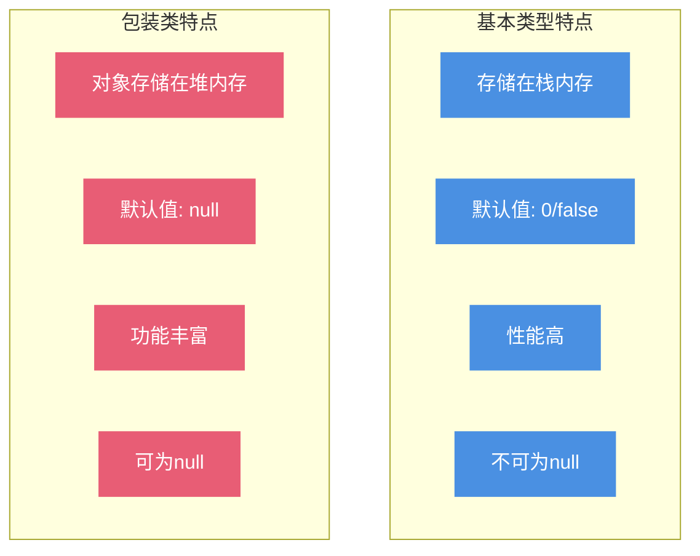
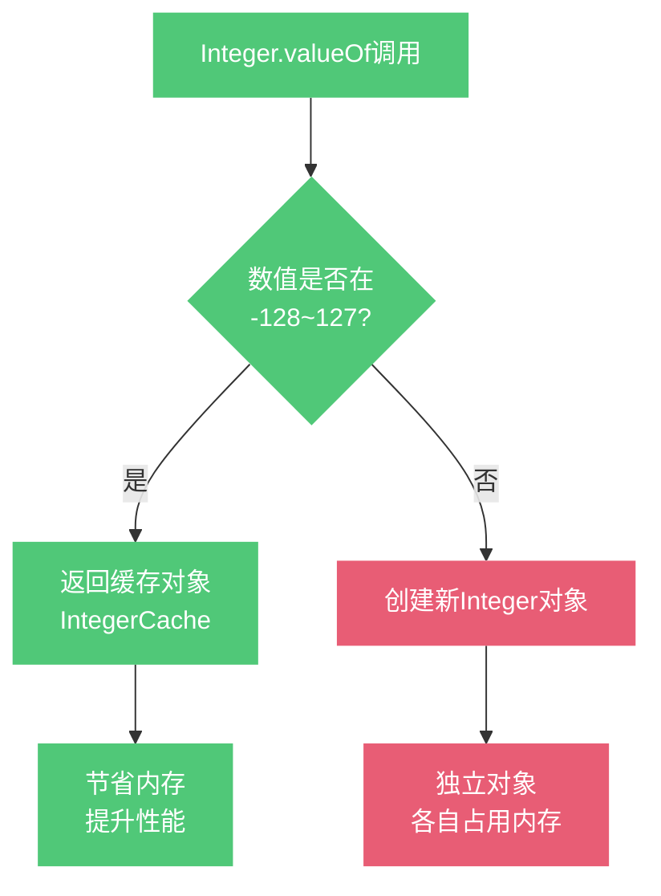

# 基本类型与包装类

## Java中为什么需要包装类?

Java作为一门面向对象的编程语言,设计之初就存在一个矛盾:为了性能考虑保留了8种基本数据类型(int、long、double等),但在很多场景下又需要将它们当作对象来使用。这就是包装类存在的根本原因。

### 基本类型与包装类对照表

| 数据分类 | 基本类型 | 包装类型 | 占用空间 | 数值范围 |
|---------|---------|---------|---------|----------|
| 布尔型 | boolean | Boolean | - | true/false |
| 字节型 | byte | Byte | 1字节 | -128 ~ 127 |
| 短整型 | short | Short | 2字节 | -32768 ~ 32767 |
| 整型 | int | Integer | 4字节 | -2^31 ~ 2^31-1 |
| 长整型 | long | Long | 8字节 | -2^63 ~ 2^63-1 |
| 字符型 | char | Character | 2字节 | 0 ~ 65535 |
| 单精度 | float | Float | 4字节 | ±3.4E38 |
| 双精度 | double | Double | 8字节 | ±1.7E308 |

### 为什么需要包装类?

**核心原因**:Java的许多特性和API都是基于对象设计的,而基本类型不是对象,无法直接使用这些功能。

主要应用场景包括:

1. **集合框架**:集合类(如ArrayList、HashMap)只能存储对象,不能直接存储基本类型
2. **泛型**:泛型参数必须是对象类型
3. **反射**:需要通过Class对象获取类型信息
4. **扩展功能**:包装类提供了类型转换、进制转换等实用方法

```java
public class WrapperExample {
    public static void main(String[] args) {
        // 场景1: 集合只能存储对象
        List<Integer> numbers = new ArrayList<>();
        numbers.add(100);  // 自动装箱
        
        // 场景2: Map的key和value都必须是对象
        Map<String, Long> userScores = new HashMap<>();
        userScores.put("Alice", 95000L);
        
        // 场景3: 使用包装类的工具方法
        String hexStr = Integer.toHexString(255);  // "ff"
        Integer parsed = Integer.valueOf("123");    // 字符串转整数
        
        // 场景4: null值表示"未设置"
        Integer age = null;  // 基本类型无法表示null
        if (age == null) {
            System.out.println("年龄未设置");
        }
    }
}
```

### 基本类型与包装类的核心区别



**主要区别**:

1. **默认值不同**:基本类型有明确的默认值(数值型为0,布尔型为false),包装类默认为null
2. **存储位置**:基本类型数据直接存储在栈中,包装类对象存储在堆中(栈中只保存引用)
3. **比较方式**:基本类型用`==`比较值,包装类用`==`比较引用地址,用`equals()`比较值
4. **性能差异**:基本类型性能更高,无需创建对象的开销

```java
public class DifferenceDemo {
    public static void main(String[] args) {
        // 1. 默认值差异
        int primitiveNum = 0;      // 默认为0
        Integer wrapperNum = null; // 默认为null
        
        // 2. 比较方式差异
        int a = 200;
        int b = 200;
        System.out.println(a == b);  // true,比较值
        
        Integer x = new Integer(200);
        Integer y = new Integer(200);
        System.out.println(x == y);       // false,比较引用
        System.out.println(x.equals(y));  // true,比较值
        
        // 3. null值处理
        Integer score = null;
        // int finalScore = score;  // 会抛出NullPointerException!
        int finalScore = (score != null) ? score : 0;  // 安全处理
    }
}
```

## 自动装箱与拆箱机制

### 什么是自动装箱和拆箱?

从Java 5开始,编译器会自动完成基本类型和包装类之间的转换:

- **自动装箱**(Autoboxing):基本类型 → 包装类
- **自动拆箱**(Unboxing):包装类 → 基本类型

```java
public class AutoBoxingDemo {
    public static void main(String[] args) {
        // 自动装箱: int → Integer
        Integer num = 50;  // 等价于 Integer num = Integer.valueOf(50);
        
        // 自动拆箱: Integer → int  
        int value = num;   // 等价于 int value = num.intValue();
    }
}
```

### 装箱与拆箱的底层实现

编译器通过调用包装类的特定方法来实现自动转换:

- **装箱**:调用`valueOf()`方法
- **拆箱**:调用`xxxValue()`方法(如`intValue()`, `longValue()`)

让我们通过反编译查看实际代码:

```java
// 源代码
Integer num = 100;
int value = num;

// 编译后的等价代码
Integer num = Integer.valueOf(100);
int value = num.intValue();
```

### 自动装箱拆箱的常见场景

**场景1: 集合操作**

```java
List<Integer> scoreList = new ArrayList<>();
for (int i = 1; i <= 100; i++) {
    scoreList.add(i);  // 自动装箱: int → Integer
}

int total = 0;
for (Integer score : scoreList) {
    total += score;  // 自动拆箱: Integer → int
}
```

**场景2: 运算操作**

包装类参与算术运算时会自动拆箱:

```java
Integer x = 10;
Integer y = 20;

// 编译前
Integer sum = x + y;

// 编译后等价代码
Integer sum = Integer.valueOf(x.intValue() + y.intValue());
```

**场景3: 比较操作**

```java
Integer num = 100;

// 包装类与基本类型比较,会自动拆箱
if (num == 100) {  // 等价于 num.intValue() == 100
    System.out.println("相等");
}

Boolean flag = true;
if (flag) {  // 等价于 flag.booleanValue()
    System.out.println("条件为真");
}
```

**场景4: 三元运算符**

这是一个容易被忽视的陷阱:

```java
boolean condition = true;
Integer nullValue = null;
int defaultValue = 0;

// 危险代码!会抛出NullPointerException
int result = condition ? nullValue : defaultValue;
// 原因: 三元运算符要求两边类型一致,会对nullValue自动拆箱
// 等价于: int result = condition ? nullValue.intValue() : defaultValue;

// 正确写法
Integer safeResult = condition ? nullValue : defaultValue;
```

**场景5: 方法参数和返回值**

```java
public class MethodExample {
    // 返回值自动装箱
    public Integer getCount(int base) {
        return base * 2;  // int → Integer
    }
    
    // 参数自动拆箱
    public int calculate(Integer num) {
        return num;  // Integer → int
    }
}
```

## 包装类的缓存机制

Java为了提升性能和节省内存,对部分包装类实现了缓存机制。

### Integer缓存范围

```java
public class CacheDemo {
    public static void main(String[] args) {
        // 场景1: -128~127范围内,使用缓存对象
        Integer a = 100;
        Integer b = 100;
        System.out.println(a == b);  // true (同一个缓存对象)
        
        // 场景2: 超出缓存范围,创建新对象
        Integer x = 200;
        Integer y = 200;
        System.out.println(x == y);  // false (不同对象)
        
        // 场景3: 使用构造器强制创建新对象
        Integer m = new Integer(100);
        Integer n = new Integer(100);
        System.out.println(m == n);  // false
        
        // 场景4: valueOf使用缓存
        Integer p = Integer.valueOf(100);
        Integer q = Integer.valueOf(100);
        System.out.println(p == q);  // true
    }
}
```

### 缓存机制详解



**各包装类的缓存规则**:

| 包装类 | 缓存范围 | 是否可调整 |
|--------|---------|----------|
| Integer | -128 ~ 127 | 最大值可通过JVM参数调整 |
| Long | -128 ~ 127 | 否 |
| Short | -128 ~ 127 | 否 |
| Byte | -128 ~ 127 | 否(所有值都缓存) |
| Character | 0 ~ 127 | 否 |
| Boolean | true/false | 否(只有两个值) |
| Float | 无缓存 | - |
| Double | 无缓存 | - |

**调整Integer缓存上限**:

```bash
# 通过JVM参数调整缓存最大值为1000
java -XX:AutoBoxCacheMax=1000 YourClass
```

### 缓存机制的实际应用

```java
public class CacheApplication {
    public static void main(String[] args) {
        // 错误示例: 用==比较包装类
        Integer score1 = getScore("user1");  // 假设返回200
        Integer score2 = getScore("user2");  // 假设返回200
        
        if (score1 == score2) {  // 错误!超出缓存范围会返回false
            System.out.println("分数相同");
        }
        
        // 正确示例: 用equals比较
        if (score1.equals(score2)) {
            System.out.println("分数相同");
        }
        
        // 性能优化: 小数值循环使用缓存
        List<Integer> smallNumbers = new ArrayList<>();
        for (int i = 0; i < 100; i++) {
            smallNumbers.add(i);  // 0~99都使用缓存,不创建新对象
        }
    }
    
    private static Integer getScore(String userId) {
        // 模拟获取用户分数
        return 200;
    }
}
```

## 最佳实践建议

1. **接口定义优先使用包装类**:允许表达"未设置"的语义
2. **局部变量优先使用基本类型**:性能更好
3. **避免包装类的空指针异常**:自动拆箱前务必判空
4. **包装类比较使用equals**:避免缓存范围导致的bug
5. **避免不必要的装箱拆箱**:减少性能开销

```java
public class BestPractices {
    // ✅ 推荐: 接口返回值用包装类
    public Integer getUserAge(String userId) {
        // null表示用户未设置年龄
        return null;
    }
    
    // ✅ 推荐: 循环中使用基本类型
    public int calculate(int[] numbers) {
        int sum = 0;  // 不是 Integer sum = 0
        for (int num : numbers) {
            sum += num;
        }
        return sum;
    }
    
    // ⚠️ 注意: 拆箱前判空
    public void processAge(Integer age) {
        if (age != null && age > 18) {  // 先判空再拆箱
            System.out.println("成年人");
        }
    }
    
    // ✅ 推荐: 包装类用equals比较
    public boolean compareScores(Integer score1, Integer score2) {
        return score1.equals(score2);  // 不是 score1 == score2
    }
}
```
