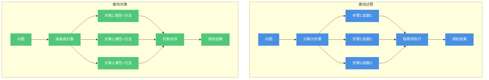
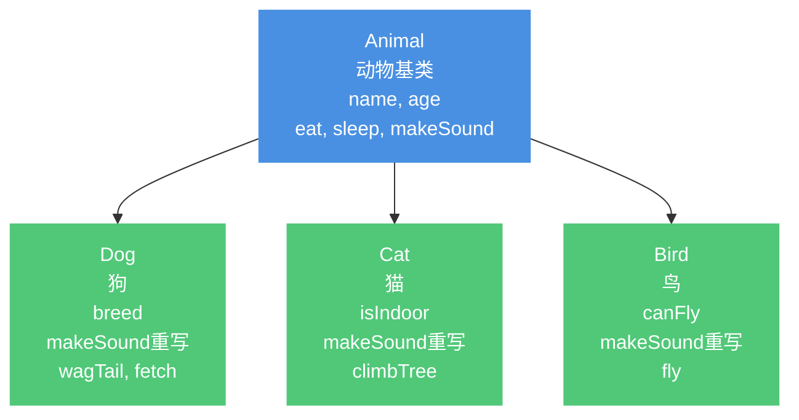
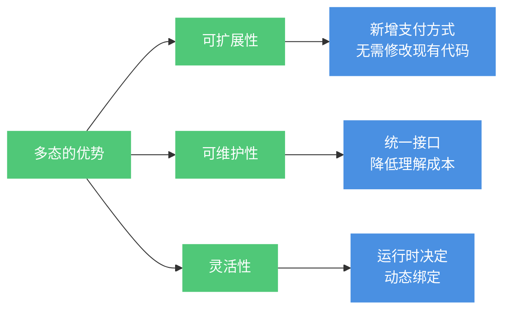
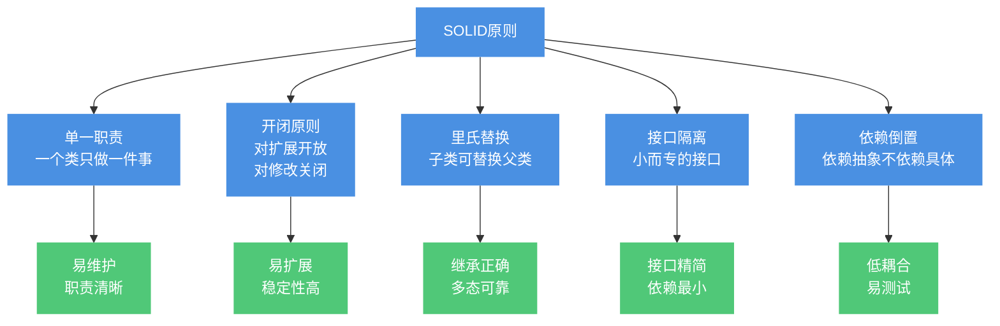

# 面向对象编程基础

## 面向对象与面向过程的区别

面向过程和面向对象是两种不同的编程思想,它们在解决问题时采用的方式截然不同。

### 面向过程编程

**核心思想**:把问题分解成一系列步骤,每个步骤用函数实现,按顺序调用这些函数来解决问题。

关注点是"怎么做",强调执行的流程和步骤。

```java
// 面向过程思维:制作一杯咖啡
public class ProceduralCoffee {
    public static void main(String[] args) {
        // 步骤1: 烧水
        boilWater();
        // 步骤2: 研磨咖啡豆
        grindCoffeeBeans();
        // 步骤3: 冲泡咖啡
        brewCoffee();
        // 步骤4: 添加糖和奶
        addSugarAndMilk();
        
        System.out.println("咖啡制作完成");
    }
    
    static void boilWater() {
        System.out.println("烧开水到100度");
    }
    
    static void grindCoffeeBeans() {
        System.out.println("研磨20克咖啡豆");
    }
    
    static void brewCoffee() {
        System.out.println("用热水冲泡咖啡粉");
    }
    
    static void addSugarAndMilk() {
        System.out.println("加入糖和奶");
    }
}
```

### 面向对象编程

**核心思想**:将问题分解成一个个对象,通过对象之间的交互和协作来解决问题。

关注点是"谁来做",强调对象的职责和协作。

```java
// 面向对象思维:制作一杯咖啡
public class OOPCoffee {
    public static void main(String[] args) {
        // 创建对象
        WaterHeater heater = new WaterHeater();
        CoffeeGrinder grinder = new CoffeeGrinder();
        CoffeeMaker maker = new CoffeeMaker();
        
        // 对象协作完成任务
        Water water = heater.heat();
        CoffeePowder powder = grinder.grind(20);
        Coffee coffee = maker.brew(water, powder);
        coffee.addSugar(2);
        coffee.addMilk(50);
        
        System.out.println("咖啡制作完成: " + coffee);
    }
}

// 热水器对象
class WaterHeater {
    public Water heat() {
        System.out.println("热水器:加热水到100度");
        return new Water(100);
    }
}

// 咖啡研磨机对象  
class CoffeeGrinder {
    public CoffeePowder grind(int grams) {
        System.out.println("研磨机:研磨" + grams + "克咖啡豆");
        return new CoffeePowder(grams);
    }
}

// 咖啡机对象
class CoffeeMaker {
    public Coffee brew(Water water, CoffeePowder powder) {
        System.out.println("咖啡机:冲泡咖啡");
        return new Coffee();
    }
}

// 水对象
class Water {
    private int temperature;
    public Water(int temperature) {
        this.temperature = temperature;
    }
}

// 咖啡粉对象
class CoffeePowder {
    private int grams;
    public CoffeePowder(int grams) {
        this.grams = grams;
    }
}

// 咖啡对象
class Coffee {
    private int sugar = 0;
    private int milk = 0;
    
    public void addSugar(int spoons) {
        this.sugar = spoons;
        System.out.println("添加" + spoons + "勺糖");
    }
    
    public void addMilk(int ml) {
        this.milk = ml;
        System.out.println("添加" + ml + "ml奶");
    }
}
```

### 两种思想的对比



**主要区别**:

| 对比维度 | 面向过程 | 面向对象 |
|---------|---------|----------|
| 关注点 | 执行步骤和流程 | 对象的职责和协作 |
| 代码组织 | 以函数为单位 | 以类/对象为单位 |
| 数据和行为 | 分离(数据结构+函数) | 封装在一起 |
| 复用方式 | 函数复用 | 继承、组合 |
| 扩展性 | 修改困难 | 易于扩展 |
| 适用场景 | 简单算法、工具函数 | 复杂系统、企业应用 |

## 面向对象的三大特征

面向对象有三个核心特征:封装、继承、多态。

### 1. 封装(Encapsulation)

**定义**:将对象的属性和行为封装在一起,对外隐藏内部实现细节,只暴露必要的接口。

**目的**:降低耦合度,提高安全性和可维护性。

```java
// 封装示例:银行账户
public class BankAccount {
    // 私有属性,外部无法直接访问
    private String accountNumber;
    private String ownerName;
    private double balance;
    private String password;
    
    public BankAccount(String accountNumber, String ownerName, String password) {
        this.accountNumber = accountNumber;
        this.ownerName = ownerName;
        this.password = password;
        this.balance = 0.0;
    }
    
    // 提供公共方法来操作私有数据
    public boolean deposit(double amount) {
        if (amount <= 0) {
            System.out.println("存款金额必须大于0");
            return false;
        }
        balance += amount;
        System.out.println("成功存入:" + amount + ",当前余额:" + balance);
        return true;
    }
    
    public boolean withdraw(double amount, String pwd) {
        // 密码验证
        if (!password.equals(pwd)) {
            System.out.println("密码错误");
            return false;
        }
        
        // 余额验证
        if (amount > balance) {
            System.out.println("余额不足");
            return false;
        }
        
        balance -= amount;
        System.out.println("成功取出:" + amount + ",当前余额:" + balance);
        return true;
    }
    
    // 只读访问
    public double getBalance(String pwd) {
        if (!password.equals(pwd)) {
            throw new SecurityException("密码错误");
        }
        return balance;
    }
    
    public String getAccountNumber() {
        return accountNumber;
    }
}

// 使用示例
class EncapsulationDemo {
    public static void main(String[] args) {
        BankAccount account = new BankAccount("6222021234567890", "张三", "123456");
        
        // ❌ 无法直接访问私有字段
        // account.balance = 1000000;  // 编译错误
        
        // ✅ 必须通过公共方法操作
        account.deposit(5000);
        account.withdraw(2000, "123456");
        
        double balance = account.getBalance("123456");
        System.out.println("账户余额:" + balance);
    }
}
```

**封装的优势**:
- 数据安全:外部无法直接修改内部状态
- 灵活修改:可以修改内部实现而不影响外部调用
- 易于维护:逻辑集中,便于理解和修改

### 2. 继承(Inheritance)

**定义**:子类可以继承父类的属性和方法,实现代码复用。

**目的**:避免重复代码,建立类之间的层次关系。

```java
// 父类:动物
public class Animal {
    protected String name;
    protected int age;
    protected String color;
    
    public Animal(String name, int age) {
        this.name = name;
        this.age = age;
    }
    
    // 通用行为
    public void eat() {
        System.out.println(name + "正在吃东西");
    }
    
    public void sleep() {
        System.out.println(name + "正在睡觉");
    }
    
    public void makeSound() {
        System.out.println(name + "发出声音");
    }
}

// 子类:狗
class Dog extends Animal {
    private String breed;  // 品种
    
    public Dog(String name, int age, String breed) {
        super(name, age);  // 调用父类构造器
        this.breed = breed;
    }
    
    // 重写父类方法
    @Override
    public void makeSound() {
        System.out.println(name + "汪汪汪!");
    }
    
    // 子类特有方法
    public void wagTail() {
        System.out.println(name + "摇尾巴");
    }
    
    public void fetch() {
        System.out.println(name + "去捡球");
    }
}

// 子类:猫
class Cat extends Animal {
    private boolean isIndoor;  // 是否室内猫
    
    public Cat(String name, int age, boolean isIndoor) {
        super(name, age);
        this.isIndoor = isIndoor;
    }
    
    @Override
    public void makeSound() {
        System.out.println(name + "喵喵喵~");
    }
    
    public void climbTree() {
        if (!isIndoor) {
            System.out.println(name + "爬树");
        } else {
            System.out.println(name + "是室内猫,不会爬树");
        }
    }
}

// 使用示例
class InheritanceDemo {
    public static void main(String[] args) {
        Dog dog = new Dog("旺财", 3, "金毛");
        dog.eat();        // 继承自Animal
        dog.makeSound();  // 重写的方法
        dog.wagTail();    // Dog特有方法
        
        System.out.println();
        
        Cat cat = new Cat("小白", 2, true);
        cat.sleep();      // 继承自Animal  
        cat.makeSound();  // 重写的方法
        cat.climbTree();  // Cat特有方法
    }
}
```

**继承的关系图**:



**继承的特点**:
- Java只支持单继承,一个类只能有一个直接父类
- 子类继承父类的所有非private成员
- 子类可以重写(Override)父类的方法
- 使用`super`关键字调用父类方法和构造器

#### 3. 多态(Polymorphism)

**定义**:同一个操作作用于不同的对象,可以产生不同的执行结果。

**实现条件**:
1. 有继承或接口实现关系
2. 子类重写父类方法
3. 父类引用指向子类对象

```java
// 多态示例:支付系统
public class PolymorphismDemo {
    public static void main(String[] args) {
        // 父类引用指向不同的子类对象
        PaymentMethod payment1 = new AlipayPayment();
        PaymentMethod payment2 = new WeChatPayment();
        PaymentMethod payment3 = new CreditCardPayment();
        
        // 同样的调用,不同的实现
        processPayment(payment1, 100.0);
        processPayment(payment2, 200.0);
        processPayment(payment3, 300.0);
    }
    
    // 多态的应用:统一处理不同的支付方式
    public static void processPayment(PaymentMethod payment, double amount) {
        System.out.println("\n开始支付...");
        if (payment.validate()) {
            payment.pay(amount);
            System.out.println("支付完成");
        } else {
            System.out.println("支付验证失败");
        }
    }
}

// 父类:支付方式
abstract class PaymentMethod {
    protected String accountId;
    
    public abstract boolean validate();
    public abstract void pay(double amount);
}

// 子类1:支付宝
class AlipayPayment extends PaymentMethod {
    @Override
    public boolean validate() {
        System.out.println("验证支付宝账户");
        return true;
    }
    
    @Override
    public void pay(double amount) {
        System.out.println("使用支付宝支付:¥" + amount);
        System.out.println("扫码完成,从余额宝扣款");
    }
}

// 子类2:微信支付
class WeChatPayment extends PaymentMethod {
    @Override
    public boolean validate() {
        System.out.println("验证微信账户");
        return true;
    }
    
    @Override
    public void pay(double amount) {
        System.out.println("使用微信支付:¥" + amount);
        System.out.println("人脸识别完成,从零钱扣款");
    }
}

// 子类3:信用卡
class CreditCardPayment extends PaymentMethod {
    @Override
    public boolean validate() {
        System.out.println("验证信用卡信息");
        return true;
    }
    
    @Override
    public void pay(double amount) {
        System.out.println("使用信用卡支付:¥" + amount);
        System.out.println("输入密码,银行扣款成功");
    }
}
```

**多态的优势**:



**方法重载vs方法重写**:

| 特性 | 重载(Overload) | 重写(Override) |
|------|---------------|---------------|
| 发生位置 | 同一个类中 | 父子类之间 |
| 方法名 | 相同 | 相同 |
| 参数列表 | 必须不同 | 必须相同 |
| 返回类型 | 可以不同 | 必须相同或是子类型 |
| 访问修饰符 | 可以不同 | 不能更严格 |
| 绑定时机 | 编译期绑定(静态) | 运行期绑定(动态) |
| 是否多态 | 争议(一般认为不是) | 是 |

```java
public class OverloadVsOverride {
    
    // 方法重载示例
    public void print(int num) {
        System.out.println("整数:" + num);
    }
    
    public void print(String str) {
        System.out.println("字符串:" + str);
    }
    
    public void print(int num, String str) {
        System.out.println("整数:" + num + ",字符串:" + str);
    }
}

class Parent {
    public void show() {
        System.out.println("Parent show");
    }
}

class Child extends Parent {
    // 方法重写示例
    @Override
    public void show() {
        System.out.println("Child show");
    }
}
```

## 面向对象的五大设计原则(SOLID)

这五个原则是面向对象设计的基石,帮助我们编写可维护、可扩展的代码。

### 1. 单一职责原则(Single Responsibility Principle)

**核心**:一个类应该只有一个引起它变化的原因,只负责一项职责。

```java
// ❌ 违反单一职责:一个类做太多事
class BadUserService {
    public void register(User user) {
        // 验证用户数据
        if (user.getName() == null || user.getEmail() == null) {
            throw new IllegalArgumentException("用户信息不完整");
        }
        
        // 保存到数据库
        saveToDatabase(user);
        
        // 发送欢迎邮件  
        sendEmail(user.getEmail(), "欢迎注册");
        
        // 记录日志
        writeLog("用户注册:" + user.getName());
    }
    
    private void saveToDatabase(User user) { /* ... */ }
    private void sendEmail(String to, String content) { /* ... */ }
    private void writeLog(String message) { /* ... */ }
}

// ✅ 符合单一职责:职责分离
class UserValidator {
    public void validate(User user) {
        if (user.getName() == null || user.getEmail() == null) {
            throw new IllegalArgumentException("用户信息不完整");
        }
    }
}

class UserRepository {
    public void save(User user) {
        // 保存到数据库
        System.out.println("保存用户到数据库:" + user.getName());
    }
}

class EmailService {
    public void sendWelcomeEmail(String email) {
        // 发送欢迎邮件
        System.out.println("发送欢迎邮件到:" + email);
    }
}

class Logger {
    public void log(String message) {
        System.out.println("[LOG] " + message);
    }
}

class GoodUserService {
    private UserValidator validator = new UserValidator();
    private UserRepository repository = new UserRepository();
    private EmailService emailService = new EmailService();
    private Logger logger = new Logger();
    
    public void register(User user) {
        validator.validate(user);
        repository.save(user);
        emailService.sendWelcomeEmail(user.getEmail());
        logger.log("用户注册:" + user.getName());
    }
}

class User {
    private String name;
    private String email;
    
    public User(String name, String email) {
        this.name = name;
        this.email = email;
    }
    
    public String getName() { return name; }
    public String getEmail() { return email; }
}
```

### 2. 开闭原则(Open-Closed Principle)

**核心**:对扩展开放,对修改关闭。应该通过扩展来实现变化,而不是修改已有代码。

```java
// ❌ 违反开闭原则:每次新增需要修改原有代码
class BadDiscountCalculator {
    public double calculate(String customerType, double amount) {
        if ("VIP".equals(customerType)) {
            return amount * 0.8;  // 8折
        } else if ("SVIP".equals(customerType)) {
            return amount * 0.7;  // 7折
        } else if ("NORMAL".equals(customerType)) {
            return amount;        // 原价
        }
        // 新增会员类型需要修改这里
        return amount;
    }
}

// ✅ 符合开闭原则:通过扩展添加新功能
interface DiscountStrategy {
    double calculateDiscount(double amount);
    String getDescription();
}

class VIPDiscount implements DiscountStrategy {
    @Override
    public double calculateDiscount(double amount) {
        return amount * 0.8;
    }
    
    @Override
    public String getDescription() {
        return "VIP会员8折优惠";
    }
}

class SVIPDiscount implements DiscountStrategy {
    @Override
    public double calculateDiscount(double amount) {
        return amount * 0.7;
    }
    
    @Override
    public String getDescription() {
        return "超级VIP会员7折优惠";
    }
}

class NormalDiscount implements DiscountStrategy {
    @Override
    public double calculateDiscount(double amount) {
        return amount;
    }
    
    @Override
    public String getDescription() {
        return "普通会员无折扣";
    }
}

// 新增会员类型,只需添加新类,无需修改现有代码
class GoldDiscount implements DiscountStrategy {
    @Override
    public double calculateDiscount(double amount) {
        return amount * 0.85;
    }
    
    @Override
    public String getDescription() {
        return "黄金会员85折优惠";
    }
}

class GoodDiscountCalculator {
    public double calculate(DiscountStrategy strategy, double amount) {
        return strategy.calculateDiscount(amount);
    }
}
```

### 3. 里氏替换原则(Liskov Substitution Principle)

**核心**:子类必须能够替换其父类,且不影响程序的正确性。

```java
// ❌ 违反里氏替换原则
class Bird {
    public void fly() {
        System.out.println("鸟在飞翔");
    }
}

class Penguin extends Bird {
    @Override
    public void fly() {
        throw new UnsupportedOperationException("企鹅不会飞!");
    }
}

// 这里会出问题
void makeBirdFly(Bird bird) {
    bird.fly();  // 如果传入Penguin会抛异常
}

// ✅ 符合里氏替换原则:重新设计继承关系
abstract class AbstractBird {
    public abstract void move();
}

class FlyingBird extends AbstractBird {
    @Override
    public void move() {
        fly();
    }
    
    public void fly() {
        System.out.println("在天空飞翔");
    }
}

class SwimmingBird extends AbstractBird {
    @Override
    public void move() {
        swim();
    }
    
    public void swim() {
        System.out.println("在水中游泳");
    }
}

class Sparrow extends FlyingBird {
    // 麻雀会飞
}

class GoodPenguin extends SwimmingBird {
    // 企鹅会游泳
}

// 现在可以安全替换
void makeBirdMove(AbstractBird bird) {
    bird.move();  // 无论是麻雀还是企鹅都能正常工作
}
```

### 4. 接口隔离原则(Interface Segregation Principle)

**核心**:客户端不应该依赖它不需要的接口,应该使用多个专门的接口,而不是一个总接口。

```java
// ❌ 违反接口隔离:接口过于臃肿
interface BadWorker {
    void work();
    void eat();
    void sleep();
    void attendMeeting();
    void writeReport();
}

class HumanWorker implements BadWorker {
    public void work() { System.out.println("人类工作"); }
    public void eat() { System.out.println("人类吃饭"); }
    public void sleep() { System.out.println("人类睡觉"); }
    public void attendMeeting() { System.out.println("参加会议"); }
    public void writeReport() { System.out.println("写报告"); }
}

class RobotWorker implements BadWorker {
    public void work() { System.out.println("机器人工作"); }
    public void eat() { /* 机器人不吃饭,但被迫实现 */ }
    public void sleep() { /* 机器人不睡觉,但被迫实现 */ }
    public void attendMeeting() { /* 机器人不开会,但被迫实现 */ }
    public void writeReport() { System.out.println("生成报告"); }
}

// ✅ 符合接口隔离:拆分成小接口
interface Workable {
    void work();
}

interface Eatable {
    void eat();
}

interface Sleepable {
    void sleep();
}

interface Meetable {
    void attendMeeting();
}

interface Reportable {
    void writeReport();
}

class GoodHumanWorker implements Workable, Eatable, Sleepable, Meetable, Reportable {
    public void work() { System.out.println("人类工作"); }
    public void eat() { System.out.println("人类吃饭"); }
    public void sleep() { System.out.println("人类睡觉"); }
    public void attendMeeting() { System.out.println("参加会议"); }
    public void writeReport() { System.out.println("写报告"); }
}

class GoodRobotWorker implements Workable, Reportable {
    public void work() { System.out.println("机器人工作"); }
    public void writeReport() { System.out.println("生成报告"); }
    // 不需要实现eat、sleep等接口
}
```

### 5. 依赖倒置原则(Dependency Inversion Principle)

**核心**:高层模块不应该依赖低层模块,两者都应该依赖抽象;抽象不应该依赖细节,细节应该依赖抽象。

```java
// ❌ 违反依赖倒置:高层依赖低层具体实现
class MySQLDatabase {
    public void saveData(String data) {
        System.out.println("保存到MySQL:" + data);
    }
}

class BadOrderService {
    private MySQLDatabase database = new MySQLDatabase();
    
    public void createOrder(String orderData) {
        // 业务逻辑
        database.saveData(orderData);
        // 如果要换成MongoDB,需要修改这里的代码
    }
}

// ✅ 符合依赖倒置:依赖抽象接口
interface Database {
    void save(String data);
    String query(String id);
}

class MySQL implements Database {
    @Override
    public void save(String data) {
        System.out.println("MySQL保存:" + data);
    }
    
    @Override
    public String query(String id) {
        return "从MySQL查询:" + id;
    }
}

class MongoDB implements Database {
    @Override
    public void save(String data) {
        System.out.println("MongoDB保存:" + data);
    }
    
    @Override
    public String query(String id) {
        return "从MongoDB查询:" + id;
    }
}

class Redis implements Database {
    @Override
    public void save(String data) {
        System.out.println("Redis缓存:" + data);
    }
    
    @Override
    public String query(String id) {
        return "从Redis查询:" + id;
    }
}

class GoodOrderService {
    private Database database;  // 依赖抽象
    
    // 通过构造器注入
    public GoodOrderService(Database database) {
        this.database = database;
    }
    
    public void createOrder(String orderData) {
        // 业务逻辑
        database.save(orderData);
        // 可以轻松切换数据库实现,无需修改代码
    }
}

class DIPDemo {
    public static void main(String[] args) {
        // 可以灵活切换实现
        GoodOrderService service1 = new GoodOrderService(new MySQL());
        service1.createOrder("订单1");
        
        GoodOrderService service2 = new GoodOrderService(new MongoDB());
        service2.createOrder("订单2");
        
        GoodOrderService service3 = new GoodOrderService(new Redis());
        service3.createOrder("订单3");
    }
}
```

**SOLID原则总结**:



这五大原则相辅相成,共同指导我们编写高质量的面向对象代码。在实际开发中,应该灵活运用,避免过度设计。
