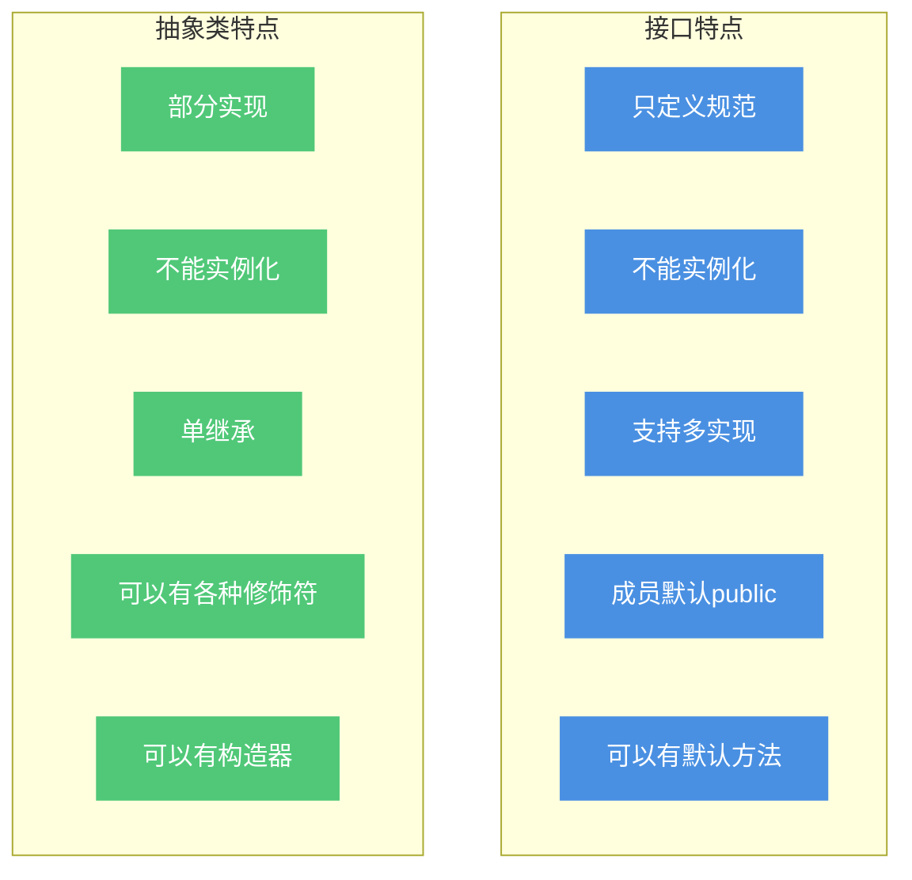
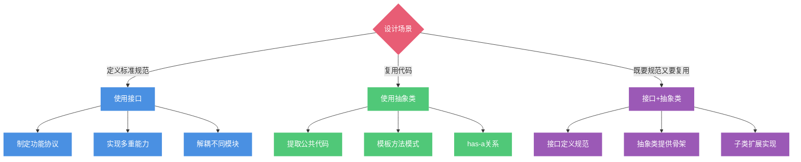
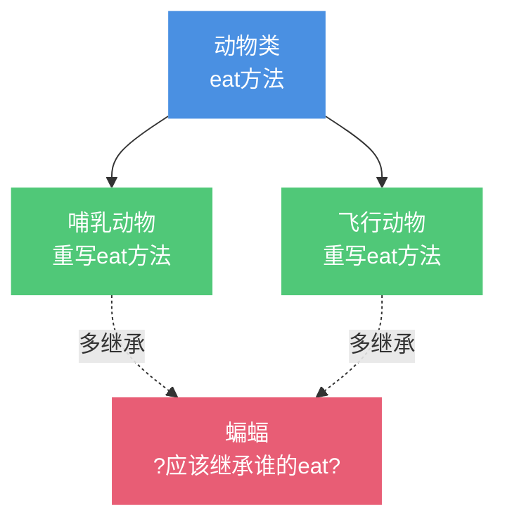
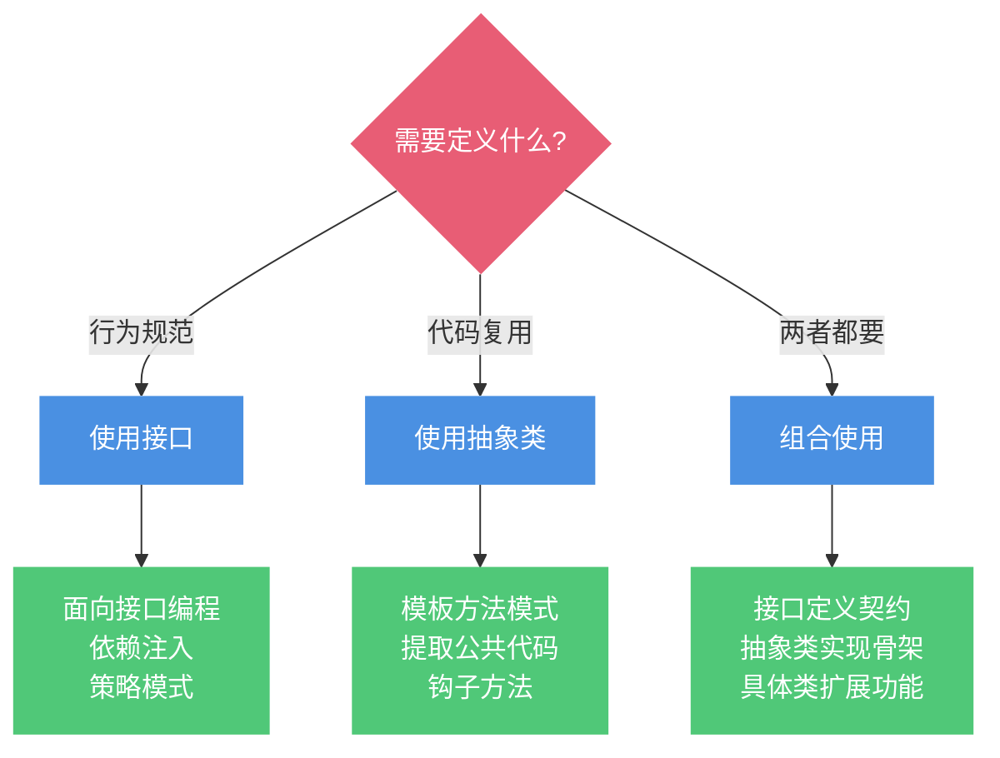

# 基础面经总结-6

## 接口与抽象类

### 接口和抽象类的概念

在Java面向对象编程中,接口(Interface)和抽象类(Abstract Class)都是实现抽象的重要手段,但它们的设计目的和使用场景有着本质区别。

#### 什么是接口?

**接口**是一种完全抽象的类型,它定义了一组规范和契约,但不提供具体实现。接口强调"能做什么"。

```java
// 接口定义示例:支付能力
public interface Payable {
    // 所有方法默认是public abstract
    boolean pay(double amount);
    
    void refund(String orderId);
    
    String getPaymentMethod();
    
    // Java 8+可以有默认方法
    default void printReceipt() {
        System.out.println("打印支付凭证");
    }
    
    // 静态方法
    static boolean validateAmount(double amount) {
        return amount > 0;
    }
    
    // 常量(默认public static final)
    int MAX_AMOUNT = 100000;
}
```

#### 什么是抽象类?

**抽象类**是介于普通类和接口之间的一种类型,既可以有抽象方法,也可以有具体实现。抽象类强调"是什么"。

```java
// 抽象类定义示例:支付处理
public abstract class AbstractPaymentProcessor implements Payable {
    // 可以有成员变量
    protected String merchantId;
    protected String secretKey;
    private int retryTimes = 3;
    
    // 可以有构造器
    public AbstractPaymentProcessor(String merchantId, String secretKey) {
        this.merchantId = merchantId;
        this.secretKey = secretKey;
    }
    
    // 具体方法:通用的支付流程
    @Override
    public final boolean pay(double amount) {
        // 前置检查
        if (!validatePayment(amount)) {
            return false;
        }
        
        // 核心支付逻辑(由子类实现)
        boolean result = doPayment(amount);
        
        // 后置处理
        if (result) {
            savePaymentRecord(amount);
        }
        
        return result;
    }
    
    // 抽象方法:子类必须实现
    protected abstract boolean doPayment(double amount);
    
    // 钩子方法:子类可以选择重写
    protected boolean validatePayment(double amount) {
        return amount > 0 && amount <= MAX_AMOUNT;
    }
    
    // 私有方法
    private void savePaymentRecord(double amount) {
        System.out.println("保存支付记录:" + amount);
    }
    
    // 实现接口方法
    @Override
    public void refund(String orderId) {
        System.out.println("处理退款:" + orderId);
    }
}
```

### 接口和抽象类的详细对比



| 对比维度 | 接口(Interface) | 抽象类(Abstract Class) |
|---------|----------------|----------------------|
| **设计目的** | 定义行为规范 | 代码复用 |
| **方法** | 默认抽象(可有默认实现) | 可以有抽象和具体方法 |
| **成员变量** | 只能是常量(public static final) | 可以有实例变量 |
| **构造器** | 不能有 | 可以有 |
| **访问修饰符** | 方法默认public | 可以是任意修饰符 |
| **继承/实现** | 类可实现多个接口 | 类只能继承一个抽象类 |
| **多重继承** | 接口可继承多个接口 | 抽象类只能继承一个类 |
| **实例化** | 不能实例化 | 不能实例化 |
| **应用场景** | 制定标准、定义能力 | 提取公共代码、模板方法 |

### 接口与抽象类的详细对比代码

```java
// ========== 1. 方法定义对比 ==========

// 接口:方法默认public abstract
interface Flyable {
    void fly();  // 等同于 public abstract void fly();
    
    // Java 8+可以有默认方法
    default void takeOff() {
        System.out.println("起飞");
    }
    
    // Java 8+可以有静态方法
    static void checkWeather() {
        System.out.println("检查天气");
    }
}

// 抽象类:可以有各种修饰符的方法
abstract class Bird {
    // 抽象方法
    public abstract void fly();
    
    // 具体方法
    public void eat() {
        System.out.println("鸟在吃东西");
    }
    
    // protected方法
    protected void sleep() {
        System.out.println("鸟在睡觉");
    }
    
    // private方法
    private void digest() {
        System.out.println("消化食物");
    }
}

// ========== 2. 成员变量对比 ==========

interface Constants {
    // 接口中的变量默认是public static final
    int MAX_SPEED = 100;  // 等同于 public static final int MAX_SPEED = 100;
    String TYPE = "BIRD"; // 必须初始化
}

abstract class Vehicle {
    // 可以有各种类型的成员变量
    public String brand;           // 公共变量
    protected int speed;           // 受保护变量
    private String engineType;     // 私有变量
    static int count = 0;          // 静态变量
    final int id = 1;              // 最终变量
    
    // 可以有构造器来初始化
    public Vehicle(String brand) {
        this.brand = brand;
        count++;
    }
}

// ========== 3. 继承和实现对比 ==========

// 接口支持多实现
interface Swimmable {
    void swim();
}

interface Runnable {
    void run();
}

// 一个类可以实现多个接口
class Duck implements Flyable, Swimmable, Runnable {
    @Override
    public void fly() {
        System.out.println("鸭子飞翔");
    }
    
    @Override
    public void swim() {
        System.out.println("鸭子游泳");
    }
    
    @Override
    public void run() {
        System.out.println("鸭子奔跑");
    }
}

// 抽象类只支持单继承
abstract class Mammal {
    abstract void breathe();
}

abstract class Primate extends Mammal {
    // 只能继承一个抽象类
    abstract void climb();
}

class Human extends Primate implements Runnable, Swimmable {
    // 继承一个抽象类,实现多个接口
    @Override
    void breathe() {
        System.out.println("用肺呼吸");
    }
    
    @Override
    void climb() {
        System.out.println("攀爬");
    }
    
    @Override
    public void run() {
        System.out.println("人类奔跑");
    }
    
    @Override
    public void swim() {
        System.out.println("人类游泳");
    }
}
```

### 如何选择接口还是抽象类?



#### 使用接口的场景

**适用于**:
1. 定义功能规范,不关心实现
2. 需要多重能力组合
3. 跨层次的能力定义

```java
// 场景1:定义规范
interface Serializable {
    byte[] serialize();
    void deserialize(byte[] data);
}

// 场景2:能力组合
interface Comparable<T> {
    int compareTo(T other);
}

interface Cloneable {
    Object clone();
}

// 一个实体类可以具备多种能力
class Student implements Serializable, Comparable<Student>, Cloneable {
    private String name;
    private int age;
    
    public Student(String name, int age) {
        this.name = name;
        this.age = age;
    }
    
    @Override
    public byte[] serialize() {
        return (name + "," + age).getBytes();
    }
    
    @Override
    public void deserialize(byte[] data) {
        String str = new String(data);
        String[] parts = str.split(",");
        this.name = parts[0];
        this.age = Integer.parseInt(parts[1]);
    }
    
    @Override
    public int compareTo(Student other) {
        return this.age - other.age;
    }
    
    @Override
    public Object clone() {
        return new Student(this.name, this.age);
    }
}
```

#### 使用抽象类的场景

**适用于**:
1. 多个类有公共代码需要复用
2. 使用模板方法模式
3. 需要成员变量或构造器

```java
// 场景:模板方法模式
public abstract class DataProcessor {
    private String dataSource;
    
    public DataProcessor(String dataSource) {
        this.dataSource = dataSource;
    }
    
    // 模板方法:定义处理流程
    public final void process() {
        // 1. 加载数据
        Object data = loadData();
        System.out.println("数据加载完成");
        
        // 2. 验证数据
        if (!validate(data)) {
            System.out.println("数据验证失败");
            return;
        }
        
        // 3. 转换数据(子类实现)
        Object transformed = transform(data);
        
        // 4. 保存数据
        save(transformed);
        System.out.println("数据处理完成");
    }
    
    // 具体方法:通用逻辑
    private Object loadData() {
        System.out.println("从" + dataSource + "加载数据");
        return "raw data";
    }
    
    // 钩子方法:子类可以重写
    protected boolean validate(Object data) {
        return data != null;
    }
    
    // 抽象方法:子类必须实现
    protected abstract Object transform(Object data);
    
    // 具体方法
    private void save(Object data) {
        System.out.println("保存数据:" + data);
    }
}

// CSV处理器
class CsvProcessor extends DataProcessor {
    public CsvProcessor(String file) {
        super(file);
    }
    
    @Override
    protected Object transform(Object data) {
        System.out.println("CSV格式转换");
        return data.toString().replace(",", "|");
    }
}

// JSON处理器
class JsonProcessor extends DataProcessor {
    public JsonProcessor(String file) {
        super(file);
    }
    
    @Override
    protected Object transform(Object data) {
        System.out.println("JSON格式转换");
        return "{\"data\":\"" + data + "\"}";
    }
    
    @Override
    protected boolean validate(Object data) {
        // JSON需要额外的验证
        return super.validate(data) && !data.toString().isEmpty();
    }
}
```

#### 接口+抽象类组合使用(推荐模式)

这是最佳实践,既有接口的灵活性,又有抽象类的代码复用:

```java
// 第1层:接口定义规范
interface MessageService {
    boolean send(String to, String content);
    boolean validate(String to);
    String getServiceName();
}

// 第2层:抽象类提供通用实现
abstract class AbstractMessageService implements MessageService {
    protected String appKey;
    protected String appSecret;
    private int maxRetries = 3;
    
    public AbstractMessageService(String appKey, String appSecret) {
        this.appKey = appKey;
        this.appSecret = appSecret;
    }
    
    @Override
    public final boolean send(String to, String content) {
        // 统一的发送流程
        if (!validate(to)) {
            System.out.println("收件人验证失败");
            return false;
        }
        
        for (int i = 0; i < maxRetries; i++) {
            try {
                if (doSend(to, content)) {
                    logSuccess(to);
                    return true;
                }
            } catch (Exception e) {
                System.out.println("第" + (i+1) + "次发送失败");
            }
        }
        
        logFailure(to);
        return false;
    }
    
    // 抽象方法:子类实现具体发送逻辑
    protected abstract boolean doSend(String to, String content);
    
    // 通用方法
    private void logSuccess(String to) {
        System.out.println("[" + getServiceName() + "] 发送成功:" + to);
    }
    
    private void logFailure(String to) {
        System.out.println("[" + getServiceName() + "] 发送失败:" + to);
    }
}

// 第3层:具体实现类
class EmailService extends AbstractMessageService {
    
    public EmailService(String appKey, String appSecret) {
        super(appKey, appSecret);
    }
    
    @Override
    protected boolean doSend(String to, String content) {
        System.out.println("通过SMTP发送邮件到:" + to);
        System.out.println("内容:" + content);
        return true;
    }
    
    @Override
    public boolean validate(String to) {
        return to != null && to.contains("@");
    }
    
    @Override
    public String getServiceName() {
        return "邮件服务";
    }
}

class SmsService extends AbstractMessageService {
    
    public SmsService(String appKey, String appSecret) {
        super(appKey, appSecret);
    }
    
    @Override
    protected boolean doSend(String to, String content) {
        System.out.println("通过短信网关发送到:" + to);
        System.out.println("内容:" + content);
        return true;
    }
    
    @Override
    public boolean validate(String to) {
        return to != null && to.matches("^1[3-9]\\d{9}$");
    }
    
    @Override
    public String getServiceName() {
        return "短信服务";
    }
}

class WeChatService extends AbstractMessageService {
    
    public WeChatService(String appKey, String appSecret) {
        super(appKey, appSecret);
    }
    
    @Override
    protected boolean doSend(String to, String content) {
        System.out.println("通过微信API推送到:" + to);
        System.out.println("内容:" + content);
        return true;
    }
    
    @Override
    public boolean validate(String to) {
        return to != null && to.startsWith("wx_");
    }
    
    @Override
    public String getServiceName() {
        return "微信服务";
    }
}

// 使用示例
class MessageDemo {
    public static void main(String[] args) {
        MessageService emailSvc = new EmailService("key1", "secret1");
        emailSvc.send("user@example.com", "欢迎注册");
        
        MessageService smsSvc = new SmsService("key2", "secret2");
        smsSvc.send("13800138000", "验证码:123456");
        
        MessageService wechatSvc = new WeChatService("key3", "secret3");
        wechatSvc.send("wx_user123", "您有新消息");
    }
}
```

### Java为什么不支持多继承?

#### 多继承带来的菱形问题

Java只支持单继承,但可以实现多个接口。这是为了避免多继承带来的复杂性和歧义性。

**菱形继承问题**:如果一个类继承了两个父类,而这两个父类又继承自同一个祖先类,会出现方法调用的歧义。



```java
// 假设Java支持多继承(实际不支持)
/*
class Animal {
    public void eat() {
        System.out.println("动物吃东西");
    }
}

class Mammal extends Animal {
    @Override
    public void eat() {
        System.out.println("哺乳动物吃奶");
    }
}

class FlyingAnimal extends Animal {
    @Override
    public void eat() {
        System.out.println("飞行动物吃虫子");
    }
}

// 如果允许多继承,会出现歧义
class Bat extends Mammal, FlyingAnimal {  // 编译错误!
    public void test() {
        eat();  // 应该调用Mammal的还是FlyingAnimal的?
    }
}
*/
```

#### Java的解决方案:接口多实现

Java通过接口实现了"能力的多重继承",避免了菱形问题:

```java
// 定义能力接口
interface Eatable {
    void eat();
}

interface Flyable {
    void fly();
}

interface Swimmable {
    void swim();
}

// 蝙蝠:会飞的哺乳动物
class Bat implements Eatable, Flyable {
    @Override
    public void eat() {
        System.out.println("蝙蝠吃虫子");
    }
    
    @Override
    public void fly() {
        System.out.println("蝙蝠在夜间飞行");
    }
}

// 鸭子:会飞、会游的动物
class DuckBird implements Eatable, Flyable, Swimmable {
    @Override
    public void eat() {
        System.out.println("鸭子吃鱼虾");
    }
    
    @Override
    public void fly() {
        System.out.println("鸭子低空飞行");
    }
    
    @Override
    public void swim() {
        System.out.println("鸭子在水中游泳");
    }
}
```

#### Java 8中的接口默认方法与菱形问题

Java 8引入了接口的默认方法,又出现了类似菱形继承的问题,Java的解决方案是:**强制子类重写冲突的方法**。

```java
// 场景:两个接口有相同的默认方法
interface Pet {
    default void makeSound() {
        System.out.println("宠物发出声音");
    }
}

interface WildAnimal {
    default void makeSound() {
        System.out.println("野生动物发出声音");
    }
}

// 编译错误:必须重写makeSound方法
class Fox implements Pet, WildAnimal {
    // 必须重写来解决冲突
    @Override
    public void makeSound() {
        // 可以选择调用某个接口的默认实现
        Pet.super.makeSound();
        // 或者提供自己的实现
        System.out.println("狐狸:嗷呜~");
    }
}

// 使用示例
class DefaultMethodDemo {
    public static void main(String[] args) {
        Fox fox = new Fox();
        fox.makeSound();
    }
}
```

### 实际开发中的最佳实践



**总结**:

1. **优先使用接口**:定义能力和规范
2. **适时使用抽象类**:复用代码和定义模板
3. **组合使用**:接口+抽象类是最佳实践
4. **避免过度设计**:简单场景直接用具体类

```java
// 推荐的设计模式

// 1. 接口定义规范
interface Cache {
    void put(String key, Object value);
    Object get(String key);
    void remove(String key);
    void clear();
}

// 2. 抽象类提供骨架实现
abstract class AbstractCache implements Cache {
    protected int maxSize = 1000;
    protected long ttl = 3600000; // 1小时
    
    @Override
    public void put(String key, Object value) {
        if (key == null || value == null) {
            throw new IllegalArgumentException("key和value不能为null");
        }
        doPut(key, value);
    }
    
    protected abstract void doPut(String key, Object value);
    
    @Override
    public void clear() {
        System.out.println("清空缓存");
        doClear();
    }
    
    protected abstract void doClear();
}

// 3. 具体类实现细节
class MemoryCache extends AbstractCache {
    private Map<String, Object> cache = new HashMap<>();
    
    @Override
    protected void doPut(String key, Object value) {
        cache.put(key, value);
    }
    
    @Override
    public Object get(String key) {
        return cache.get(key);
    }
    
    @Override
    public void remove(String key) {
        cache.remove(key);
    }
    
    @Override
    protected void doClear() {
        cache.clear();
    }
}

class RedisCache extends AbstractCache {
    private String host;
    private int port;
    
    public RedisCache(String host, int port) {
        this.host = host;
        this.port = port;
    }
    
    @Override
    protected void doPut(String key, Object value) {
        System.out.println("存入Redis: " + key);
    }
    
    @Override
    public Object get(String key) {
        System.out.println("从Redis获取: " + key);
        return null;
    }
    
    @Override
    public void remove(String key) {
        System.out.println("从Redis删除: " + key);
    }
    
    @Override
    protected void doClear() {
        System.out.println("清空Redis缓存");
    }
}
```

这样的设计既保证了灵活性(通过接口),又实现了代码复用(通过抽象类),是工业级代码的典型模式。