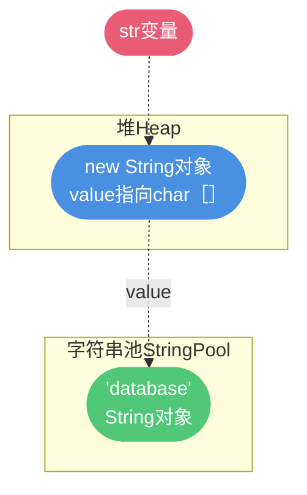

# String 类详解

## String 的不可变性

### 什么是不可变

在 Java 中,String 被设计成不可变类型。**不可变对象是指对象一旦被创建后,其内部状态就无法改变**。这意味着,当对象被赋值给变量后,我们既不能更新引用指向的对象内容,也不能通过任何方式修改其内部数据。

```java
public class StringImmutabilityDemo {
    public static void main(String[] args) {
        String username = "admin";
        System.out.println("Original: " + username);  // admin
        
        // 看似修改了字符串
        username = username.concat("_2024");
        System.out.println("Modified: " + username);  // admin_2024
        
        // 实际上创建了新对象,原对象 "admin" 依然存在
    }
}
```


### String 如何实现不可变

让我们通过源码来理解 String 的不可变实现机制(以 JDK 8 为例):

```java
public final class String
    implements java.io.Serializable, Comparable<String>, CharSequence {
    
    // 存储字符串内容的数组,被 final 修饰
    private final char value[];
    
    // 缓存的 hash 值
    private int hash;
    
    // substring 方法不修改原对象,而是创建新对象
    public String substring(int beginIndex, int endIndex) {
        // ...参数校验...
        return new String(value, beginIndex, subLen);
    }
    
    // concat 方法也是创建新对象
    public String concat(String str) {
        if (str.isEmpty()) {
            return this;
        }
        int len = value.length;
        int otherLen = str.length();
        char buf[] = Arrays.copyOf(value, len + otherLen);
        str.getChars(buf, len);
        return new String(buf, true);  // 返回新对象
    }
}
```

String 的不可变性通过以下三种机制保证:

1. **类被 final 修饰**:不能被继承,防止子类破坏不可变性
2. **存储数组被 final 修饰**:`char[] value` 被 final 修饰且私有,一旦初始化就不能再指向其他数组
3. **没有提供修改方法**:所有修改操作(如 substring、concat)都返回新对象

> **JDK 9 的变化**: 从 JDK 9 开始,`char[]` 被改为 `byte[]`,并增加了编码标记。这样对于 Latin-1 字符集的字符只需要 1 字节存储,节省了内存空间。

### 为什么要设计成不可变

Java 创始人 James Gosling 在接受采访时表示:

> "I would use an immutable whenever I can."

那么,为什么 String 要设计成不可变呢?主要有以下几个原因:

**1. 字符串常量池的需要**

JVM 为了优化性能和节约内存,维护了一个字符串常量池。如果字符串是可变的,就无法实现这种共享机制。

```java
public class PoolDemo {
    public static void main(String[] args) {
        String email1 = "user@example.com";
        String email2 = "user@example.com";
        
        // 两个变量指向同一个对象
        System.out.println(email1 == email2);  // true
        
        // 如果 String 可变,修改 email1 就会影响 email2
        // 这显然不是我们期望的结果
    }
}
```


**2. 安全性考虑**

字符串广泛用于存储敏感信息(如用户名、密码、数据库连接地址等)。如果字符串可变,就可能导致安全问题。

```java
public class SecurityDemo {
    private String password;
    
    public void authenticate(String pwd) {
        this.password = pwd;
        // 如果 String 可变,调用者后续修改 pwd 会影响这里存储的密码
        // 这就存在安全风险
    }
}
```

**3. 线程安全**

不可变对象天然是线程安全的。多个线程可以安全地访问同一个 String 对象,无需同步措施。

```java
public class ThreadSafeDemo {
    // String 作为共享资源,无需加锁
    private static final String CONFIG = "server.port=8080";
    
    public void thread1() {
        System.out.println(CONFIG);  // 安全访问
    }
    
    public void thread2() {
        System.out.println(CONFIG);  // 安全访问
    }
}
```

**4. HashCode 缓存**

String 经常被用作 HashMap 的 key。由于不可变,其 hashCode 可以被缓存,提高性能。

```java
public final class String {
    private int hash;  // 缓存 hashCode
    
    public int hashCode() {
        int h = hash;
        if (h == 0 && value.length > 0) {
            // 第一次计算并缓存
            hash = h = // ...计算逻辑...
        }
        return h;  // 后续调用直接返回缓存值
    }
}
```

**5. 性能优化**

不可变性允许 JVM 进行多种优化:
- 字符串常量池共享,节约内存
- HashCode 缓存,提高查找效率  
- JIT 编译器可以进行更激进的优化


### String、StringBuffer 与 StringBuilder 的区别

String、StringBuilder 和 StringBuffer 都用于处理字符串,但它们在可变性、线程安全性和性能上有显著差异。

### 三者对比

| 特性 | String | StringBuilder | StringBuffer |
|------|--------|---------------|---------------|
| **可变性** | 不可变 | 可变 | 可变 |
| **线程安全** | 安全 | 不安全 | 安全 |
| **性能** | 低(频繁创建新对象) | 高 | 中(有同步开销) |
| **底层实现** | final char[] | char[]（可扩容） | char[]（可扩容） |
| **适用场景** | 字符串不变 | 单线程大量拼接 | 多线程大量拼接 |


### 实现原理对比

**String 的实现**

```java
public final class String {
    // final 修饰,不可改变引用
    private final char[] value;
    
    // 每次操作都返回新对象
    public String concat(String str) {
        int otherLen = str.length();
        if (otherLen == 0) {
            return this;
        }
        int len = value.length;
        char buf[] = Arrays.copyOf(value, len + otherLen);
        str.getChars(buf, len);
        return new String(buf, true);  // 创建新对象
    }
}
```

**StringBuilder 的实现**

```java
public final class StringBuilder extends AbstractStringBuilder {
    // 无同步措施,性能高
    public StringBuilder append(String str) {
        super.append(str);
        return this;
    }
}

abstract class AbstractStringBuilder {
    // 可以修改的数组
    char[] value;
    int count;  // 已使用的字符数
    
    public AbstractStringBuilder append(String str) {
        if (str == null) {
            return appendNull();
        }
        int len = str.length();
        ensureCapacityInternal(count + len);  // 必要时扩容
        str.getChars(0, len, value, count);   // 直接复制到数组
        count += len;
        return this;
    }
}
```

**StringBuffer 的实现**

```java
public final class StringBuffer extends AbstractStringBuilder {
    // synchronized 保证线程安全
    @Override
    public synchronized StringBuffer append(String str) {
        toStringCache = null;  // 清空缓存
        super.append(str);
        return this;
    }
    
    // 其他方法也都加了 synchronized
    @Override
    public synchronized int length() {
        return count;
    }
}
```

### 性能测试对比

```java
public class PerformanceComparison {
    private static final int ITERATIONS = 50000;
    
    public static void main(String[] args) {
        testString();
        testStringBuilder();
        testStringBuffer();
    }
    
    // 测试 String
    private static void testString() {
        long start = System.currentTimeMillis();
        String result = "";
        for (int i = 0; i < ITERATIONS; i++) {
            result += i;  // 每次都创建新对象
        }
        System.out.println("String 耗时: " + (System.currentTimeMillis() - start) + "ms");
        // 约 3000-5000ms
    }
    
    // 测试 StringBuilder
    private static void testStringBuilder() {
        long start = System.currentTimeMillis();
        StringBuilder sb = new StringBuilder();
        for (int i = 0; i < ITERATIONS; i++) {
            sb.append(i);  // 在原对象上修改
        }
        String result = sb.toString();
        System.out.println("StringBuilder 耗时: " + (System.currentTimeMillis() - start) + "ms");
        // 约 5-10ms
    }
    
    // 测试 StringBuffer
    private static void testStringBuffer() {
        long start = System.currentTimeMillis();
        StringBuffer sb = new StringBuffer();
        for (int i = 0; i < ITERATIONS; i++) {
            sb.append(i);  // 有同步开销
        }
        String result = sb.toString();
        System.out.println("StringBuffer 耗时: " + (System.currentTimeMillis() - start) + "ms");
        // 约 8-15ms
    }
}
```

### 为什么不要在循环中用 + 拼接字符串

虽然 `+` 拼接字符串底层使用的也是 StringBuilder,但在循环中会有问题:

```java
// 错误写法:每次循环都创建新的 StringBuilder
String result = "User: ";
for (int i = 0; i < 1000; i++) {
    result += "ID=" + i + ",";
}

// 编译后的等价代码(以 JDK 8 为例)
String result = "User: ";
for (int i = 0; i < 1000; i++) {
    // 每次循环都 new 一个 StringBuilder
    result = new StringBuilder()
        .append(result)
        .append("ID=")
        .append(i)
        .append(",")
        .toString();
}
```

这样会导致:
1. **频繁创建对象**:每次循环都 new StringBuilder,性能差
2. **内存浪费**:产生大量中间对象,增加 GC 压力

**正确写法**:

```java
// 复用同一个 StringBuilder
StringBuilder sb = new StringBuilder("User: ");
for (int i = 0; i < 1000; i++) {
    sb.append("ID=").append(i).append(",");
}
String result = sb.toString();
```

### 使用场景选择

```java
public class UsageScenarios {
    // 1. String: 字符串不变或少量操作
    public String getWelcomeMessage(String username) {
        return "Welcome, " + username + "!";
    }
    
    // 2. StringBuilder: 单线程大量字符串拼接
    public String buildReport(List<Order> orders) {
        StringBuilder report = new StringBuilder();
        report.append("=== Order Report ===\n");
        for (Order order : orders) {
            report.append("Order#").append(order.getId())
                  .append(": $").append(order.getAmount())
                  .append("\n");
        }
        return report.toString();
    }
    
    // 3. StringBuffer: 多线程共享的字符串拼接
    private StringBuffer sharedLog = new StringBuffer();
    
    public void logFromMultipleThreads(String message) {
        // 多个线程同时调用,需要线程安全
        sharedLog.append(Thread.currentThread().getName())
                 .append(": ")
                 .append(message)
                 .append("\n");
    }
}
```

**总结**:
- 简单拼接、字符串不变 → **String**
- 单线程环境、大量拼接 → **StringBuilder** (最常用)
- 多线程环境、大量拼接 → **StringBuffer**
- 循环中拼接 → **必须用 StringBuilder**

## 字符串常量池机制

字符串常量池(也称字符串池或String Pool)是 JVM 为了提高性能和节约内存而设计的一种机制。

### 什么是字面量

在计算机科学中,**字面量(Literal)是指在源代码中直接表示的固定值**。简单来说,就是由字符、数字等构成的常量值。

```java
public class LiteralDemo {
    public static void main(String[] args) {
        int age = 25;                    // 25 是整数字面量
        double price = 99.99;            // 99.99 是浮点数字面量
        boolean isActive = true;         // true 是布尔字面量
        String product = "iPhone";       // "iPhone" 是字符串字面量
        char level = 'A';                // 'A' 是字符字面量
    }
}
```

**字面量的特点**:
- 只能作为右值使用(在等号右边)
- 编译期确定,被写入 Class 文件的常量池

### Class 常量池与运行时常量池

```java
public class ConstantPoolDemo {
    public static void main(String[] args) {
        String database = "MySQL";
    }
}
```

编译后,查看 Class 文件的常量池:

```bash
# 使用 javap -v ConstantPoolDemo.class 查看
Constant pool:
   #1 = Methodref          #4.#20     // java/lang/Object."<init>":()V
   #2 = String             #21        // MySQL
   #3 = Class              #22        // ConstantPoolDemo
   #4 = Class              #23        // java/lang/Object
   ...
   #16 = Utf8               database
   #21 = Utf8               MySQL
   #22 = Utf8               ConstantPoolDemo
```

关键内容:
- `#16 = Utf8 database` → 符号引用(变量名)
- `#21 = Utf8 MySQL` → 字面量(字符串内容)

**流程**:
1. **编译期**: 字面量被放入 Class 文件的常量池
2. **运行期**: Class 常量池的内容被加载到运行时常量池
3. **首次使用**: 字符串字面量在首次被 ldc 指令执行时,在字符串池中创建实例


### 字符串常量池的位置

- **JDK 6**: 字符串池在永久代(PermGen)
- **JDK 7+**: 字符串池移到堆(Heap)中


### new String() 创建几个对象

这是一个经典的面试题,答案是: **1个或 2个**。

```java
String str = new String("database");
```

**情况 1: 字符串池中没有 "database"**

创建 **2 个对象**:
1. 字符串池中创建 "database" 对象(由 `ldc` 指令触发)
2. 堆中创建 String 对象(由 `new` 指令触发)




**情况 2: 字符串池中已有 "database"**

创建 **1 个对象**:
1. 仅在堆中创建 String 对象,引用常量池中已有的 "database"

```java
// 字节码分析
String str = new String("database");

// 对应字节码:
 0 new #2 <java/lang/String>          // 在堆中分配 String 对象
 3 dup                                 // 复制引用
 4 ldc #3 <database>                   // 加载/创建常量池中的 "database"
 6 invokespecial #4 <init>             // 调用构造函数
 9 astore_1                            // 存入局部变量表
```


**重要的概念澄清**:

在 JVM 中,只有通过 `instanceOopDesc` 结构创建的才叫对象。引用只是引用,不是对象。

### 字符串拼接与常量池

```java
public class StringConcatDemo {
    public static void main(String[] args) {
        String s1 = "Hello";
        String s2 = "World";
        String s3 = "HelloWorld";
        
        // 情况 1: 字面量拼接 - 编译期优化
        String s4 = "Hello" + "World";
        System.out.println(s3 == s4);  // true
        
        // 情况 2: 变量拼接 - 运行时生成
        String s5 = s1 + s2;
        System.out.println(s3 == s5);  // false
    }
}
```

**原理分析**:

```java
// 情况 1: 编译器优化(常量折叠)
String s4 = "Hello" + "World";
// 编译器直接优化为:
String s4 = "HelloWorld";
// 所以 s3 和 s4 指向同一个对象

// 情况 2: 变量拼接(运行时生成)
String s5 = s1 + s2;
// 编译为(以 JDK 8 为例):
String s5 = new StringBuilder().append(s1).append(s2).toString();
// toString() 会创建新的 String 对象
```

**原因**: 常量池只保存**编译期确定**的字面量值。对于变量拼接,编译器无法确定最终值,因此不会放入常量池。

### intern() 方法详解

`intern()` 是 String 类的一个 Native 方法,用于手动将字符串添加到常量池。

**作用**:
1. 如果常量池中已存在相同内容的字符串,返回常量池中的引用
2. 如果常量池中不存在,将当前字符串添加到常量池并返回引用

```java
public class InternDemo {
    public static void main(String[] args) {
        // 示例 1
        String s1 = new String("mysql");
        s1.intern();  // "mysql" 在编译期已进入常量池
        String s2 = "mysql";
        System.out.println(s1 == s2);  // false
        // s1 指向堆中的对象, s2 指向常量池
        
        // 示例 2
        String s3 = new String("my") + new String("sql");  // 堆中创建
        s3.intern();  // 将 s3 的引用放入常量池
        String s4 = "mysql";
        System.out.println(s3 == s4);  // true (JDK 7+)
        // s3 和 s4 都指向同一个对象
    }
}
```

**为什么结果不同**:


**关键区别**:
- 示例 1: `"mysql"` 是字面量,编译期就进入了常量池
- 示例 2: `"my" + "sql"` 是运行期拼接,常量池中没有 "mysql"

### intern() 的实际应用

当程序中有大量重复的字符串,但这些字符串是运行时生成的(编译期无法确定),可以使用 `intern()` 优化:

```java
public class InternOptimization {
    public static void main(String[] args) {
        // 模拟从数据库读取数据
        String[] dbData = new String[10];
        Random random = new Random();
        for (int i = 0; i < dbData.length; i++) {
            dbData[i] = String.valueOf(random.nextInt(10));  // 只有9种值
        }
        
        // 不使用 intern: 创建多个重复对象
        String[] arr1 = new String[100000];
        for (int i = 0; i < arr1.length; i++) {
            arr1[i] = new String(String.valueOf(dbData[i % dbData.length]));
            // 每次都创建新对象,即使内容相同
        }
        
        // 使用 intern: 复用常量池中的对象
        String[] arr2 = new String[100000];
        for (int i = 0; i < arr2.length; i++) {
            arr2[i] = new String(String.valueOf(dbData[i % dbData.length])).intern();
            // 相同内容的字符串共享同一个对象
        }
    }
}
```

**优化效果**:
- 不使用 intern: 100000 个 String 对象,占用大量堆内存
- 使用 intern: 只有10个 String 对象(因为只有10种不同的值),节省内存

## String 的长度限制

String 的长度限制分为编译期和运行期两种情况。

### 编译期限制

根据《Java 虚拟机规范》,Class 文件中常量池使用 `CONSTANT_Utf8_info` 结构存储字符串:

```java
CONSTANT_Utf8_info {
    u1 tag;           // 1 字节
    u2 length;        // 2 字节无符号数
    u1 bytes[length]; // 实际字节数据
}
```

**length 的限制**:
- `u2` 表示 2 字节的无符号数
- 最大值 = 2^16 - 1 = **65535**

```java
public class CompileTimeLimitDemo {
    public static void main(String[] args) {
        // 这样定义会编译失败
        // String s = "aaa...aaa";  // 65536 个字符
        // 错误: 常量字符串过长
        
        // 这样是 OK 的
        String s = "aaa...aaa";  // 65535 个字符
    }
}
```

**javac 的额外限制**:

javac 编译器有额外的检查,在 `Gen.java` 中:

```java
private void checkStringConstant(DiagnosticPosition pos, Object value) {
    if (nerrs == 0 && value != null && value instanceof String 
        && ((String)value).length() >= 65535) {
        log.error(pos, "limit.string");
        ++nerrs;
    }
}
```

所以实际限制是 **65534 个字符**。

### 运行期限制

String 类的多个构造方法使用 `int` 类型作为长度参数:

```java
public String(byte bytes[], int offset, int length, String charsetName)
public String(char value[], int offset, int count)
```

**int 的限制**:
- `Integer.MAX_VALUE` = 2^31 - 1 = **2,147,483,647**
- 约等于 **2GB**

```java
public class RuntimeLimitDemo {
    public static void main(String[] args) {
        // 理论上最大长度
        int maxLength = Integer.MAX_VALUE;  // 2,147,483,647
        
        // 实际上受内存限制
        // 如果每个字符 2 字节(char),需要约 4GB 内存
        
        // 运行时拼接可以超过编译期限制
        StringBuilder sb = new StringBuilder();
        for (int i = 0; i < 100000; i++) {
            sb.append("data");  // 最终长度 400000
        }
        String result = sb.toString();  // 成功创建
    }
}
```

### 实际应用中的问题

```java
public class PracticalIssue {
    // 场景: 接收 BASE64 编码的图片
    public void processImage(String base64Image) {
        // 高清图片的 BASE64 编码可能很长
        // 如果超过 Integer.MAX_VALUE 会抛异常
        
        // 解决方案: 不传输 BASE64,传输文件 URL
        // String imageUrl = uploadToOSS(imageFile);
        // return imageUrl;
    }
}
```

**总结**:
- **编译期**: 字面量最大 65534 字符
- **运行期**: 理论最大 2^31-1 字符,实际受内存限制
- **实际应用**: 大数据建议使用流或文件,不要放入 String

## JDK 9 的重大优化

### Compact String：从 char[] 到 byte[]

在 JDK 9 之前，String 内部使用 `char[]` 存储字符，每个字符固定占用 2 字节。但实际上，大多数字符串仅包含 Latin-1 字符（如英文、数字），只需 1 字节即可表示。

JDK 9 引入了 **Compact String** 优化，将底层存储改为 `byte[]`：

```java
// JDK 8 的实现
public final class String {
    private final char value[];  // 每个字符固定 2 字节
}

// JDK 9+ 的实现
public final class String {
    private final byte[] value;  // 根据编码动态选择
    
    // 编码标识符
    private final byte coder;
    
    // 编码类型常量
    static final byte LATIN1 = 0;  // 1 字节/字符
    static final byte UTF16 = 1;   // 2 字节/字符
}
```


### 编码选择机制

```java
/**
 * JDK 9+ String 编码选择逻辑
 */
public class StringEncodingDemo {
    
    public static void main(String[] args) {
        // 纯 Latin-1 字符：使用 LATIN1 编码（1字节/字符）
        String english = "Hello World";
        printEncodingInfo(english);
        
        // 包含中文：使用 UTF16 编码（2字节/字符）
        String chinese = "你好世界";
        printEncodingInfo(chinese);
        
        // 混合内容：使用 UTF16 编码
        String mixed = "Hello 中国";
        printEncodingInfo(mixed);
    }
    
    private static void printEncodingInfo(String str) {
        // 通过反射查看内部编码（仅用于演示）
        System.out.printf("字符串: %s, 长度: %d%n", str, str.length());
    }
}
```

**存储空间优化效果**：

| 字符串类型 | JDK 8 占用 | JDK 9+ 占用 | 节省比例 |
|-----------|-----------|------------|----------|
| 纯英文/数字 | 2n 字节 | n 字节 | 50% |
| 纯中文 | 2n 字节 | 2n 字节 | 0% |
| 混合内容 | 2n 字节 | 2n 字节 | 0% |

### 字符串拼接优化：StringConcatFactory

JDK 9 对字符串拼接进行了革命性优化，使用 `invokedynamic` 指令替代传统的 `StringBuilder` 方式。

```java
/**
 * 字符串拼接在不同 JDK 版本的实现
 */
public class StringConcatDemo {
    
    public static void main(String[] args) {
        String name = "张三";
        int age = 25;
        
        // 源代码
        String info = "姓名:" + name + ", 年龄:" + age;
        
        // JDK 8 编译后（等价代码）
        // String info = new StringBuilder()
        //     .append("姓名:")
        //     .append(name)
        //     .append(", 年龄:")
        //     .append(age)
        //     .toString();
        
        // JDK 9+ 使用 invokedynamic
        // 运行时动态选择最优拼接策略
    }
}
```

### StringConcatFactory 的策略

JDK 9 提供了多种拼接策略，JVM 会根据实际情况选择最优方案：

```java
// StringConcatFactory 内部策略枚举
private enum Strategy {
    // 使用 StringBuilder，不预估空间
    BC_SB,
    
    // 使用 StringBuilder，预估空间大小
    BC_SB_SIZED,
    
    // 使用 StringBuilder，精确计算空间
    BC_SB_SIZED_EXACT,
    
    // 使用 MethodHandle + StringBuilder，预估空间
    MH_SB_SIZED,
    
    // 使用 MethodHandle + StringBuilder，精确空间
    MH_SB_SIZED_EXACT,
    
    // 直接构建 byte 数组（最高效）
    MH_INLINE_SIZED_EXACT
}
```

**优化效果**：

- **运行时优化**：根据实际参数类型和数量动态选择最优策略
- **减少对象创建**：部分场景可以避免创建 StringBuilder 对象
- **更好的 JIT 优化**：`invokedynamic` 让 JIT 编译器有更多优化空间

### 实际性能对比

```java
/**
 * 字符串拼接性能测试
 */
public class ConcatPerformanceTest {
    
    private static final int ITERATIONS = 1_000_000;
    
    public static void main(String[] args) {
        String prefix = "商品";
        int code = 12345;
        double price = 99.99;
        
        // 测试 + 拼接（JDK 9+ 优化后）
        long start = System.nanoTime();
        for (int i = 0; i < ITERATIONS; i++) {
            String result = prefix + "-" + code + "-" + price;
        }
        long time1 = System.nanoTime() - start;
        
        // 测试 StringBuilder
        start = System.nanoTime();
        for (int i = 0; i < ITERATIONS; i++) {
            String result = new StringBuilder()
                .append(prefix).append("-")
                .append(code).append("-")
                .append(price).toString();
        }
        long time2 = System.nanoTime() - start;
        
        System.out.printf("+ 拼接耗时: %d ms%n", time1 / 1_000_000);
        System.out.printf("StringBuilder 耗时: %d ms%n", time2 / 1_000_000);
        // JDK 9+ 两者性能接近，某些场景 + 更快
    }
}
```

### 最佳实践更新

基于 JDK 9+ 的优化，字符串拼接的最佳实践也需要更新：

| 场景 | JDK 8 建议 | JDK 9+ 建议 |
|------|-----------|-------------|
| 简单拼接 | StringBuilder | 可直接用 + |
| 循环内拼接 | StringBuilder | 仍建议 StringBuilder |
| 大量拼接 | StringBuilder | StringBuilder |
| 条件拼接 | StringBuilder | 可直接用 + |

```java
/**
 * JDK 9+ 字符串操作建议
 */
public class ModernStringUsage {
    
    // JDK 9+：简单拼接可以直接用 +
    public String buildMessage(String user, String action) {
        return "用户 " + user + " 执行了 " + action + " 操作";
    }
    
    // 循环内拼接仍建议使用 StringBuilder
    public String buildReport(List<String> items) {
        StringBuilder sb = new StringBuilder();
        for (String item : items) {
            sb.append(item).append("\n");
        }
        return sb.toString();
    }
    
    // 大量字符串操作使用 String.join
    public String joinItems(List<String> items) {
        return String.join(", ", items);
    }
}
