# Queue接口详解

## Queue在集合框架中的位置

在深入了解Queue之前，我们先来看看它在Java集合框架中的位置，以及与Collection、List、Map等接口的关系。

### 集合框架整体架构

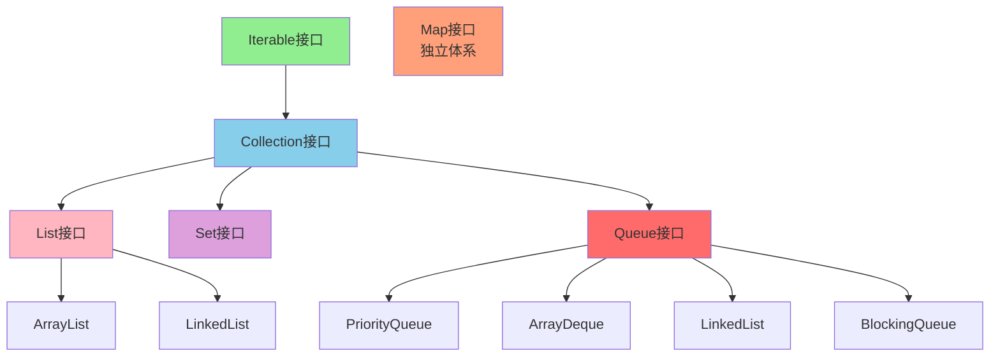

### Queue与Collection的关系

Queue是Collection接口的子接口，这意味着：

1. **继承关系**: Queue继承了Collection的所有方法（add、remove、size、isEmpty等）
2. **特殊语义**: Queue在此基础上定义了队列特有的操作（offer、poll、peek等）
3. **遍历支持**: 作为Collection的子类，Queue同样支持Iterator遍历

```java
// Queue继承自Collection，可以使用Collection的方法
Queue<String> queue = new LinkedList<>();
queue.add("元素1");        // Collection方法
queue.offer("元素2");      // Queue特有方法
queue.size();              // Collection方法
queue.isEmpty();           // Collection方法

// 遍历队列
for (String item : queue) {
    System.out.println(item);
}
```

### Queue与List的区别

虽然Queue和List都继承自Collection，但它们的设计目标完全不同：

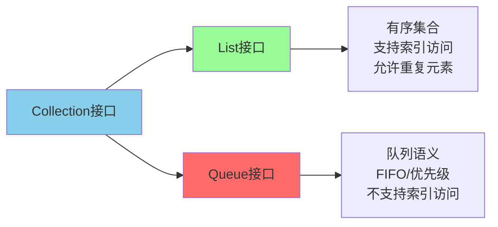

| 特性 | List | Queue |
|------|------|-------|
| **设计目的** | 有序存储，随机访问 | 按规则处理元素 |
| **索引访问** | 支持 get(index) | 不支持 |
| **元素顺序** | 插入顺序 | FIFO/优先级/LIFO |
| **典型操作** | add, get, set, remove | offer, poll, peek |
| **使用场景** | 数据存储 | 任务调度、消息传递 |

### Queue与Map的关系

Queue和Map是Java集合框架中的两个**完全独立**的体系：

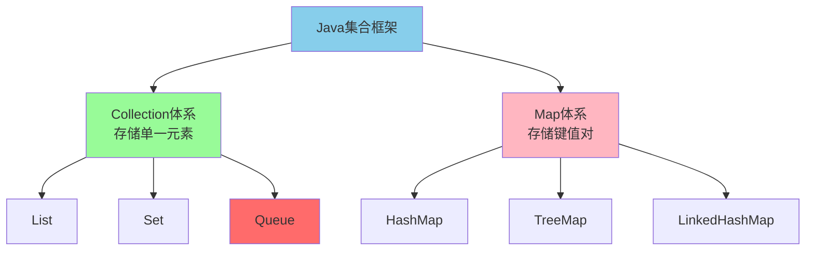

- **Collection体系**: 包括List、Set、Queue，存储单一元素
- **Map体系**: 存储键值对，与Collection没有继承关系
- **LinkedList特例**: 同时实现了List和Deque（Queue的子接口），是两个接口的桥梁

```java
// LinkedList同时实现List和Queue
LinkedList<String> linkedList = new LinkedList<>();

// 作为List使用
linkedList.add(0, "索引0");
linkedList.get(0);

// 作为Queue使用
linkedList.offer("入队");
linkedList.poll();
```

## Queue接口基础

### Queue的核心特点

Queue（队列）是一种特殊的线性数据结构，通常遵循**FIFO（First In First Out，先进先出）**原则。就像排队买票一样，先排队的人先买到票。

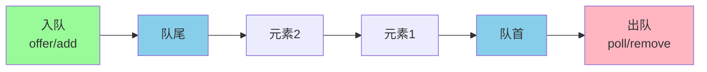

### Queue的两组方法

Queue接口提供了两组操作方法，区别在于操作失败时的行为：

| 操作类型 | 抛出异常 | 返回特殊值 | 说明 |
|----------|----------|------------|------|
| 插入队尾 | add(e) | offer(e) | offer返回false表示失败 |
| 删除队首 | remove() | poll() | poll返回null表示队列为空 |
| 查询队首 | element() | peek() | peek返回null表示队列为空 |

**使用建议**: 在实际开发中，推荐使用 offer/poll/peek 方法，可以优雅地处理边界情况。

```java
Queue<String> queue = new LinkedList<>();

// 推荐方式：使用返回特殊值的方法
queue.offer("任务1");
queue.offer("任务2");
queue.offer("任务3");

// 安全地获取队首元素
String head = queue.peek();  // 不删除，可能返回null
if (head != null) {
    System.out.println("队首: " + head);
}

// 安全地出队
String task;
while ((task = queue.poll()) != null) {
    System.out.println("处理任务: " + task);
}
```

## Deque双端队列

### Queue vs Deque

Deque（Double Ended Queue，双端队列）是Queue的子接口，允许在队列两端进行插入和删除操作。

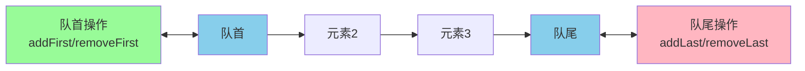

**Deque的方法汇总**:

| 操作 | 抛出异常 | 返回特殊值 |
|------|----------|------------|
| 插入队首 | addFirst(e) | offerFirst(e) |
| 插入队尾 | addLast(e) | offerLast(e) |
| 删除队首 | removeFirst() | pollFirst() |
| 删除队尾 | removeLast() | pollLast() |
| 查询队首 | getFirst() | peekFirst() |
| 查询队尾 | getLast() | peekLast() |

### Deque实现栈

由于Deque可以在两端操作，因此可以完美模拟栈（Stack）的后进先出（LIFO）行为：

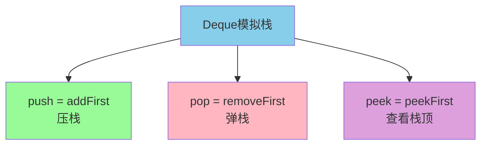

```java
// 使用Deque替代Stack（官方推荐）
Deque<String> stack = new ArrayDeque<>();

// 压栈
stack.push("第一层");
stack.push("第二层");
stack.push("第三层");

System.out.println("栈状态: " + stack); // [第三层, 第二层, 第一层]

// 弹栈
System.out.println(stack.pop()); // 第三层
System.out.println(stack.pop()); // 第二层
System.out.println(stack.pop()); // 第一层
```

**为什么推荐用Deque替代Stack？**

1. Stack继承自Vector，设计过时
2. Stack的方法都是synchronized，性能较差
3. Deque接口更规范，实现类选择更多

## ArrayDeque vs LinkedList

ArrayDeque和LinkedList都实现了Deque接口，但底层实现和性能特点不同：

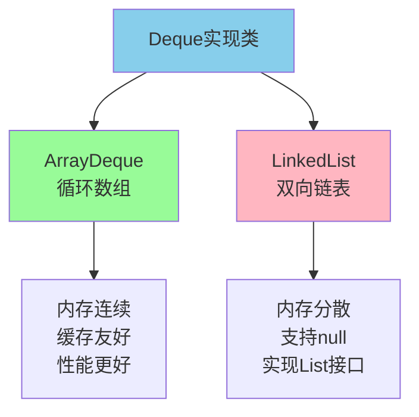

| 特性 | ArrayDeque | LinkedList |
|------|-----------|------------|
| 底层结构 | 可变长数组+双指针 | 双向链表 |
| null值 | **不支持** | 支持 |
| 引入版本 | JDK 1.6 | JDK 1.2 |
| 扩容 | 需要扩容（2倍） | 不需要 |
| 内存分配 | 连续内存，缓存友好 | 每次申请堆空间 |
| 性能 | **更快** | 较慢 |
| 实现接口 | 仅Deque | List + Deque |

**最佳实践**: 优先使用ArrayDeque实现队列和栈，除非需要存储null值或需要List接口的功能。

```java
// 推荐：使用ArrayDeque作为队列
Deque<Integer> queue = new ArrayDeque<>();
queue.offer(1);
queue.offer(2);
queue.offer(3);

// 推荐：使用ArrayDeque作为栈
Deque<Integer> stack = new ArrayDeque<>();
stack.push(1);
stack.push(2);
stack.push(3);
```

## PriorityQueue优先队列

### 优先队列原理

PriorityQueue是一个基于**优先级堆**的无界队列，元素按照自然顺序或自定义Comparator排序。

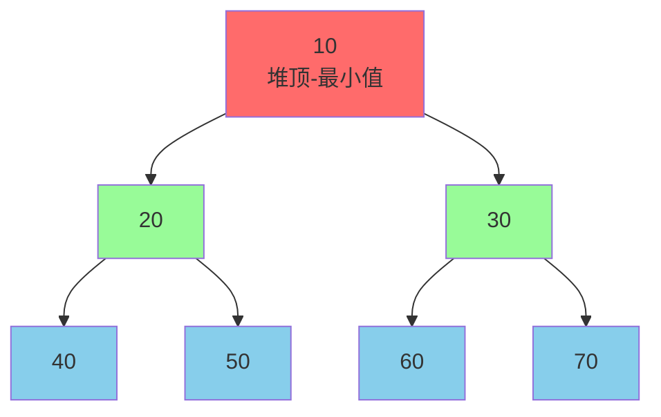

### PriorityQueue核心特点

| 特点 | 说明 |
|------|------|
| 底层实现 | 二叉堆（数组存储） |
| 默认排序 | 小顶堆（最小值优先） |
| 插入/删除 | O(log n) |
| 查看堆顶 | O(1) |
| 线程安全 | 否 |
| null值 | **不支持** |
| non-comparable | **不支持** |

### 使用示例

```java
// 示例1：默认小顶堆
PriorityQueue<Integer> minHeap = new PriorityQueue<>();
minHeap.offer(50);
minHeap.offer(20);
minHeap.offer(80);
minHeap.offer(10);
minHeap.offer(30);

System.out.println("小顶堆依次取出:");
while (!minHeap.isEmpty()) {
    System.out.print(minHeap.poll() + " "); // 10 20 30 50 80
}

// 示例2：大顶堆（通过Comparator）
PriorityQueue<Integer> maxHeap = new PriorityQueue<>((a, b) -> b - a);
maxHeap.offer(50);
maxHeap.offer(20);
maxHeap.offer(80);
maxHeap.offer(10);
maxHeap.offer(30);

System.out.println("\n大顶堆依次取出:");
while (!maxHeap.isEmpty()) {
    System.out.print(maxHeap.poll() + " "); // 80 50 30 20 10
}
```

### 自定义对象排序

```java
// 定义任务类
class Task {
    String name;
    int priority;  // 数字越小优先级越高
    
    public Task(String name, int priority) {
        this.name = name;
        this.priority = priority;
    }
    
    @Override
    public String toString() {
        return name + "(优先级:" + priority + ")";
    }
}

// 使用优先队列调度任务
PriorityQueue<Task> taskQueue = new PriorityQueue<>(
    Comparator.comparingInt(t -> t.priority)
);

taskQueue.offer(new Task("普通任务", 3));
taskQueue.offer(new Task("紧急任务", 1));
taskQueue.offer(new Task("一般任务", 2));

System.out.println("按优先级执行任务:");
while (!taskQueue.isEmpty()) {
    System.out.println("执行: " + taskQueue.poll());
}
// 输出:
// 执行: 紧急任务(优先级:1)
// 执行: 一般任务(优先级:2)
// 执行: 普通任务(优先级:3)
```

### 应用场景

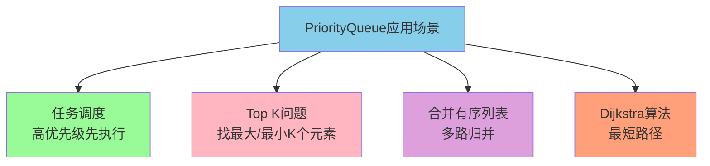

## BlockingQueue阻塞队列

### 阻塞队列概述

BlockingQueue是Queue的子接口，专为**多线程并发**场景设计，支持阻塞操作。

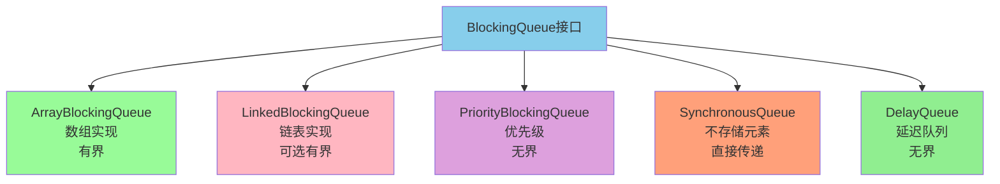

### 阻塞队列的核心特性

| 特性 | 说明 |
|------|------|
| 队列空时 | 获取操作阻塞，直到有元素 |
| 队列满时 | 插入操作阻塞，直到有空间 |
| 线程安全 | 内置同步机制 |
| 典型应用 | 生产者-消费者模型 |

### 阻塞队列的四组方法

| 操作 | 抛出异常 | 返回特殊值 | 阻塞 | 超时 |
|------|----------|------------|------|------|
| 插入 | add(e) | offer(e) | put(e) | offer(e, time, unit) |
| 删除 | remove() | poll() | take() | poll(time, unit) |
| 查看 | element() | peek() | - | - |

### ArrayBlockingQueue vs LinkedBlockingQueue

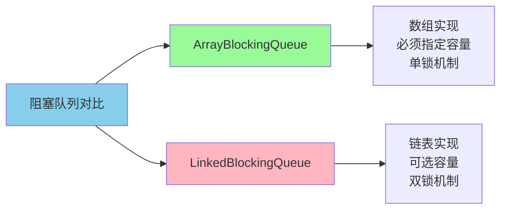

| 特性 | ArrayBlockingQueue | LinkedBlockingQueue |
|------|-------------------|---------------------|
| 底层实现 | 数组 | 链表 |
| 是否有界 | **必须指定容量** | 可选（默认Integer.MAX_VALUE） |
| 锁机制 | 单锁（生产消费共用） | 双锁（读写分离） |
| 内存占用 | 预分配 | 动态分配 |
| 吞吐量 | 锁竞争大 | 锁竞争小，吞吐量更高 |

### 生产者-消费者示例

```java
public class ProducerConsumerDemo {
    public static void main(String[] args) {
        // 创建容量为5的阻塞队列
        BlockingQueue<String> queue = new ArrayBlockingQueue<>(5);
        
        // 生产者线程
        Thread producer = new Thread(() -> {
            try {
                for (int i = 1; i <= 10; i++) {
                    String product = "产品" + i;
                    queue.put(product);  // 队列满时阻塞
                    System.out.println("生产: " + product);
                    Thread.sleep(100);
                }
            } catch (InterruptedException e) {
                Thread.currentThread().interrupt();
            }
        }, "生产者");
        
        // 消费者线程
        Thread consumer = new Thread(() -> {
            try {
                for (int i = 1; i <= 10; i++) {
                    String product = queue.take();  // 队列空时阻塞
                    System.out.println("消费: " + product);
                    Thread.sleep(200);
                }
            } catch (InterruptedException e) {
                Thread.currentThread().interrupt();
            }
        }, "消费者");
        
        producer.start();
        consumer.start();
    }
}
```

### DelayQueue延迟队列

DelayQueue是一个特殊的阻塞队列，元素只有在延迟期满后才能被取出。

```java
// 定义延迟任务
class DelayedTask implements Delayed {
    private String name;
    private long executeTime;  // 执行时间
    
    public DelayedTask(String name, long delayMs) {
        this.name = name;
        this.executeTime = System.currentTimeMillis() + delayMs;
    }
    
    @Override
    public long getDelay(TimeUnit unit) {
        long diff = executeTime - System.currentTimeMillis();
        return unit.convert(diff, TimeUnit.MILLISECONDS);
    }
    
    @Override
    public int compareTo(Delayed other) {
        return Long.compare(this.executeTime, 
            ((DelayedTask) other).executeTime);
    }
    
    @Override
    public String toString() {
        return name;
    }
}

// 使用延迟队列
DelayQueue<DelayedTask> delayQueue = new DelayQueue<>();
delayQueue.offer(new DelayedTask("任务A", 3000));  // 3秒后执行
delayQueue.offer(new DelayedTask("任务B", 1000));  // 1秒后执行
delayQueue.offer(new DelayedTask("任务C", 2000));  // 2秒后执行

System.out.println("开始取任务...");
while (!delayQueue.isEmpty()) {
    DelayedTask task = delayQueue.take();  // 阻塞直到延迟期满
    System.out.println("执行: " + task + " at " + System.currentTimeMillis());
}
// 输出顺序: 任务B -> 任务C -> 任务A
```

**DelayQueue应用场景**:
- 订单超时取消
- 缓存过期清理
- 任务定时执行
- 会话超时管理

## Queue的选择指南

### 根据场景选择Queue实现

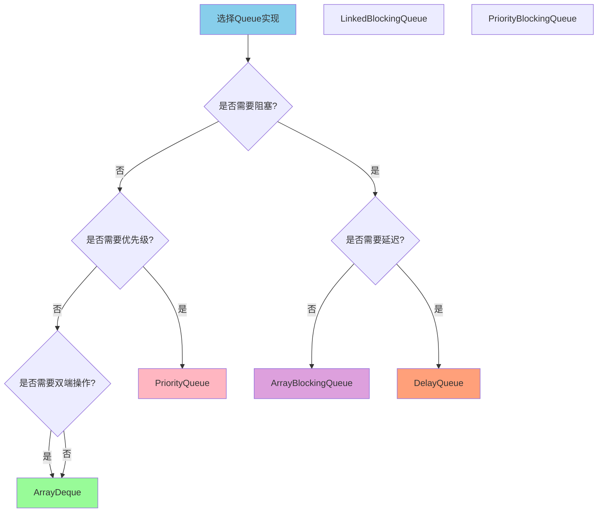

### 选择建议总结

| 使用场景 | 推荐实现 | 理由 |
|----------|----------|------|
| 普通队列 | ArrayDeque | 性能最佳，内存友好 |
| 栈结构 | ArrayDeque | 替代过时的Stack类 |
| 优先级队列 | PriorityQueue | 基于堆，O(log n)操作 |
| 生产者-消费者 | LinkedBlockingQueue | 双锁设计，吞吐量高 |
| 有界阻塞队列 | ArrayBlockingQueue | 防止内存溢出 |
| 定时任务 | DelayQueue | 延迟期满才能取出 |
| 线程间直接传递 | SynchronousQueue | 不存储元素 |

## 总结

### Queue核心知识点

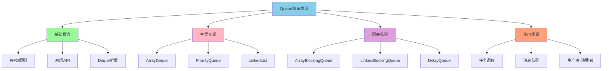

### 面试要点

1. **Queue与Deque的区别**: Queue是单端队列，Deque是双端队列
2. **为什么用ArrayDeque替代Stack**: Stack继承Vector，设计过时，性能差
3. **PriorityQueue的原理**: 基于二叉堆，默认小顶堆
4. **BlockingQueue的作用**: 支持阻塞操作，用于生产者-消费者模型
5. **ArrayBlockingQueue vs LinkedBlockingQueue**: 单锁vs双锁，有界vs可选有界
