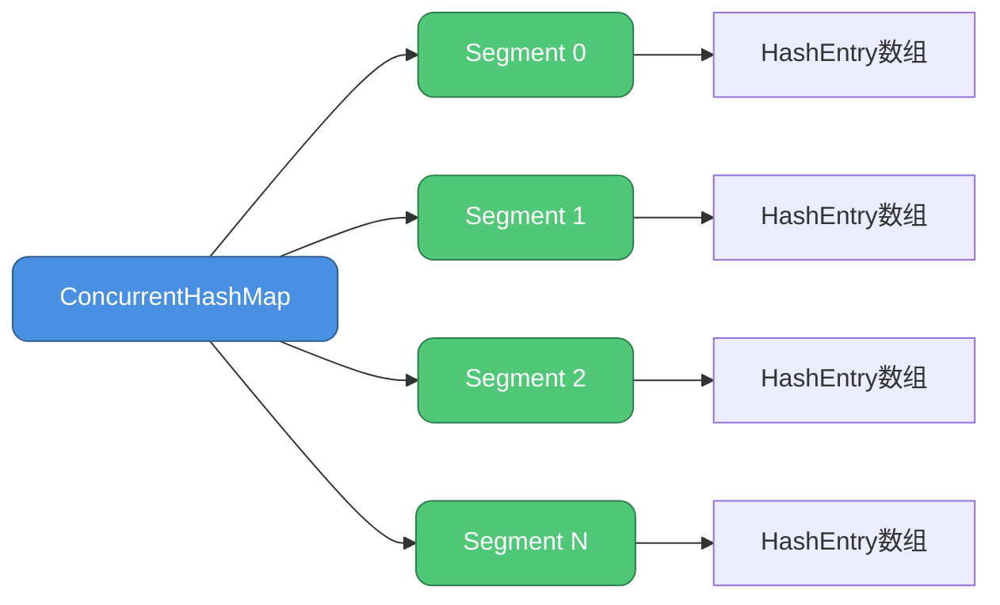
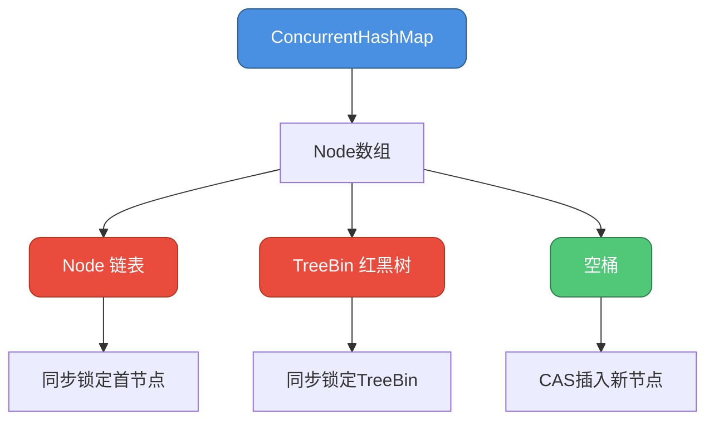
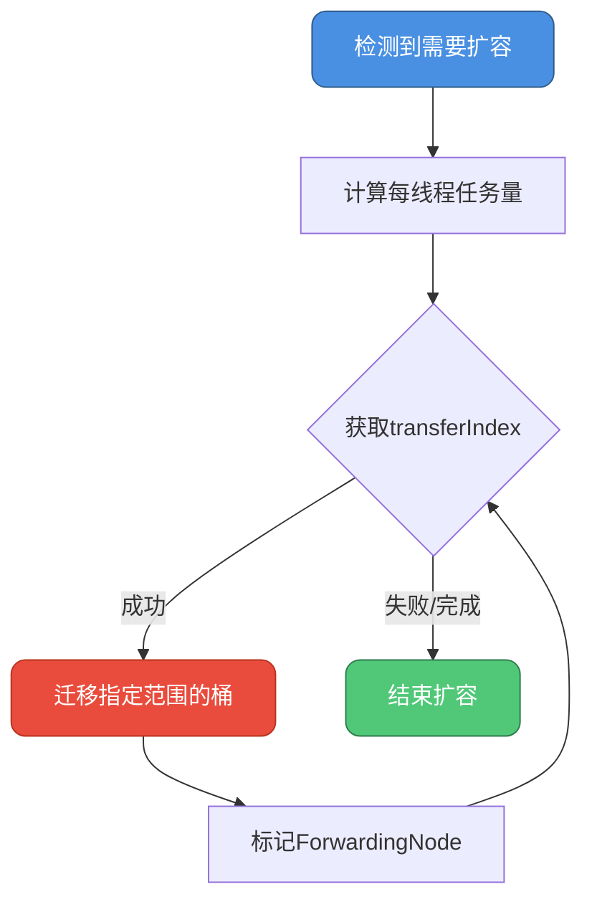
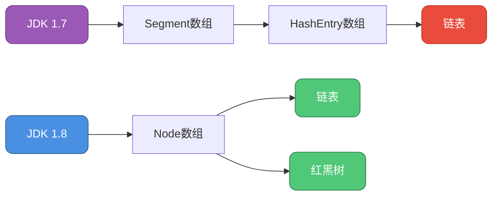

## 线程安全实现概述

ConcurrentHashMap作为Java并发包中的核心容器，通过精巧的设计实现了高效的线程安全访问。不同于Hashtable采用的粗粒度全表锁方案，ConcurrentHashMap在保证线程安全的同时，显著提升了并发性能。

### 与Hashtable的对比

**Hashtable的同步策略**

Hashtable采用synchronized关键字修饰所有公共方法，使用一把全局锁保护整个哈希表。这种方式简单粗暴，但存在明显的性能瓶颈：当一个线程执行put操作时，其他线程无论是读还是写都必须等待，导致锁竞争激烈。

```java
// Hashtable的同步方式（示例）
public synchronized V put(K key, V value) {
    // 整个方法被锁定
    // ...
}

public synchronized V get(Object key) {
    // 即使是读操作也需要获取锁
    // ...
}
```

**ConcurrentHashMap的优化思路**

相比之下，ConcurrentHashMap采用更细粒度的锁策略，允许多个线程同时访问不同的数据段，大幅提高并发吞吐量。

## JDK 1.7的分段锁机制

### 核心架构

在JDK 1.7中，ConcurrentHashMap采用**分段锁（Segment）**设计，将整个哈希表划分为多个独立的段，每个段独立管理自己的锁。



### Segment的实现细节

每个Segment继承自ReentrantLock，本身就是一个可重入锁：

```java
static class Segment<K,V> extends ReentrantLock implements Serializable {
    private static final long serialVersionUID = 2249069246763182397L;
    
    // 存储数据的哈希表
    transient volatile HashEntry<K,V>[] table;
    
    // 当前段中的元素数量
    transient int count;
    
    // 修改次数统计
    transient int modCount;
    
    // 扩容阈值
    transient int threshold;
    
    // 负载因子
    final float loadFactor;
}
```

### 并发访问特性

- **默认并发度**：Segment数组大小默认为16，支持16个线程同时写入不同段
- **锁隔离**：对不同Segment的操作互不干扰，可并发执行
- **局部锁定**：仅在修改特定段时获取对应Segment的锁

例如，在商品库存系统中，多个用户同时下单不同类别的商品：

```java
// 用户A购买电子产品（hash到Segment 0）
inventoryMap.put("laptop-001", 100);

// 用户B购买图书（hash到Segment 5）
inventoryMap.put("book-java", 200);

// 两个操作可以并发执行，无需等待
```

## JDK 1.8的节点锁优化

### 架构变革

JDK 1.8完全重构了ConcurrentHashMap，摒弃Segment分段锁，改用**Node数组 + CAS + synchronized**的组合方案。



### 核心数据结构

**Node节点定义**

```java
static class Node<K,V> implements Map.Entry<K,V> {
    final int hash;
    final K key;
    volatile V val;        // 使用volatile保证可见性
    volatile Node<K,V> next;

    Node(int hash, K key, V val, Node<K,V> next) {
        this.hash = hash;
        this.key = key;
        this.val = val;
        this.next = next;
    }
}
```

**TreeBin红黑树包装器**

```java
static final class TreeBin<K,V> extends Node<K,V> {
    TreeNode<K,V> root;              // 红黑树根节点
    volatile TreeNode<K,V> first;    // 链表首节点
    volatile Thread waiter;          // 等待线程
    volatile int lockState;          // 锁状态标识
    
    static final int WRITER = 1;     // 写锁
    static final int WAITER = 2;     // 等待标识
    static final int READER = 4;     // 读锁
}
```

### 并发控制策略

#### 初始化阶段的并发控制

使用sizeCtl变量协调多线程初始化，避免重复创建：

```java
private final Node<K,V>[] initTable() {
    Node<K,V>[] tab; int sc;
    while ((tab = table) == null || tab.length == 0) {
        // sizeCtl < 0表示其他线程正在初始化
        if ((sc = sizeCtl) < 0)
            Thread.yield();  // 让出CPU时间片
        // CAS竞争初始化权限
        else if (U.compareAndSetInt(this, SIZECTL, sc, -1)) {
            try {
                if ((tab = table) == null || tab.length == 0) {
                    int n = (sc > 0) ? sc : DEFAULT_CAPACITY;
                    Node<K,V>[] nt = (Node<K,V>[])new Node<?,?>[n];
                    table = tab = nt;
                    sc = n - (n >>> 2);  // 0.75 * capacity
                }
            } finally {
                sizeCtl = sc;
            }
            break;
        }
    }
    return tab;
}
```

#### 插入操作的并发控制

结合CAS和synchronized实现高效并发插入：

```java
final V putVal(K key, V value, boolean onlyIfAbsent) {
    if (key == null || value == null) throw new NullPointerException();
    
    int hash = spread(key.hashCode());
    int binCount = 0;
    
    for (Node<K,V>[] tab = table;;) {
        Node<K,V> f; int n, i, fh;
        
        // 场景1: 表未初始化，执行初始化
        if (tab == null || (n = tab.length) == 0)
            tab = initTable();
        
        // 场景2: 目标桶为空，CAS直接插入
        else if ((f = tabAt(tab, i = (n - 1) & hash)) == null) {
            if (casTabAt(tab, i, null, 
                        new Node<K,V>(hash, key, value, null)))
                break;  // 无锁插入成功
        }
        
        // 场景3: 正在扩容，协助转移数据
        else if ((fh = f.hash) == MOVED)
            tab = helpTransfer(tab, f);
        
        // 场景4: 桶已有数据，加锁处理
        else {
            V oldVal = null;
            synchronized (f) {  // 锁定桶的首节点
                if (tabAt(tab, i) == f) {
                    // 链表节点插入逻辑
                    if (fh >= 0) {
                        binCount = 1;
                        for (Node<K,V> e = f;; ++binCount) {
                            K ek;
                            if (e.hash == hash &&
                                ((ek = e.key) == key ||
                                 (ek != null && key.equals(ek)))) {
                                oldVal = e.val;
                                if (!onlyIfAbsent)
                                    e.val = value;
                                break;
                            }
                            Node<K,V> pred = e;
                            if ((e = e.next) == null) {
                                pred.next = new Node<K,V>(hash, key, value, null);
                                break;
                            }
                        }
                    }
                    // 红黑树节点插入逻辑
                    else if (f instanceof TreeBin) {
                        Node<K,V> p;
                        binCount = 2;
                        if ((p = ((TreeBin<K,V>)f).putTreeVal(hash, key, value)) != null) {
                            oldVal = p.val;
                            if (!onlyIfAbsent)
                                p.val = value;
                        }
                    }
                }
            }
            
            // 判断是否需要树化
            if (binCount != 0) {
                if (binCount >= TREEIFY_THRESHOLD)
                    treeifyBin(tab, i);
                if (oldVal != null)
                    return oldVal;
                break;
            }
        }
    }
    
    addCount(1L, binCount);
    return null;
}
```

#### 多线程协同扩容

ConcurrentHashMap在扩容时允许多线程协作，每个线程负责迁移一部分桶：



**扩容协调机制**：

1. **任务划分**：根据CPU核心数，为每个线程分配至少16个桶的迁移任务
2. **索引管理**：通过transferIndex记录当前待迁移的桶索引，使用CAS确保唯一分配
3. **状态标记**：已迁移的桶用ForwardingNode标记，指向新数组

示例：订单处理系统中的并发扩容

```java
// 线程1负责迁移桶 [48-63]
// 线程2负责迁移桶 [32-47]
// 线程3负责迁移桶 [16-31]
// 线程4负责迁移桶 [0-15]

// 每个线程独立工作，通过CAS获取任务范围
if (U.compareAndSetInt(this, TRANSFERINDEX, nextIndex, nextBound)) {
    // 成功获取任务，开始迁移
    transferBuckets(nextBound, nextIndex);
}
```

## 为何选择synchronized而非ReentrantLock

### 性能考量

在JDK 1.8的节点锁场景下，synchronized展现出优势：

**并发冲突概率低**

由于锁粒度细化到单个桶，多线程同时操作同一桶的概率极低，大部分情况下synchronized停留在偏向锁或轻量级锁阶段，性能损耗可忽略。

### JVM优化支持

**锁消除与锁粗化**

JVM能够在运行时识别synchronized的使用模式，进行自动优化：

- **锁消除**：分析发现同步块内对象不会逃逸时，直接移除锁
- **锁粗化**：合并相邻的同步块，减少加锁/解锁次数

**自适应自旋**

线程获取锁失败时，synchronized会先自旋等待而非立即挂起，减少上下文切换开销。相比之下，ReentrantLock获取失败会导致线程挂起，唤醒成本更高。

### 内存占用对比

**ReentrantLock的额外开销**

每个ReentrantLock对象需要维护：
- 锁状态管理
- 等待队列（AbstractQueuedSynchronizer）
- 持有锁的线程信息
- 重入计数器

对于ConcurrentHashMap中成千上万的节点，如果每个节点继承ReentrantLock，内存开销将非常可观。

**synchronized的轻量方案**

synchronized依赖对象头的Mark Word实现锁，无需额外对象，节省大量内存。

### 编程简洁性

synchronized无需手动管理锁的获取与释放，降低死锁风险：

```java
// synchronized自动释放锁
synchronized (node) {
    // 业务逻辑
    // 无论是否抛出异常，锁都会被释放
}

// ReentrantLock需要手动管理
lock.lock();
try {
    // 业务逻辑
} finally {
    lock.unlock();  // 必须显式释放
}
```

## 版本差异总结

### 线程安全机制对比

| 对比维度 | JDK 1.7 | JDK 1.8 |
|---------|---------|---------|
| 锁策略 | Segment分段锁（ReentrantLock） | Node节点锁（synchronized） |
| 锁粒度 | 段级别（默认16个段） | 桶级别（数组长度） |
| 无锁化技术 | 较少使用 | 大量CAS操作 |
| 并发度 | 受限于Segment数量 | 理论上等于数组长度 |
| 内存占用 | Segment额外开销 | 更紧凑 |

### Hash冲突解决

- **JDK 1.7**：仅使用链表
- **JDK 1.8**：链表 + 红黑树（链表长度≥8时转换）

### 数据结构演进



## 实战场景分析

### 高并发写入场景

**示例：实时日志收集系统**

```java
ConcurrentHashMap<String, AtomicLong> logCounters = new ConcurrentHashMap<>();

// 多个线程同时记录不同模块的日志量
public void recordLog(String module) {
    logCounters.computeIfAbsent(module, k -> new AtomicLong())
               .incrementAndGet();
}

// 线程1记录用户模块日志
recordLog("user-service");

// 线程2记录订单模块日志
recordLog("order-service");

// 由于hash到不同桶，两个操作可并发执行
```

### 读多写少场景

**示例：配置中心缓存**

```java
ConcurrentHashMap<String, ConfigItem> configCache = new ConcurrentHashMap<>();

// 大量线程并发读取配置
public ConfigItem getConfig(String key) {
    return configCache.get(key);  // 读操作几乎无锁
}

// 少量线程更新配置
public void updateConfig(String key, ConfigItem item) {
    configCache.put(key, item);   // 仅锁定目标桶
}
```

通过精巧的并发控制设计，ConcurrentHashMap在各种实际场景中都能提供优异的性能表现。
