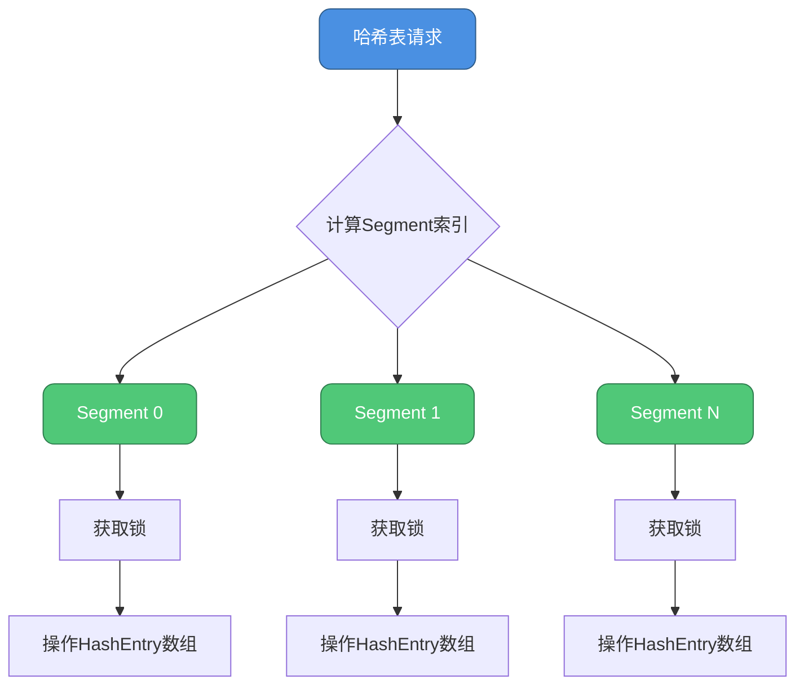
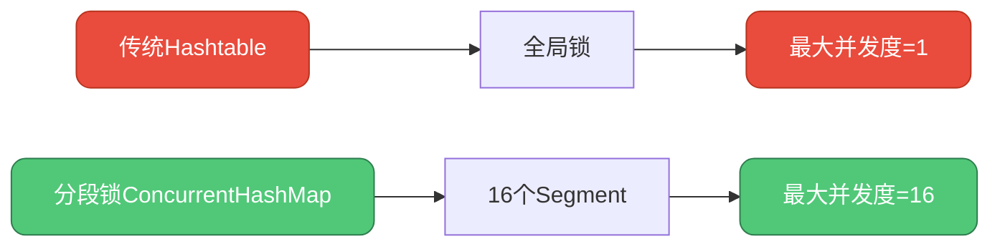
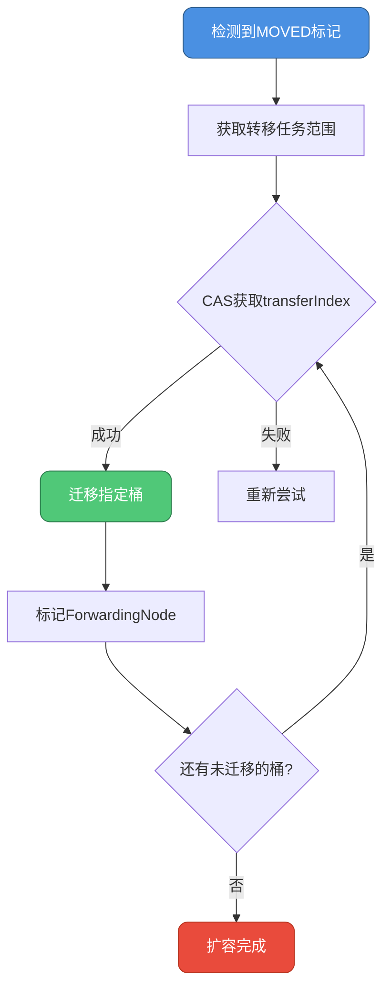
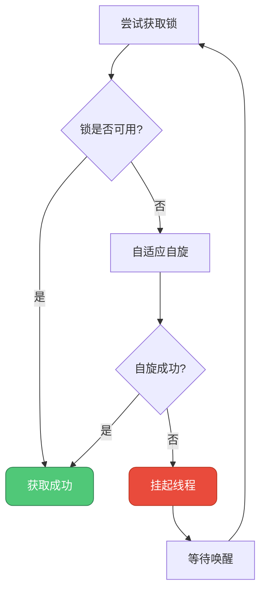

## 分段锁的诞生与挑战

### JDK 1.7的设计初衷

在JDK 1.7时代，面对Hashtable全局锁的性能瓶颈，ConcurrentHashMap引入了**分段锁（Segmentation）**机制，这是一个革命性的创新。

### 分段锁的核心思想

将整个哈希表在逻辑上划分为多个独立的存储段，每个段维护自己的锁，从而将锁的竞争范围限定在段内部。



### Segment的结构设计

每个Segment本质上是一个小型的HashMap，继承ReentrantLock实现独立加锁：

```java
static final class Segment<K,V> extends ReentrantLock implements Serializable {
    // 版本序列号
    private static final long serialVersionUID = 2249069246763182397L;
    
    // 存储键值对的数组
    transient volatile HashEntry<K,V>[] table;
    
    // 段内元素数量
    transient int count;
    
    // 结构修改次数
    transient int modCount;
    
    // 扩容阈值
    transient int threshold;
    
    // 负载因子
    final float loadFactor;
    
    Segment(float lf, int threshold, HashEntry<K,V>[] tab) {
        this.loadFactor = lf;
        this.threshold = threshold;
        this.table = tab;
    }
}
```

### HashEntry的链式结构

段内采用链表解决哈希冲突：

```java
static final class HashEntry<K,V> {
    final int hash;
    final K key;
    volatile V value;
    volatile HashEntry<K,V> next;

    HashEntry(int hash, K key, V value, HashEntry<K,V> next) {
        this.hash = hash;
        this.key = key;
        this.value = value;
        this.next = next;
    }
}
```

### 分段锁的工作流程

**定位Segment的过程**

```java
// 计算key的hash值
int hash = hash(key);

// 定位到具体的Segment（高位参与运算）
int segmentIndex = (hash >>> segmentShift) & segmentMask;
Segment<K,V> segment = segments[segmentIndex];

// 在Segment内定位HashEntry
int entryIndex = hash & (segment.table.length - 1);
```

**并发访问示例：电商促销场景**

```java
ConcurrentHashMap<String, Integer> productStock = new ConcurrentHashMap<>(16);

// 线程1：用户A抢购手机（hash到Segment 2）
productStock.put("iphone-15", 100);

// 线程2：用户B抢购电脑（hash到Segment 7）
productStock.put("macbook-pro", 50);

// 线程3：用户C抢购耳机（hash到Segment 2）
productStock.put("airpods-pro", 200);

// 线程1和线程3竞争Segment 2的锁
// 线程2独立操作Segment 7，无需等待
```

### 分段锁的性能优势

**并发度的提升**

默认配置下，Segment数组大小为16，理论上支持16个线程同时进行写操作而互不干扰。



### 分段锁的局限性

尽管分段锁带来了显著的性能提升，但在极端并发场景下仍暴露出问题。

#### 热点段问题

**场景描述**

在实际应用中，数据分布往往不均匀，某些Segment可能成为热点：

```java
// 用户ID生成器，高并发场景
ConcurrentHashMap<String, Long> userIdMap = new ConcurrentHashMap<>();

// 大量线程同时访问相同业务域的key
// 假设这些key都hash到Segment 5
for (int i = 0; i < 1000; i++) {
    String userId = "user-" + (10000 + i);
    // 所有操作集中在Segment 5，形成瓶颈
    userIdMap.put(userId, System.currentTimeMillis());
}
```

**性能退化**

当多数请求集中在少数Segment时，这些热点段的锁竞争仍然激烈，性能退化接近全局锁。

#### 固定并发度限制

Segment数组在初始化后无法动态调整，最大并发度受限于初始配置：

```java
// 创建时指定16个Segment
ConcurrentHashMap<String, String> map = new ConcurrentHashMap<>(16, 0.75f, 16);

// 即使后续数据量暴增，并发度仍为16
// 无法利用更多CPU核心
```

#### 内存开销较大

每个Segment作为独立对象，需要额外的存储空间：

- Segment对象本身的开销
- ReentrantLock的AQS队列结构
- 各自独立的HashEntry数组

对于元素数量较少的Map，这种开销占比显著。

## JDK 1.8的架构重构

### 设计目标

JDK 1.8对ConcurrentHashMap进行了彻底重构，核心目标包括：

1. **提高并发度**：从段级别细化到桶（Node）级别
2. **降低内存占用**：移除Segment中间层
3. **优化查询性能**：引入红黑树处理长链表

### 新架构的核心组件

**Node数组的扁平化设计**

```java
transient volatile Node<K,V>[] table;

static class Node<K,V> implements Map.Entry<K,V> {
    final int hash;
    final K key;
    volatile V val;
    volatile Node<K,V> next;
    
    // ...
}
```

与1.7相比，直接使用Node数组替代Segment + HashEntry的两层结构。

**红黑树的引入**

当链表长度达到阈值（默认8）时，转换为红黑树提升查询效率：

```java
static final class TreeNode<K,V> extends Node<K,V> {
    TreeNode<K,V> parent;
    TreeNode<K,V> left;
    TreeNode<K,V> right;
    TreeNode<K,V> prev;
    boolean red;
    
    // ...
}
```

**TreeBin包装器**

TreeBin负责管理红黑树的并发访问：

```java
static final class TreeBin<K,V> extends Node<K,V> {
    TreeNode<K,V> root;              // 根节点
    volatile TreeNode<K,V> first;    // 链表形式的首节点
    volatile Thread waiter;          // 等待线程
    volatile int lockState;          // 锁状态
    
    // 锁状态常量
    static final int WRITER = 1;     // 写锁
    static final int WAITER = 2;     // 等待中
    static final int READER = 4;     // 读锁
}
```

### 锁策略的革新

#### CAS的广泛应用

对于无冲突的操作，使用CAS避免加锁：

```java
// 原子地读取数组指定位置的Node
static final <K,V> Node<K,V> tabAt(Node<K,V>[] tab, int i) {
    return (Node<K,V>)U.getObjectAcquire(tab, ((long)i << ASHIFT) + ABASE);
}

// 原子地CAS更新数组指定位置的Node
static final <K,V> boolean casTabAt(Node<K,V>[] tab, int i,
                                     Node<K,V> c, Node<K,V> v) {
    return U.compareAndSetObject(tab, ((long)i << ASHIFT) + ABASE, c, v);
}
```

#### synchronized的精准锁定

仅对有冲突的桶头节点加锁，锁粒度极小：

```java
synchronized (f) {  // f为桶的首节点
    // 只锁定当前桶，其他桶不受影响
    if (tabAt(tab, i) == f) {
        // 链表或红黑树的插入/更新逻辑
    }
}
```

### 并发控制的三个关键场景

#### 场景1：空桶插入（无锁化）

```java
else if ((f = tabAt(tab, i = (n - 1) & hash)) == null) {
    // 桶为空，使用CAS尝试插入
    if (casTabAt(tab, i, null, new Node<K,V>(hash, key, value, null)))
        break;  // 插入成功，无需加锁
}
```

**示例：分布式Session存储**

```java
ConcurrentHashMap<String, Session> sessionMap = new ConcurrentHashMap<>();

// 多个Web服务器实例同时创建不同用户的Session
// 服务器1：创建用户A的Session（hash到桶10）
sessionMap.putIfAbsent("session-A", new Session());

// 服务器2：创建用户B的Session（hash到桶25）
sessionMap.putIfAbsent("session-B", new Session());

// 由于hash到不同桶且桶为空，两个操作都通过CAS完成，无锁竞争
```

#### 场景2：扩容协助（多线程协同）

```java
else if ((fh = f.hash) == MOVED) {
    // 发现正在扩容，协助转移数据
    tab = helpTransfer(tab, f);
}
```

**转移过程**



**实战案例：实时排行榜系统**

```java
ConcurrentHashMap<String, Integer> scoreBoard = new ConcurrentHashMap<>();

// 高并发更新玩家分数，触发扩容
for (int i = 0; i < 10000; i++) {
    String player = "player-" + i;
    scoreBoard.compute(player, (k, v) -> (v == null ? 0 : v) + 10);
}

// 多个线程检测到扩容，自动协助转移数据
// 线程1负责迁移桶[0-31]
// 线程2负责迁移桶[32-63]
// ...
// 大幅加速扩容过程
```

#### 场景3：桶内冲突（精准加锁）

```java
else {
    V oldVal = null;
    synchronized (f) {  // 锁定桶的首节点
        if (tabAt(tab, i) == f) {
            // 链表处理
            if (fh >= 0) {
                // 遍历链表插入
            }
            // 红黑树处理
            else if (f instanceof TreeBin) {
                // 红黑树插入
            }
        }
    }
}
```

## 废弃分段锁的深层原因

### 锁粒度的极致优化

**对比分析**

| 维度 | JDK 1.7分段锁 | JDK 1.8节点锁 |
|-----|-------------|-------------|
| 锁定范围 | 整个Segment（多个桶） | 单个桶 |
| 最大并发度 | Segment数量（通常16） | 数组长度（可达数万） |
| 锁竞争概率 | 较高（段内所有桶共享锁） | 极低（仅同桶冲突） |

**量化示例**

假设数组长度为64，Segment数量为16：

```java
// JDK 1.7场景
// 64个桶分布在16个Segment中，每个Segment管理4个桶
// 如果4个线程操作的key恰好落在同一Segment的不同桶，仍需排队

// JDK 1.8场景
// 64个桶各自独立，64个线程可同时操作不同桶而完全无锁竞争
```

### 内存效率的提升

**Segment的额外开销**

```java
// JDK 1.7中，每个Segment占用的额外空间：
// - Segment对象头：~16字节
// - ReentrantLock的AQS：~48字节
// - 其他字段：~32字节
// 总计每个Segment约96字节

// 16个Segment的额外开销 = 16 * 96 = 1536字节
```

**JDK 1.8的精简设计**

直接使用Node数组，无中间层开销，内存占用显著降低。

### 查询性能的飞跃

**红黑树的引入背景**

在极端情况下（如恶意构造的hash碰撞攻击），链表可能退化为超长链表：

```java
// 攻击场景：构造大量hash值相同的key
for (int i = 0; i < 10000; i++) {
    String maliciousKey = generateHashCollisionKey(i);
    map.put(maliciousKey, "value");
}

// JDK 1.7：形成10000长度的链表，查询时间O(n)
// JDK 1.8：转换为红黑树，查询时间O(log n)
```

**性能对比**

| 链表长度 | 链表查询复杂度 | 红黑树查询复杂度 | 性能提升 |
|---------|--------------|----------------|---------|
| 8 | O(8) | O(3) | 2.67倍 |
| 16 | O(16) | O(4) | 4倍 |
| 64 | O(64) | O(6) | 10.67倍 |

### 扩展性的增强

**动态并发度**

JDK 1.8的并发度随数组大小动态增长：

```java
// 初始容量16，最大并发度16
ConcurrentHashMap<String, String> map = new ConcurrentHashMap<>(16);

// 扩容到32，最大并发度提升到32
// 扩容到64，最大并发度提升到64
// ...

// 充分利用多核CPU资源
```

## 设计权衡的哲学

### synchronized的选择依据

#### JVM优化的深度融合

**偏向锁的适配**

在低竞争场景下，synchronized的偏向锁几乎零开销：

```java
// 首次访问桶时，偏向当前线程
synchronized (node) {
    // 后续同一线程再次访问，无需CAS
    // 直接通过检查Mark Word即可进入
}
```

**逃逸分析的协同**

JVM能识别synchronized保护的对象未逃逸出作用域，进行锁消除：

```java
public void localOperation() {
    Node<K,V> localNode = new Node<>(hash, key, val, null);
    synchronized (localNode) {
        // JVM检测到localNode未被外部引用
        // 自动消除同步开销
        localNode.val = newValue;
    }
}
```

#### 线程调度的优化

**自旋与挂起的平衡**

synchronized在获取锁失败时的策略：



相比之下，ReentrantLock获取失败直接挂起，频繁的挂起/唤醒在高并发下损耗明显。

### ReentrantLock的劣势

#### 手动管理的风险

```java
// 容易忘记释放锁的错误示例
ReentrantLock lock = new ReentrantLock();
lock.lock();
if (condition) {
    return;  // Bug：提前返回未释放锁
}
lock.unlock();

// synchronized自动保证释放
synchronized (obj) {
    if (condition) {
        return;  // 正常，自动释放锁
    }
}
```

#### 内存占用对比

**实测数据**（假设100万个桶）

```java
// ReentrantLock方案
// 每个Node继承ReentrantLock：~112字节/Node
// 总额外开销：1,000,000 * 112 = 112MB

// synchronized方案
// 仅利用对象头：~16字节/Node
// 总额外开销：1,000,000 * 16 = 16MB

// 节省内存：96MB（85.7%）
```

## 架构演进的启示

### 性能优化的多维度思考

ConcurrentHashMap的演进体现了性能优化的全局视角：

1. **锁粒度细化**：从段到桶的降维
2. **无锁化探索**：CAS的大量应用
3. **数据结构升级**：红黑树的引入
4. **内存效率**：扁平化设计
5. **协同机制**：多线程协作扩容

### 技术选型的场景适配

**并发场景决定锁策略**

- 高冲突：分段锁（历史方案）
- 低冲突：节点锁 + CAS（现代方案）

**业务特性决定数据结构**

- 均匀分布：链表足够
- 倾斜分布：红黑树优化

### 持续演进的工程哲学

Java生态的迭代证明：没有完美的设计，只有更适应当前场景的方案。随着硬件发展、并发模型演进，未来ConcurrentHashMap可能继续变革，但其追求极致性能与可靠性的精神将持续传承。
