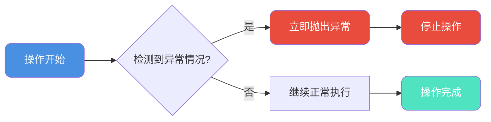
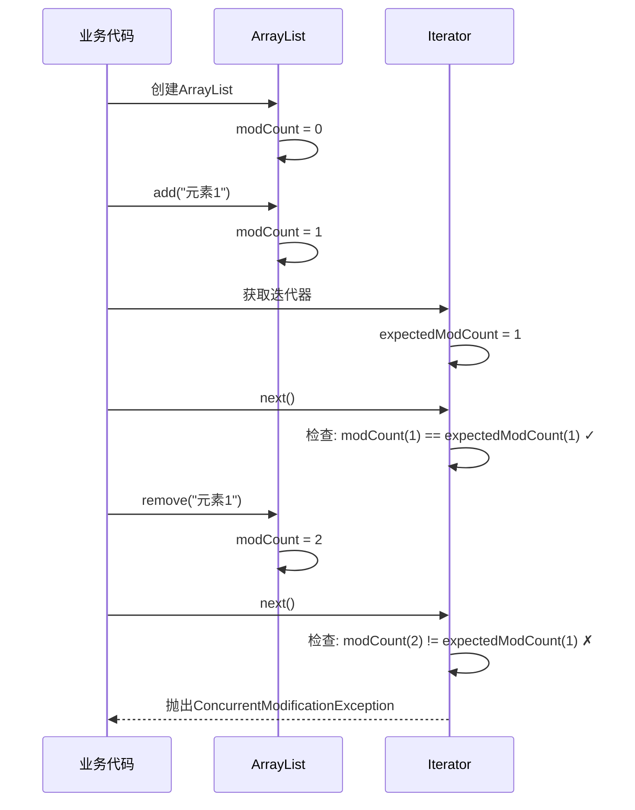
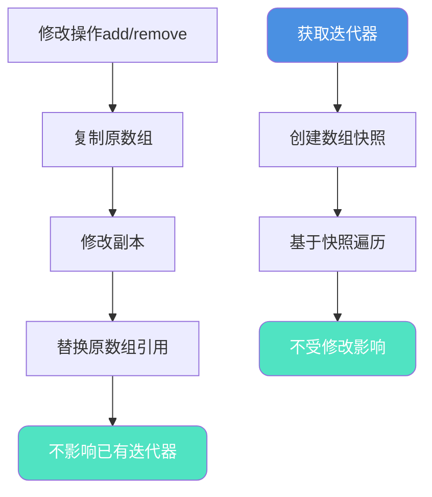
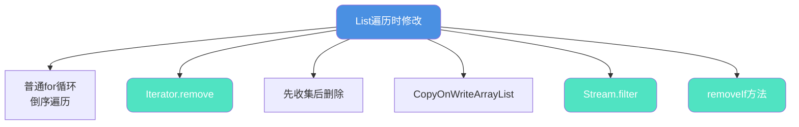

import PaidCTA from '@site/src/components/PaidCTA';

## fail-fast与fail-safe机制

在集合操作中,fail-fast和fail-safe是两种重要的错误处理机制,理解它们的原理对于编写健壮的并发代码至关重要。

### fail-fast快速失败机制

fail-fast(快速失败)是一种系统设计理念:一旦检测到可能导致失败的情况,立即报告错误并停止执行,而不是继续可能产生错误结果的操作。



### fail-fast简单示例

```java
public class FailFastExample {
    
    // 除法运算中的fail-fast
    public static double divide(double dividend, double divisor) {
        if (divisor == 0) {
            // fail-fast: 发现除数为0,立即抛出异常
            throw new IllegalArgumentException("除数不能为零");
        }
        return dividend / divisor;
    }
    
    // 参数验证中的fail-fast
    public static void processOrder(Order order) {
        if (order == null) {
            throw new IllegalArgumentException("订单不能为空");
        }
        if (order.getAmount() <= 0) {
            throw new IllegalArgumentException("订单金额必须大于0");
        }
        if (order.getProductCount() <= 0) {
            throw new IllegalArgumentException("商品数量必须大于0");
        }
        
        // 执行复杂的业务逻辑
        // ...
    }
}
```

## 集合中的fail-fast机制

### 并发修改检测

Java集合类(ArrayList、HashMap等)使用fail-fast机制防止并发修改:

```java
public class CollectionFailFast {
    public static void main(String[] args) {
        List<String> products = new ArrayList<>();
        products.add("笔记本电脑");
        products.add("机械键盘");
        products.add("显示器");
        products.add("鼠标");
        
        // ❌ 错误示范:遍历中删除
        try {
            for (String product : products) {
                if (product.equals("机械键盘")) {
                    products.remove(product);  // ConcurrentModificationException
                }
            }
        } catch (ConcurrentModificationException e) {
            System.out.println("触发fail-fast: " + e.getClass().getSimpleName());
        }
    }
}
```

### modCount修改计数器

集合类通过`modCount`和`expectedModCount`实现fail-fast:

```java
public class ArrayList<E> extends AbstractList<E> {
    // 集合实际被修改的次数
    protected transient int modCount = 0;
    
    public boolean add(E e) {
        ensureCapacityInternal(size + 1);
        elementData[size++] = e;
        modCount++;  // 修改时增加计数
        return true;
    }
    
    private class Itr implements Iterator<E> {
        // 迭代器期望的修改次数
        int expectedModCount = modCount;
        
        public E next() {
            checkForComodification();  // 检查并发修改
            // ...
        }
        
        final void checkForComodification() {
            if (modCount != expectedModCount)
                throw new ConcurrentModificationException();
        }
    }
}
```

### fail-fast触发流程



### 详细源码分析

```java
public class FailFastMechanism {
    public static void main(String[] args) {
        List<String> cart = new ArrayList<>();
        cart.add("iPhone 15");
        cart.add("AirPods Pro");
        cart.add("MacBook Pro");
        cart.add("iPad Air");
        
        // foreach实际上是Iterator的语法糖
        // 反编译后代码:
        Iterator<String> iterator = cart.iterator();
        while (iterator.hasNext()) {
            String item = iterator.next();
            if (item.equals("AirPods Pro")) {
                // 直接调用List的remove
                cart.remove(item);  // modCount++,但expectedModCount不变
            }
        }
        // 下次调用next()时检测到modCount != expectedModCount
        // 抛出ConcurrentModificationException
    }
}
```

**为什么会抛出异常?**

1. Iterator创建时:`expectedModCount = modCount = 4`
2. 调用`cart.remove()`:`modCount`变为5
3. Iterator的`expectedModCount`仍为4
4. 下次调用`next()`检测:`5 != 4`,抛出异常

## fail-safe安全失败机制

### Copy-On-Write思想

fail-safe集合采用"写时复制"策略,避免并发修改异常:

```java
public class CopyOnWriteArrayList<E> implements List<E> {
    private transient volatile Object[] array;
    
    public boolean add(E e) {
        synchronized (lock) {
            Object[] elements = getArray();
            int len = elements.length;
            // 复制原数组
            Object[] newElements = Arrays.copyOf(elements, len + 1);
            newElements[len] = e;
            setArray(newElements);  // 原子性替换
            return true;
        }
    }
    
    public Iterator<E> iterator() {
        // 返回当前数组快照的迭代器
        return new COWIterator<E>(getArray(), 0);
    }
}
```

### fail-safe工作流程



### fail-safe示例

```java
public class FailSafeExample {
    public static void main(String[] args) {
        // ✅ 使用fail-safe集合
        List<String> sessionIds = new CopyOnWriteArrayList<>();
        sessionIds.add("session-001");
        sessionIds.add("session-002");
        sessionIds.add("session-003");
        sessionIds.add("session-004");
        
        // 遍历中删除,不会抛异常
        for (String sessionId : sessionIds) {
            if (sessionId.equals("session-002")) {
                sessionIds.remove(sessionId);  // 安全删除
            }
            System.out.println("当前遍历: " + sessionId);
        }
        
        System.out.println("\n删除后集合内容:");
        sessionIds.forEach(System.out::println);
    }
}
```

**输出结果:**
```
当前遍历: session-001
当前遍历: session-002
当前遍历: session-003
当前遍历: session-004

删除后集合内容:
session-001
session-003
session-004
```

### 弱一致性特性

fail-safe的代价是弱一致性:

```java
public class WeakConsistency {
    public static void main(String[] args) {
        List<String> notifications = new CopyOnWriteArrayList<>();
        notifications.add("消息1");
        notifications.add("消息2");
        notifications.add("消息3");
        notifications.add("消息4");
        
        // 获取迭代器(此时得到快照)
        Iterator<String> iterator = notifications.iterator();
        
        // 在迭代过程中修改集合
        for (String msg : notifications) {
            if (msg.equals("消息2")) {
                notifications.remove(msg);
                notifications.add("新消息5");  // 迭代器看不到
            }
        }
        
        System.out.println("迭代器遍历(旧快照):");
        while (iterator.hasNext()) {
            System.out.println(iterator.next());
        }
        
        System.out.println("\n集合实际内容(新版本):");
        notifications.forEach(System.out::println);
    }
}
```

**输出结果:**
```
迭代器遍历(旧快照):
消息1
消息2
消息3
消息4

集合实际内容(新版本):
消息1
消息3
消息4
新消息5
```

### fail-fast vs fail-safe对比

| 特性 | fail-fast | fail-safe |
|-----|-----------|-----------|
| **代表类** | ArrayList, HashMap | CopyOnWriteArrayList, ConcurrentHashMap |
| **并发修改** | 抛出ConcurrentModificationException | 不抛异常 |
| **实现方式** | modCount检测 | 写时复制/快照 |
| **迭代内容** | 实时数据 | 快照数据 |
| **一致性** | 强一致性 | 弱一致性 |
| **性能** | 读快写快 | 读快写慢 |
| **内存开销** | 小 | 大(复制数组) |
| **适用场景** | 单线程/同步控制 | 读多写少的并发场景 |

## List遍历修改安全指南

### 六种安全修改方式



### 方式一: 普通for循环(需谨慎)

#### 正序遍历的陷阱

```java
public class ForLoopTrap {
    public static void main(String[] args) {
        List<Integer> scores = new ArrayList<>(Arrays.asList(85, 60, 92, 55, 78, 45, 88));
        
        // ❌ 错误示范:正序遍历删除
        System.out.println("删除前: " + scores);
        for (int i = 0; i < scores.size(); i++) {
            if (scores.get(i) < 60) {
                scores.remove(i);  // 删除后索引会变化
                // 问题:后续元素前移,导致跳过检查
            }
        }
        System.out.println("删除后: " + scores);  // 可能漏删
    }
}
```

**输出结果:**
```
删除前: [85, 60, 92, 55, 78, 45, 88]
删除后: [85, 60, 92, 78, 88]  // 45漏删了!
```

**问题分析:**
1. 删除索引3的55后,45从索引5移到索引4
2. 循环继续i=4,检查新的索引4(原来的78)
3. 跳过了45的检查

#### 正确方式:倒序遍历

<PaidCTA />