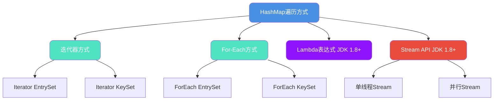

import PaidCTA from '@site/src/components/PaidCTA';

## HashMap遍历方式全解析

自JDK 1.8引入Stream API后,HashMap的遍历方式变得更加多样化。本文将深入解析HashMap的各种遍历方式,并从性能、原理和安全性等多个维度进行对比分析,帮助开发者选择最优方案。

### 遍历方式分类

HashMap的遍历方式可以分为4大类、7种具体实现:



## 七种遍历方式详解

### 方式一: 迭代器EntrySet遍历

EntrySet方式一次性获取键值对,无需额外查询:

```java
public class ProductInventory {
    public static void main(String[] args) {
        // 商品库存管理系统
        Map<String, Integer> inventory = new HashMap<>();
        inventory.put("iPhone-15", 120);
        inventory.put("MacBook-Pro", 85);
        inventory.put("AirPods-Pro", 200);
        inventory.put("iPad-Air", 150);
        inventory.put("Apple-Watch", 95);
        
        // 使用迭代器EntrySet遍历
        Iterator<Map.Entry<String, Integer>> iterator = inventory.entrySet().iterator();
        while (iterator.hasNext()) {
            Map.Entry<String, Integer> entry = iterator.next();
            System.out.println("商品: " + entry.getKey() + ", 库存: " + entry.getValue());
        }
    }
}
```

### 方式二: 迭代器KeySet遍历

KeySet方式需要通过key二次查询获取value:

```java
public class ProductInventory {
    public static void main(String[] args) {
        Map<String, Integer> inventory = new HashMap<>();
        inventory.put("iPhone-15", 120);
        inventory.put("MacBook-Pro", 85);
        inventory.put("AirPods-Pro", 200);
        inventory.put("iPad-Air", 150);
        inventory.put("Apple-Watch", 95);
        
        // 使用迭代器KeySet遍历
        Iterator<String> iterator = inventory.keySet().iterator();
        while (iterator.hasNext()) {
            String product = iterator.next();
            Integer stock = inventory.get(product);  // 需要二次查询
            System.out.println("商品: " + product + ", 库存: " + stock);
        }
    }
}
```

### 方式三: ForEach EntrySet遍历

增强for循环的EntrySet方式,代码简洁:

```java
public class ProductInventory {
    public static void main(String[] args) {
        Map<String, Integer> inventory = new HashMap<>();
        inventory.put("iPhone-15", 120);
        inventory.put("MacBook-Pro", 85);
        inventory.put("AirPods-Pro", 200);
        inventory.put("iPad-Air", 150);
        inventory.put("Apple-Watch", 95);
        
        // 增强for循环遍历EntrySet
        for (Map.Entry<String, Integer> entry : inventory.entrySet()) {
            System.out.println("商品: " + entry.getKey() + ", 库存: " + entry.getValue());
        }
    }
}
```

### 方式四: ForEach KeySet遍历

增强for循环的KeySet方式:

```java
public class ProductInventory {
    public static void main(String[] args) {
        Map<String, Integer> inventory = new HashMap<>();
        inventory.put("iPhone-15", 120);
        inventory.put("MacBook-Pro", 85);
        inventory.put("AirPods-Pro", 200);
        inventory.put("iPad-Air", 150);
        inventory.put("Apple-Watch", 95);
        
        // 增强for循环遍历KeySet
        for (String product : inventory.keySet()) {
            Integer stock = inventory.get(product);
            System.out.println("商品: " + product + ", 库存: " + stock);
        }
    }
}
```

### 方式五: Lambda表达式遍历

JDK 1.8引入的Lambda方式,代码最简洁:

```java
public class ProductInventory {
    public static void main(String[] args) {
        Map<String, Integer> inventory = new HashMap<>();
        inventory.put("iPhone-15", 120);
        inventory.put("MacBook-Pro", 85);
        inventory.put("AirPods-Pro", 200);
        inventory.put("iPad-Air", 150);
        inventory.put("Apple-Watch", 95);
        
        // Lambda表达式遍历
        inventory.forEach((product, stock) -> {
            System.out.println("商品: " + product + ", 库存: " + stock);
        });
    }
}
```

### 方式六: Stream API单线程遍历

Stream提供声明式编程风格:

```java
public class ProductInventory {
    public static void main(String[] args) {
        Map<String, Integer> inventory = new HashMap<>();
        inventory.put("iPhone-15", 120);
        inventory.put("MacBook-Pro", 85);
        inventory.put("AirPods-Pro", 200);
        inventory.put("iPad-Air", 150);
        inventory.put("Apple-Watch", 95);
        
        // Stream单线程遍历
        inventory.entrySet().stream().forEach(entry -> {
            System.out.println("商品: " + entry.getKey() + ", 库存: " + entry.getValue());
        });
    }
}
```

### 方式七: Stream API并行遍历

利用多核CPU并行处理,适合大数据量场景:

```java
public class ProductInventory {
    public static void main(String[] args) {
        Map<String, Integer> inventory = new HashMap<>();
        inventory.put("iPhone-15", 120);
        inventory.put("MacBook-Pro", 85);
        inventory.put("AirPods-Pro", 200);
        inventory.put("iPad-Air", 150);
        inventory.put("Apple-Watch", 95);
        
        // 并行Stream遍历(输出顺序不固定)
        inventory.entrySet().parallelStream().forEach(entry -> {
            System.out.println("商品: " + entry.getKey() + ", 库存: " + entry.getValue());
        });
    }
}
```

## 性能基准测试

### 测试环境搭建

使用JMH(Java Microbenchmark Harness)进行精确的性能测试:

<PaidCTA />