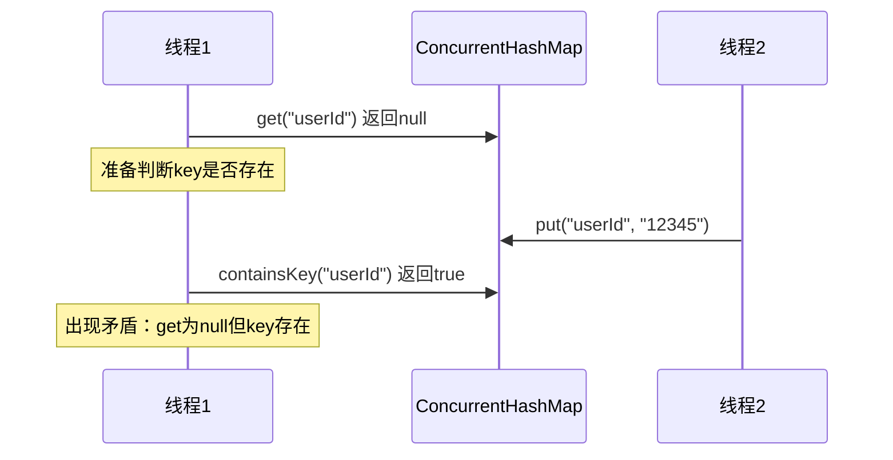
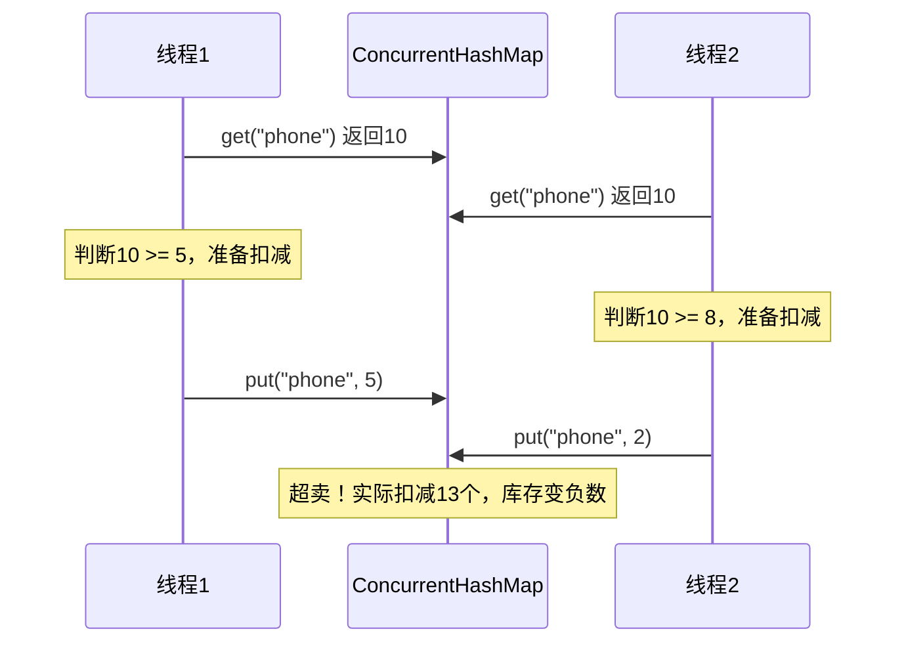
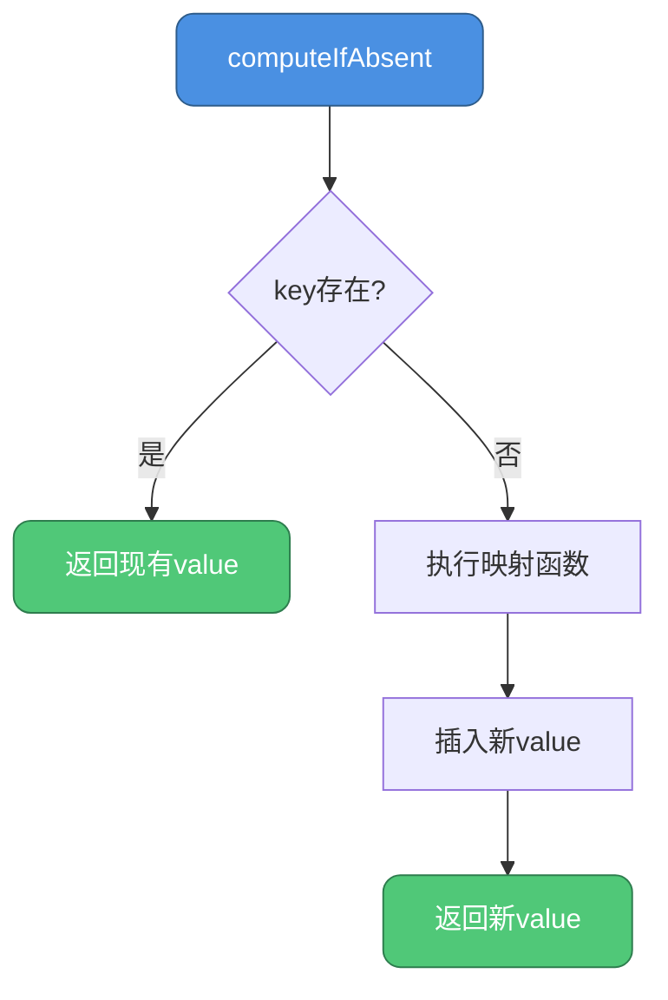

## null值的禁止与二义性问题

### 问题的本质

ConcurrentHashMap明确拒绝null作为key或value，这与HashMap的宽松策略形成鲜明对比。根本原因在于**多线程环境下的二义性**。

### 二义性的产生

当调用`get(key)`返回null时，存在两种可能：

1. 该key确实不存在于Map中
2. 该key存在，但其value被设置为null

```java
// HashMap的单线程场景
HashMap<String, String> map = new HashMap<>();
map.put("config", null);  // 允许null值

String result = map.get("config");  // 返回null
if (map.containsKey("config")) {
    // 可以通过containsKey区分两种情况
    System.out.println("key存在，值为null");
} else {
    System.out.println("key不存在");
}
```

### 多线程下的困境

在并发环境中，这种判断机制失效：

```java
ConcurrentHashMap<String, String> concurrentMap = new ConcurrentHashMap<>();

// 线程1
String value = concurrentMap.get("userId");
if (value == null) {
    // 此时准备调用containsKey判断
    
    // 但线程2可能在此刻插入了数据
    // concurrentMap.put("userId", "12345");
    
    boolean exists = concurrentMap.containsKey("userId");
    // exists的结果已不可靠，状态已发生变化
}
```

**时序图展示**



### Doug Lea的官方解释

ConcurrentHashMap的作者Doug Lea曾明确说明：

> The main reason that nulls aren't allowed in ConcurrentMaps (ConcurrentHashMaps, ConcurrentSkipListMaps) is that ambiguities that may be just barely tolerable in non-concurrent maps can't be accommodated. The main one is that if `map.get(key)` returns `null`, you can't detect whether the key explicitly maps to `null` vs the key isn't mapped.

翻译要点：
- 非并发Map中的歧义勉强可以容忍（通过containsKey）
- 并发Map中，Map状态可能在两次调用间改变，无法容忍歧义

### 替代方案：特殊标记对象

如果业务确需表示"空值"，可使用占位符：

```java
// 定义全局空对象
public static final String NULL_PLACEHOLDER = new String("__NULL__");

ConcurrentHashMap<String, String> cache = new ConcurrentHashMap<>();

// 存储时转换
public void put(String key, String value) {
    cache.put(key, value == null ? NULL_PLACEHOLDER : value);
}

// 读取时还原
public String get(String key) {
    String value = cache.get(key);
    return NULL_PLACEHOLDER.equals(value) ? null : value;
}
```

**实战案例：用户权限缓存**

```java
public class PermissionCache {
    private static final Permission EMPTY_PERMISSION = new Permission();
    private final ConcurrentHashMap<String, Permission> cache = new ConcurrentHashMap<>();
    
    // 用户无权限时，使用空对象而非null
    public void cachePermission(String userId, Permission permission) {
        cache.put(userId, permission != null ? permission : EMPTY_PERMISSION);
    }
    
    public Permission getPermission(String userId) {
        Permission perm = cache.get(userId);
        return EMPTY_PERMISSION.equals(perm) ? null : perm;
    }
}
```

## 复合操作的原子性保障

### 复合操作的风险

ConcurrentHashMap虽然保证单个操作（put、get、remove）的线程安全，但**复合操作**仍可能出现竞态条件。

### 典型的竞态场景

**场景1：检查-执行模式**

```java
ConcurrentHashMap<String, Integer> inventory = new ConcurrentHashMap<>();

// 错误示例：非原子性的库存扣减
public boolean decreaseStock(String productId, int quantity) {
    Integer stock = inventory.get(productId);
    if (stock != null && stock >= quantity) {
        // 问题：此时其他线程可能修改了stock
        inventory.put(productId, stock - quantity);
        return true;
    }
    return false;
}
```

**问题分析**



### 原子复合操作API

ConcurrentHashMap提供了多种原子方法避免竞态：

#### putIfAbsent

仅当key不存在时插入：

```java
// 正确示例：幂等的初始化操作
public void initCounter(String metric) {
    // 原子性保证：仅首次插入成功
    counterMap.putIfAbsent(metric, new AtomicLong(0));
}

// 错误的等价写法
if (!counterMap.containsKey(metric)) {
    // 问题：containsKey和put之间存在时间窗口
    counterMap.put(metric, new AtomicLong(0));
}
```

#### computeIfAbsent

带计算逻辑的条件插入：

```java
ConcurrentHashMap<String, List<Order>> userOrders = new ConcurrentHashMap<>();

// 原子性获取或创建用户订单列表
public void addOrder(String userId, Order order) {
    userOrders.computeIfAbsent(userId, k -> new CopyOnWriteArrayList<>())
              .add(order);
}
```

**工作流程**



#### compute

无条件更新，支持基于旧值计算新值：

```java
ConcurrentHashMap<String, Integer> scores = new ConcurrentHashMap<>();

// 原子性增加分数
public void addScore(String playerId, int delta) {
    scores.compute(playerId, (k, oldScore) -> {
        return (oldScore == null ? 0 : oldScore) + delta;
    });
}
```

#### computeIfPresent

仅当key存在时更新：

```java
// 原子性的条件更新
public void applyDiscount(String productId, double discountRate) {
    priceMap.computeIfPresent(productId, (k, oldPrice) -> {
        return oldPrice * (1 - discountRate);
    });
}
```

#### merge

合并操作，处理key存在与不存在的情况：

```java
ConcurrentHashMap<String, Long> wordCount = new ConcurrentHashMap<>();

// 原子性累加单词计数
public void countWord(String word) {
    wordCount.merge(word, 1L, (oldCount, one) -> oldCount + one);
}

// 等价于
wordCount.merge(word, 1L, Long::sum);
```

### 实战案例：分布式计数器

**需求**：统计各类事件的发生次数，支持高并发更新和查询。

**错误实现**

```java
public class EventCounter {
    private ConcurrentHashMap<String, Long> counters = new ConcurrentHashMap<>();
    
    // 非原子性，存在竞态
    public void increment(String eventType) {
        Long count = counters.get(eventType);
        if (count == null) {
            counters.put(eventType, 1L);
        } else {
            counters.put(eventType, count + 1);  // 竞态窗口
        }
    }
}
```

**正确实现1：使用merge**

```java
public class EventCounter {
    private ConcurrentHashMap<String, Long> counters = new ConcurrentHashMap<>();
    
    public void increment(String eventType) {
        counters.merge(eventType, 1L, Long::sum);
    }
    
    public long getCount(String eventType) {
        return counters.getOrDefault(eventType, 0L);
    }
}
```

**正确实现2：使用LongAdder**

```java
public class EventCounter {
    private ConcurrentHashMap<String, LongAdder> counters = new ConcurrentHashMap<>();
    
    public void increment(String eventType) {
        counters.computeIfAbsent(eventType, k -> new LongAdder())
                .increment();
    }
    
    public long getCount(String eventType) {
        LongAdder adder = counters.get(eventType);
        return adder == null ? 0L : adder.sum();
    }
}
```

### 性能对比

| 实现方式 | 并发安全 | 性能 | 复杂度 |
|---------|---------|-----|-------|
| get-判断-put | ❌ | 高（但错误） | 低 |
| synchronized同步 | ✅ | 低 | 低 |
| merge原子方法 | ✅ | 高 | 中 |
| LongAdder | ✅ | 极高 | 中 |

## fail-safe机制详解

### fail-fast vs fail-safe

**fail-fast（快速失败）**

以HashMap为代表，迭代时检测到结构修改立即抛出`ConcurrentModificationException`：

```java
HashMap<String, String> map = new HashMap<>();
map.put("k1", "v1");
map.put("k2", "v2");

for (String key : map.keySet()) {
    map.put("k3", "v3");  // 抛出ConcurrentModificationException
}
```

**fail-safe（安全失败）**

ConcurrentHashMap采用此策略，允许迭代过程中修改集合，不抛出异常。

### 弱一致性迭代器

ConcurrentHashMap的迭代器提供**弱一致性保证**：

- **能看到**：迭代器创建前已存在的元素
- **可能看到**：迭代器创建后新增的元素
- **可能看不到**：迭代器创建后删除的元素

```java
ConcurrentHashMap<String, Integer> map = new ConcurrentHashMap<>();
map.put("a", 1);
map.put("b", 2);

Iterator<Map.Entry<String, Integer>> iterator = map.entrySet().iterator();

// 迭代过程中修改
new Thread(() -> {
    map.put("c", 3);      // 可能被迭代到
    map.remove("a");      // 可能仍被迭代到
}).start();

while (iterator.hasNext()) {
    Map.Entry<String, Integer> entry = iterator.next();
    System.out.println(entry.getKey() + ": " + entry.getValue());
    // 不会抛出ConcurrentModificationException
}
```

### 实现原理

**JDK 1.7的Segment隔离**

每个Segment独立遍历，且遍历时只需获取桶的头节点：

```java
// 简化的遍历逻辑
for (int segmentIndex = 0; segmentIndex < segments.length; segmentIndex++) {
    Segment<K,V> seg = segments[segmentIndex];
    HashEntry<K,V>[] tab = seg.table;
    
    for (int i = 0; i < tab.length; i++) {
        // 获取头节点的瞬时快照
        HashEntry<K,V> e = tab[i];
        while (e != null) {
            // 遍历链表
            e = e.next;
        }
    }
}
```

**JDK 1.8的volatile保障**

Node节点的`val`和`next`都声明为volatile，确保可见性：

```java
static class Node<K,V> implements Map.Entry<K,V> {
    final int hash;
    final K key;
    volatile V val;          // 保证修改对迭代器可见
    volatile Node<K,V> next; // 保证链表变化可见
}
```

迭代时，读取到的节点状态是某个时刻的快照，后续修改不影响已获取的引用。

### 弱一致性的实战影响

**场景：实时监控系统**

```java
ConcurrentHashMap<String, Metric> metrics = new ConcurrentHashMap<>();

// 线程1：持续采集指标
new Thread(() -> {
    while (true) {
        metrics.put("cpu-usage", new Metric(getCpuUsage()));
        metrics.put("memory-usage", new Metric(getMemoryUsage()));
        Thread.sleep(1000);
    }
}).start();

// 线程2：周期性生成报告
new Thread(() -> {
    while (true) {
        StringBuilder report = new StringBuilder();
        for (Map.Entry<String, Metric> entry : metrics.entrySet()) {
            report.append(entry.getKey())
                  .append(": ")
                  .append(entry.getValue())
                  .append("\n");
            // 即使metrics在遍历中被修改，也不会抛异常
        }
        System.out.println(report);
        Thread.sleep(5000);
    }
}).start();
```

**弱一致性的优势**

1. **无阻塞**：迭代不影响其他线程的修改
2. **无异常**：不会因并发修改而失败
3. **高性能**：避免复制整个集合

**需要注意的场景**

对于需要**强一致性快照**的场景，需要额外处理：

```java
// 获取某一时刻的一致性快照
public Map<String, Integer> getSnapshot() {
    // 方法1：使用synchronized
    synchronized (this) {
        return new HashMap<>(concurrentMap);
    }
    
    // 方法2：使用快照类（如CopyOnWriteArrayList）
    // 但ConcurrentHashMap没有内置快照方法
}
```

## 高级特性综合应用

### 缓存系统设计

**需求**：实现一个线程安全的本地缓存，支持过期时间。

```java
public class ExpiringCache<K, V> {
    private static class CacheEntry<V> {
        final V value;
        final long expireTime;
        
        CacheEntry(V value, long ttlMillis) {
            this.value = value;
            this.expireTime = System.currentTimeMillis() + ttlMillis;
        }
        
        boolean isExpired() {
            return System.currentTimeMillis() > expireTime;
        }
    }
    
    private final ConcurrentHashMap<K, CacheEntry<V>> cache = new ConcurrentHashMap<>();
    
    // 原子性的带过期时间的put
    public void put(K key, V value, long ttlMillis) {
        cache.put(key, new CacheEntry<>(value, ttlMillis));
    }
    
    // 获取时自动清理过期数据
    public V get(K key) {
        CacheEntry<V> entry = cache.get(key);
        if (entry == null) {
            return null;
        }
        
        if (entry.isExpired()) {
            // 原子性删除过期条目
            cache.remove(key, entry);
            return null;
        }
        
        return entry.value;
    }
    
    // 批量清理过期数据（弱一致性迭代）
    public void cleanUp() {
        cache.entrySet().removeIf(entry -> entry.getValue().isExpired());
    }
}
```

**使用示例**

```java
ExpiringCache<String, UserSession> sessionCache = new ExpiringCache<>();

// 存储会话，30分钟过期
sessionCache.put("session-123", new UserSession(), 30 * 60 * 1000);

// 获取会话（自动验证过期）
UserSession session = sessionCache.get("session-123");

// 定期清理过期会话
ScheduledExecutorService cleaner = Executors.newSingleThreadScheduledExecutor();
cleaner.scheduleAtFixedRate(sessionCache::cleanUp, 1, 1, TimeUnit.MINUTES);
```

### 分布式限流器

**需求**：统计API调用频率，实现令牌桶限流。

```java
public class RateLimiter {
    private static class TokenBucket {
        final int capacity;
        final int refillRate;
        volatile int tokens;
        volatile long lastRefillTime;
        
        TokenBucket(int capacity, int refillRate) {
            this.capacity = capacity;
            this.refillRate = refillRate;
            this.tokens = capacity;
            this.lastRefillTime = System.currentTimeMillis();
        }
        
        synchronized boolean tryAcquire() {
            refill();
            if (tokens > 0) {
                tokens--;
                return true;
            }
            return false;
        }
        
        private void refill() {
            long now = System.currentTimeMillis();
            long elapsed = now - lastRefillTime;
            int newTokens = (int) (elapsed * refillRate / 1000);
            if (newTokens > 0) {
                tokens = Math.min(capacity, tokens + newTokens);
                lastRefillTime = now;
            }
        }
    }
    
    private final ConcurrentHashMap<String, TokenBucket> buckets = new ConcurrentHashMap<>();
    private final int capacity;
    private final int refillRate;
    
    public RateLimiter(int capacity, int refillRate) {
        this.capacity = capacity;
        this.refillRate = refillRate;
    }
    
    // 原子性创建或获取令牌桶
    public boolean allowRequest(String apiKey) {
        TokenBucket bucket = buckets.computeIfAbsent(apiKey, 
            k -> new TokenBucket(capacity, refillRate));
        return bucket.tryAcquire();
    }
}
```

**使用示例**

```java
// 每秒100次请求
RateLimiter limiter = new RateLimiter(100, 100);

// API处理
public Response handleRequest(String apiKey, Request request) {
    if (!limiter.allowRequest(apiKey)) {
        return Response.error("Rate limit exceeded");
    }
    return processRequest(request);
}
```

## 性能调优建议

### 初始容量设置

避免频繁扩容，根据预期大小设置初始容量：

```java
// 预期10000个元素，设置初始容量为16384（考虑0.75负载因子）
ConcurrentHashMap<String, String> map = new ConcurrentHashMap<>(16384);
```

### 并发级别选择（JDK 1.7）

```java
// 根据并发线程数设置并发级别
int concurrencyLevel = Runtime.getRuntime().availableProcessors() * 2;
ConcurrentHashMap<String, String> map = new ConcurrentHashMap<>(initialCapacity, 0.75f, concurrencyLevel);
```

### 避免大value对象

大对象会增加内存压力和GC负担：

```java
// 不推荐：存储大对象
map.put(key, largeByteArray);

// 推荐：存储引用或ID
map.put(key, objectId);
// 真实对象存储在外部存储
```

通过合理运用ConcurrentHashMap的高级特性，可以构建出健壮高效的并发应用系统。
