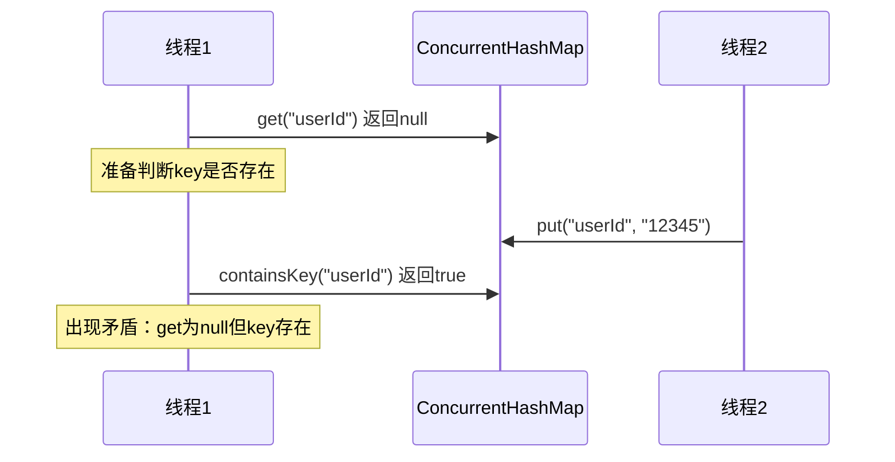
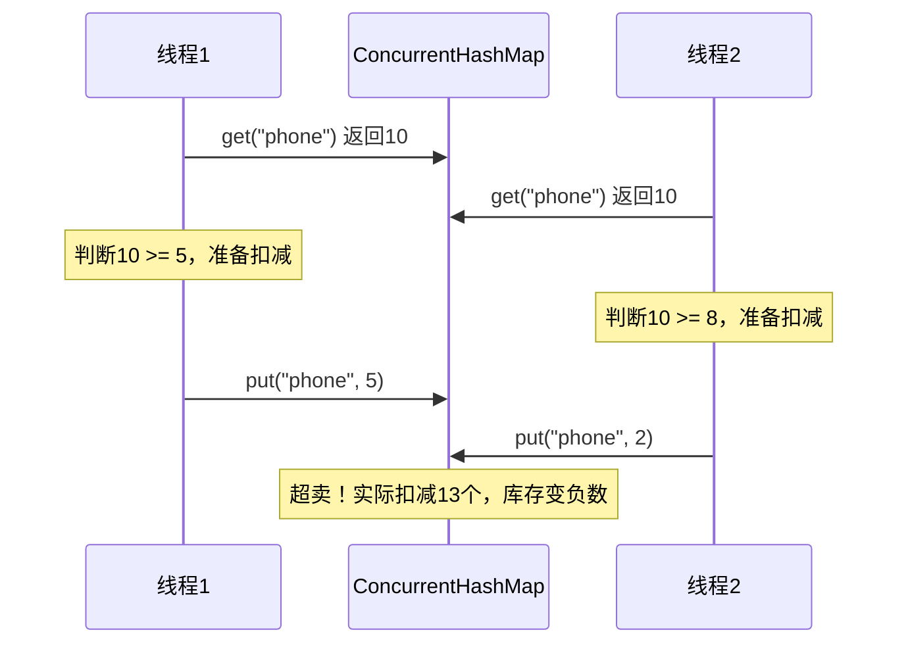
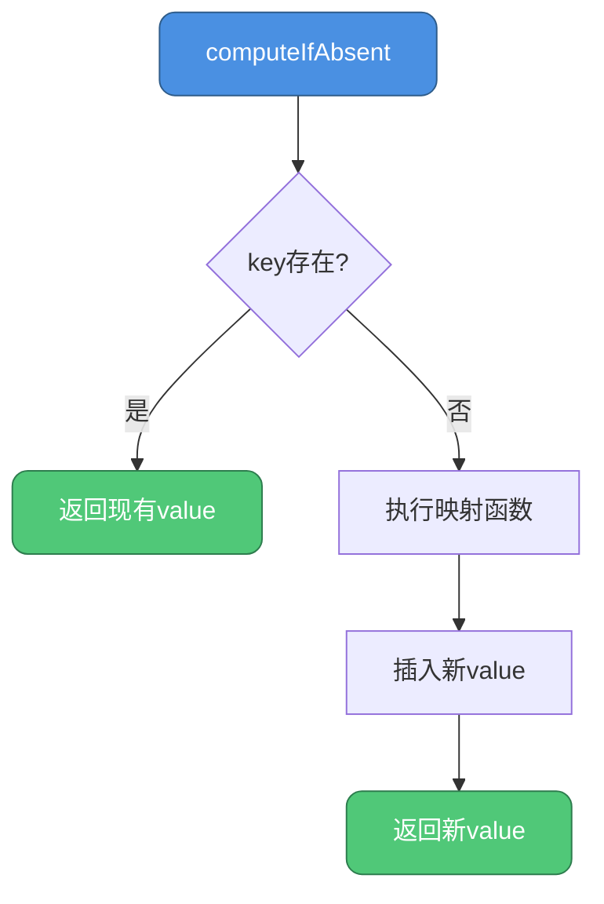

import PaidCTA from '@site/src/components/PaidCTA';

## null值的禁止与二义性问题

### 问题的本质

ConcurrentHashMap明确拒绝null作为key或value，这与HashMap的宽松策略形成鲜明对比。根本原因在于**多线程环境下的二义性**。

### 二义性的产生

当调用`get(key)`返回null时，存在两种可能：

1. 该key确实不存在于Map中
2. 该key存在，但其value被设置为null

```java
// HashMap的单线程场景
HashMap<String, String> map = new HashMap<>();
map.put("config", null);  // 允许null值

String result = map.get("config");  // 返回null
if (map.containsKey("config")) {
    // 可以通过containsKey区分两种情况
    System.out.println("key存在，值为null");
} else {
    System.out.println("key不存在");
}
```

### 多线程下的困境

在并发环境中，这种判断机制失效：

```java
ConcurrentHashMap<String, String> concurrentMap = new ConcurrentHashMap<>();

// 线程1
String value = concurrentMap.get("userId");
if (value == null) {
    // 此时准备调用containsKey判断
    
    // 但线程2可能在此刻插入了数据
    // concurrentMap.put("userId", "12345");
    
    boolean exists = concurrentMap.containsKey("userId");
    // exists的结果已不可靠，状态已发生变化
}
```

**时序图展示**



### Doug Lea的官方解释

ConcurrentHashMap的作者Doug Lea曾明确说明：

> The main reason that nulls aren't allowed in ConcurrentMaps (ConcurrentHashMaps, ConcurrentSkipListMaps) is that ambiguities that may be just barely tolerable in non-concurrent maps can't be accommodated. The main one is that if `map.get(key)` returns `null`, you can't detect whether the key explicitly maps to `null` vs the key isn't mapped.

翻译要点：
- 非并发Map中的歧义勉强可以容忍（通过containsKey）
- 并发Map中，Map状态可能在两次调用间改变，无法容忍歧义

### 替代方案：特殊标记对象

如果业务确需表示"空值"，可使用占位符：

```java
// 定义全局空对象
public static final String NULL_PLACEHOLDER = new String("__NULL__");

ConcurrentHashMap<String, String> cache = new ConcurrentHashMap<>();

// 存储时转换
public void put(String key, String value) {
    cache.put(key, value == null ? NULL_PLACEHOLDER : value);
}

// 读取时还原
public String get(String key) {
    String value = cache.get(key);
    return NULL_PLACEHOLDER.equals(value) ? null : value;
}
```

**实战案例：用户权限缓存**

```java
public class PermissionCache {
    private static final Permission EMPTY_PERMISSION = new Permission();
    private final ConcurrentHashMap<String, Permission> cache = new ConcurrentHashMap<>();
    
    // 用户无权限时，使用空对象而非null
    public void cachePermission(String userId, Permission permission) {
        cache.put(userId, permission != null ? permission : EMPTY_PERMISSION);
    }
    
    public Permission getPermission(String userId) {
        Permission perm = cache.get(userId);
        return EMPTY_PERMISSION.equals(perm) ? null : perm;
    }
}
```

## 复合操作的原子性保障

### 复合操作的风险

ConcurrentHashMap虽然保证单个操作（put、get、remove）的线程安全，但**复合操作**仍可能出现竞态条件。

### 典型的竞态场景

**场景1：检查-执行模式**

```java
ConcurrentHashMap<String, Integer> inventory = new ConcurrentHashMap<>();

// 错误示例：非原子性的库存扣减
public boolean decreaseStock(String productId, int quantity) {
    Integer stock = inventory.get(productId);
    if (stock != null && stock >= quantity) {
        // 问题：此时其他线程可能修改了stock
        inventory.put(productId, stock - quantity);
        return true;
    }
    return false;
}
```

**问题分析**



### 原子复合操作API

ConcurrentHashMap提供了多种原子方法避免竞态：

#### putIfAbsent

仅当key不存在时插入：

```java
// 正确示例：幂等的初始化操作
public void initCounter(String metric) {
    // 原子性保证：仅首次插入成功
    counterMap.putIfAbsent(metric, new AtomicLong(0));
}

// 错误的等价写法
if (!counterMap.containsKey(metric)) {
    // 问题：containsKey和put之间存在时间窗口
    counterMap.put(metric, new AtomicLong(0));
}
```

#### computeIfAbsent

带计算逻辑的条件插入：

```java
ConcurrentHashMap<String, List<Order>> userOrders = new ConcurrentHashMap<>();

// 原子性获取或创建用户订单列表
public void addOrder(String userId, Order order) {
    userOrders.computeIfAbsent(userId, k -> new CopyOnWriteArrayList<>())
              .add(order);
}
```

**工作流程**



#### compute

无条件更新，支持基于旧值计算新值：

```java
ConcurrentHashMap<String, Integer> scores = new ConcurrentHashMap<>();

// 原子性增加分数
public void addScore(String playerId, int delta) {
    scores.compute(playerId, (k, oldScore) -> {
        return (oldScore == null ? 0 : oldScore) + delta;
    });
}
```

#### computeIfPresent

仅当key存在时更新：

```java
// 原子性的条件更新
public void applyDiscount(String productId, double discountRate) {
    priceMap.computeIfPresent(productId, (k, oldPrice) -> {
        return oldPrice * (1 - discountRate);
    });
}
```

#### merge

合并操作，处理key存在与不存在的情况：

```java
ConcurrentHashMap<String, Long> wordCount = new ConcurrentHashMap<>();

// 原子性累加单词计数
public void countWord(String word) {
    wordCount.merge(word, 1L, (oldCount, one) -> oldCount + one);
}

// 等价于
wordCount.merge(word, 1L, Long::sum);
```

### 实战案例：分布式计数器

<PaidCTA />