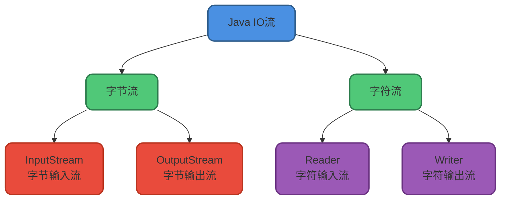
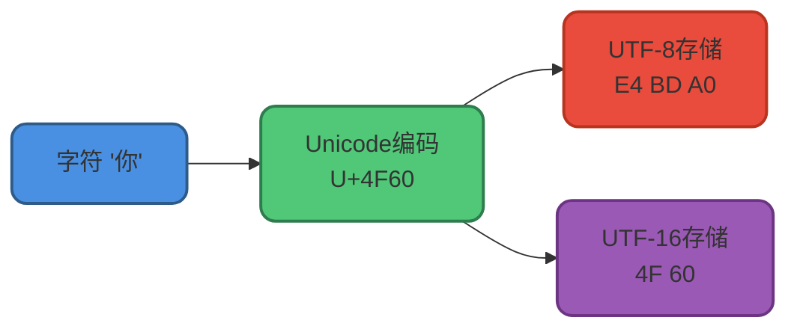
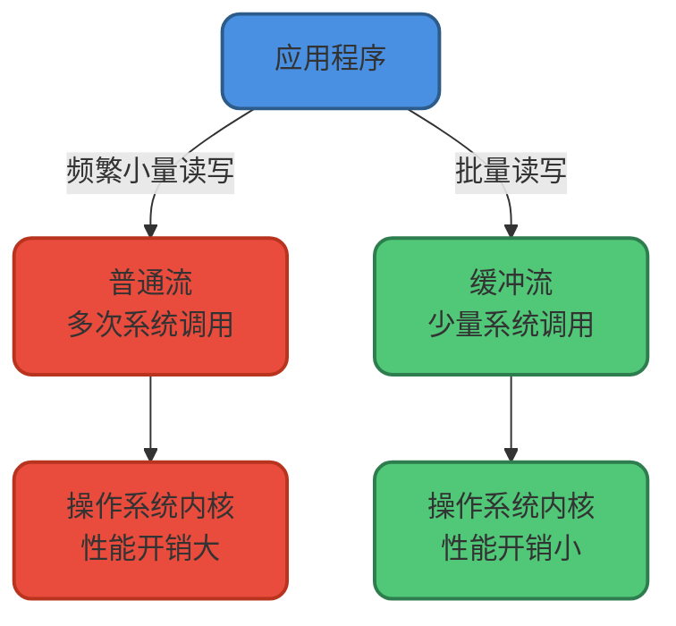
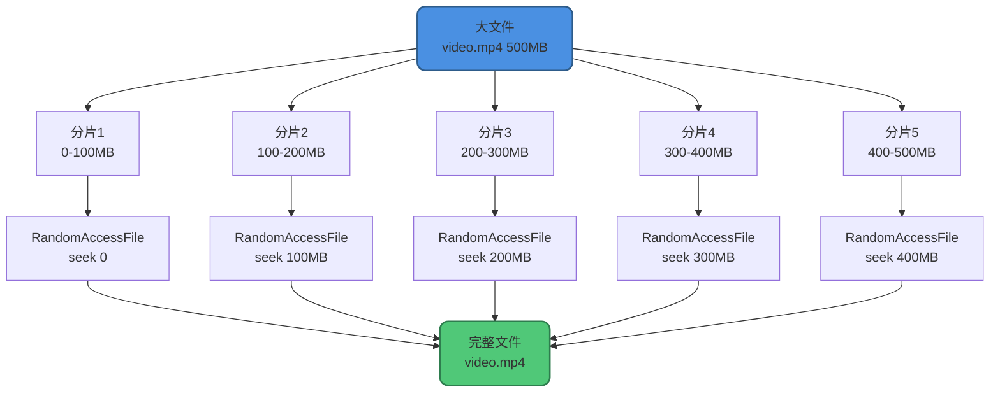

# Java IO基础与流操作

## IO流核心概念

IO（Input/Output）是指数据的输入与输出操作。当应用程序需要从外部存储（如文件、数据库、网络）读取数据到内存时,这个过程称为输入;反之,将内存中的数据写出到外部存储的过程称为输出。由于数据传输的特性类似于水流,因此我们将这种数据传输机制称为IO流。

Java的IO流体系以4个抽象基类为核心,派生出40多个具体实现类:

- `InputStream` / `Reader`: 输入流的抽象基类,前者处理字节数据,后者处理字符数据
- `OutputStream` / `Writer`: 输出流的抽象基类,前者处理字节数据,后者处理字符数据



## 字节流操作

### InputStream核心方法

`InputStream`是所有字节输入流的抽象父类,用于从数据源读取字节数据到内存。

核心API方法:

- `read()`: 读取单个字节,返回0-255之间的int值,返回-1表示流结束
- `read(byte[] b)`: 将数据读入字节数组,返回实际读取的字节数
- `read(byte[] b, int off, int len)`: 指定偏移量和读取长度的读取操作
- `skip(long n)`: 跳过n个字节
- `available()`: 返回可读取的字节数估计值
- `close()`: 关闭流并释放系统资源

JDK 9新增的便捷方法:

- `readAllBytes()`: 一次性读取所有字节
- `readNBytes(byte[] b, int off, int len)`: 阻塞直到读取len个字节
- `transferTo(OutputStream out)`: 将所有字节传输到输出流

#### FileInputStream文件读取示例

`FileInputStream`是最常用的字节输入流实现,可直接读取文件内容:

```java
public class LogFileReader {
    public void readAccessLog(String logPath) {
        try (InputStream fis = new FileInputStream(logPath)) {
            System.out.println("日志文件可读字节数: " + fis.available());
            
            // 跳过前10个字节(通常是时间戳)
            long skipped = fis.skip(10);
            System.out.println("已跳过字节数: " + skipped);
            
            System.out.print("访问记录内容: ");
            int byteData;
            while ((byteData = fis.read()) != -1) {
                System.out.print((char) byteData);
            }
        } catch (IOException e) {
            e.printStackTrace();
        }
    }
}
```

假设`access.log`文件内容为:
```
2024-11-26 UserLoginSuccess
```

输出结果:
```
日志文件可读字节数: 33
已跳过字节数: 10
访问记录内容:  UserLoginSuccess
```

#### BufferedInputStream缓冲读取

实际项目中,我们通常会搭配`BufferedInputStream`来提升读取性能:

```java
public class ConfigLoader {
    public String loadConfig(String configPath) throws IOException {
        try (BufferedInputStream bis = new BufferedInputStream(
                new FileInputStream(configPath))) {
            // 使用JDK 9+的便捷方法一次性读取全部内容
            return new String(bis.readAllBytes());
        }
    }
}
```

#### DataInputStream类型化读取

`DataInputStream`可以读取Java基本数据类型,常用于读取二进制配置文件:

```java
public class BinaryConfigReader {
    public void readDatabaseConfig(String path) throws IOException {
        try (DataInputStream dis = new DataInputStream(
                new FileInputStream(path))) {
            boolean isEnabled = dis.readBoolean();      // 读取布尔值
            int maxConnections = dis.readInt();         // 读取整数
            String dbUrl = dis.readUTF();               // 读取字符串
            
            System.out.println("数据库启用状态: " + isEnabled);
            System.out.println("最大连接数: " + maxConnections);
            System.out.println("数据库URL: " + dbUrl);
        }
    }
}
```

#### ObjectInputStream对象反序列化

`ObjectInputStream`用于反序列化Java对象,对象必须实现`Serializable`接口:

```java
public class UserSessionManager {
    public UserSession restoreSession(String sessionFile) throws Exception {
        try (ObjectInputStream ois = new ObjectInputStream(
                new FileInputStream(sessionFile))) {
            return (UserSession) ois.readObject();
        }
    }
}

class UserSession implements Serializable {
    private static final long serialVersionUID = 1L;
    
    private String userId;
    private String sessionToken;
    private transient String password; // transient字段不会被序列化
    
    // getters and setters...
}
```

### OutputStream核心方法

`OutputStream`是所有字节输出流的抽象父类,用于将字节数据写入目标位置。

核心API方法:

- `write(int b)`: 写入单个字节
- `write(byte[] b)`: 写入字节数组
- `write(byte[] b, int off, int len)`: 写入字节数组的指定部分
- `flush()`: 刷新缓冲区,强制写出缓存数据
- `close()`: 关闭流并释放资源

#### FileOutputStream文件写入示例

```java
public class AuditLogger {
    public void logUserAction(String action) {
        try (FileOutputStream fos = new FileOutputStream("audit.log", true)) { // true表示追加模式
            byte[] actionBytes = action.getBytes();
            fos.write(actionBytes);
            fos.write('\n'); // 换行
        } catch (IOException e) {
            e.printStackTrace();
        }
    }
}
```

实际项目中通常搭配`BufferedOutputStream`使用:

```java
public class ReportExporter {
    public void exportReport(String reportPath, List<String> data) throws IOException {
        try (BufferedOutputStream bos = new BufferedOutputStream(
                new FileOutputStream(reportPath))) {
            for (String line : data) {
                bos.write(line.getBytes());
                bos.write('\n');
            }
            // BufferedOutputStream会在close时自动flush,也可手动flush
            bos.flush();
        }
    }
}
```

#### DataOutputStream类型化写入

```java
public class BinaryConfigWriter {
    public void saveDatabaseConfig(String path) throws IOException {
        try (DataOutputStream dos = new DataOutputStream(
                new FileOutputStream(path))) {
            dos.writeBoolean(true);                    // 写入布尔值
            dos.writeInt(100);                         // 写入整数
            dos.writeUTF("jdbc:mysql://localhost:3306/app"); // 写入字符串
        }
    }
}
```

#### ObjectOutputStream对象序列化

```java
public class SessionPersistence {
    public void saveSession(UserSession session, String path) throws IOException {
        try (ObjectOutputStream oos = new ObjectOutputStream(
                new FileOutputStream(path))) {
            oos.writeObject(session);
        }
    }
}
```

## 字符流操作

字节流以字节为单位处理数据,如果直接用字节流处理文本会遇到编码问题。字符流的出现主要解决两个问题:

1. **编码转换开销**: 字符流内部已处理好编码转换,避免重复转换
2. **乱码问题**: 字符流会按照指定编码正确解析字符

让我们看看如果用字节流读取中文会发生什么:

```java
// 错误示例：使用字节流读取中文
try (FileInputStream fis = new FileInputStream("message.txt")) {
    int b;
    while ((b = fis.read()) != -1) {
        System.out.print((char) b); // 输出乱码: è¿æ¯ä¸æ
    }
}
```

字符流默认使用Unicode编码,我们也可以通过构造方法指定编码方式。需要注意的是,Unicode只是字符集(给每个字符分配唯一编号),UTF-8、UTF-16、UTF-32才是具体的编码方案(定义如何存储这些编号)。例如UTF-8编码中,英文占1字节,中文占3字节。



### Reader字符输入流

`Reader`是所有字符输入流的抽象基类,用于读取字符数据。

核心API方法:

- `read()`: 读取单个字符
- `read(char[] cbuf)`: 读取字符到数组
- `read(char[] cbuf, int off, int len)`: 读取指定长度的字符
- `skip(long n)`: 跳过n个字符
- `close()`: 关闭流释放资源

#### InputStreamReader桥接转换

`InputStreamReader`是字节流到字符流的桥梁,其子类`FileReader`进一步简化了文件读取:

```java
// 继承关系
public class InputStreamReader extends Reader {
    // 内部使用StreamDecoder进行解码
}

public class FileReader extends InputStreamReader {
    // 简化文件读取操作
}
```

示例代码:

```java
public class MultiLanguageReader {
    public void readUserProfile(String profilePath) {
        try (FileReader reader = new FileReader(profilePath)) {
            int ch;
            long skipped = reader.skip(5); // 跳过文件头标识
            System.out.println("跳过的字符数: " + skipped);
            
            System.out.print("用户信息: ");
            while ((ch = reader.read()) != -1) {
                System.out.print((char) ch);
            }
        } catch (IOException e) {
            e.printStackTrace();
        }
    }
}
```

假设`profile.txt`内容为:
```
用户:张三,年龄:28
```

输出:
```
跳过的字符数: 5
用户信息: 三,年龄:28
```

### Writer字符输出流

`Writer`是所有字符输出流的抽象基类,用于写入字符数据。

核心API方法:

- `write(int c)`: 写入单个字符
- `write(char[] cbuf)`: 写入字符数组
- `write(char[] cbuf, int off, int len)`: 写入字符数组的一部分
- `write(String str)`: 写入字符串
- `write(String str, int off, int len)`: 写入字符串的一部分
- `append(CharSequence csq)`: 追加字符序列
- `append(char c)`: 追加单个字符
- `flush()`: 刷新缓冲区
- `close()`: 关闭流

#### OutputStreamWriter桥接转换

`OutputStreamWriter`是字符流到字节流的桥梁:

```java
public class OutputStreamWriter extends Writer {
    // 内部使用StreamEncoder进行编码
}

public class FileWriter extends OutputStreamWriter {
    // 简化文件写入操作
}
```

示例代码:

```java
public class NotificationWriter {
    public void saveNotification(String message) {
        try (Writer writer = new FileWriter("notifications.txt", true)) {
            writer.write("【系统通知】");
            writer.write(message);
            writer.write("\n");
        } catch (IOException e) {
            e.printStackTrace();
        }
    }
}
```

## 缓冲流性能优化

IO操作涉及系统调用,频繁的调用会严重影响性能。缓冲流通过在内存中维护缓冲区,批量读写数据,大幅减少系统调用次数。



缓冲流采用**装饰器模式**增强原有流的功能,我们可以通过包装任何`InputStream`或`OutputStream`来添加缓冲能力。

### 字节缓冲流性能对比

我使用单字节读写方式,对比复制一个350MB的视频文件的耗时:

```java
@Test
public void testBufferedStreamPerformance() {
    long start = System.currentTimeMillis();
    try (BufferedInputStream bis = new BufferedInputStream(
            new FileInputStream("tutorial-video.mp4"));
         BufferedOutputStream bos = new BufferedOutputStream(
            new FileOutputStream("tutorial-video-copy.mp4"))) {
        int data;
        while ((data = bis.read()) != -1) {
            bos.write(data);
        }
    } catch (IOException e) {
        e.printStackTrace();
    }
    long end = System.currentTimeMillis();
    System.out.println("使用缓冲流复制视频文件耗时: " + (end - start) + " 毫秒");
}

@Test
public void testNormalStreamPerformance() {
    long start = System.currentTimeMillis();
    try (FileInputStream fis = new FileInputStream("tutorial-video.mp4");
         FileOutputStream fos = new FileOutputStream("tutorial-video-copy2.mp4")) {
        int data;
        while ((data = fis.read()) != -1) {
            fos.write(data);
        }
    } catch (IOException e) {
        e.printStackTrace();
    }
    long end = System.currentTimeMillis();
    System.out.println("使用普通流复制视频文件耗时: " + (end - start) + " 毫秒");
}
```

测试结果:
```
使用缓冲流复制视频文件耗时: 8523 毫秒
使用普通流复制视频文件耗时: 1456789 毫秒
```

缓冲流的速度是普通流的**170倍**!

如果使用数组批量读写方式,性能差距会显著缩小:

```java
@Test
public void testBufferedStreamWithArray() {
    long start = System.currentTimeMillis();
    try (BufferedInputStream bis = new BufferedInputStream(
            new FileInputStream("tutorial-video.mp4"));
         BufferedOutputStream bos = new BufferedOutputStream(
            new FileOutputStream("tutorial-video-copy3.mp4"))) {
        byte[] buffer = new byte[8192];
        int len;
        while ((len = bis.read(buffer)) != -1) {
            bos.write(buffer, 0, len);
        }
    } catch (IOException e) {
        e.printStackTrace();
    }
    long end = System.currentTimeMillis();
    System.out.println("缓冲流+数组批量复制耗时: " + (end - start) + " 毫秒");
}

@Test
public void testNormalStreamWithArray() {
    long start = System.currentTimeMillis();
    try (FileInputStream fis = new FileInputStream("tutorial-video.mp4");
         FileOutputStream fos = new FileOutputStream("tutorial-video-copy4.mp4")) {
        byte[] buffer = new byte[8192];
        int len;
        while ((len = fis.read(buffer)) != -1) {
            fos.write(buffer, 0, len);
        }
    } catch (IOException e) {
        e.printStackTrace();
    }
    long end = System.currentTimeMillis();
    System.out.println("普通流+数组批量复制耗时: " + (end - start) + " 毫秒");
}
```

测试结果:
```
缓冲流+数组批量复制耗时: 412 毫秒
普通流+数组批量复制耗时: 567 毫秒
```

两者性能接近,因为我们已经在应用层实现了缓冲机制。

### BufferedInputStream实现原理

`BufferedInputStream`内部维护一个字节数组作为缓冲区:

```java
public class BufferedInputStream extends FilterInputStream {
    // 内部缓冲区数组
    protected volatile byte buf[];
    
    // 默认缓冲区大小8KB
    private static int DEFAULT_BUFFER_SIZE = 8192;
    
    // 使用默认缓冲区大小
    public BufferedInputStream(InputStream in) {
        this(in, DEFAULT_BUFFER_SIZE);
    }
    
    // 自定义缓冲区大小
    public BufferedInputStream(InputStream in, int size) {
        super(in);
        if (size <= 0) {
            throw new IllegalArgumentException("Buffer size <= 0");
        }
        buf = new byte[size];
    }
}
```

默认缓冲区大小为**8192字节**(8KB),也可以通过构造方法自定义大小。

### BufferedOutputStream实现原理

`BufferedOutputStream`同样维护一个8KB的内部缓冲区:

```java
public class CacheWriter {
    public void writeCache(String cacheFile, List<String> items) throws IOException {
        try (BufferedOutputStream bos = new BufferedOutputStream(
                new FileOutputStream(cacheFile))) {
            for (String item : items) {
                bos.write(item.getBytes());
                bos.write('\n');
            }
            // 可以手动刷新,也可以等待close时自动刷新
            bos.flush();
        }
    }
}
```

## 字符缓冲流

`BufferedReader`和`BufferedWriter`是字符流的缓冲版本,除了提供缓冲功能,还增加了按行读写的便捷方法。

```java
public class ConfigFileManager {
    // 按行读取配置文件
    public List<String> readConfig(String configPath) throws IOException {
        List<String> configs = new ArrayList<>();
        try (BufferedReader reader = new BufferedReader(
                new FileReader(configPath))) {
            String line;
            while ((line = reader.readLine()) != null) {
                if (!line.trim().isEmpty() && !line.startsWith("#")) {
                    configs.add(line);
                }
            }
        }
        return configs;
    }
    
    // 按行写入配置文件
    public void writeConfig(String configPath, List<String> configs) throws IOException {
        try (BufferedWriter writer = new BufferedWriter(
                new FileWriter(configPath))) {
            for (String config : configs) {
                writer.write(config);
                writer.newLine(); // 跨平台的换行符
            }
        }
    }
}
```

## 打印流

打印流提供了便捷的格式化输出功能,我们最常用的`System.out.println()`实际上就是调用`PrintStream`的方法。

```java
public final class System {
    public final static PrintStream out = null; // 标准输出流
    public final static PrintStream err = null; // 标准错误流
}
```

`PrintStream`是字节打印流,继承自`OutputStream`:

```java
public class PrintStream extends FilterOutputStream
    implements Appendable, Closeable {
    // 提供各种便捷的打印方法
}
```

`PrintWriter`是字符打印流,继承自`Writer`:

```java
public class PrintWriter extends Writer {
    // 提供各种便捷的打印方法
}
```

打印流的特点是**永远不会抛出IOException**,并且提供了自动flush功能。

## 随机访问流

`RandomAccessFile`支持随机访问文件的任意位置进行读写,这是其他流都不具备的能力。

```java
public class RandomAccessFile implements DataOutput, DataInput, Closeable {
    // 构造方法
    public RandomAccessFile(File file, String mode) throws FileNotFoundException {
        this(file, mode, false);
    }
    
    // mode支持的模式:
    // "r"  : 只读模式
    // "rw" : 读写模式
    // "rws": 读写模式,同步更新文件内容和元数据
    // "rwd": 读写模式,同步更新文件内容
}
```

文件内容是指实际保存的数据,元数据是指文件属性(如大小、创建时间、修改时间等)。

`RandomAccessFile`维护一个文件指针,可以通过`seek()`方法移动指针位置:

```java
public class UserDataManager {
    public void updateUserStatus(String dataFile, long userOffset, byte status) 
            throws IOException {
        try (RandomAccessFile raf = new RandomAccessFile(dataFile, "rw")) {
            System.out.println("当前文件指针位置: " + raf.getFilePointer());
            
            // 读取用户ID
            byte userId = (byte) raf.read();
            System.out.println("用户ID: " + (char) userId);
            
            // 移动指针到指定位置
            raf.seek(userOffset);
            System.out.println("移动后指针位置: " + raf.getFilePointer());
            
            // 读取原状态
            byte oldStatus = (byte) raf.read();
            System.out.println("原状态: " + (char) oldStatus);
            
            // 更新状态(从当前位置写入会覆盖后续数据)
            raf.seek(userOffset);
            raf.write(new byte[]{status, 'A', 'C', 'T', 'I', 'V', 'E'});
            
            // 回到文件开头验证
            raf.seek(0);
            System.out.println("验证指针位置: " + raf.getFilePointer());
        }
    }
}
```

假设`users.dat`文件内容为`U-PENDING`,执行代码后:

```
当前文件指针位置: 0
用户ID: U
移动后指针位置: 2
原状态: P
验证指针位置: 0
```

文件内容变为: `U-ACTIVE`

**注意**: `write()`方法会覆盖当前位置的数据。

### 实战应用:大文件断点续传

`RandomAccessFile`的典型应用场景是实现大文件的断点续传。基本思路:

1. 将大文件切分成多个分片
2. 多线程并发上传各个分片
3. 服务端使用`RandomAccessFile`将分片写入到文件的指定位置
4. 所有分片上传完成后合并成完整文件

```java
public class FileUploadService {
    /**
     * 合并文件分片
     * @param targetFile 目标文件路径
     * @param chunkFiles 分片文件路径列表
     * @param chunkSize 每个分片的大小
     */
    public void mergeChunks(String targetFile, List<String> chunkFiles, int chunkSize) 
            throws IOException {
        try (RandomAccessFile raf = new RandomAccessFile(targetFile, "rw")) {
            for (int i = 0; i < chunkFiles.size(); i++) {
                // 定位到该分片应该写入的位置
                raf.seek((long) i * chunkSize);
                
                // 读取分片内容并写入目标文件
                try (FileInputStream fis = new FileInputStream(chunkFiles.get(i))) {
                    byte[] buffer = new byte[8192];
                    int len;
                    while ((len = fis.read(buffer)) != -1) {
                        raf.write(buffer, 0, len);
                    }
                }
            }
        }
    }
}
```



### 底层实现

`RandomAccessFile`的实现依赖于`FileDescriptor`(文件描述符)和`FileChannel`(文件通道):

```java
public class RandomAccessFile implements DataOutput, DataInput, Closeable {
    private FileDescriptor fd;
    private FileChannel channel = null;
    
    // 获取文件通道
    public final FileChannel getChannel() {
        synchronized (this) {
            if (channel == null) {
                channel = FileChannelImpl.open(fd, path, true, rw, this);
            }
            return channel;
        }
    }
}
```

## 总结

本文详细介绍了Java IO的核心知识:

1. **IO流分类**: 字节流(InputStream/OutputStream)和字符流(Reader/Writer)
2. **字节流**: 适合处理二进制数据,如图片、视频、音频
3. **字符流**: 适合处理文本数据,自动处理字符编码
4. **缓冲流**: 通过减少系统调用次数大幅提升性能
5. **打印流**: 提供便捷的格式化输出功能
6. **随机访问流**: 支持文件的随机读写,实现断点续传等高级功能

在实际开发中,建议优先使用缓冲流,并且始终使用try-with-resources语法确保资源正确关闭。
