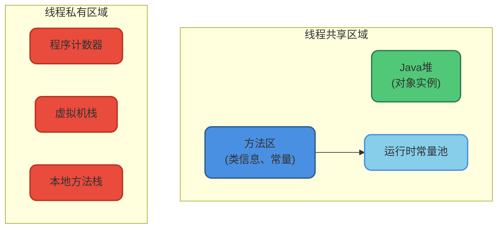
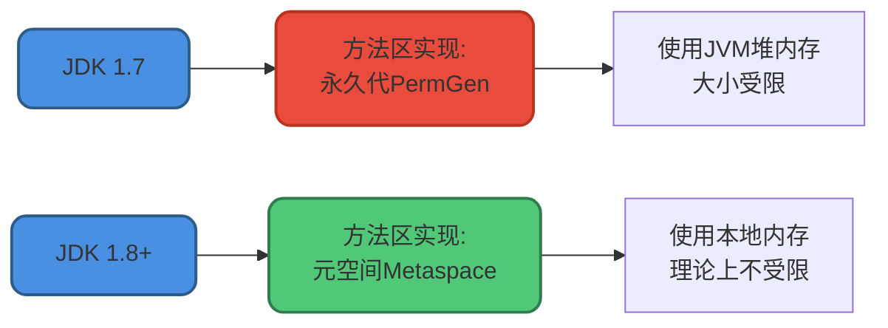
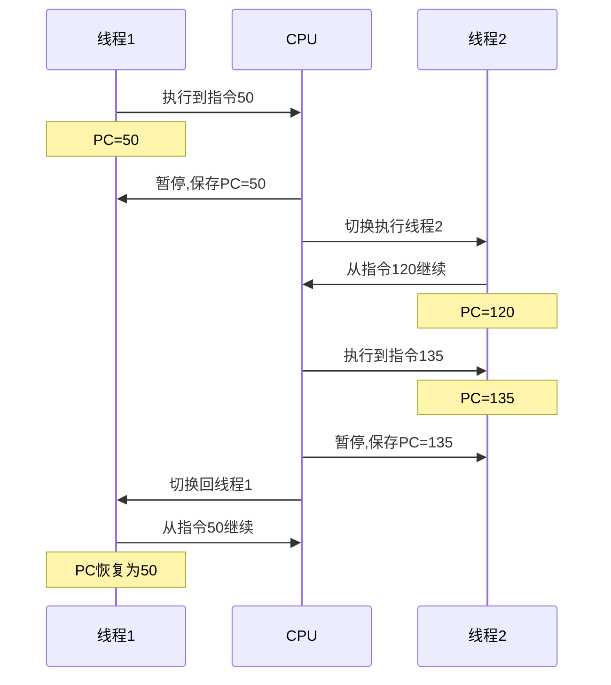

# JVM运行时数据区概述

## 前言

对于Java程序员而言，JVM自动内存管理机制让我们不再需要像C/C++那样为每个new操作编写对应的delete/free代码，大大降低了内存泄漏和溢出的风险。然而，一旦出现内存相关问题，如果不了解JVM的内存管理机制，排查将会变得异常困难。

本文将深入剖析JVM运行时内存区域的组成，帮助你全面理解JVM内存模型的基础框架。

> 本文基于HotSpot虚拟机进行讲解，不同虚拟机的实现细节可能有所差异。

## 运行时数据区组成

JVM在执行Java程序时，会将管理的内存划分为若干个不同的数据区域。根据《Java虚拟机规范》的定义，运行时数据区主要包括：

- **程序计数器**(Program Counter Register)
- **Java虚拟机栈**(Java Virtual Machine Stack)
- **本地方法栈**(Native Method Stack)
- **Java堆**(Java Heap)
- **方法区**(Method Area)
- **运行时常量池**(Runtime Constant Pool)

其中，**堆、方法区和运行时常量池**是所有线程共享的内存区域，而**程序计数器、虚拟机栈和本地方法栈**是线程私有的。



### JDK版本差异

JDK 1.8相比1.7，最显著的变化是**永久代(PermGen)被元空间(Metaspace)取代**，元空间使用本地内存而非JVM堆内存。



Java虚拟机规范对运行时数据区的定义相当宽松。以堆为例：堆可以是连续空间也可以不连续，大小可以固定也可以动态扩展，甚至可以不进行垃圾回收（虽然不现实）。这给虚拟机实现者提供了很大的灵活性。

## 程序计数器

### 核心概念

程序计数器(Program Counter Register)是一块较小的内存空间，可以看作**当前线程执行的字节码指令的行号指示器**。

字节码解释器通过改变程序计数器的值来选取下一条需要执行的字节码指令。程序的分支、循环、跳转、异常处理、线程恢复等基础功能都依赖程序计数器完成。

### 为什么需要程序计数器

在多线程环境下，CPU会频繁切换线程执行。**为了线程切换后能恢复到正确的执行位置**，每个线程都需要一个独立的程序计数器。这就是为什么程序计数器是"线程私有"的内存。



### 核心作用

1. **控制代码流程**：字节码解释器通过改变程序计数器实现顺序执行、选择、循环、异常处理等控制流
2. **线程切换恢复**：记录线程执行位置，切换回来时能知道上次运行到哪里

### 特殊性质

程序计数器是**唯一不会出现`OutOfMemoryError`的内存区域**。它的生命周期随线程的创建而创建，随线程的结束而销毁。

### 程序计数器的值

- **执行Java方法时**：记录正在执行的虚拟机字节码指令地址
- **执行Native方法时**：计数器值为空(Undefined)

```java
public class PCRegisterDemo {
    public static void main(String[] args) {
        int a = 10;       // PC指向对应字节码指令
        int b = 20;       // PC递增
        int c = a + b;    // PC继续递增
        
        if (c > 25) {     // 分支判断，PC根据条件跳转
            System.out.println("大于25");
        }
    }
}
```

## 内存区域特性总结

| 内存区域 | 线程共享 | 是否有OOM | 生命周期 |
|---------|---------|----------|---------|
| 程序计数器 | 私有 | 否 | 随线程 |
| 虚拟机栈 | 私有 | 是(StackOverflow/OOM) | 随线程 |
| 本地方法栈 | 私有 | 是(StackOverflow/OOM) | 随线程 |
| Java堆 | 共享 | 是 | 随JVM |
| 方法区 | 共享 | 是 | 随JVM |
| 运行时常量池 | 共享 | 是 | 随JVM |

理解JVM运行时数据区的组成是深入学习JVM内存管理的基础，后续将分别详细介绍各个区域的实现细节和工作机制。
