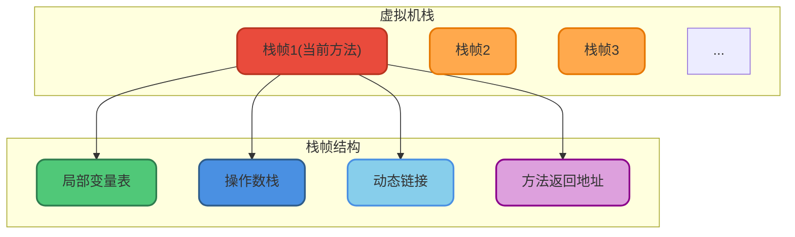
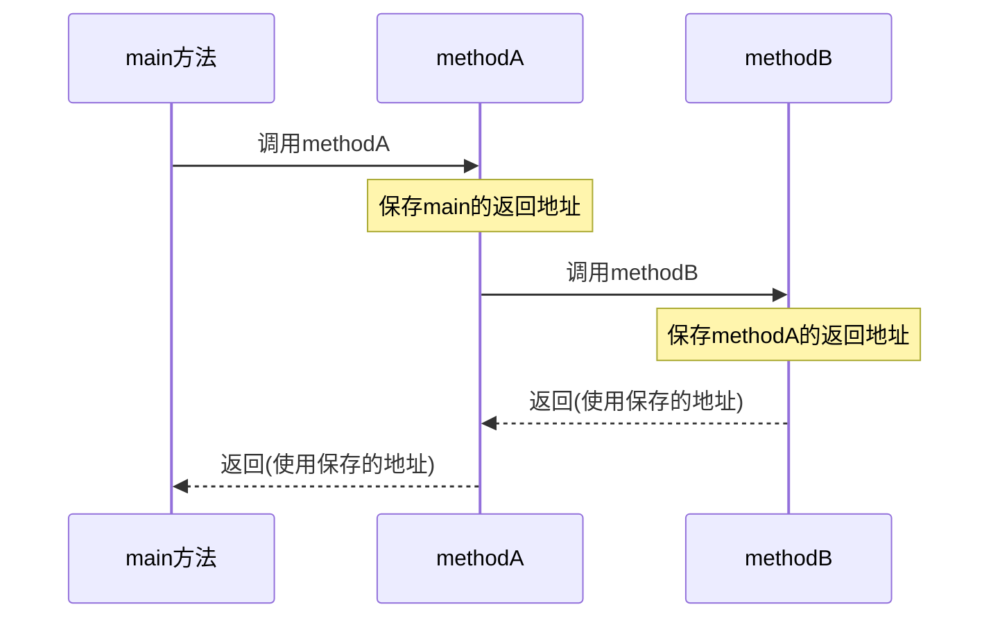
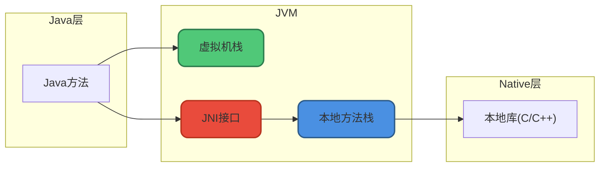
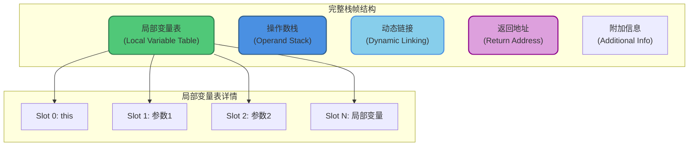

# 虚拟机栈与本地方法栈

## Java虚拟机栈

### 核心概念

Java虚拟机栈(Java Virtual Machine Stack)是线程私有的，生命周期与线程相同。

虚拟机栈是JVM运行时数据区的核心，除了Native方法(通过本地方法栈实现)，**所有Java方法调用都通过虚拟机栈实现**。

### 栈帧结构

方法调用的数据通过栈传递，**每次方法调用都会创建一个栈帧(Stack Frame)压入栈中，方法返回时栈帧弹出**。

栈帧包含四个核心组成部分：



### 局部变量表

局部变量表存放编译期可知的各种基本数据类型(boolean、byte、char、short、int、float、long、double)和对象引用(reference类型)。

**存储内容：**
- 基本数据类型：直接存储值
- 对象引用(reference)：不等同于对象本身，可能是指向对象起始地址的指针、指向对象的句柄或其他与对象相关的位置信息

```java
public void example(int userId, String userName) {
    // 局部变量表存储内容：
    // slot 0: this引用(非静态方法)
    // slot 1: int userId
    // slot 2: String userName引用
    
    long timestamp = System.currentTimeMillis();
    // slot 3-4: long timestamp(占2个slot)
    
    double price = 99.9;
    // slot 5-6: double price(占2个slot)
}
```

### 操作数栈

操作数栈主要用作方法调用的中转站，存放方法执行过程中产生的中间计算结果和临时变量。

```java
// 计算 a + b * c 的字节码执行过程
public int calculate(int a, int b, int c) {
    return a + b * c;
    
    // 操作数栈变化：
    // 1. iload_1    [a]          - 加载a
    // 2. iload_2    [a, b]       - 加载b
    // 3. iload_3    [a, b, c]    - 加载c
    // 4. imul       [a, b*c]     - b*c结果入栈
    // 5. iadd       [a+b*c]      - 最终结果
    // 6. ireturn                  - 返回
}
```

### 动态链接

动态链接是Java虚拟机实现**方法调用**的关键机制之一。

在Class文件中，方法调用以**符号引用**的形式存在于常量池。为了执行调用，这些符号引用必须转换为内存中的**直接引用**：

- **静态解析**：对于静态方法、私有方法等编译期就能确定版本的方法，在类加载的解析阶段完成转换
- **动态链接**：对于需要根据对象实际类型才能确定的虚方法(多态的基础)，在运行时完成转换

```java
// 示例：动态链接支持多态
public class PaymentService {
    public void process(Payment payment) {
        payment.pay();  // 编译时：符号引用，运行时：动态链接到实际类型的pay方法
    }
}

class CreditCardPayment implements Payment {
    public void pay() { System.out.println("信用卡支付"); }
}

class AlipayPayment implements Payment {
    public void pay() { System.out.println("支付宝支付"); }
}
```

### 方法返回地址

方法返回地址记录了方法返回后继续执行的位置：

- **正常返回**：调用者的PC计数器值
- **异常返回**：通过异常处理器表确定返回地址



### 可能出现的错误

虚拟机栈可能出现两种错误：

**1. StackOverflowError**

栈深度超过虚拟机允许的最大深度，通常由无限递归导致。

```java
public class StackOverflowDemo {
    private int stackDepth = 0;
    
    public void recursiveCall() {
        stackDepth++;
        recursiveCall();  // 无限递归，最终导致栈溢出
    }
    
    public static void main(String[] args) {
        StackOverflowDemo demo = new StackOverflowDemo();
        try {
            demo.recursiveCall();
        } catch (StackOverflowError e) {
            System.out.println("栈深度: " + demo.stackDepth);
            // 输出: 栈深度: 约10000+ (具体值取决于-Xss参数)
        }
    }
}
```

**2. OutOfMemoryError**

栈动态扩展时无法申请到足够的内存。

```java
// 设置较小的栈大小触发OOM
// -Xss128k
public class StackOOMDemo {
    public static void main(String[] args) {
        while (true) {
            new Thread(() -> {
                while (true) {
                    try {
                        Thread.sleep(1000);
                    } catch (InterruptedException e) {
                        break;
                    }
                }
            }).start();
        }
    }
}
```

### 栈大小配置

```bash
# 设置每个线程的栈大小
-Xss256k    # 256KB
-Xss1m      # 1MB
```

**配置建议：**
- 栈太小：容易StackOverflow
- 栈太大：能创建的线程数减少
- 默认值：因平台而异，通常512KB-1MB

## 本地方法栈

### 核心概念

本地方法栈(Native Method Stack)与虚拟机栈作用类似，区别在于：

- **虚拟机栈**：为执行Java方法(字节码)服务
- **本地方法栈**：为执行Native方法(通常用C/C++编写)服务



### HotSpot的实现

在HotSpot虚拟机中，本地方法栈和Java虚拟机栈**合二为一**。

### Native方法示例

```java
public class NativeMethodDemo {
    // 声明native方法
    public native void systemCall();
    
    static {
        // 加载本地库
        System.loadLibrary("nativedemo");
    }
    
    public void doWork() {
        // 调用Java方法 - 使用虚拟机栈
        processData();
        
        // 调用Native方法 - 使用本地方法栈
        systemCall();
    }
    
    private void processData() {
        System.out.println("Processing data in Java");
    }
}
```

### 常见的Native方法

Java标准库中大量使用Native方法：

```java
// Object类
public native int hashCode();
public final native Class<?> getClass();
protected native Object clone();

// Thread类
private native void start0();
public static native void sleep(long millis);
public static native Thread currentThread();

// System类
public static native void arraycopy(Object src, int srcPos, 
                                    Object dest, int destPos, int length);
public static native long currentTimeMillis();
```

### 本地方法栈的错误

本地方法执行时也会创建栈帧，存储局部变量表、操作数栈、动态链接、返回地址等信息。同样可能出现`StackOverflowError`和`OutOfMemoryError`。

## 栈帧详细结构



## 虚拟机栈与本地方法栈对比

| 特性 | 虚拟机栈 | 本地方法栈 |
|-----|---------|-----------|
| 服务对象 | Java方法(字节码) | Native方法(C/C++) |
| 线程属性 | 线程私有 | 线程私有 |
| 栈帧结构 | 标准栈帧 | 由本地代码决定 |
| 可能的错误 | SOF/OOM | SOF/OOM |
| HotSpot实现 | 合并为一个栈 | 合并为一个栈 |
| 配置参数 | -Xss | -Xss |

## 实践建议

### 避免栈溢出

```java
// 不推荐：深度递归
public long fibonacci(int n) {
    if (n <= 1) return n;
    return fibonacci(n - 1) + fibonacci(n - 2);
}

// 推荐：迭代替代递归
public long fibonacciIterative(int n) {
    if (n <= 1) return n;
    long prev = 0, curr = 1;
    for (int i = 2; i <= n; i++) {
        long next = prev + curr;
        prev = curr;
        curr = next;
    }
    return curr;
}
```

### 合理设置栈大小

```bash
# 普通应用
-Xss512k

# 递归深度大的应用
-Xss1m

# 创建大量线程的应用(减小栈大小)
-Xss256k
```

理解虚拟机栈和本地方法栈的工作原理，对于分析栈溢出问题、优化递归算法、合理配置JVM参数都有重要意义。
