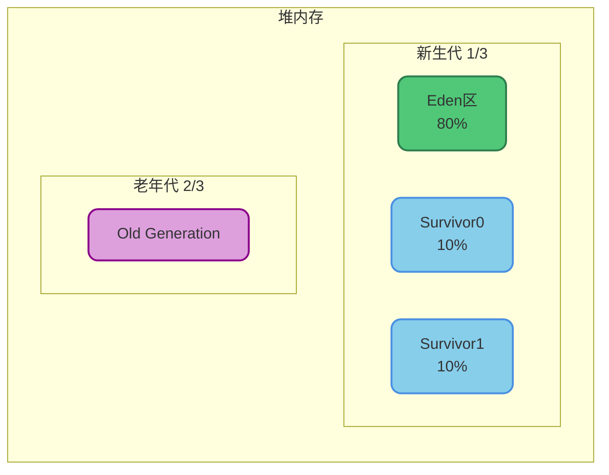
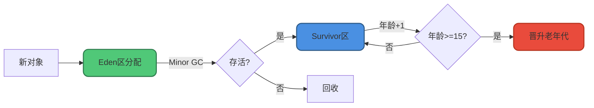
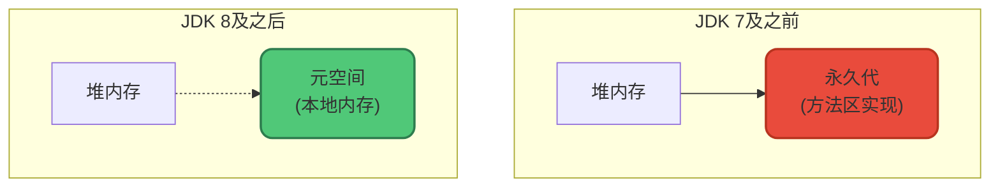

# Java堆内存详解

## 核心概念

Java堆是JVM管理的内存中**最大的一块**，也是**所有线程共享的内存区域**，在虚拟机启动时创建。

**堆的唯一目的就是存放对象实例，几乎所有的对象实例和数组都在这里分配内存。**

## 不是"所有"对象都在堆上

随着JIT编译器和逃逸分析技术的成熟，一些优化技术可能改变对象的分配位置：

- **栈上分配**：如果对象未逃逸出方法，可以直接在栈上分配
- **标量替换**：将对象拆解为基本类型，直接在栈上分配

从JDK 1.7开始默认开启逃逸分析(`-XX:+DoEscapeAnalysis`)。

```java
// 逃逸分析示例
public class EscapeAnalysisDemo {
    public static void main(String[] args) {
        for (int i = 0; i < 10000000; i++) {
            createUser();
        }
    }
    
    // user对象未逃逸出方法，可能在栈上分配
    private static void createUser() {
        User user = new User("张三", 25);
        System.out.println(user.getName());
    }
}
```

## 堆的分代结构

堆是垃圾收集器管理的主要区域，也称**GC堆(Garbage Collected Heap)**。

由于现代垃圾收集器基本都采用**分代收集算法**，堆被划分为不同的区域：



### 新生代(Young Generation)

新生代用于存放新创建的对象，分为三个区域：

**Eden区(伊甸园区)**
- 占新生代的80%
- 新对象首先在此分配
- 触发Minor GC的主要区域

**Survivor区(幸存者区)**
- 分为From和To两个区，各占10%
- 存放经过一次GC后存活的对象
- 采用复制算法

### 老年代(Old Generation)

老年代存放长期存活的对象：
- 经过多次Minor GC仍存活的对象
- 大对象直接进入老年代
- 占堆的2/3

## 为什么要分代

分代的核心思想基于一个观察：**大部分对象都是朝生夕死的**。

通过分代，可以为不同区域设置不同的GC策略，提升垃圾回收效率：

| 代 | 特点 | GC类型 | GC频率 |
|---|------|-------|-------|
| 新生代 | 对象存活率低 | Minor GC | 频繁 |
| 老年代 | 对象存活率高 | Major GC | 低频 |



## Minor GC与Full GC

### Minor GC(新生代GC)

- 发生在新生代
- 触发条件：Eden区满
- 速度快，频繁发生
- 采用复制算法

### Major GC/Full GC

- 清理老年代(Major GC)或整个堆(Full GC)
- 触发条件：老年代空间不足
- 速度慢，STW时间长
- 应尽量避免

```java
// 触发Minor GC的示例
public class MinorGCDemo {
    public static void main(String[] args) {
        List<byte[]> list = new ArrayList<>();
        
        for (int i = 0; i < 1000; i++) {
            // 不断创建对象，Eden满时触发Minor GC
            byte[] data = new byte[1024 * 100]; // 100KB
            
            // 保留部分对象，模拟存活
            if (i % 10 == 0) {
                list.add(data);
            }
        }
    }
}
```

## 堆内存配置参数

### 基础配置

```bash
# 设置堆的初始大小
-Xms512m

# 设置堆的最大大小
-Xmx2g

# 推荐：Xms和Xmx设置相同，避免堆扩容带来的性能损耗
-Xms2g -Xmx2g
```

### 新生代配置

```bash
# 设置新生代大小
-Xmn512m

# 设置新生代和老年代的比例(默认1:2)
-XX:NewRatio=2

# 设置Eden和Survivor的比例(默认8:1:1)
-XX:SurvivorRatio=8
```

### 配置示例

```bash
# 生产环境推荐配置
-Xms4g -Xmx4g           # 堆大小4G
-Xmn1536m               # 新生代1.5G
-XX:SurvivorRatio=8     # Eden:S0:S1 = 8:1:1
-XX:+UseG1GC            # 使用G1收集器
```

## 堆内存溢出

堆最容易出现`OutOfMemoryError`，表现形式有多种：

### Java heap space

创建对象时堆空间不足。

```java
public class HeapOOMDemo {
    public static void main(String[] args) {
        List<byte[]> list = new ArrayList<>();
        while (true) {
            // 不断创建1MB的数组，最终导致堆内存溢出
            list.add(new byte[1024 * 1024]);
        }
    }
}

// 运行参数: -Xms20m -Xmx20m
// 输出: java.lang.OutOfMemoryError: Java heap space
```

### GC Overhead Limit Exceeded

JVM花费太多时间执行GC却只能回收很少的堆空间。

```java
public class GCOverheadDemo {
    public static void main(String[] args) {
        Map<Integer, String> map = new HashMap<>();
        int i = 0;
        while (true) {
            // 不断添加数据，GC频繁但回收不了
            map.put(i++, String.valueOf(i).intern());
        }
    }
}

// 输出: java.lang.OutOfMemoryError: GC overhead limit exceeded
```

## 堆内存监控

### 使用JVM参数

```bash
# 打印GC详情
-XX:+PrintGCDetails

# 打印GC时间戳
-XX:+PrintGCDateStamps

# GC日志输出到文件
-Xloggc:/path/to/gc.log
```

### 使用代码监控

```java
public class HeapMonitor {
    public static void printHeapInfo() {
        Runtime runtime = Runtime.getRuntime();
        
        long maxMemory = runtime.maxMemory();      // 最大堆内存
        long totalMemory = runtime.totalMemory();  // 已分配堆内存
        long freeMemory = runtime.freeMemory();    // 空闲内存
        long usedMemory = totalMemory - freeMemory; // 已使用内存
        
        System.out.printf("Max: %d MB%n", maxMemory / 1024 / 1024);
        System.out.printf("Total: %d MB%n", totalMemory / 1024 / 1024);
        System.out.printf("Used: %d MB%n", usedMemory / 1024 / 1024);
        System.out.printf("Free: %d MB%n", freeMemory / 1024 / 1024);
    }
}
```

### 使用JMX监控

```java
public class JMXHeapMonitor {
    public static void monitor() {
        MemoryMXBean memoryBean = ManagementFactory.getMemoryMXBean();
        MemoryUsage heapUsage = memoryBean.getHeapMemoryUsage();
        
        System.out.printf("Init: %d MB%n", heapUsage.getInit() / 1024 / 1024);
        System.out.printf("Used: %d MB%n", heapUsage.getUsed() / 1024 / 1024);
        System.out.printf("Committed: %d MB%n", heapUsage.getCommitted() / 1024 / 1024);
        System.out.printf("Max: %d MB%n", heapUsage.getMax() / 1024 / 1024);
    }
}
```

## 堆与元空间的关系

JDK 8之后，永久代被**元空间(Metaspace)**取代：



**变化点：**
- 元空间使用本地内存，不再占用堆内存
- 字符串常量池从永久代移到堆中
- 静态变量也移到堆中

## 堆内存优化建议

### 合理设置堆大小

```bash
# 根据应用特点设置
# 响应优先型：较小堆，减少GC时间
-Xms1g -Xmx1g

# 吞吐量优先型：较大堆，减少GC频率
-Xms4g -Xmx4g
```

### 新生代与老年代比例

```bash
# 短生命周期对象多：增大新生代
-XX:NewRatio=1  # 新生代:老年代 = 1:1

# 长生命周期对象多：增大老年代
-XX:NewRatio=3  # 新生代:老年代 = 1:3
```

### 选择合适的GC器

| 场景 | 推荐GC | 参数 |
|-----|-------|------|
| 小内存、低延迟 | Serial | -XX:+UseSerialGC |
| 多核、高吞吐 | Parallel | -XX:+UseParallelGC |
| 低延迟、大内存 | G1 | -XX:+UseG1GC |
| 超低延迟 | ZGC | -XX:+UseZGC |

理解Java堆内存的结构和工作原理，是进行JVM调优、解决内存问题的基础。
