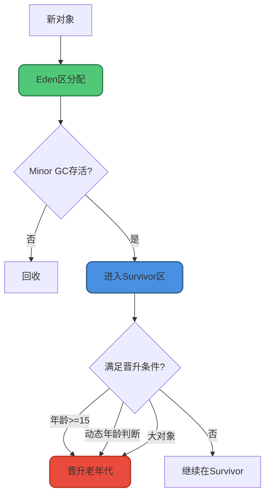
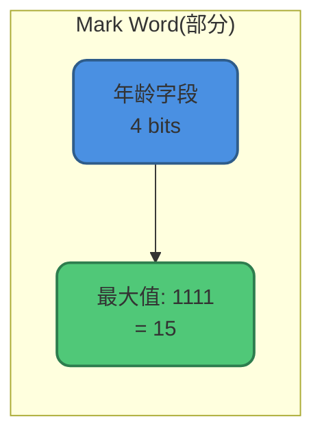
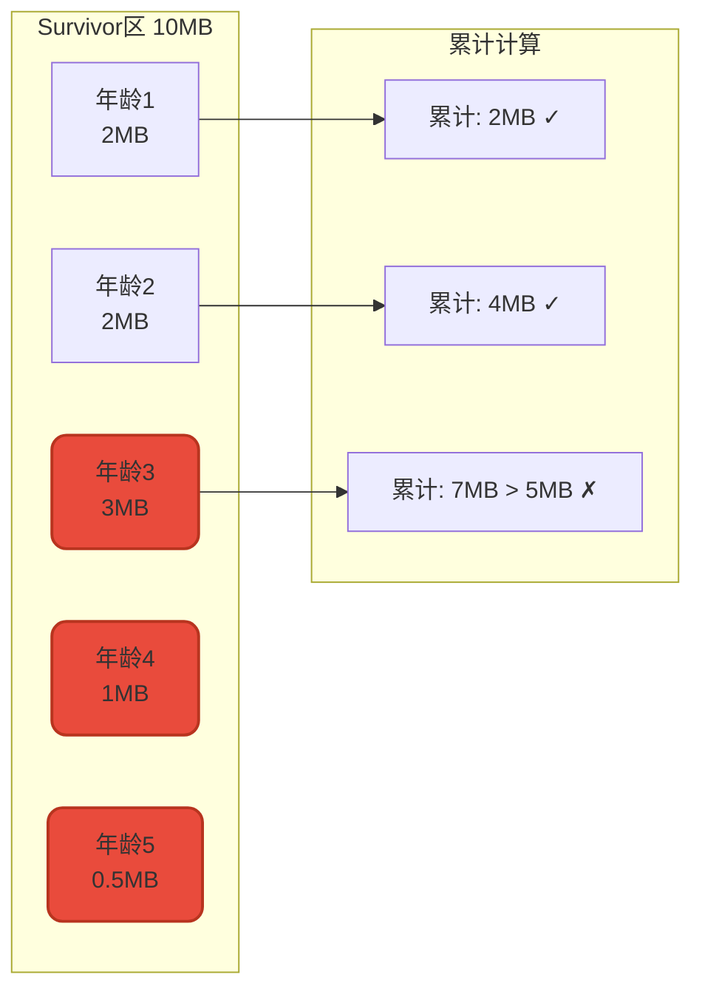
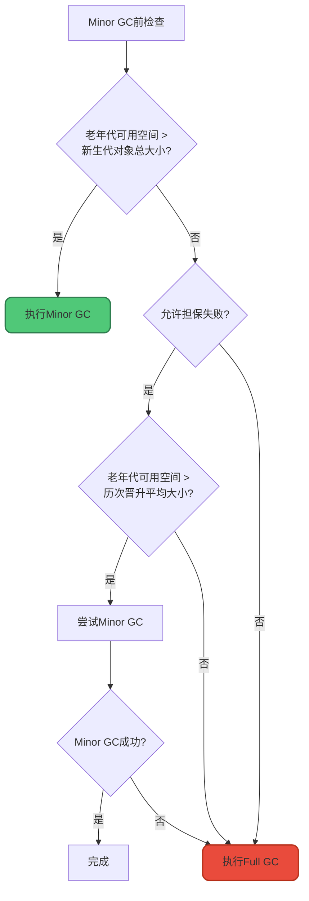

# 对象分代晋升规则

## 概述

在JVM的分代收集中，对象从新生代晋升到老年代有三个条件，满足任一即可：

1. **年龄阈值晋升**：对象年龄达到阈值
2. **动态年龄判断**：Survivor区对象累计大小超过阈值
3. **大对象直接进入老年代**：超过设定的大小阈值



## 年龄阈值晋升

### 基本规则

对象每经历一次Minor GC存活，年龄加1。当年龄达到阈值(默认15)时晋升老年代。

### 为什么年龄最大是15

因为对象头的Mark Word中，记录年龄的字段只有**4位**，最大值为`1111`(二进制) = 15(十进制)。



### 配置参数

```bash
# 设置晋升年龄阈值(有效范围: 0-15)
-XX:MaxTenuringThreshold=15
```

### 对象年龄变化过程

```java
public class ObjectAgeDemo {
    public static void main(String[] args) {
        // 创建对象，年龄为0
        Object obj = new Object();
        
        // 第1次Minor GC后存活，年龄变为1
        // 第2次Minor GC后存活，年龄变为2
        // ...
        // 第15次Minor GC后存活，年龄变为15
        // 年龄达到15，晋升到老年代
    }
}
```

## 动态年龄判断

### 常见误解

**错误理解**：年龄1+年龄2+...的对象大小超过Survivor区50%时，年龄大于等于最大年龄的对象进入老年代。

**正确理解**：从年龄小的对象开始累加大小，当累加到某个年龄N时，大小超过Survivor区的50%(TargetSurvivorRatio)，则将所有年龄**大于等于N**的对象晋升到老年代。

### 源码实现

```c
uint ageTable::compute_tenuring_threshold(size_t survivor_capacity) {
    // TargetSurvivorRatio默认为50
    size_t desired_survivor_size = (size_t)((((double)survivor_capacity) * TargetSurvivorRatio) / 100);
    
    size_t total = 0;
    uint age = 1;
    
    // 从年龄1开始累加
    while (age < table_size) {
        total += sizes[age];
        if (total > desired_survivor_size) break;  // 超过50%，停止
        age++;
    }
    
    // 取动态计算值和MaxTenuringThreshold的较小值
    uint result = age < MaxTenuringThreshold ? age : MaxTenuringThreshold;
    return result;
}
```

### 计算示例

假设Survivor区大小为10MB，TargetSurvivorRatio=50%，即阈值为5MB：

```
年龄分布:
年龄1: 2MB  (累计2MB < 5MB，继续)
年龄2: 2MB  (累计4MB < 5MB，继续)
年龄3: 3MB  (累计7MB > 5MB，停止!)

结果: 年龄>=3的所有对象晋升老年代
```



### 配置参数

```bash
# Survivor区目标使用率，默认50%
-XX:TargetSurvivorRatio=50
```

### 设计目的

动态年龄判断的目的是防止Survivor区溢出：
- 如果某些年龄段的对象特别多
- 等到年龄达到15才晋升可能导致Survivor区不够用
- 动态调整可以更灵活地管理内存

## 大对象直接进入老年代

### 基本规则

大对象指需要大量连续内存的对象，如长字符串或大数组。为避免在Eden区和Survivor区之间来回复制，大对象直接分配到老年代。

### 配置参数

```bash
# 设置大对象阈值(单位: 字节)
-XX:PretenureSizeThreshold=1048576  # 1MB
```

### 注意事项

**PretenureSizeThreshold默认为0**，即不启用该机制。大对象仍在Eden区分配，通过GC次数和动态年龄判断晋升。

**仅对Serial和ParNew收集器有效**，对Parallel Scavenge无效。

```java
public class LargeObjectDemo {
    public static void main(String[] args) {
        // 设置: -XX:PretenureSizeThreshold=1000000 (约1MB)
        
        // 小对象，在Eden区分配
        byte[] small = new byte[1024];  // 1KB
        
        // 大对象，直接进入老年代
        byte[] large = new byte[2 * 1024 * 1024];  // 2MB
    }
}
```

### 大对象的问题

频繁创建大对象会导致：
- 老年代快速填满
- 频繁触发Full GC
- 应用性能下降

```java
// 不推荐: 频繁创建大数组
public void badPractice() {
    for (int i = 0; i < 1000; i++) {
        byte[] data = new byte[10 * 1024 * 1024];  // 10MB
        process(data);
    }
}

// 推荐: 复用大数组
public void goodPractice() {
    byte[] data = new byte[10 * 1024 * 1024];  // 10MB
    for (int i = 0; i < 1000; i++) {
        Arrays.fill(data, (byte) 0);  // 清空复用
        process(data);
    }
}
```

## 空间分配担保

### 机制说明

在Minor GC前，JVM会检查老年代最大可用连续空间是否大于新生代所有对象总空间：

- 如果大于：Minor GC安全，直接执行
- 如果小于：检查是否允许担保失败



### 配置参数

```bash
# JDK 6 Update 24之前需要手动开启
-XX:+HandlePromotionFailure

# JDK 6 Update 24之后默认开启，此参数已失效
```

## 晋升规则总结

| 晋升条件 | 触发时机 | 配置参数 |
|---------|---------|---------|
| 年龄阈值 | 对象年龄达到阈值 | -XX:MaxTenuringThreshold=15 |
| 动态年龄 | Survivor累计超过50% | -XX:TargetSurvivorRatio=50 |
| 大对象 | 对象大小超过阈值 | -XX:PretenureSizeThreshold=0 |

## 实践建议

### 避免过早晋升

```bash
# 如果对象生命周期较短，可增大年龄阈值
-XX:MaxTenuringThreshold=15

# 增大Survivor区，容纳更多对象
-XX:SurvivorRatio=6  # Eden:S0:S1 = 6:1:1
```

### 避免大对象频繁创建

```java
// 使用对象池
public class ByteArrayPool {
    private static final ThreadLocal<byte[]> BUFFER = 
        ThreadLocal.withInitial(() -> new byte[1024 * 1024]);
    
    public static byte[] get() {
        return BUFFER.get();
    }
}
```

### 监控晋升情况

```bash
# 打印GC详情，观察晋升情况
-XX:+PrintGCDetails
-XX:+PrintTenuringDistribution
```

输出示例：
```
Desired survivor size 5242880 bytes, new threshold 7 (max 15)
- age   1:    1234567 bytes,    1234567 total
- age   2:     890123 bytes,    2124690 total
- age   3:     456789 bytes,    2581479 total
```

理解对象晋升规则对于JVM调优非常重要，可以帮助我们：
- 合理设置新生代和老年代大小
- 减少不必要的Full GC
- 提升应用性能
