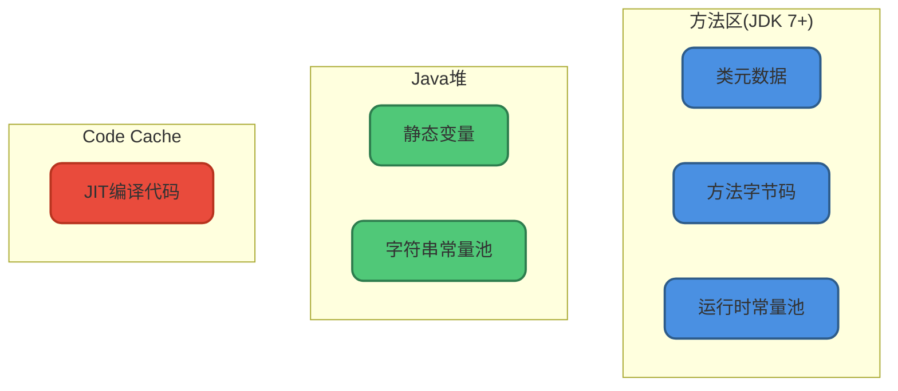
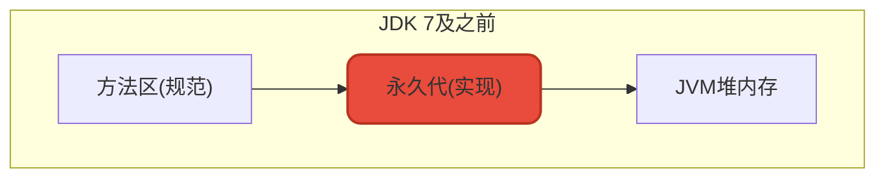
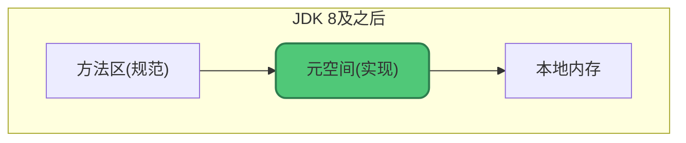
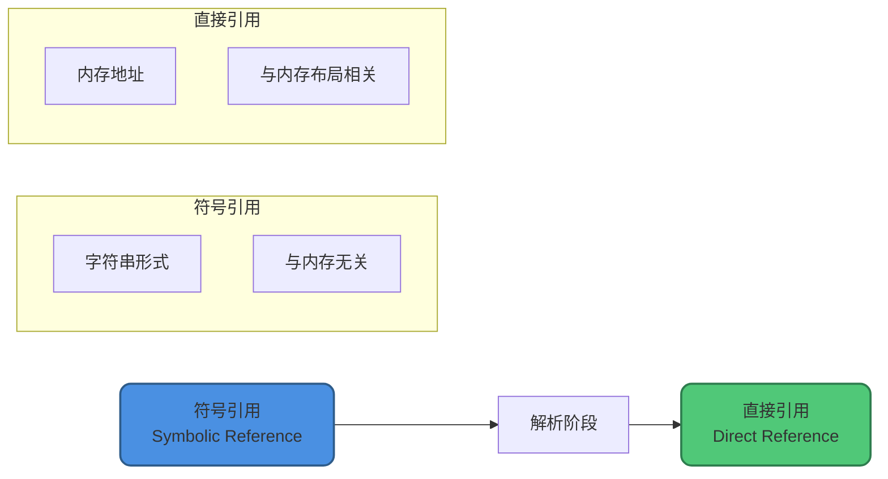

# 方法区与元空间

## 方法区核心概念

方法区(Method Area)是JVM规范中定义的一块**逻辑区域**，是所有线程共享的内存区域。

**《Java虚拟机规范》只规定了方法区的概念和作用，具体如何实现由虚拟机自己决定。** 不同虚拟机的实现差异很大。

## 方法区存储什么

当虚拟机加载一个类时，会将类的元数据存入方法区：

### 存储内容

**1. 类的元数据**

类的完整结构信息：
- 类名、父类、接口、访问修饰符
- 字段信息(名称、类型、修饰符)
- 方法信息(名称、参数、返回值、修饰符)

**2. 方法的字节码**

每个方法的原始指令序列。

**3. 运行时常量池**

由Class文件常量池转换而来，存放字面量和符号引用。

### 不在方法区的数据

以下数据**不在**方法区(JDK 7+)：

| 数据类型 | 存储位置 |
|---------|---------|
| 静态变量 | Java堆(与Class对象一起) |
| 字符串常量池 | Java堆 |
| JIT编译后的代码 | Code Cache |



## 方法区的实现演进

方法区是规范，永久代和元空间是HotSpot虚拟机的两种实现方式：

### JDK 1.8之前：永久代(PermGen)



**特点：**
- 使用JVM堆内存
- 大小固定，需要预先设置
- 容易出现`OutOfMemoryError: PermGen space`

### JDK 1.8及之后：元空间(Metaspace)



**特点：**
- 使用本地内存(Native Memory)
- 可以动态调整大小
- 理论上受限于系统可用内存

## 为什么用元空间替换永久代

### 1. 永久代大小固定

永久代大小在JVM启动时就确定，无法动态调整。如果加载的类太多，容易OOM。

```bash
# 永久代配置
-XX:PermSize=64m
-XX:MaxPermSize=128m
```

### 2. 元空间更灵活

元空间可以根据需要自动扩展，溢出几率更小。

```bash
# 元空间配置
-XX:MetaspaceSize=128m       # 初始高水位线
-XX:MaxMetaspaceSize=256m    # 最大大小(默认无限制)
```

### 3. 简化GC

永久代的GC效率低，只有Full GC才会回收。元空间的类卸载更加高效。

### 4. 统一虚拟机

合并HotSpot和JRockit时，JRockit没有永久代的概念，使用元空间便于统一。

## 永久代与元空间对比

| 特性 | 永久代(PermGen) | 元空间(Metaspace) |
|-----|----------------|------------------|
| JDK版本 | JDK 7及之前 | JDK 8及之后 |
| 内存位置 | JVM堆内存 | 本地内存 |
| 大小限制 | 固定大小 | 默认无限制 |
| GC触发 | Full GC | 达到阈值触发 |
| OOM类型 | PermGen space | Metaspace |
| 调优难度 | 需要预估大小 | 相对简单 |

## 元空间配置参数

### 基础参数

```bash
# 元空间初始大小(触发GC的阈值)
-XX:MetaspaceSize=128m

# 元空间最大大小(默认unlimited)
-XX:MaxMetaspaceSize=256m
```

### 高级参数

```bash
# 最小空闲比例，低于此值会扩容
-XX:MinMetaspaceFreeRatio=40

# 最大空闲比例，高于此值会缩容
-XX:MaxMetaspaceFreeRatio=70

# 压缩类空间大小(64位JVM，开启指针压缩时)
-XX:CompressedClassSpaceSize=1g
```

### 配置建议

**不建议不设置MaxMetaspaceSize**：如果不指定，元空间会耗尽所有可用系统内存！

```bash
# 生产环境推荐配置
-XX:MetaspaceSize=256m
-XX:MaxMetaspaceSize=512m
```

## 运行时常量池

### 核心概念

运行时常量池(Runtime Constant Pool)是方法区的一部分，由Class文件的常量池表转换而来。

Class文件的常量池表存放：

**1. 字面量(Literal)**

源代码中的固定值：
- 整数字面量：123
- 浮点字面量：3.14
- 字符串字面量："Hello"

**2. 符号引用(Symbolic Reference)**

- 类的全限定名：com/example/UserService
- 字段的名称和描述符：userName:Ljava/lang/String;
- 方法的名称和描述符：getUserById:(I)Lcom/example/User;

### 符号引用 vs 直接引用



**符号引用**：用一组符号描述引用的目标，与内存布局无关
**直接引用**：直接指向目标的指针、偏移量或句柄，与内存布局相关

在类加载的**解析阶段**，符号引用转换为直接引用。

```java
// 示例
public class OrderService {
    private UserService userService;  // 编译时：符号引用
    
    public void createOrder(int userId) {
        User user = userService.getUserById(userId);  // 运行时：直接引用
    }
}
```

## 方法区溢出

### 永久代溢出(JDK 7及之前)

```
java.lang.OutOfMemoryError: PermGen space
```

**常见原因：**
- 大量使用动态代理
- 频繁使用反射
- CGLib生成大量类
- JSP编译生成大量类

```java
// 模拟永久代溢出
public class PermGenOOM {
    public static void main(String[] args) {
        while (true) {
            Enhancer enhancer = new Enhancer();
            enhancer.setSuperclass(Object.class);
            enhancer.setUseCache(false);
            enhancer.setCallback((MethodInterceptor) (obj, method, args1, proxy) -> 
                proxy.invokeSuper(obj, args1));
            enhancer.create();  // 不断创建类
        }
    }
}
```

### 元空间溢出(JDK 8及之后)

```
java.lang.OutOfMemoryError: Metaspace
```

**解决方案：**

```bash
# 增大元空间大小
-XX:MaxMetaspaceSize=512m

# 或者检查是否有类加载器泄漏
```

## 方法区监控

### 使用JMX

```java
public class MetaspaceMonitor {
    public static void monitor() {
        for (MemoryPoolMXBean pool : ManagementFactory.getMemoryPoolMXBeans()) {
            if ("Metaspace".equals(pool.getName())) {
                MemoryUsage usage = pool.getUsage();
                long used = usage.getUsed();
                long max = usage.getMax();
                
                System.out.printf("元空间使用: %d MB, 最大: %s MB%n", 
                    used / 1024 / 1024, 
                    max == -1 ? "无限制" : max / 1024 / 1024);
            }
        }
    }
}
```

### 使用命令行工具

```bash
# 查看元空间使用情况
jstat -gcmetacapacity <pid>

# 查看类加载信息
jstat -class <pid>
```

## 类卸载条件

方法区的类不容易被回收，需要同时满足三个条件：

1. **该类的所有实例都已被回收**：堆中不存在该类及其子类的任何实例
2. **加载该类的ClassLoader已被回收**：通常难以达成
3. **该类的Class对象没有被引用**：无法通过反射访问该类

```java
public class ClassUnloadDemo {
    public static void main(String[] args) throws Exception {
        // 使用自定义类加载器
        CustomClassLoader loader = new CustomClassLoader();
        Class<?> clazz = loader.loadClass("com.example.TempClass");
        Object instance = clazz.newInstance();
        
        // 断开所有引用
        instance = null;  // 条件1: 实例被回收
        clazz = null;     // 条件3: Class对象无引用
        loader = null;    // 条件2: ClassLoader被回收
        
        System.gc();  // 提示GC，但不保证立即回收类
    }
}
```

## 最佳实践

### 1. 合理设置元空间大小

```bash
# 根据应用特点设置
-XX:MetaspaceSize=256m
-XX:MaxMetaspaceSize=512m
```

### 2. 监控元空间使用

定期监控元空间使用情况，及时发现类加载异常。

### 3. 避免类加载器泄漏

在使用自定义类加载器时，确保正确释放引用。

### 4. 使用合适的框架版本

选择对方法区友好的框架版本，避免创建过多的动态类。

理解方法区和元空间的工作原理，对于诊断类加载问题、优化JVM配置非常重要。
