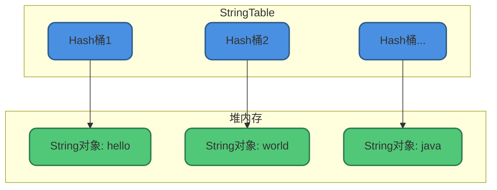
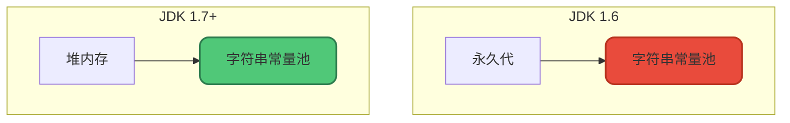
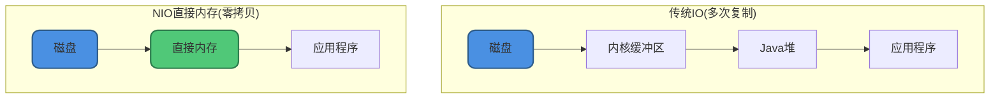
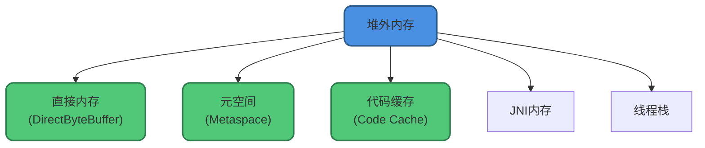

# 字符串常量池与直接内存

## 字符串常量池

### 核心概念

字符串常量池(String Pool)是JVM为了提升性能和减少内存消耗，专门为String类开辟的一块区域，主要目的是**避免字符串的重复创建**。

```java
// 字符串常量池示例
String s1 = "hello";  // 在字符串常量池中创建"hello"
String s2 = "hello";  // 直接返回字符串常量池中的"hello"
System.out.println(s1 == s2);  // true，指向同一个对象
```

### 实现原理

HotSpot虚拟机中，字符串常量池的实现是`StringTable`，可以理解为一个固定大小的`HashTable`：

- **Key**：字符串内容的哈希值
- **Value**：指向堆中String对象的引用



### 位置变迁

字符串常量池的位置在JVM演进中发生了变化：

| JDK版本 | 位置 | 说明 |
|--------|------|------|
| JDK 1.6 | 永久代 | GC效率低 |
| JDK 1.7+ | Java堆 | GC效率高 |

**为什么要移动？**

永久代的GC效率太低，只有Full GC才会回收。Java程序通常创建大量字符串，放在堆中能更高效及时地回收。



### String.intern()方法

`intern()`方法可以手动将字符串添加到常量池：

```java
public class InternDemo {
    public static void main(String[] args) {
        // 在堆中创建新的String对象
        String s1 = new String("hello");
        
        // 调用intern()尝试将字符串加入常量池
        String s2 = s1.intern();
        
        // 字面量形式，直接从常量池获取
        String s3 = "hello";
        
        System.out.println(s1 == s3);  // false，s1在堆中
        System.out.println(s2 == s3);  // true，都指向常量池
    }
}
```

**intern()工作机制：**
- 如果常量池中已存在相同内容的字符串，返回池中对象的引用
- 如果不存在，将当前字符串对象的引用添加到常量池(JDK 7+)

### StringTable配置

```bash
# 设置StringTable大小(桶的数量)
-XX:StringTableSize=60013  # 默认值取决于JVM版本

# JDK 7: 默认60013
# JDK 8+: 默认60013，最小1009
```

**配置建议：**
- 如果应用中有大量字符串常量，增大StringTableSize
- 减少哈希冲突，提升查找效率

## 直接内存

### 核心概念

直接内存(Direct Memory)并**不是**虚拟机运行时数据区的一部分，也不是《Java虚拟机规范》中定义的内存区域。但这部分内存也被频繁使用，且可能导致`OutOfMemoryError`。

### NIO与直接内存

JDK 1.4引入的**NIO(New I/O)**，基于**通道(Channel)**和**缓冲区(Buffer)**，可以使用Native函数库直接分配堆外内存，通过一个存储在Java堆中的`DirectByteBuffer`对象作为这块内存的引用。

```java
import java.nio.ByteBuffer;

public class DirectMemoryDemo {
    public static void main(String[] args) {
        // 分配1GB直接内存
        ByteBuffer buffer = ByteBuffer.allocateDirect(1024 * 1024 * 1024);
        System.out.println("直接内存分配成功");
        
        buffer.put((byte) 100);
        buffer.flip();
        System.out.println("读取数据: " + buffer.get());
    }
}
```

### 为什么使用直接内存

直接内存的最大优势是**避免了Java堆和Native堆之间的数据复制**，在某些场景下能显著提升性能：



**优势：**
- 减少一次内存复制
- 不受Java堆GC影响
- 适合大块数据的I/O操作

### 直接内存 vs 堆内存

| 特性 | 堆内存 | 直接内存 |
|-----|-------|---------|
| 分配方式 | ByteBuffer.allocate() | ByteBuffer.allocateDirect() |
| 内存位置 | JVM堆内存 | 本地内存 |
| GC影响 | 受GC管理 | 不受GC管理 |
| 分配速度 | 快 | 慢 |
| I/O性能 | 需要复制 | 零拷贝 |
| 管理方式 | 自动 | 需手动释放 |

### 直接内存配置

```bash
# 设置最大直接内存大小
-XX:MaxDirectMemorySize=256m

# 默认值等于-Xmx的值
```

### 直接内存溢出

```java
public class DirectMemoryOOM {
    public static void main(String[] args) {
        List<ByteBuffer> list = new ArrayList<>();
        while (true) {
            // 不断分配直接内存
            ByteBuffer buffer = ByteBuffer.allocateDirect(100 * 1024 * 1024);
            list.add(buffer);
        }
    }
}

// 输出: java.lang.OutOfMemoryError: Direct buffer memory
```

### 手动释放直接内存

```java
public class DirectMemoryRelease {
    public static void releaseDirectBuffer(ByteBuffer buffer) {
        if (buffer.isDirect()) {
            try {
                // 获取Cleaner并执行清理
                Method cleanerMethod = buffer.getClass().getMethod("cleaner");
                cleanerMethod.setAccessible(true);
                Object cleaner = cleanerMethod.invoke(buffer);
                
                if (cleaner != null) {
                    Method cleanMethod = cleaner.getClass().getMethod("clean");
                    cleanMethod.invoke(cleaner);
                }
            } catch (Exception e) {
                System.err.println("释放失败: " + e.getMessage());
            }
        }
    }
}
```

## 堆外内存

### 概念区分

**堆外内存**是指把内存对象分配在JVM堆外的内存，直接由操作系统管理。

**直接内存是堆外内存的一种**，但不完全等价：



### 使用场景

**适合使用直接内存的场景：**
- 大文件传输
- 网络I/O密集型应用
- 需要与Native代码交互

**不适合使用直接内存的场景：**
- 频繁创建小对象
- 需要频繁分配/释放内存
- 内存使用量较小

```java
// 大文件零拷贝传输
public class ZeroCopyTransfer {
    public void transferFile(String source, String target) throws IOException {
        try (FileChannel srcChannel = FileChannel.open(Paths.get(source), StandardOpenOption.READ);
             FileChannel destChannel = FileChannel.open(Paths.get(target), 
                 StandardOpenOption.WRITE, StandardOpenOption.CREATE)) {
            
            // 直接传输，不经过Java堆
            srcChannel.transferTo(0, srcChannel.size(), destChannel);
        }
    }
}
```

## 内存监控

### 监控直接内存

```java
public class DirectMemoryMonitor {
    public static void monitor() {
        // 通过MXBean获取
        BufferPoolMXBean directPool = ManagementFactory.getPlatformMXBeans(BufferPoolMXBean.class)
            .stream()
            .filter(pool -> "direct".equals(pool.getName()))
            .findFirst()
            .orElse(null);
        
        if (directPool != null) {
            System.out.printf("直接内存使用: %d MB%n", directPool.getMemoryUsed() / 1024 / 1024);
            System.out.printf("直接内存容量: %d MB%n", directPool.getTotalCapacity() / 1024 / 1024);
        }
    }
}
```

### 监控字符串常量池

```bash
# 打印StringTable统计信息
-XX:+PrintStringTableStatistics

# 输出示例
# StringTable statistics:
# Number of buckets       :     60013 =    480104 bytes, avg   8.000
# Number of entries       :     12345 =    296280 bytes, avg  24.000
# Number of literals      :     12345 =    567890 bytes, avg  46.000
```

## 最佳实践

### 字符串优化

```java
// 避免在循环中创建大量字符串
// 不推荐
String result = "";
for (int i = 0; i < 1000; i++) {
    result += "item" + i;  // 每次创建新对象
}

// 推荐
StringBuilder sb = new StringBuilder();
for (int i = 0; i < 1000; i++) {
    sb.append("item").append(i);
}
String result = sb.toString();
```

### 直接内存优化

```java
// 使用对象池复用DirectByteBuffer
public class DirectBufferPool {
    private static final int BUFFER_SIZE = 1024 * 1024;  // 1MB
    private static final Queue<ByteBuffer> pool = new ConcurrentLinkedQueue<>();
    
    public static ByteBuffer acquire() {
        ByteBuffer buffer = pool.poll();
        if (buffer == null) {
            buffer = ByteBuffer.allocateDirect(BUFFER_SIZE);
        }
        buffer.clear();
        return buffer;
    }
    
    public static void release(ByteBuffer buffer) {
        if (buffer != null && buffer.isDirect()) {
            pool.offer(buffer);
        }
    }
}
```

理解字符串常量池和直接内存的工作原理，对于编写高性能Java应用和进行内存调优非常重要。
