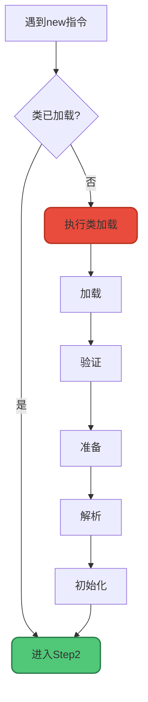
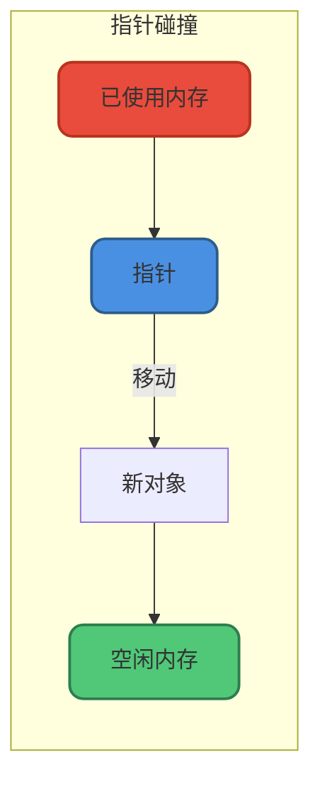
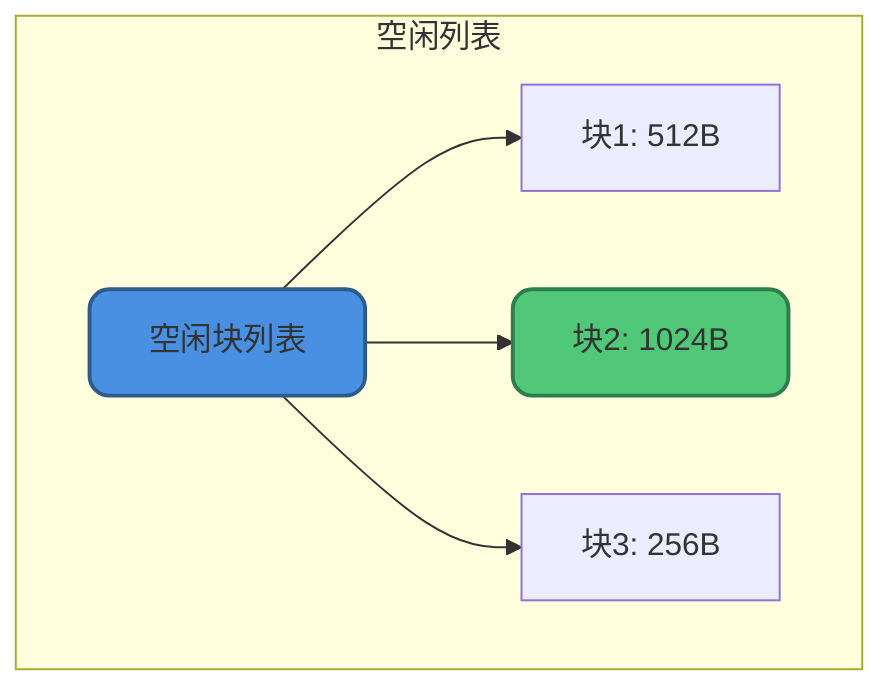
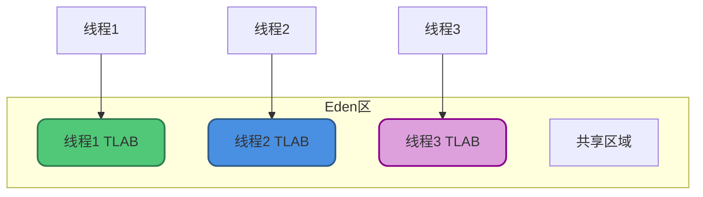
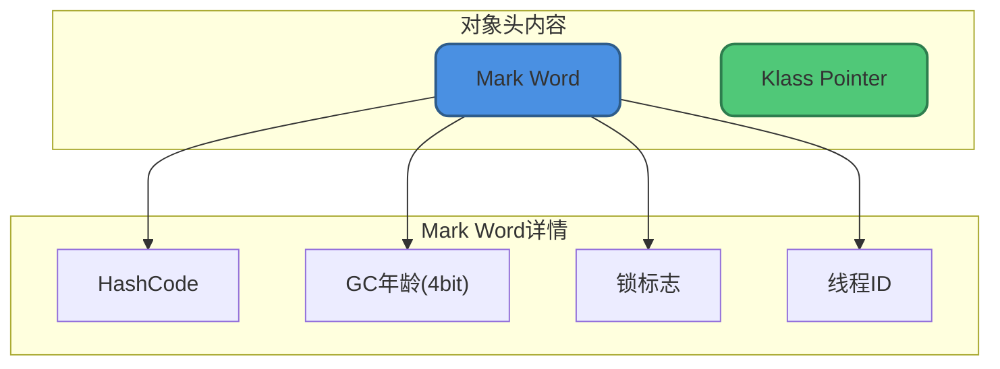
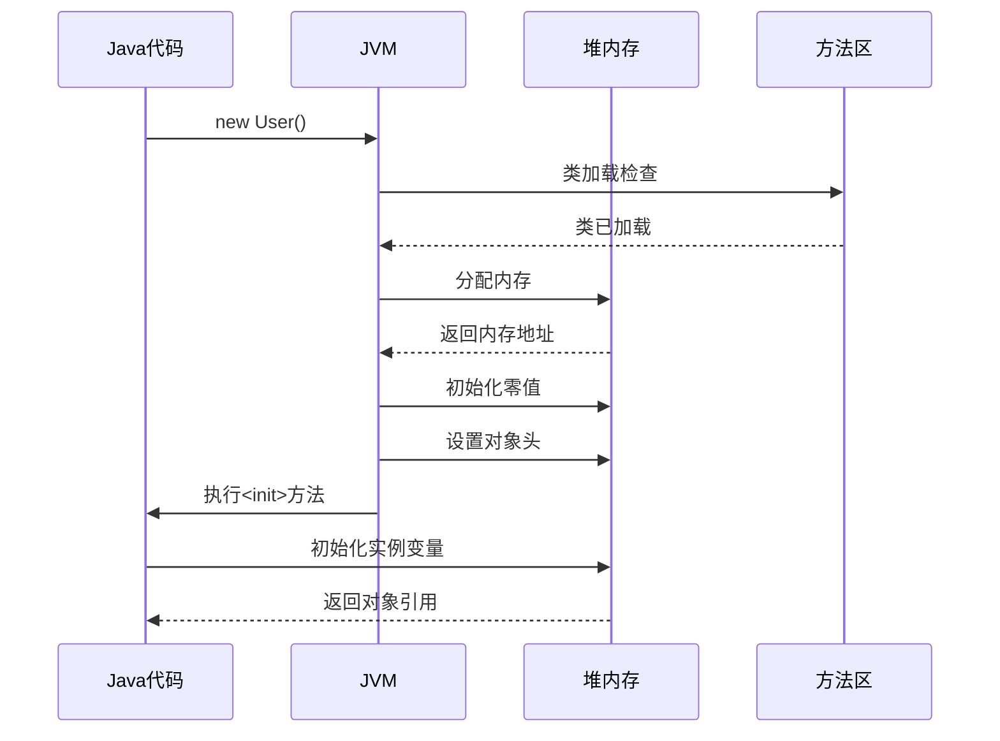

# 对象创建流程详解

## 概述

Java对象的创建是一个复杂而精妙的过程。当执行`new`指令时，JVM会经历五个关键步骤：


建议能够默写出这五个步骤，并理解每步虚拟机做了什么。

## Step1：类加载检查

虚拟机遇到`new`指令时，首先进行类加载检查：

1. 检查这个指令的参数能否在**常量池**中定位到类的**符号引用**
2. 检查这个符号引用代表的类是否已被**加载、解析和初始化**

如果类尚未加载，必须先执行类加载过程。

```java
// new指令触发类加载检查
User user = new User();  // 如果User类未加载，先执行类加载
```



## Step2：分配内存

类加载检查通过后，JVM在堆中为对象分配内存。对象所需内存大小在类加载完成后就已确定。

### 分配方式

分配方式取决于**Java堆是否规整**，而堆是否规整又取决于**GC收集器是否带压缩整理功能**：

#### 指针碰撞(Bump The Pointer)

**适用场景**：堆内存规整(无内存碎片)

**原理**：用过的内存放一边，未用的放另一边，中间一个指针作为分界。分配时只需移动指针即可。



**使用的GC**：Serial、ParNew等

#### 空闲列表(Free List)

**适用场景**：堆内存不规整(有内存碎片)

**原理**：维护一个列表，记录哪些内存块可用。分配时从列表中找足够大的内存块。



**使用的GC**：CMS等

### 并发安全保障

对象创建是高频操作，在并发环境下需要保证线程安全。HotSpot提供两种方式：

#### CAS + 失败重试

使用CAS(Compare And Swap)保证更新操作的原子性，失败则重试。

```java
// CAS伪代码
do {
    oldValue = memoryPointer;
    newValue = oldValue + objectSize;
} while (!CAS(memoryPointer, oldValue, newValue));
```

#### TLAB(Thread Local Allocation Buffer)

为每个线程在Eden区预先分配一小块私有内存(TLAB)，线程优先在自己的TLAB中分配对象，无需同步。



**TLAB配置**：

```bash
# 启用TLAB(默认开启)
-XX:+UseTLAB

# 设置TLAB大小
-XX:TLABSize=256k
```

## Step3：初始化零值

内存分配完成后，虚拟机将分配的内存空间初始化为零值(不包括对象头)。

这保证了对象的实例字段在Java代码中不赋初始值就能直接使用。

```java
public class User {
    private int age;      // 初始化为0
    private String name;  // 初始化为null
    private boolean active; // 初始化为false
    private double balance; // 初始化为0.0
    
    public void printAge() {
        System.out.println(age);  // 输出0，不会报错
    }
}
```

**各类型的零值**：

| 类型 | 零值 |
|-----|-----|
| int | 0 |
| long | 0L |
| float | 0.0f |
| double | 0.0d |
| boolean | false |
| char | '\u0000' |
| 引用类型 | null |

## Step4：设置对象头

虚拟机对对象进行必要的设置，这些信息存放在**对象头(Object Header)**：

- 对象是哪个类的实例
- 如何找到类的元数据信息
- 对象的哈希码(懒加载)
- 对象的GC分代年龄
- 锁状态标志
- 线程持有的锁
- 偏向线程ID
- 偏向时间戳



## Step5：执行init方法

从**虚拟机视角**，对象已经创建完成。

但从**Java程序视角**，对象创建才刚开始。执行`new`指令后会接着执行`<init>`方法，按程序员的意愿初始化对象。

```java
public class User {
    private String name;
    private int age;
    
    // <init>方法由构造方法生成
    public User(String name, int age) {
        this.name = name;  // Step5执行
        this.age = age;    // Step5执行
    }
}
```

**`<init>`方法包含：**
- 成员变量的显式赋值
- 构造代码块
- 构造方法体

```java
public class InitOrderDemo {
    // 1. 成员变量显式赋值
    private int value = 10;
    
    // 2. 构造代码块
    {
        System.out.println("构造代码块执行");
    }
    
    // 3. 构造方法
    public InitOrderDemo() {
        System.out.println("构造方法执行");
    }
}
```

## 创建过程时序



## 对象创建优化

### 逃逸分析优化

如果对象未逃逸出方法，JVM可能进行优化：

```java
// 未逃逸，可能被优化
public void process() {
    Point p = new Point(1, 2);
    int sum = p.x + p.y;
    System.out.println(sum);
}
```

**可能的优化：**
- **栈上分配**：对象在栈上分配，方法结束自动回收
- **标量替换**：对象拆解为基本类型，不创建对象

### TLAB优化

大部分对象在TLAB中分配，无需同步：

```bash
# 打印TLAB信息
-XX:+PrintTLAB

# 输出示例
# TLAB: gc thread: 0x00007f8b1800a800 [id: 12345] 
# desired_size: 1048576KB slow allocs: 5
```

## 对象创建的字节码

```java
public class User {
    private String name;
    
    public User(String name) {
        this.name = name;
    }
}
```

对应的字节码：

```
0: new           #2    // class User
3: dup                 // 复制栈顶引用
4: aload_1             // 加载参数
5: invokespecial #3    // 调用<init>方法
8: areturn             // 返回引用
```

| 指令 | 说明 |
|-----|------|
| new | 分配内存，执行Step1-4 |
| dup | 复制引用(一个用于赋值，一个用于调用构造方法) |
| invokespecial | 执行`<init>`方法，即Step5 |

## 常见问题

### 对象一定在堆上分配吗？

**不一定**。通过逃逸分析，未逃逸对象可能：
- 栈上分配
- 标量替换(不创建对象)

### 分配内存时如何保证线程安全？

两种方式：
1. CAS + 失败重试
2. TLAB(线程私有缓冲区)

### Step3零值初始化的意义？

保证对象字段有默认值，不需要显式初始化就能使用。

理解对象创建过程，对于分析性能问题、理解内存模型非常重要。
