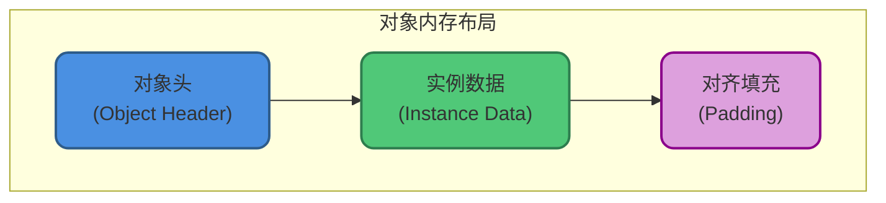
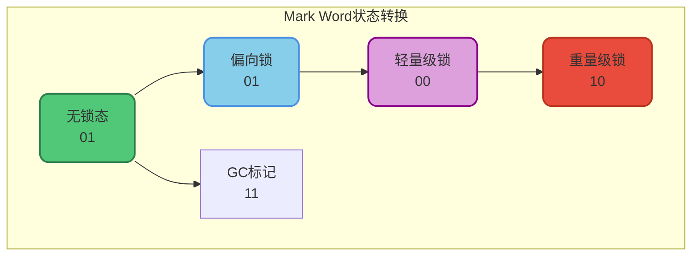
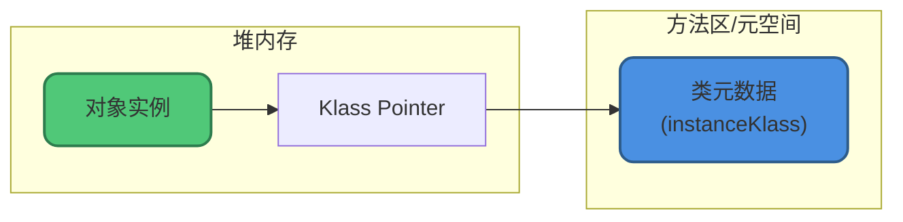
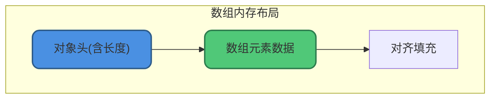

# 对象内存布局详解

## 概述

在HotSpot虚拟机中，对象在内存中的布局分为三部分：



## 对象头(Object Header)

对象头是对象在内存中最重要的部分，包含两个核心组成：

### Mark Word(标记字)

Mark Word存储对象自身的运行时数据：

- 哈希码(HashCode)
- GC分代年龄
- 锁状态标志
- 线程持有的锁
- 偏向线程ID
- 偏向时间戳

#### Mark Word的动态结构

Mark Word采用**动态复用**设计，在不同对象状态下存储不同的信息：

**64位虚拟机的Mark Word布局**：

| 对象状态 | 存储内容 | 标志位 |
|---------|---------|-------|
| 无锁态 | hashcode(31) + age(4) + biased(1) + lock(2) | 01 |
| 偏向锁 | threadId(54) + epoch(2) + age(4) + biased(1) + lock(2) | 01 |
| 轻量级锁 | 栈中锁记录指针(62) + lock(2) | 00 |
| 重量级锁 | Monitor指针(62) + lock(2) | 10 |
| GC标记 | 空 + lock(2) | 11 |



#### 为什么年龄最大是15

GC分代年龄字段只有**4位**，最大值为`1111`(二进制) = 15(十进制)。

### Klass Pointer(类型指针)

对象指向它的**类元数据**的指针，虚拟机通过这个指针确定对象是哪个类的实例。



**指针压缩**：

- 64位JVM默认开启指针压缩(`-XX:+UseCompressedOops`)
- 开启后Klass Pointer从8字节压缩到4字节
- 堆内存不超过32GB时有效

```bash
# 查看是否开启指针压缩
-XX:+PrintFlagsFinal | grep UseCompressedOops
```

### 数组长度(可选)

如果对象是数组，对象头还需要一块空间记录数组长度(4字节)。

## 对象头大小计算

| JVM类型 | 普通对象 | 数组对象 |
|---------|---------|---------|
| 32位 | 8字节 | 12字节 |
| 64位(压缩) | 12字节 | 16字节 |
| 64位(非压缩) | 16字节 | 20字节 |

## 实例数据(Instance Data)

实例数据是对象真正存储的有效信息，即程序中定义的各种类型的字段内容。

### 字段存储顺序

HotSpot虚拟机默认的分配策略：

1. **相同宽度的字段分配在一起**
   - long/double(8字节)
   - int/float(4字节)
   - short/char(2字节)
   - byte/boolean(1字节)
   - 引用类型(4或8字节)

2. **父类字段在子类字段之前**

3. **可通过参数调整**：`-XX:FieldsAllocationStyle`

```java
public class FieldLayoutDemo {
    // 字段定义顺序
    private boolean flag;      // 1字节
    private int count;         // 4字节
    private long timestamp;    // 8字节
    private String name;       // 引用4字节(压缩)
    
    // 实际内存布局(HotSpot优化后):
    // 1. long timestamp    (8字节) - 优先排列
    // 2. int count         (4字节)
    // 3. String name       (4字节引用)
    // 4. boolean flag      (1字节)
    // 5. 对齐填充          (3字节)
}
```

### 继承关系的字段布局

```java
public class Parent {
    private int parentValue;    // 4字节
    private long parentTime;    // 8字节
}

public class Child extends Parent {
    private int childValue;     // 4字节
    private String childName;   // 4字节引用
}

// Child对象的内存布局:
// 对象头: 12字节(64位压缩)
// Parent.parentTime: 8字节
// Parent.parentValue: 4字节
// Child.childValue: 4字节
// Child.childName: 4字节
// 对齐填充: 0字节
// 总计: 32字节
```

## 对齐填充(Padding)

### 为什么需要对齐

HotSpot要求对象起始地址必须是**8字节的整数倍**。

如果对象头+实例数据的总大小不是8的倍数，就需要对齐填充补全。

### 对齐的性能优势

- CPU一次读取对齐的内存更高效
- 避免跨缓存行访问导致的性能损失
- 支持CAS等原子操作

```java
// 对象大小计算示例
public class AlignmentDemo {
    private int value;  // 4字节
}

// 内存布局(64位JVM，开启指针压缩):
// 对象头: 12字节
// value: 4字节
// 总计: 16字节(已是8的倍数，无需填充)
```

```java
public class AlignmentDemo2 {
    private int value;      // 4字节
    private boolean flag;   // 1字节
}

// 内存布局:
// 对象头: 12字节
// value: 4字节
// flag: 1字节
// 对齐填充: 3字节(补齐到24字节)
// 总计: 24字节
```

## 使用JOL查看对象布局

**JOL(Java Object Layout)**是分析对象内存布局的工具：

```xml
<!-- Maven依赖 -->
<dependency>
    <groupId>org.openjdk.jol</groupId>
    <artifactId>jol-core</artifactId>
    <version>0.16</version>
</dependency>
```

```java
import org.openjdk.jol.info.ClassLayout;

public class JOLDemo {
    public static void main(String[] args) {
        Object obj = new Object();
        System.out.println(ClassLayout.parseInstance(obj).toPrintable());
    }
}
```

**输出示例**：

```
java.lang.Object object internals:
 OFFSET  SIZE   TYPE DESCRIPTION               VALUE
      0     4        (object header)           01 00 00 00
      4     4        (object header)           00 00 00 00
      8     4        (object header)           e5 01 00 f8
     12     4        (loss due to alignment)
Instance size: 16 bytes
```

### 分析更复杂的对象

```java
public class User {
    private int id;
    private String name;
    private boolean active;
    private long createTime;
}

public class JOLUserDemo {
    public static void main(String[] args) {
        User user = new User();
        System.out.println(ClassLayout.parseInstance(user).toPrintable());
    }
}
```

## 对象大小估算

### 估算公式

```
对象大小 = 对象头 + 实例数据 + 对齐填充
```

### 各类型占用空间

| 类型 | 大小 |
|-----|------|
| boolean | 1字节 |
| byte | 1字节 |
| char | 2字节 |
| short | 2字节 |
| int | 4字节 |
| float | 4字节 |
| long | 8字节 |
| double | 8字节 |
| 引用(压缩) | 4字节 |
| 引用(非压缩) | 8字节 |

### 估算示例

```java
public class Order {
    private long orderId;       // 8字节
    private int amount;         // 4字节
    private String status;      // 4字节引用
    private boolean paid;       // 1字节
    private Date createTime;    // 4字节引用
}

// 估算(64位JVM，开启压缩):
// 对象头: 12字节
// orderId: 8字节
// amount: 4字节
// status: 4字节
// createTime: 4字节
// paid: 1字节
// 总计: 33字节
// 对齐后: 40字节(补7字节)
```

## 数组的内存布局

数组对象比普通对象多一个**长度字段**：



```java
// int数组大小计算
int[] arr = new int[10];

// 内存布局(64位压缩):
// 对象头: 12字节
// 数组长度: 4字节
// 元素数据: 10 * 4 = 40字节
// 总计: 56字节(已是8的倍数)
```

## 优化建议

### 1. 减少对象大小

```java
// 不推荐: 字段顺序导致更多填充
public class BadOrder {
    private boolean flag;   // 1字节
    private long time;      // 8字节
    private int value;      // 4字节
}

// 推荐: 合理排列减少填充
public class GoodOrder {
    private long time;      // 8字节
    private int value;      // 4字节
    private boolean flag;   // 1字节
}
```

### 2. 使用合适的数据类型

```java
// 不推荐: 使用Long包装类
private Long count;  // 对象头 + 8字节值 = 24字节

// 推荐: 使用基本类型
private long count;  // 仅8字节
```

### 3. 开启指针压缩

```bash
# 确保开启指针压缩(默认开启)
-XX:+UseCompressedOops
```

理解对象内存布局，对于内存优化、性能调优和理解JVM内部机制非常重要。
