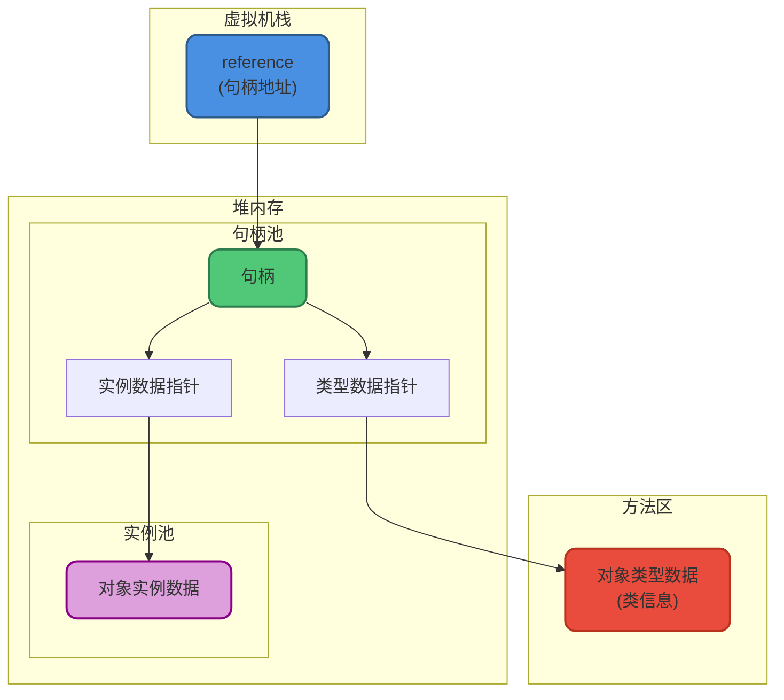
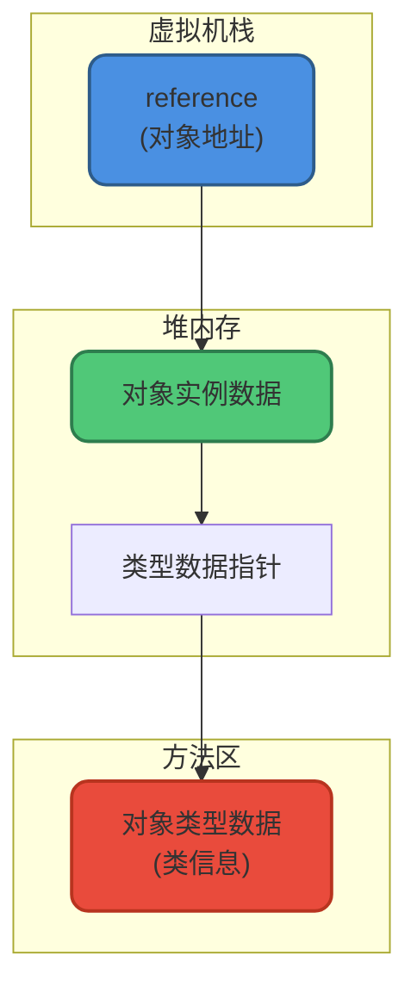
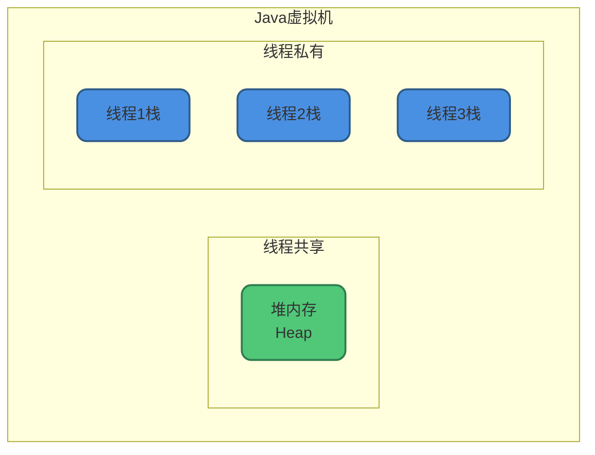
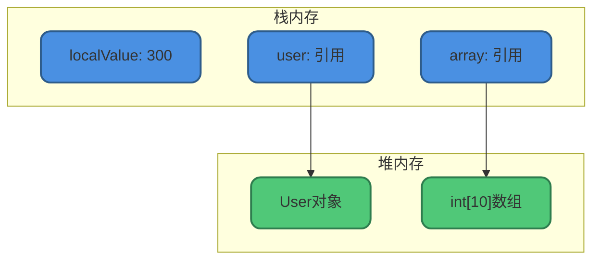
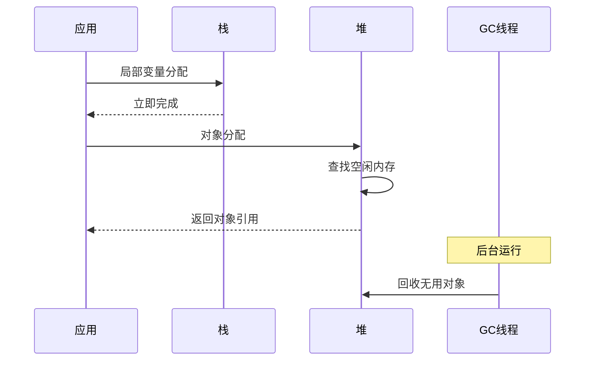
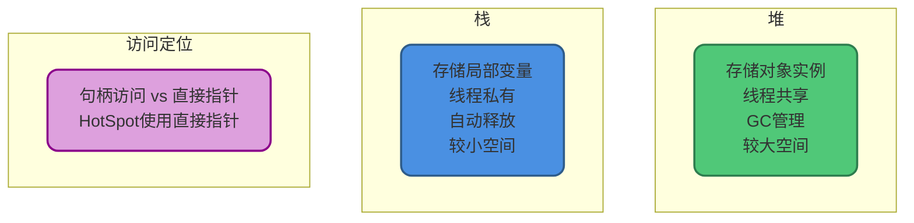

# 对象访问定位与堆栈区别

## 对象的访问定位

建立对象就是为了使用对象，Java程序通过栈上的`reference`数据来操作堆上的具体对象。

对象访问方式由虚拟机实现决定，主流方式有两种：

### 句柄访问

如果使用句柄，Java堆中会划分出一块内存作为**句柄池**，reference中存储对象的句柄地址，句柄包含对象实例数据和类型数据的地址。



**句柄访问的特点：**

| 优点 | 缺点 |
|-----|-----|
| 对象移动时只需修改句柄 | 需要两次指针定位 |
| reference本身不需改变 | 访问速度相对较慢 |
| GC时对象移动很常见 | 需要额外的句柄池空间 |

### 直接指针访问

如果使用直接指针，reference中存储的直接就是对象地址，对象实例数据中包含类型数据的指针。



**直接指针访问的特点：**

| 优点 | 缺点 |
|-----|-----|
| 访问速度快 | 对象移动时需要修改reference |
| 只需一次指针定位 | GC时需要更新所有引用 |
| 节省句柄池空间 | 实现相对复杂 |

### HotSpot的选择

**HotSpot虚拟机使用直接指针访问**。

原因：Java程序对对象的访问非常频繁，一次指针定位比两次更高效。虽然GC时需要更新引用，但现代GC算法已经很好地处理了这个问题。

### 访问方式对比

| 特性 | 句柄访问 | 直接指针 |
|-----|---------|---------|
| 定位次数 | 2次 | 1次 |
| 访问速度 | 较慢 | 较快 |
| GC友好度 | 更友好 | 一般 |
| 内存占用 | 需要句柄池 | 无额外开销 |
| HotSpot使用 | 否 | 是 |

## 堆与栈的区别

堆和栈是Java程序运行中的两大核心存储区域，它们的区别是面试高频考点。

### 基本对比



### 详细对比表

| 维度 | 堆(Heap) | 栈(Stack) |
|------|----------|-----------|
| **内存位置** | JVM堆内存 | JVM栈内存 |
| **存储内容** | 对象实例 | 局部变量、方法调用 |
| **线程共享** | 所有线程共享 | 线程私有 |
| **内存管理** | GC自动回收 | 方法执行完自动释放 |
| **大小** | 通常几百MB到几GB | 通常几百KB到几MB |
| **访问速度** | 相对较慢 | 相对较快 |
| **异常类型** | OutOfMemoryError | StackOverflowError |

### 代码示例

```java
public class HeapVsStackDemo {
    // 静态变量：方法区(JDK7+移到堆)
    private static int staticValue = 100;
    
    // 实例变量：堆
    private int instanceValue = 200;
    
    public void method() {
        // 局部变量：栈
        int localValue = 300;
        
        // 对象引用：栈(引用) + 堆(对象)
        User user = new User();
        
        // 数组：栈(引用) + 堆(数组对象)
        int[] array = new int[10];
    }
}
```



### 生命周期对比

**栈的生命周期**：

```java
public void stackLifecycle() {
    // 进入方法，创建栈帧
    int a = 10;  // 局部变量入栈
    int b = 20;  // 局部变量入栈
    
    if (a > 5) {
        int c = 30;  // 进入代码块，c入栈
        // 代码块结束，c出栈
    }
    
    // 方法结束，栈帧销毁，a、b自动释放
}
```

**堆的生命周期**：

```java
public void heapLifecycle() {
    User user1 = new User();  // 对象在堆中创建
    User user2 = new User();  // 另一个对象在堆中创建
    
    user1 = null;  // user1不再引用对象，但对象还在堆中
    // 等待GC回收user1原来指向的对象
    
    // 方法结束时:
    // - user2引用从栈中移除
    // - user2指向的对象仍在堆中，等待GC
}
```

### 内存分配效率

**栈分配更快**：
- 只需移动栈指针
- 无需查找空闲空间
- 无需GC参与

**堆分配相对较慢**：
- 需要查找合适的内存块
- 可能触发GC
- 需要同步(TLAB除外)



### 线程安全性

**栈：天然线程安全**
- 每个线程有自己的栈
- 局部变量不共享
- 无需同步

**堆：需要考虑线程安全**
- 对象可能被多线程访问
- 需要同步机制
- 可能出现竞态条件

```java
public class ThreadSafetyDemo {
    // 堆上的共享对象，需要同步
    private List<String> sharedList = new ArrayList<>();
    
    public void addItem(String item) {
        // 局部变量在栈上，线程安全
        String localItem = item + "_processed";
        
        // 访问共享对象，需要同步
        synchronized (sharedList) {
            sharedList.add(localItem);
        }
    }
}
```

## 常见面试问题

### Q1: 基本类型存储在哪里？

- **局部变量**：栈中
- **实例变量**：堆中(作为对象的一部分)
- **静态变量**：方法区/堆(JDK7+)

```java
public class PrimitiveLocation {
    // 静态变量：方法区(JDK7+在堆)
    private static int staticInt = 1;
    
    // 实例变量：堆(对象的一部分)
    private int instanceInt = 2;
    
    public void method() {
        // 局部变量：栈
        int localInt = 3;
    }
}
```

### Q2: String对象存储在哪里？

```java
// 字面量：字符串常量池(堆)
String s1 = "hello";

// new创建：堆(普通对象区域)
String s2 = new String("hello");

// intern()：返回常量池中的引用
String s3 = s2.intern();
```

### Q3: 数组存储在哪里？

```java
public void arrayLocation() {
    // 数组引用：栈
    // 数组对象：堆
    int[] array = new int[10];
    
    // 数组元素(基本类型)：堆(作为数组对象的一部分)
    array[0] = 100;
}
```

### Q4: 为什么堆比栈大？

- 堆存储所有对象实例，数量多、生命周期长
- 栈只存储方法调用信息和局部变量，生命周期短
- 堆是共享的，栈是线程私有的

## 总结



理解对象访问定位和堆栈区别，是掌握JVM内存模型的基础，也是面试中的高频考点。
