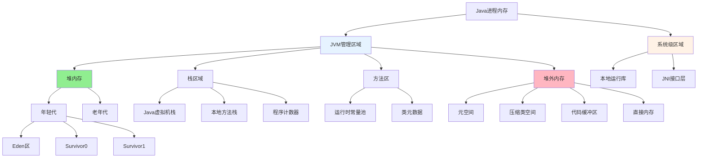
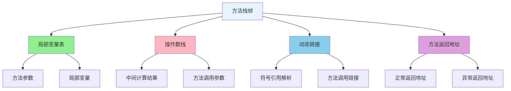
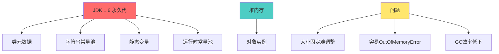
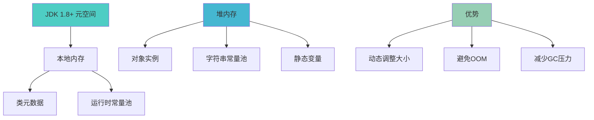

# Java进程内存结构详解

## Java进程的完整内存构成

Java应用程序运行时占用的内存空间远比我们通常关注的堆内存要复杂。一个完整的Java进程内存可以分为JVM管理的内存区域和系统级内存区域两大类。

### 内存区域全景图



## JVM内存区域详解

### 堆内存结构

堆内存是Java程序运行时最主要的内存区域,负责存储几乎所有的对象实例:

```java
// 企业人力资源管理系统
public class HRManagementSystem {
    
    public void processEmployeeData() {
        // 小对象分配在年轻代Eden区
        Employee newEmployee = new Employee("张明", 25);
        Department dept = new Department("技术部");
        
        // 大对象直接分配在老年代
        // 设置-XX:PretenureSizeThreshold=1KB
        StringBuilder largeReport = new StringBuilder(2048);
        for (int i = 0; i < 1000; i++) {
            largeReport.append("员工绩效数据记录").append(i).append("\n");
        }
        
        // 长期存活对象会晋升到老年代
        CacheManager.getInstance().putEmployee(newEmployee.getId(), newEmployee);
    }
}

// 缓存管理器 - 对象长期存活
class CacheManager {
    private static final CacheManager instance = new CacheManager();
    private Map<String, Employee> employeeCache = new HashMap<>();
    
    public static CacheManager getInstance() {
        return instance; // 静态实例在老年代长期存在
    }
}
```

**分代内存策略:**

| 区域 | 特点 | 存储对象类型 | GC频率 |
|------|------|--------------|--------|
| Eden区 | 新生代主要区域 | 新创建的对象 | 高频率Minor GC |
| Survivor区 | 暂存区域 | 经过1次GC的对象 | 随Minor GC |
| 老年代 | 长期存储 | 大对象或长寿对象 | 低频率Major GC |

### 栈区域

#### Java虚拟机栈

每个线程拥有独立的Java虚拟机栈,用于存储方法调用的上下文信息:

```java
// 金融交易处理系统
public class TransactionProcessor {
    
    public void processPayment(PaymentRequest request) {
        // 栈帧1: processPayment方法栈帧
        // 局部变量表: request, amount, account
        double amount = request.getAmount();
        Account account = getAccount(request.getAccountId());
        
        // 操作数栈: 存放中间计算结果
        // 动态链接: 指向运行时常量池中的方法引用
        // 方法返回地址: 记录调用位置
        
        validateTransaction(account, amount);
        executePayment(account, amount);
    }
    
    private void validateTransaction(Account account, double amount) {
        // 栈帧2: validateTransaction方法栈帧
        // 每次方法调用都创建新的栈帧
        if (account.getBalance() < amount) {
            throw new InsufficientFundsException("余额不足");
        }
        // 方法结束,栈帧销毁
    }
    
    private void executePayment(Account account, double amount) {
        // 栈帧3: executePayment方法栈帧
        account.debit(amount);
        logTransaction(account.getId(), amount);
    }
}
```

**栈帧组成部分:**



#### 本地方法栈

支持native方法的执行环境,与JNI调用密切相关:

```java
// 图像处理服务
public class ImageProcessor {
    
    // 声明native方法
    private native byte[] compressImageNative(byte[] imageData, int quality);
    
    // 静态块加载本地库
    static {
        System.loadLibrary("imageprocessor"); // 加载libimageprocessor.so
    }
    
    public byte[] compressImage(byte[] imageData, int quality) {
        // Java方法调用在Java虚拟机栈
        validateInput(imageData, quality);
        
        // native方法调用在本地方法栈
        return compressImageNative(imageData, quality);
        
        // C/C++实现的compressImageNative函数
        // 在本地方法栈中执行,有自己的栈帧结构
        // 处理完成后返回Java虚拟机栈
    }
}
```

### 方法区的演进历程

方法区用于存储类级别的元数据信息,其实现方式在不同JDK版本中有显著变化:

#### JDK 1.6及之前:永久代实现



#### JDK 1.7:部分迁移

```java
// 字符串常量池迁移示例
public class StringPoolMigration {
    
    public static void demonstrateStringPool() {
        // JDK 1.6: 以下字符串存储在永久代
        // JDK 1.7+: 字符串常量池迁移到堆内存
        
        String literal = "Hello World";  // 字符串字面量
        String intern1 = new String("Hello World").intern();
        
        // 1.7后的优势:
        // 1. 字符串可以被正常GC回收
        // 2. 避免永久代溢出
        // 3. 提高GC效率
        
        System.out.println(literal == intern1); // true
    }
    
    // 静态变量也在JDK 1.7中迁移到堆内存
    private static Map<String, Object> cache = new HashMap<>();
    
    static {
        // JDK 1.6: cache引用在永久代
        // JDK 1.7+: cache引用在堆内存
        cache.put("config", loadConfiguration());
    }
}
```

#### JDK 1.8+:元空间时代



**元空间特性:**

```java
// 企业级应用框架
public class FrameworkManager {
    
    // 动态类加载场景
    public void loadPlugins() {
        ClassLoader pluginLoader = new URLClassLoader(pluginUrls);
        
        for (String pluginClass : pluginClasses) {
            try {
                // 每个加载的类在元空间创建对应的元数据
                Class<?> clazz = pluginLoader.loadClass(pluginClass);
                
                // 元空间优势:
                // 1. 使用本地内存,不受-Xmx限制
                // 2. 自动扩展,避免固定大小限制
                // 3. 类卸载时自动回收元数据
                
                Object plugin = clazz.getDeclaredConstructor().newInstance();
                registerPlugin(plugin);
                
            } catch (Exception e) {
                log.error("插件加载失败: " + pluginClass, e);
            }
        }
    }
    
    // 元空间监控
    public void monitorMetaspace() {
        MemoryMXBean memoryMBean = ManagementFactory.getMemoryMXBean();
        
        // 获取元空间使用情况
        for (MemoryPoolMXBean pool : ManagementFactory.getMemoryPoolMXBeans()) {
            if ("Metaspace".equals(pool.getName())) {
                MemoryUsage usage = pool.getUsage();
                long used = usage.getUsed();
                long max = usage.getMax(); // -1表示无限制
                
                System.out.printf("元空间使用: %d MB, 最大: %s MB%n", 
                    used / 1024 / 1024, 
                    max == -1 ? "无限制" : max / 1024 / 1024);
            }
        }
    }
}
```

**元空间配置参数:**

| 参数 | 说明 | 默认值 |
|------|------|--------|
| -XX:MetaspaceSize | 初始高水位线 | 约20.8MB |
| -XX:MaxMetaspaceSize | 最大元空间大小 | 无限制 |
| -XX:MinMetaspaceFreeRatio | 最小空闲比例 | 40% |
| -XX:MaxMetaspaceFreeRatio | 最大空闲比例 | 70% |

## 堆外内存详解

堆外内存为Java应用提供了突破堆大小限制的能力,在高性能场景中应用广泛:

### 堆外内存组成

#### 元空间(Metaspace)
已在方法区章节详述,存储类的元数据信息。

#### 压缩类空间(Compressed Class Space)
在64位平台开启压缩指针时,专门存储类的元数据:

```java
// 大型Web应用服务器
public class WebServerManager {
    
    // 启用压缩指针配置:
    // -XX:+UseCompressedOops (对象指针压缩)
    // -XX:+UseCompressedClassPointers (类指针压缩)
    // -XX:CompressedClassSpaceSize=1G (压缩类空间大小)
    
    private Map<String, HttpHandler> handlerMap = new HashMap<>();
    
    public void registerHandlers() {
        // 创建大量Handler类,类元数据存储在压缩类空间
        handlerMap.put("/api/user", new UserApiHandler());
        handlerMap.put("/api/order", new OrderApiHandler());
        handlerMap.put("/api/product", new ProductApiHandler());
        
        // 优势:
        // 1. 32位指针引用64位地址空间内的类元数据
        // 2. 节省50%的指针存储空间
        // 3. 提高CPU缓存利用率
    }
}
```

#### 代码缓冲区(Code Cache)
存储JIT编译器生成的本地机器码:

```java
// 高频交易系统
public class HighFrequencyTrader {
    
    // 热点方法会被JIT编译成机器码
    public double calculatePrice(double basePrice, double volatility, int volume) {
        // 这个方法被频繁调用,JIT编译器会:
        // 1. 检测到这是热点代码
        // 2. 将字节码编译成本地机器码
        // 3. 存储在CodeCache中
        // 4. 后续调用直接执行机器码,性能大幅提升
        
        double adjustedPrice = basePrice * (1 + volatility / 100);
        double volumeDiscount = volume > 1000 ? 0.95 : 1.0;
        
        return adjustedPrice * volumeDiscount;
    }
    
    // 监控CodeCache使用情况
    public void monitorCodeCache() {
        for (MemoryPoolMXBean pool : ManagementFactory.getMemoryPoolMXBeans()) {
            if (pool.getName().contains("Code Cache")) {
                MemoryUsage usage = pool.getUsage();
                long usedMB = usage.getUsed() / 1024 / 1024;
                long maxMB = usage.getMax() / 1024 / 1024;
                
                System.out.printf("CodeCache使用: %d/%d MB (%.1f%%)%n",
                    usedMB, maxMB, (double) usedMB / maxMB * 100);
                
                // CodeCache满了会影响性能,JIT停止编译
                if (usedMB > maxMB * 0.9) {
                    System.out.println("警告: CodeCache即将用完!");
                }
            }
        }
    }
}
```

#### 直接内存(Direct Memory)
通过NIO的DirectByteBuffer使用的堆外内存:

```java
// 高性能文件传输服务
public class FileTransferService {
    
    public void transferLargeFile(String sourcePath, String targetPath) throws IOException {
        // 使用直接内存进行零拷贝传输
        int bufferSize = 1024 * 1024; // 1MB缓冲区
        ByteBuffer directBuffer = ByteBuffer.allocateDirect(bufferSize);
        
        try (FileChannel sourceChannel = FileChannel.open(Paths.get(sourcePath), StandardOpenOption.READ);
             FileChannel targetChannel = FileChannel.open(Paths.get(targetPath), 
                 StandardOpenOption.WRITE, StandardOpenOption.CREATE)) {
            
            while (sourceChannel.read(directBuffer) > 0) {
                directBuffer.flip();
                targetChannel.write(directBuffer);
                directBuffer.clear();
                
                // 优势:
                // 1. 避免Java堆与操作系统之间的内存拷贝
                // 2. 减少GC压力
                // 3. 提高I/O性能
            }
            
        } finally {
            // 手动清理直接内存
            if (directBuffer instanceof DirectBuffer) {
                ((DirectBuffer) directBuffer).cleaner().clean();
            }
        }
    }
    
    // 直接内存监控
    public void monitorDirectMemory() {
        // 通过JMX监控
        List<MemoryPoolMXBean> pools = ManagementFactory.getMemoryPoolMXBeans();
        
        // 或通过Unsafe获取(JDK内部方式)
        try {
            Class<?> vmClass = Class.forName("sun.misc.VM");
            Method maxDirectMemory = vmClass.getDeclaredMethod("maxDirectMemory");
            long maxDirect = (Long) maxDirectMemory.invoke(null);
            
            System.out.println("最大直接内存: " + maxDirect / 1024 / 1024 + " MB");
            
        } catch (Exception e) {
            // 处理反射异常
        }
    }
}
```

## 系统级内存区域

### 本地运行库

运行时链接的C/C++动态库占用的内存空间:

```java
// 图像处理本地库集成
public class NativeImageLibrary {
    
    static {
        // 加载本地库到进程空间
        System.loadLibrary("opencv");     // libopencv.so
        System.loadLibrary("tensorflow"); // libtensorflow.so
        System.loadLibrary("cuda");       // libcuda.so
        
        // 这些库的内存占用包括:
        // 1. 代码段: 库的机器指令
        // 2. 数据段: 全局变量和静态变量
        // 3. BSS段: 未初始化的静态变量
        // 4. 堆内存: 库运行时动态分配的内存
    }
    
    // GPU加速图像处理
    public native int[] processImageWithGPU(int[] imageData, int width, int height);
    
    // 深度学习模型推理
    public native float[] predictWithTensorFlow(float[] inputData);
    
    // 本地库内存使用特点:
    // 1. 不受JVM堆大小限制
    // 2. 由操作系统管理
    // 3. 需要手动管理内存释放
    // 4. 内存泄漏风险需要在本地代码中防范
}
```

### JNI接口层

Java与本地代码交互的桥梁,维护引用映射和类型转换:

```java
// 硬件设备控制系统
public class DeviceController {
    
    public boolean controlDevice(String deviceId, Map<String, Object> parameters) {
        // JNI调用涉及的内存操作:
        // 1. Java对象转换为C结构体
        // 2. 字符串编码转换(UTF-16 <-> UTF-8)
        // 3. 数组内存复制或固定(pinning)
        // 4. 异常信息在Java和C之间传递
        
        return nativeControlDevice(deviceId, parameters);
    }
    
    private native boolean nativeControlDevice(String deviceId, Map<String, Object> parameters);
    
    // JNI内存管理要点:
    // 1. JNI会为Java对象创建本地引用
    // 2. 全局引用需要手动释放
    // 3. 字符串和数组的临时拷贝
    // 4. 回调函数栈帧管理
}
```

## 内存监控与调优

### 完整内存视图监控

```java
// 内存监控仪表板
public class MemoryMonitor {
    
    public void generateMemoryReport() {
        MemoryMXBean memoryBean = ManagementFactory.getMemoryMXBean();
        
        // 堆内存使用情况
        MemoryUsage heapUsage = memoryBean.getHeapMemoryUsage();
        System.out.printf("堆内存: 已用 %d MB / 最大 %d MB%n",
            heapUsage.getUsed() / 1024 / 1024,
            heapUsage.getMax() / 1024 / 1024);
        
        // 非堆内存(元空间等)
        MemoryUsage nonHeapUsage = memoryBean.getNonHeapMemoryUsage();
        System.out.printf("非堆内存: 已用 %d MB%n",
            nonHeapUsage.getUsed() / 1024 / 1024);
        
        // 详细内存池信息
        for (MemoryPoolMXBean pool : ManagementFactory.getMemoryPoolMXBeans()) {
            MemoryUsage usage = pool.getUsage();
            if (usage != null) {
                System.out.printf("%s: %d MB%n",
                    pool.getName(),
                    usage.getUsed() / 1024 / 1024);
            }
        }
        
        // 进程总内存(包括本地库)
        OperatingSystemMXBean osBean = ManagementFactory.getOperatingSystemMXBean();
        if (osBean instanceof com.sun.management.OperatingSystemMXBean) {
            com.sun.management.OperatingSystemMXBean sunOsBean = 
                (com.sun.management.OperatingSystemMXBean) osBean;
            
            long processMemory = sunOsBean.getCommittedVirtualMemorySize();
            System.out.printf("进程总内存: %d MB%n", processMemory / 1024 / 1024);
        }
    }
}
```

### 内存优化建议

| 内存区域 | 优化策略 | 关键参数 |
|----------|----------|----------|
| 堆内存 | 合理设置新生代老年代比例 | -Xmx -Xms -XX:NewRatio |
| 元空间 | 预设合理初始大小 | -XX:MetaspaceSize |
| 直接内存 | 限制最大使用量 | -XX:MaxDirectMemorySize |
| 代码缓存 | 根据应用特点调整 | -XX:InitialCodeCacheSize |
| TLAB | 高并发场景优化 | -XX:TLABSize |

## 堆外内存深度应用

### 堆外内存与堆内存的本质差异

堆外内存允许Java程序直接使用操作系统管理的本地内存,在高性能场景中发挥关键作用:

**核心差异对比:**

| 特征维度 | 堆内存 | 堆外内存 |
|----------|--------|----------|
| 管理方式 | JVM自动管理 | 程序手动管理 |
| 垃圾回收 | 受GC影响 | 不受GC影响 |
| 大小限制 | 受-Xmx参数限制 | 受物理内存限制 |
| 访问性能 | 中等(需类型检查) | 高(直接内存访问) |
| 内存布局 | JVM控制 | 程序控制 |
| 数据持久性 | 临时性 | 可持久化 |
| 安全性 | JVM保护 | 需程序保证 |

### NIO DirectByteBuffer实现

DirectByteBuffer是Java NIO提供的堆外内存操作接口:

```java
// 高性能文件传输服务
public class HighPerformanceFileService {
    
    // 堆外内存零拷贝文件传输
    public void transferFileWithDirectMemory(String source, String target) throws IOException {
        try (FileInputStream fis = new FileInputStream(source);
             FileOutputStream fos = new FileOutputStream(target);
             FileChannel sourceChannel = fis.getChannel();
             FileChannel targetChannel = fos.getChannel()) {
            
            // 分配堆外内存缓冲区
            ByteBuffer directBuffer = ByteBuffer.allocateDirect(4 * 1024 * 1024); // 4MB
            
            try {
                while (sourceChannel.read(directBuffer) > 0) {
                    directBuffer.flip();
                    targetChannel.write(directBuffer);
                    directBuffer.clear();
                    
                    // 优势:
                    // 1. 数据直接在操作系统内存空间中传输
                    // 2. 避免Java堆到本地内存的拷贝
                    // 3. 减少CPU使用率和延迟
                    // 4. 不会触发GC,延迟更加可预测
                }
                
            } finally {
                // 重要: 手动释放堆外内存
                releaseDirectBuffer(directBuffer);
            }
        }
    }
    
    // 安全的堆外内存释放
    private void releaseDirectBuffer(ByteBuffer buffer) {
        if (buffer.isDirect()) {
            try {
                Method cleanerMethod = buffer.getClass().getMethod("cleaner");
                cleanerMethod.setAccessible(true);
                
                Object cleaner = cleanerMethod.invoke(buffer);
                if (cleaner != null) {
                    Method cleanMethod = cleaner.getClass().getMethod("clean");
                    cleanMethod.invoke(cleaner);
                }
                
            } catch (Exception e) {
                System.err.println("堆外内存手动释放失败,将依赖GC清理: " + e.getMessage());
            }
        }
    }
}
```

### Unsafe直接内存操作

Unsafe类提供了最底层的堆外内存操作能力:

```java
// 高性能数据结构实现
public class OffHeapHashMap<K, V> {
    
    private static final Unsafe unsafe;
    private final long baseAddress;
    private final int capacity;
    
    static {
        try {
            Field field = Unsafe.class.getDeclaredField("theUnsafe");
            field.setAccessible(true);
            unsafe = (Unsafe) field.get(null);
        } catch (Exception e) {
            throw new RuntimeException("无法获取Unsafe实例", e);
        }
    }
    
    public OffHeapHashMap(int capacity) {
        this.capacity = capacity;
        long totalSize = (long) capacity * 1024; // 每个桶1KB
        this.baseAddress = unsafe.allocateMemory(totalSize);
        unsafe.setMemory(baseAddress, totalSize, (byte) 0);
    }
    
    // 存储键值对到堆外内存
    public void put(K key, V value) {
        int hash = key.hashCode();
        int bucketIndex = Math.abs(hash % capacity);
        long bucketAddress = baseAddress + (long) bucketIndex * 1024;
        
        byte[] keyBytes = serializeObject(key);
        byte[] valueBytes = serializeObject(value);
        
        // 写入数据到堆外内存
        unsafe.putInt(bucketAddress, keyBytes.length);
        unsafe.copyMemory(keyBytes, Unsafe.ARRAY_BYTE_BASE_OFFSET, 
            null, bucketAddress + 4, keyBytes.length);
    }
    
    // 释放堆外内存
    public void close() {
        if (baseAddress != 0) {
            unsafe.freeMemory(baseAddress);
        }
    }
}
```

### 堆外内存应用场景

#### 分布式缓存系统

```java
// 基于堆外内存的本地缓存
public class OffHeapLocalCache {
    
    private final ConcurrentHashMap<String, OffHeapEntry> index;
    private final AtomicLong totalSize;
    private final long maxSize;
    
    public OffHeapLocalCache(long maxSizeBytes) {
        this.index = new ConcurrentHashMap<>();
        this.totalSize = new AtomicLong(0);
        this.maxSize = maxSizeBytes;
    }
    
    // 存储数据到堆外内存
    public boolean put(String key, byte[] value, long ttlMs) {
        // 检查内存容量
        if (totalSize.get() + value.length > maxSize) {
            evictExpiredEntries();
            if (totalSize.get() + value.length > maxSize) {
                evictLeastRecentlyUsed();
            }
        }
        
        // 分配堆外内存并写入数据
        long address = unsafe.allocateMemory(value.length);
        unsafe.copyMemory(value, Unsafe.ARRAY_BYTE_BASE_OFFSET, 
            null, address, value.length);
        
        long expireTime = System.currentTimeMillis() + ttlMs;
        OffHeapEntry entry = new OffHeapEntry(address, value.length, expireTime);
        
        index.put(key, entry);
        totalSize.addAndGet(value.length);
        return true;
    }
    
    // 从堆外内存读取数据
    public byte[] get(String key) {
        OffHeapEntry entry = index.get(key);
        if (entry == null || System.currentTimeMillis() > entry.expireTime) {
            return null;
        }
        
        byte[] result = new byte[entry.size];
        unsafe.copyMemory(null, entry.address, 
            result, Unsafe.ARRAY_BYTE_BASE_OFFSET, entry.size);
        
        return result;
    }
}
```

### 堆外内存监控与调优

```java
// 堆外内存监控工具
public class OffHeapMemoryMonitor {
    
    private final AtomicLong totalAllocated = new AtomicLong(0);
    private final AtomicLong totalFreed = new AtomicLong(0);
    
    // 监控内存分配
    public long monitoredAllocate(long size) {
        long address = unsafe.allocateMemory(size);
        if (address != 0) {
            totalAllocated.addAndGet(size);
            checkMemoryUsage();
        }
        return address;
    }
    
    // 内存使用量检查
    private void checkMemoryUsage() {
        long currentUsage = totalAllocated.get() - totalFreed.get();
        long systemFree = getSystemFreeMemory();
        
        if (currentUsage > systemFree * 0.8) {
            System.err.println("⚠️ 堆外内存使用量过高,触发清理策略");
            triggerCleanupStrategies();
        }
    }
    
    // 清理策略
    private void triggerCleanupStrategies() {
        System.gc(); // 清理DirectByteBuffer
        CacheManager.clearExpiredEntries();
    }
}
```

### 堆外内存配置与优化

**JVM参数配置:**

```bash
# 堆外内存相关参数
-XX:MaxDirectMemorySize=2G          # 限制DirectByteBuffer最大使用量
-XX:+DisableExplicitGC              # 禁用System.gc()调用
-XX:NativeMemoryTracking=detail     # 启用本地内存跟踪

# 性能优化参数
-XX:+UseLargePages                  # 启用大页内存
-XX:LargePageSizeInBytes=2m         # 设置大页大小
-XX:+AlwaysPreTouch                 # 预分配并初始化内存页
```

**最佳实践建议:**

| 实践建议 | 说明 | 适用场景 |
|----------|------|----------|
| 及时释放 | 确保每个分配都有对应的释放 | 所有堆外内存使用 |
| 池化管理 | 使用内存池减少分配开销 | 频繁分配小块内存 |
| 边界检查 | 防止内存访问越界 | 调试和安全要求高的场景 |
| 监控统计 | 跟踪内存使用量和泄漏 | 生产环境 |
| 错误处理 | 合理处理分配失败情况 | 高可用性要求 |
| 压力测试 | 模拟高负载下的内存行为 | 性能调优阶段 |

堆外内存技术为Java应用提供了突破传统内存限制的强大能力,在大数据处理、高频交易、分布式缓存等场景中可以显著提升性能。