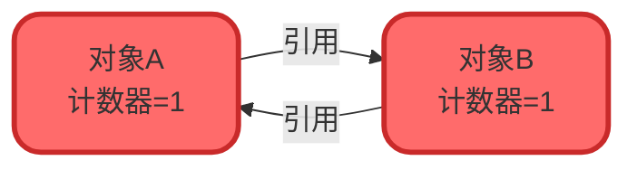
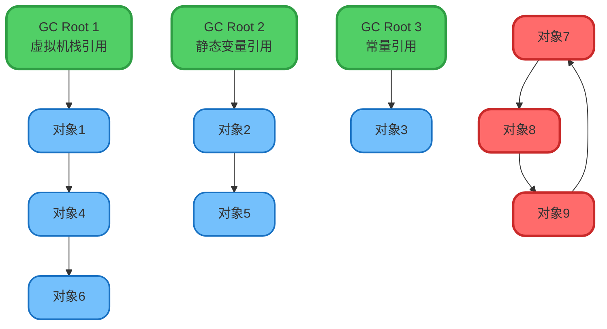
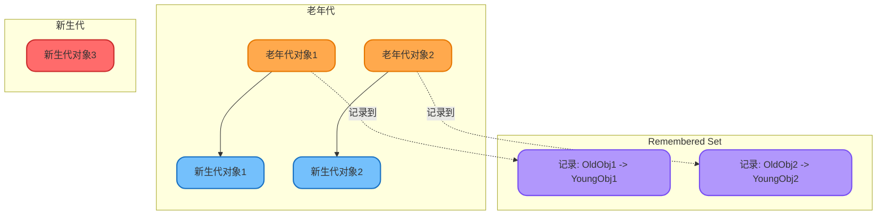
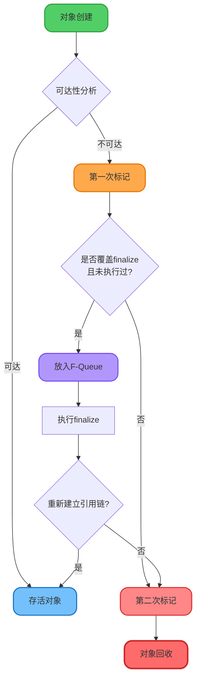
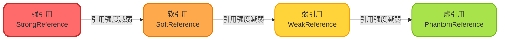

# 对象存活判断与GC Roots

## 对象存活性判断算法

JVM进行垃圾回收时,首先需要确定哪些对象已经"死亡",即不再被程序使用的对象。目前主要有两种判断算法:引用计数法和可达性分析算法。

### 引用计数法的原理与缺陷

引用计数法是一种简单直观的对象存活判断机制。其核心思想是:

- 为每个对象维护一个引用计数器
- 每当有新的引用指向该对象时,计数器加1
- 当某个引用失效时,计数器减1
- 计数器为0的对象即为可回收对象

**优点**: 实现简单,判断效率高,可以立即回收垃圾对象

**致命缺陷**: 无法解决循环引用问题



循环引用示例代码:

```java
public class CircularReferenceDemo {
    private CircularReferenceDemo reference;
    
    public static void main(String[] args) {
        CircularReferenceDemo objectA = new CircularReferenceDemo();
        CircularReferenceDemo objectB = new CircularReferenceDemo();
        
        // 形成循环引用
        objectA.reference = objectB;
        objectB.reference = objectA;
        
        // 断开外部引用
        objectA = null;
        objectB = null;
        
        // 此时两个对象互相引用,引用计数都为1,但实际已无法访问
    }
}
```

由于循环引用问题的存在,主流JVM(如HotSpot)并未采用引用计数法。

### 可达性分析算法

可达性分析是目前主流JVM采用的对象存活判断算法。该算法以一组称为"GC Roots"的对象作为起始点,从这些节点向下搜索,搜索走过的路径称为引用链(Reference Chain)。



**核心原理**: 如果一个对象到GC Roots之间没有任何引用链相连,则该对象不可达,可被回收。即使对象之间存在循环引用(如图中对象7、8、9),只要它们整体不可达,就会被回收。

### 哪些对象可以作为GC Roots

GC Roots是一组必须活跃的引用,主要包括以下几类:

#### 基本的GC Roots类型

1. **虚拟机栈中的引用**: 方法执行时的局部变量表中引用的对象
2. **本地方法栈中的引用**: Native方法中引用的对象(JNI引用)
3. **方法区中的类静态属性引用**: 类的static字段引用的对象
4. **方法区中的常量引用**: 常量池中引用的对象
5. **被同步锁持有的对象**: synchronized关键字持有的对象

```java
public class GCRootsDemo {
    // 方法区中的类静态属性引用
    private static GCRootsDemo staticObj;
    
    // 方法区中的常量引用
    private static final GCRootsDemo CONSTANT_OBJ = new GCRootsDemo();
    
    public void method() {
        // 虚拟机栈中的局部变量引用
        GCRootsDemo localObj = new GCRootsDemo();
        
        // 被同步锁持有的对象
        synchronized(localObj) {
            // localObj在synchronized块中,作为锁对象
        }
    }
}
```

#### 特殊的GC Roots: Remembered Set

为解决跨代引用问题,JVM引入了Remembered Set(记忆集)机制。Remembered Set也会被视为GC Roots的一部分,这在大多数八股文中很少被提及。

**跨代引用问题**: 新生代GC时,如果老年代对象引用了新生代对象,必须扫描整个老年代才能确保不遗漏,这会导致效率低下。

**Remembered Set解决方案**: 
- 记录从老年代指向新生代的引用关系
- 新生代GC时,只需扫描Remembered Set,无需遍历整个老年代
- Remembered Set中记录的引用也会作为GC Roots



### 对象的两次标记过程

即使在可达性分析中判定为不可达的对象,也不会立即被回收,而是要经历两次标记过程:

**第一次标记**: 可达性分析后,标记不可达对象

**筛选过程**: 判断对象是否有必要执行finalize()方法
- 如果对象未覆盖finalize()方法,直接回收
- 如果finalize()方法已被JVM调用过,直接回收

**第二次标记**: 将需要执行finalize()的对象放入F-Queue队列
- JVM会触发Finalizer线程执行finalize()方法
- 如果对象在finalize()中重新与引用链建立连接,则逃脱回收
- 否则,进行第二次标记,最终回收



:::warning 重要提示
从JDK 9开始,finalize()方法已被标记为废弃(Deprecated)。Oracle官方建议使用try-with-resources、Cleaner等机制替代finalize()。finalize()方法存在以下问题:
- 影响GC性能
- 执行时机不可控
- 可能导致安全问题
- 增加程序复杂度

因此,现代Java开发中应避免使用finalize()方法。
:::

## Java引用类型详解

JDK 1.2之前,Java的引用定义很传统:如果reference类型的数据存储的数值代表另一块内存的起始地址,就称这块内存代表一个引用。

JDK 1.2之后,Java将引用分为四种类型,引用强度依次减弱:强引用、软引用、弱引用、虚引用。



### 强引用(StrongReference)

强引用是程序代码中最普遍的引用方式,类似于"必需品"。

```java
// 创建强引用
Product product = new Product("Laptop");
```

**特性**:
- 只要强引用存在,垃圾回收器永远不会回收被引用的对象
- 即使内存不足导致OutOfMemoryError,JVM也不会回收强引用对象
- 显式将引用赋值为null可断开强引用

**应用场景**: 日常开发中大部分对象引用都是强引用

### 软引用(SoftReference)

软引用描述"有用但非必需"的对象,类似于"可选物品"。

```java
// 创建软引用
Product product = new Product("Tablet");
SoftReference<Product> softRef = new SoftReference<>(product);
product = null; // 断开强引用

// 获取软引用对象
Product retrieved = softRef.get();
```

**特性**:
- 内存充足时,不会回收软引用对象
- 内存不足时,垃圾回收器会回收软引用对象
- 可与ReferenceQueue配合,监控对象回收

**应用场景**: 实现内存敏感的缓存系统

```java
public class ImageCache {
    private Map<String, SoftReference<Image>> cache = new HashMap<>();
    
    public Image getImage(String path) {
        SoftReference<Image> ref = cache.get(path);
        Image image = (ref != null) ? ref.get() : null;
        
        if (image == null) {
            // 缓存未命中或已被回收,重新加载
            image = loadImageFromDisk(path);
            cache.put(path, new SoftReference<>(image));
        }
        return image;
    }
    
    private Image loadImageFromDisk(String path) {
        // 从磁盘加载图片
        return new Image(path);
    }
}
```

### 弱引用(WeakReference)

弱引用描述"非必需"的对象,比软引用更弱。

```java
// 创建弱引用
Product product = new Product("Phone");
WeakReference<Product> weakRef = new WeakReference<>(product);
product = null; // 断开强引用

// 下次GC时,弱引用对象将被回收
System.gc();
Product retrieved = weakRef.get(); // 可能返回null
```

**特性**:
- 无论内存是否充足,只要发生GC,就会回收弱引用对象
- 适合引用生命周期短暂的对象
- 可与ReferenceQueue配合使用

**应用场景**: ThreadLocal、WeakHashMap等

```java
// WeakHashMap示例
public class WeakHashMapDemo {
    public static void main(String[] args) {
        WeakHashMap<Product, String> map = new WeakHashMap<>();
        
        Product key1 = new Product("Monitor");
        Product key2 = new Product("Keyboard");
        
        map.put(key1, "Display Device");
        map.put(key2, "Input Device");
        
        key1 = null; // 断开强引用
        System.gc(); // 触发GC
        
        // key1对应的entry会被自动移除
        System.out.println(map.size()); // 可能输出1
    }
}
```

### 虚引用(PhantomReference)

虚引用是最弱的引用,形同虚设,不影响对象生命周期。

```java
// 创建虚引用(必须与ReferenceQueue关联)
Product product = new Product("Mouse");
ReferenceQueue<Product> queue = new ReferenceQueue<>();
PhantomReference<Product> phantomRef = new PhantomReference<>(product, queue);

// 虚引用的get()方法始终返回null
Product retrieved = phantomRef.get(); // 返回null
```

**特性**:
- get()方法永远返回null,无法通过虚引用获取对象
- 必须与ReferenceQueue配合使用
- 对象被回收前,虚引用会被加入关联的队列

**应用场景**: 跟踪对象回收状态,比finalize()更安全可控

```java
public class ResourceTracker {
    private static ReferenceQueue<LargeResource> queue = new ReferenceQueue<>();
    
    public void trackResource(LargeResource resource) {
        PhantomReference<LargeResource> ref = 
            new PhantomReference<>(resource, queue);
        
        // 启动监控线程
        new Thread(() -> {
            try {
                Reference<?> removedRef = queue.remove();
                // 对象即将被回收,执行清理操作
                System.out.println("Resource is being collected, cleanup...");
                performCleanup();
            } catch (InterruptedException e) {
                e.printStackTrace();
            }
        }).start();
    }
    
    private void performCleanup() {
        // 释放外部资源,如关闭文件句柄、网络连接等
    }
}
```

### 引用类型对比总结

| 引用类型 | 回收时机 | get()返回 | 主要用途 | 关联队列 |
|---------|---------|----------|---------|----------|
| 强引用 | 永不回收 | 原对象 | 常规对象引用 | 不支持 |
| 软引用 | 内存不足时 | 原对象或null | 内存敏感缓存 | 可选 |
| 弱引用 | GC发生时 | 原对象或null | 生命周期短的缓存 | 可选 |
| 虚引用 | 随时 | 始终为null | 对象回收监控 | 必须 |

:::tip 实践建议
在实际开发中,软引用使用最为广泛,可有效防止内存溢出。弱引用和虚引用使用相对较少,主要用于特定的框架设计场景。
:::

## 方法区的垃圾回收

### 废弃常量的判断

运行时常量池中的常量回收判断较为简单:

**判断标准**: 如果常量池中的某个常量(如字符串"hello")没有被任何对象引用,则该常量为废弃常量,可以被回收。

```java
String str = new String("hello"); // 常量池中创建"hello"
str = null; // 断开引用
// 此时"hello"成为废弃常量,GC时可能被清理
```

:::info 常量池位置变化
- JDK 1.7之前: 运行时常量池在方法区(永久代)
- JDK 1.7: 字符串常量池移至堆中,其他运行时常量仍在永久代
- JDK 1.8及以后: 永久代被元空间(Metaspace)替代,字符串常量池仍在堆中,运行时常量池在元空间
:::

### 无用类的判断

类的回收条件比常量严格得多,需同时满足以下三个条件:

1. **该类的所有实例都已被回收**: Java堆中不存在该类及其子类的任何实例
2. **加载该类的ClassLoader已被回收**: 通常难以达成
3. **该类的Class对象没有被引用**: 无法通过反射访问该类的方法

```java
// 示例:一个可能被回收的类
public class UnusedClassDemo {
    public static void main(String[] args) throws Exception {
        // 使用自定义类加载器加载类
        CustomClassLoader loader = new CustomClassLoader();
        Class<?> clazz = loader.loadClass("com.example.TempClass");
        
        // 创建实例
        Object instance = clazz.newInstance();
        
        // 断开所有引用
        instance = null;  // 条件1: 实例被回收
        clazz = null;     // 条件3: Class对象无引用
        loader = null;    // 条件2: ClassLoader被回收
        
        System.gc(); // 提示GC,但不保证立即回收类
    }
}
```

:::warning 注意
满足这三个条件的类仅仅是"可以"被回收,并非"必然"被回收。JVM可以选择不回收这些无用类。在大量使用反射、动态代理、CGLib等技术的场景下,需要JVM具备类卸载能力,以避免方法区溢出。
:::
