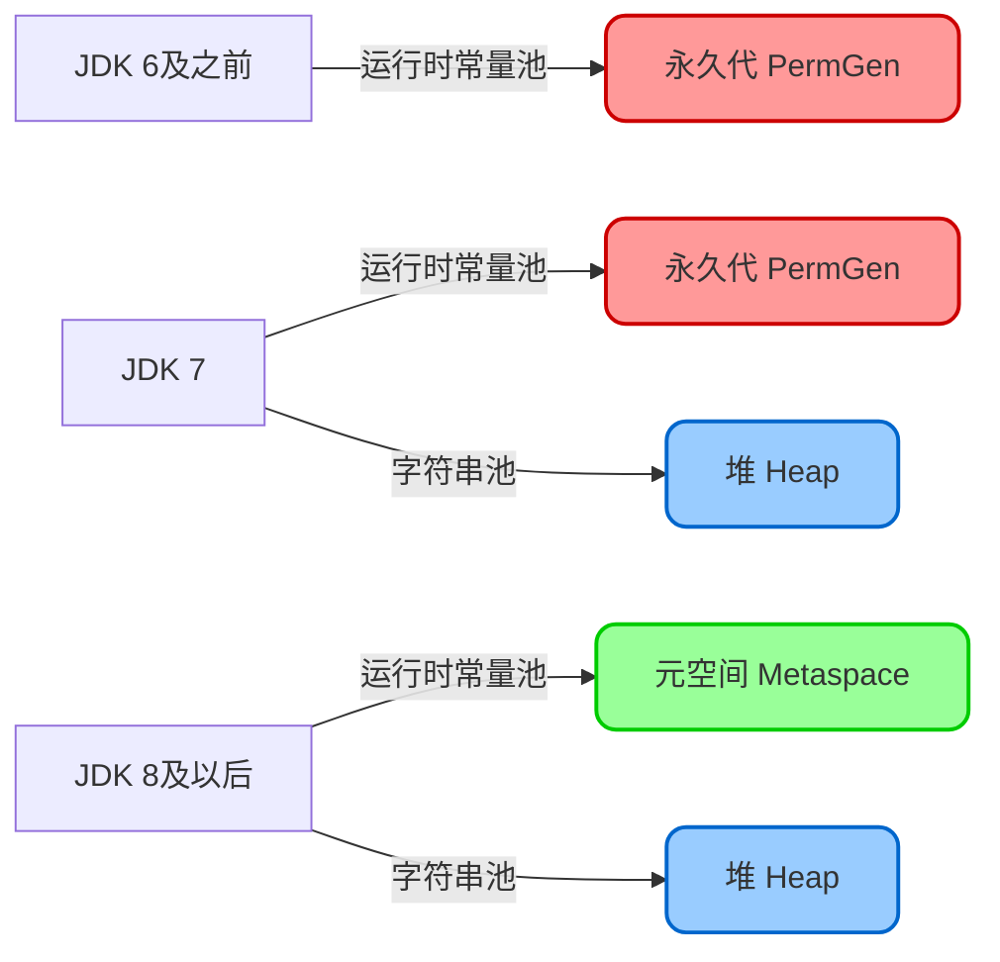
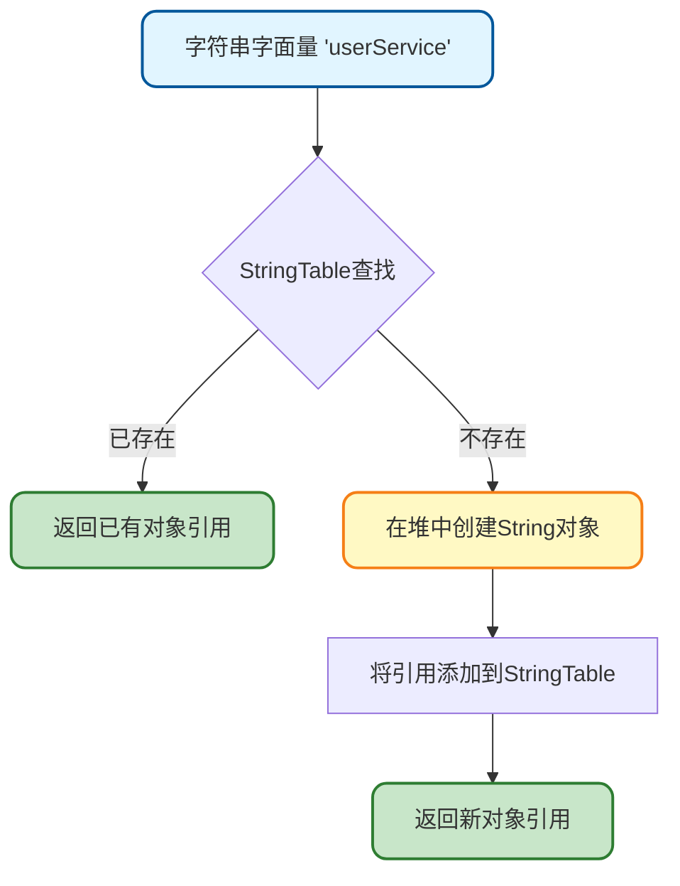
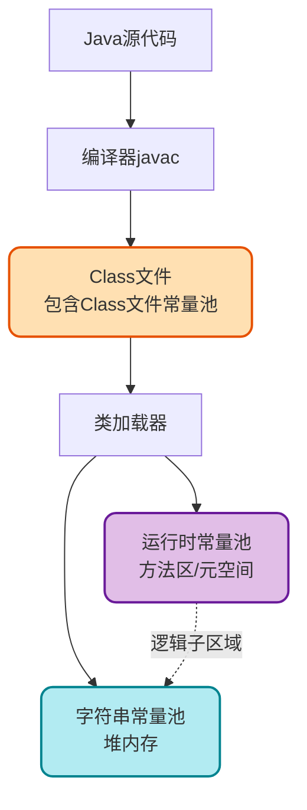

# 常量池机制与内存结构深度解析

## 常量池概述

在Java虚拟机的内存模型中，常量池是一个非常重要的概念，它涉及到多个层面的实现。理解常量池的机制，对于深入掌握Java内存管理和性能优化至关重要。

常量池主要包含三个核心概念：
- **Class文件常量池**：存在于编译后的字节码文件中
- **运行时常量池**：类加载后在JVM内存中的表现形式
- **字符串常量池**：专门用于管理字符串对象的特殊区域

## Class文件常量池详解

### 什么是Class文件常量池

Class文件常量池是字节码文件的核心组成部分，可以将其理解为编译期的资源存储中心。当Java源代码经过编译器编译后，会生成对应的`.class`文件，这个文件不仅包含类的基本信息（版本号、访问标识、字段描述、方法定义、接口列表等），还包含一个重要的数据结构——常量池表（Constant Pool Table）。

常量池表中主要存储两大类信息：

- **字面量（Literal）**：包括文本字符串、final修饰的常量值、基本数据类型的值等
- **符号引用（Symbolic References）**：包括类和接口的全限定名、字段的名称和描述符、方法的名称和描述符等

这些信息在编译阶段就已确定，为后续的类加载和动态链接提供了基础数据。

### 常量池的结构特点

Class文件常量池采用动态大小设计，不同的类文件包含的常量数量各不相同。为了标识常量池的大小，在常量池的入口位置使用2个字节的无符号整数作为容量计数器。

需要特别注意的是，这个计数器的索引是从1开始的，而不是传统编程中常见的从0开始。例如，如果常量池容量计数器的值为0x0011（十六进制），转换为十进制是17，这表示常量池中实际有16个常量项，索引范围是1到16。索引0被保留用于特殊用途，表示"不引用任何常量池项"。

### 查看Class文件常量池

要查看Class文件中的常量池内容，Java提供了便捷的命令行工具`javap`。使用以下命令可以详细查看字节码信息：

```bash
javap -v UserService.class
```

以一个用户服务类为例：

```java
public class UserService {
    private String serviceName = "用户管理服务";
    
    public void processUser(String username) {
        System.out.println("处理用户: " + username);
    }
}
```

执行`javap -v UserService.class`后，会看到类似如下的常量池信息：

```
Constant pool:
   #1 = Methodref          #6.#20         // java/lang/Object."<init>":()V
   #2 = String             #21            // 用户管理服务
   #3 = Fieldref           #5.#22         // UserService.serviceName:Ljava/lang/String;
   #4 = Fieldref           #23.#24        // java/lang/System.out:Ljava/io/PrintStream;
   #5 = Class              #25            // UserService
   ...
```

从这个输出可以看出，常量池中存储了方法引用、字符串常量、字段引用、类引用等多种类型的常量项，每个常量项都有唯一的索引编号。

### Class常量池与运行时常量池的关系

Class文件常量池是静态的、存储在磁盘上的数据结构，它本身并不参与程序的运行。当类加载器将Class文件加载到JVM时，Class文件中的常量池数据会被转换并存储到方法区的运行时常量池中。

这个转换过程不是简单的数据复制，而是包含了符号引用解析、字符串对象创建等复杂操作。可以说，Class文件常量池是常量数据的传输媒介和中转站，运行时常量池才是程序运行时真正使用的常量存储区域。

## 运行时常量池机制

### 运行时常量池的定义

运行时常量池（Runtime Constant Pool）是Java虚拟机规范中明确定义的一个逻辑内存区域，它属于方法区的一部分。当类加载器完成类的加载后，Class文件中的常量池信息会被解析并存入运行时常量池。

运行时常量池的主要作用包括：
- 存储类加载后的常量数据
- 保存编译期确定的数值型字面量
- 维护符号引用到直接引用的映射
- 存储运行期生成的常量（如String的intern()方法产生的字符串）

### 运行时常量池的存储位置演变

由于Java虚拟机规范只是定义了方法区的概念和作用，并没有规定其具体实现方式，因此不同版本的HotSpot虚拟机对方法区和运行时常量池的实现存在差异：

- **JDK 6及更早版本**：运行时常量池位于永久代（PermGen）中，与方法区的其他数据（类信息、静态变量等）共享永久代空间
- **JDK 7**：开始了方法区的改革，部分数据（如字符串常量池）被移出永久代，迁移到堆内存中
- **JDK 8及以后**：彻底移除了永久代，使用元空间（Metaspace）实现方法区，运行时常量池随之迁移到元空间，但字符串常量池仍保留在堆中



## 字符串常量池实现原理

### 字符串常量池的基本概念

字符串常量池（String Constant Pool）是JVM为了优化字符串对象的创建和存储而设计的一块特殊内存区域。由于字符串在Java程序中使用频率极高，如果每次创建字符串都生成新对象，将造成巨大的内存浪费。字符串常量池通过复用字符串对象，显著提升了内存利用率和程序性能。

字符串常量池的核心特性：
- **对象复用**：相同内容的字符串共享同一个对象
- **不可变性**：池中的字符串对象是不可变的（immutable）
- **自动管理**：编译器和JVM自动处理字符串的池化

### 字符串常量池的底层实现

在HotSpot虚拟机的实现中，字符串常量池采用了一个类似HashTable的数据结构来管理字符串对象。这个结构被称为StringTable，它的工作原理如下：

- 使用哈希表存储字符串的引用（而不是字符串对象本身）
- 键是字符串的哈希值，值是堆中String对象的引用
- 当需要获取一个字符串常量时，先计算哈希值，然后在StringTable中查找
- 如果找到，直接返回已存在的对象引用；如果未找到，则在堆中创建新对象并将引用添加到StringTable中



### 字符串常量池的存储位置变迁

字符串常量池的存储位置在JVM的演进过程中经历了重要变化：

**JDK 6及之前**：字符串常量池位于方法区的永久代中。这种设计存在明显问题，因为永久代的垃圾回收效率低下，只有在触发Full GC时才会进行清理。然而，Java应用中大量的字符串对象是临时性的（朝生夕死），这导致内存浪费和频繁的Full GC。

**JDK 7及之后**：字符串常量池被移至堆内存中。这一改变带来了显著优势：
- 堆内存的GC机制更加高效，可以更及时地回收不再使用的字符串对象
- Young GC就能回收字符串常量池中的临时对象，避免了等待Full GC
- 字符串对象与普通对象享受相同的内存管理策略，简化了内存管理

### 字符串常量的来源

字符串常量池中的字符串主要来源于以下几个途径：

**1. 字面量形式定义**

这是最常见的字符串常量来源。在代码中使用双引号定义的字符串会在编译阶段进入Class文件的常量池，在类加载时自动进入字符串常量池：

```java
public class OrderService {
    // 字面量字符串在编译期就确定，类加载时进入字符串常量池
    private String status = "订单已创建";
    
    public void printStatus() {
        // "订单处理中"也会进入字符串常量池
        String processing = "订单处理中";
        System.out.println(processing);
    }
}
```

**2. String.intern()方法**

String类提供的`intern()`方法允许程序员手动将字符串添加到字符串常量池中：

```java
public class ProductService {
    public void demonstrateIntern() {
        // 在堆中创建新的String对象
        String product1 = new String("笔记本电脑");
        
        // 调用intern()尝试将字符串加入常量池
        String product2 = product1.intern();
        
        // 字面量形式，直接从常量池获取
        String product3 = "笔记本电脑";
        
        // product2和product3指向常量池中的同一个对象
        System.out.println(product2 == product3); // true
        // product1指向堆中的对象，与常量池中的对象不同
        System.out.println(product1 == product3); // false
    }
}
```

`intern()`方法的工作机制：
- 如果字符串常量池中已存在内容相等的字符串，返回池中对象的引用
- 如果不存在，将当前字符串对象的引用添加到常量池中（JDK 7+）或复制一个新对象到池中（JDK 6），然后返回引用

**3. 编译期字符串常量计算**

在编译期就能确定结果的字符串表达式，编译器会直接将计算结果放入常量池：

```java
public class ConfigService {
    // 编译期常量折叠，结果直接进入常量池
    private static final String APP_NAME = "电商";
    private static final String MODULE = "支付";
    
    // 编译期可计算，"电商支付系统"直接进入常量池
    private static final String SYSTEM_NAME = APP_NAME + MODULE + "系统";
    
    public void demonstrateConstantFolding() {
        // 编译期计算，"配置管理"进入常量池
        String config = "配置" + "管理";
        
        // 运行期计算，不会进入常量池
        String timestamp = "配置" + System.currentTimeMillis();
    }
}
```

## 常量池之间的关系

### 逻辑关系图解

三种常量池在JVM内存模型中的关系可以用以下图示表达：



### 运行时常量池与字符串常量池的关系

根据Java虚拟机规范的定义，运行时常量池是方法区的逻辑组成部分，用于存储各类常量和符号引用。规范中明确指出，字符串字面量不应该在运行时常量池中重复存储，而应该实现复用机制。

在HotSpot虚拟机的具体实现中，为了满足这一要求，设计了字符串常量池这一专门的数据结构。虽然从物理位置看，字符串常量池（位于堆中）和运行时常量池（位于元空间）处于不同的内存区域，但从逻辑概念上，**字符串常量池应该被视为运行时常量池的一个逻辑子区域或分支池**。

这种设计体现了以下思想：
- **职责分离**：字符串常量池专门负责字符串对象的管理和复用
- **性能优化**：将高频使用的字符串对象放在堆中，利用更高效的GC机制
- **规范遵循**：满足JVM规范中关于字符串常量不重复存储的要求

可以将这种关系类比为：运行时常量池是整个常量管理系统，而字符串常量池是其中专门处理字符串类型常量的子系统。

### 三种常量池的关键区别

| 特性 | Class文件常量池 | 运行时常量池 | 字符串常量池 |
|------|----------------|-------------|-------------|
| **存在阶段** | 编译期 | 运行期 | 运行期 |
| **存储位置** | .class文件中 | 方法区/元空间 | 堆内存 |
| **存储内容** | 字面量和符号引用 | 常量和部分解析后的引用 | String对象引用 |
| **生命周期** | 永久（文件级） | 类加载后直到类卸载 | 对象级，受GC管理 |
| **是否可变** | 不可变（静态） | 相对固定（可动态添加） | 动态变化 |

## 实际应用场景

### 字符串拼接优化

了解常量池机制后，可以更好地优化字符串操作：

```java
public class StringOptimizationDemo {
    
    public void inefficientConcat() {
        String result = "";
        // 每次循环都创建新的String对象，效率低下
        for (int i = 0; i < 1000; i++) {
            result += "订单编号:" + i;
        }
    }
    
    public void efficientConcat() {
        StringBuilder sb = new StringBuilder();
        // 使用StringBuilder避免频繁创建String对象
        for (int i = 0; i < 1000; i++) {
            sb.append("订单编号:").append(i);
        }
        String result = sb.toString();
    }
    
    public void constantPoolReuse() {
        // 这两个变量指向常量池中的同一个对象
        String order1 = "待支付";
        String order2 = "待支付";
        System.out.println(order1 == order2); // true
        
        // new关键字强制在堆中创建新对象
        String order3 = new String("待支付");
        System.out.println(order1 == order3); // false
        
        // intern()返回常量池中的对象引用
        String order4 = order3.intern();
        System.out.println(order1 == order4); // true
    }
}
```

### 常量池内存调优

理解常量池机制有助于进行JVM参数调优：

```bash
# JDK 7及之后，字符串常量池在堆中，通过调整堆大小来优化
-Xms2g -Xmx2g

# JDK 6及之前，需要调整永久代大小
-XX:PermSize=256m -XX:MaxPermSize=512m

# 调整StringTable的大小（JDK 7+）
-XX:StringTableSize=1000003
```

## 常见问题与注意事项

### 字符串常量池的大小

字符串常量池的StringTable是有大小限制的，默认大小在不同JDK版本中有所不同。如果应用中使用了大量不同的字符串常量，可能需要通过`-XX:StringTableSize`参数调整StringTable的大小，以减少哈希冲突，提升查找效率。

### intern()方法的使用场景

`intern()`方法虽然可以手动将字符串加入常量池，但不应该滥用：
- **适合使用**：处理大量重复的字符串（如从数据库读取的枚举值、配置项等）
- **不适合使用**：处理唯一性字符串（如用户ID、订单号等），会导致常量池膨胀

### 常量池与内存泄漏

在JDK 6及之前，由于字符串常量池位于永久代，不当使用`intern()`方法可能导致永久代内存溢出（OutOfMemoryError: PermGen space）。JDK 7及之后，这个问题得到缓解，但仍需注意不要无限制地向字符串常量池中添加字符串。

## 总结

常量池机制是Java内存管理的重要组成部分，它通过三个层次的设计实现了常量的高效存储和复用：

- **Class文件常量池**作为编译期的常量存储容器，保存了编译时确定的字面量和符号引用
- **运行时常量池**是类加载后在JVM中的内存表示，随着方法区的实现方式变化而演进
- **字符串常量池**是专门优化字符串对象存储的机制，通过对象复用显著提升了性能

理解这三种常量池的概念、实现原理和相互关系，对于编写高性能Java代码、进行JVM调优和排查内存问题都具有重要意义。开发者应该：
- 合理利用字符串常量池的自动复用机制
- 在适当场景使用`intern()`方法
- 根据应用特点调整相关JVM参数
- 避免不当使用导致的内存问题

通过深入掌握常量池机制，可以更好地理解Java的内存模型，写出更高效、更健壮的代码。
