# JVM运行时内存区域详解

## 前言

对于Java程序员而言,JVM自动内存管理机制让我们不再需要像C/C++那样为每个new操作编写对应的delete/free代码,大大降低了内存泄漏和溢出的风险。然而,一旦出现内存相关问题,如果不了解JVM的内存管理机制,排查将会变得异常困难。

本文将深入剖析JVM运行时内存区域的组成、各区域的职责以及对象的创建和访问机制,帮助你全面理解JVM内存模型。

> 本文基于HotSpot虚拟机进行讲解,不同虚拟机的实现细节可能有所差异。

## 运行时数据区组成

JVM在执行Java程序时,会将管理的内存划分为若干个不同的数据区域。根据《Java虚拟机规范》的定义,运行时数据区主要包括:

- **程序计数器**(Program Counter Register)
- **Java虚拟机栈**(Java Virtual Machine Stack)
- **本地方法栈**(Native Method Stack)
- **Java堆**(Java Heap)
- **方法区**(Method Area)
- **运行时常量池**(Runtime Constant Pool)

其中,**堆、方法区和运行时常量池**是所有线程共享的内存区域,而**程序计数器、虚拟机栈和本地方法栈**是线程私有的。

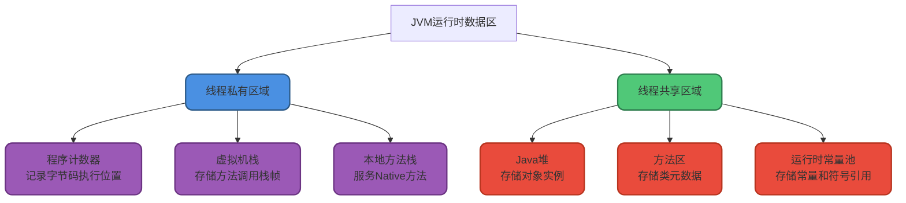

**JDK 1.7 vs JDK 1.8的差异**:

JDK 1.8相比1.7,最显著的变化是**永久代(PermGen)被元空间(Metaspace)取代**,元空间使用本地内存而非JVM堆内存。

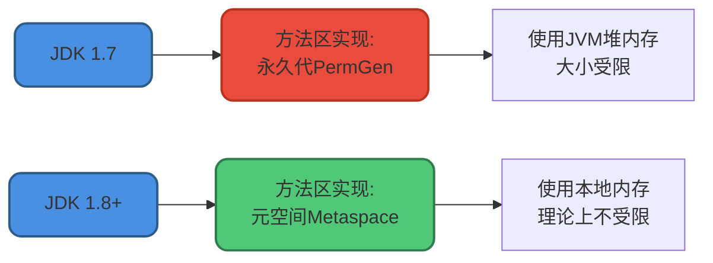

Java虚拟机规范对运行时数据区的定义相当宽松。以堆为例:堆可以是连续空间也可以不连续,大小可以固定也可以动态扩展,甚至可以不进行垃圾回收(虽然不现实)。这给虚拟机实现者提供了很大的灵活性。

## 程序计数器

### 核心概念

程序计数器(Program Counter Register)是一块较小的内存空间,可以看作**当前线程执行的字节码指令的行号指示器**。

字节码解释器通过改变程序计数器的值来选取下一条需要执行的字节码指令。程序的分支、循环、跳转、异常处理、线程恢复等基础功能都依赖程序计数器完成。

### 为什么需要程序计数器?

在多线程环境下,CPU会频繁切换线程执行。**为了线程切换后能恢复到正确的执行位置**,每个线程都需要一个独立的程序计数器。这就是为什么程序计数器是"线程私有"的内存。

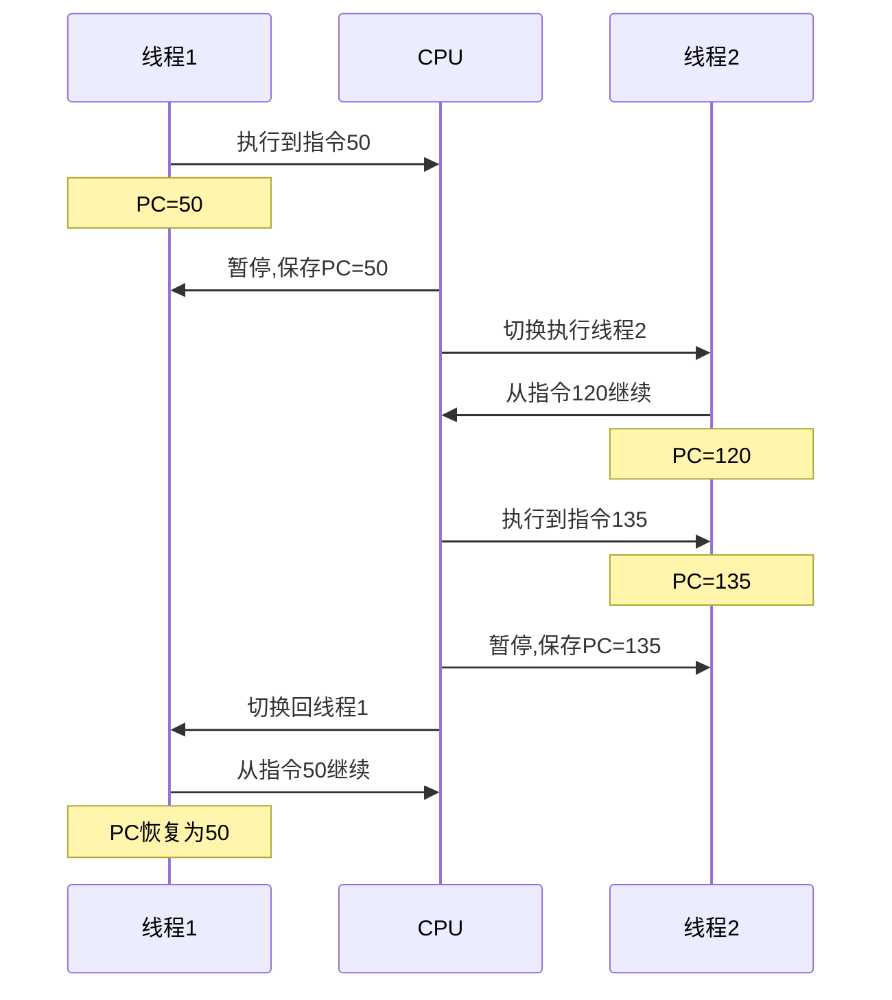

### 核心作用

1. **控制代码流程**:字节码解释器通过改变程序计数器实现顺序执行、选择、循环、异常处理等控制流
2. **线程切换恢复**:记录线程执行位置,切换回来时能知道上次运行到哪里

### 特殊性质

⚠️ **程序计数器是唯一不会出现`OutOfMemoryError`的内存区域**。它的生命周期随线程的创建而创建,随线程的结束而销毁。

## Java虚拟机栈

### 核心概念

Java虚拟机栈(Java Virtual Machine Stack)也是线程私有的,生命周期与线程相同。

虚拟机栈是JVM运行时数据区的核心,除了Native方法(通过本地方法栈实现),**所有Java方法调用都通过虚拟机栈实现**。

### 栈帧结构

方法调用的数据通过栈传递,**每次方法调用都会创建一个栈帧(Stack Frame)压入栈中,方法返回时栈帧弹出**。

栈帧包含四个核心组成部分:

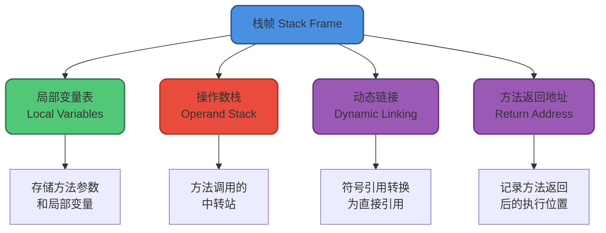

#### 局部变量表

局部变量表存放编译期可知的各种基本数据类型(boolean、byte、char、short、int、float、long、double)和对象引用(reference类型)。

**注意**:对象引用不等同于对象本身,它可能是:
- 指向对象起始地址的指针
- 指向对象的句柄
- 其他与对象相关的位置信息

#### 操作数栈

操作数栈主要用作方法调用的中转站,存放方法执行过程中产生的中间计算结果和临时变量。

#### 动态链接

动态链接是Java虚拟机实现**方法调用**的关键机制之一。

在Class文件中,方法调用以**符号引用**的形式存在于常量池。为了执行调用,这些符号引用必须转换为内存中的**直接引用**:

- **静态解析**:对于静态方法、私有方法等编译期就能确定版本的方法,在类加载的解析阶段完成转换
- **动态链接**:对于需要根据对象实际类型才能确定的虚方法(多态的基础),在运行时完成转换

```java
// 示例:动态链接支持多态
public class PaymentService {
    public void process(Payment payment) {
        payment.pay();  // 编译时:符号引用,运行时:动态链接到实际类型的pay方法
    }
}

class CreditCardPayment implements Payment {
    public void pay() { System.out.println("信用卡支付"); }
}

class AlipayPayment implements Payment {
    public void pay() { System.out.println("支付宝支付"); }
}
```

### 可能出现的错误

虚拟机栈可能出现两种错误:

1. **`StackOverflowError`**:栈深度超过虚拟机允许的最大深度(如无限递归)
2. **`OutOfMemoryError`**:栈动态扩展时无法申请到足够的内存

```java
// StackOverflowError示例
public class StackOverflowDemo {
    private int stackDepth = 0;
    
    public void recursiveCall() {
        stackDepth++;
        recursiveCall();  // 无限递归,最终导致栈溢出
    }
    
    public static void main(String[] args) {
        StackOverflowDemo demo = new StackOverflowDemo();
        try {
            demo.recursiveCall();
        } catch (StackOverflowError e) {
            System.out.println("栈深度: " + demo.stackDepth);
            // 输出: 栈深度: 约10000+ (具体值取决于-Xss参数)
        }
    }
}
```

## 本地方法栈

本地方法栈(Native Method Stack)与虚拟机栈作用类似,区别在于:

- **虚拟机栈**:为执行Java方法(字节码)服务
- **本地方法栈**:为执行Native方法(通常用C/C++编写)服务

在HotSpot虚拟机中,本地方法栈和Java虚拟机栈合二为一。

本地方法执行时也会创建栈帧,存储局部变量表、操作数栈、动态链接、返回地址等信息。同样可能出现`StackOverflowError`和`OutOfMemoryError`。

```java
// Native方法示例
public class NativeMethodDemo {
    // 声明native方法
    public native void systemCall();
    
    static {
        // 加载本地库
        System.loadLibrary("nativedemo");
    }
}
```

## Java堆

### 核心概念

Java堆是JVM管理的内存中**最大的一块**,也是**所有线程共享的内存区域**,在虚拟机启动时创建。

**堆的唯一目的就是存放对象实例,几乎所有的对象实例和数组都在这里分配内存。**

### 不是"所有"对象都在堆上?

随着JIT编译器和逃逸分析技术的成熟,一些优化技术可能改变对象的分配位置:

- **栈上分配**:如果对象未逃逸出方法,可以直接在栈上分配
- **标量替换**:将对象拆解为基本类型,直接在栈上分配

从JDK 1.7开始默认开启逃逸分析(`-XX:+DoEscapeAnalysis`)。

```java
// 逃逸分析示例
public class EscapeAnalysisDemo {
    public static void main(String[] args) {
        for (int i = 0; i < 10000000; i++) {
            createUser();
        }
    }
    
    // user对象未逃逸出方法,可能在栈上分配
    private static void createUser() {
        User user = new User("张三", 25);
        System.out.println(user.getName());
    }
}
```

### 堆的分代结构

堆是垃圾收集器管理的主要区域,也称**GC堆(Garbage Collected Heap)**。

由于现代垃圾收集器基本都采用**分代收集算法**,堆被划分为不同的区域:

**JDK 7及之前**:

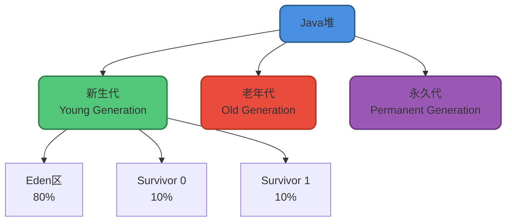

**JDK 8及之后**:

永久代被**元空间(Metaspace)**取代,元空间使用本地内存,不再占用堆内存。

### 为什么要分代?

分代的核心思想基于一个观察:**大部分对象都是朝生夕死的**。

- **新生代**(Young):存放新创建的对象,大部分对象很快死亡
- **老年代**(Old):存放长期存活的对象

通过分代,可以为不同区域设置不同的GC策略,提升垃圾回收效率:

- 新生代:频繁GC,但每次回收大量对象
- 老年代:GC频率低,但每次耗时长

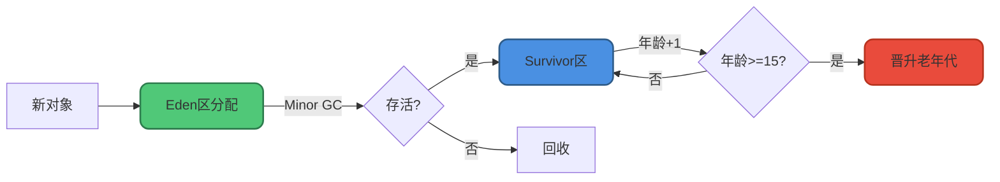

### 对象分代晋升规则

对象从新生代晋升到老年代有三个条件,满足任一即可:

#### 1. 年龄阈值晋升

对象每经历一次Minor GC存活,年龄加1。当年龄达到阈值(默认15)时晋升老年代。

**为什么年龄最大是15?**

因为对象头中记录年龄的字段只有4位,最大值为`1111`(二进制)=15(十进制)。

```java
// 设置晋升年龄阈值
-XX:MaxTenuringThreshold=15  // 有效范围:0-15
```

#### 2. 动态年龄判断

这是一个容易被误解的规则。《深入理解Java虚拟机》第三版的描述存在错误!

**正确的规则**:从年龄小的对象开始累加大小,当累加到某个年龄N时,大小超过Survivor区的50%(TargetSurvivorRatio),则将所有年龄**大于等于N**的对象晋升到老年代。

源码实现:

```c
uint ageTable::compute_tenuring_threshold(size_t survivor_capacity) {
    // TargetSurvivorRatio默认为50
    size_t desired_survivor_size = (size_t)((((double)survivor_capacity) * TargetSurvivorRatio) / 100);
    
    size_t total = 0;
    uint age = 1;
    
    // 从年龄1开始累加
    while (age < table_size) {
        total += sizes[age];
        if (total > desired_survivor_size) break;  // 超过50%,停止
        age++;
    }
    
    // 取动态计算值和MaxTenuringThreshold的较小值
    uint result = age < MaxTenuringThreshold ? age : MaxTenuringThreshold;
    return result;
}
```

示例:

```
假设Survivor区大小为10MB,TargetSurvivorRatio=50%,即5MB

年龄分布:
年龄1: 2MB  (累计2MB < 5MB,继续)
年龄2: 2MB  (累计4MB < 5MB,继续)
年龄3: 3MB  (累计7MB > 5MB,停止!)

结果:年龄>=3的所有对象晋升老年代
```

#### 3. 大对象直接进入老年代

大对象指需要大量连续内存的对象,如长字符串或大数组。

```java
// 设置大对象阈值
-XX:PretenureSizeThreshold=1048576  // 单位:字节,此处为1MB
```

**注意**:PretenureSizeThreshold默认为0,即不启用该机制。大对象仍在Eden区分配,通过GC次数和动态年龄判断晋升。

### 堆内存溢出

堆最容易出现`OutOfMemoryError`,表现形式有多种:

1. **`java.lang.OutOfMemoryError: Java heap space`**  
   创建对象时堆空间不足

2. **`java.lang.OutOfMemoryError: GC Overhead Limit Exceeded`**  
   JVM花费太多时间执行GC却只能回收很少的堆空间

```java
// 堆内存溢出示例
public class HeapOOMDemo {
    public static void main(String[] args) {
        List<byte[]> list = new ArrayList<>();
        while (true) {
            // 不断创建1MB的数组,最终导致堆内存溢出
            list.add(new byte[1024 * 1024]);
        }
    }
}

// 运行参数: -Xms20m -Xmx20m
// 输出: java.lang.OutOfMemoryError: Java heap space
```

## 方法区

### 核心概念

方法区(Method Area)是JVM规范中定义的一块**逻辑区域**,是所有线程共享的内存区域。

**《Java虚拟机规范》只规定了方法区的概念和作用,具体如何实现由虚拟机自己决定。** 不同虚拟机的实现差异很大。

### 方法区存储什么?

当虚拟机加载一个类时,会将类的元数据存入方法区:

1. **类的元数据**:类的完整结构信息
   - 类名、父类、接口、访问修饰符
   - 字段信息(名称、类型、修饰符)
   - 方法信息(名称、参数、返回值、修饰符)

2. **方法的字节码**:每个方法的原始指令序列

3. **运行时常量池**:由Class文件常量池转换而来,存放字面量和符号引用

**注意**:以下数据**不在**方法区:

- **静态变量**:JDK 7+移至Java堆,与Class对象一起存放
- **字符串常量池**:JDK 7+移至Java堆
- **JIT编译后的代码**:存放在独立的Code Cache区域

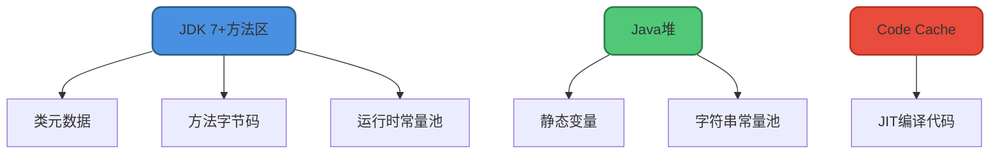

### 方法区的实现:永久代 vs 元空间

方法区是规范,永久代和元空间是HotSpot虚拟机的两种实现方式:

- **JDK 1.8之前**:永久代(PermGen)
- **JDK 1.8及之后**:元空间(Metaspace)

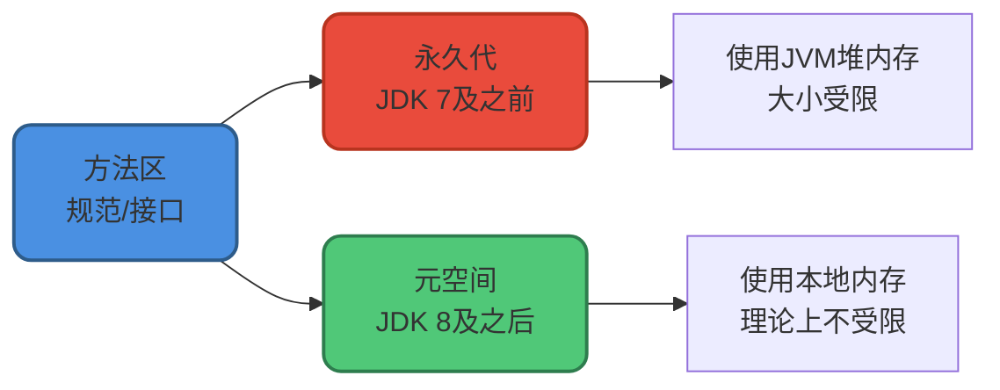

### 为什么用元空间替换永久代?

1. **永久代大小固定**,无法动态调整,容易发生`OutOfMemoryError: PermGen space`
2. **元空间使用本地内存**,受本机可用内存限制,溢出几率更小
3. **简化GC**:永久代GC效率低,只有Full GC才回收
4. **统一虚拟机**:合并HotSpot和JRockit时,JRockit没有永久代

### 方法区参数配置

**JDK 1.8之前(永久代)**:

```java
-XX:PermSize=128m         // 永久代初始大小
-XX:MaxPermSize=256m      // 永久代最大大小
```

**JDK 1.8及之后(元空间)**:

```java
-XX:MetaspaceSize=128m      // 元空间初始大小
-XX:MaxMetaspaceSize=256m   // 元空间最大大小(默认unlimited)
```

**警告**:如果不指定MaxMetaspaceSize,元空间会耗尽所有可用系统内存!

## 运行时常量池

### 核心概念

运行时常量池(Runtime Constant Pool)是方法区的一部分,由Class文件的常量池表转换而来。

Class文件的常量池表存放:

1. **字面量**(Literal):源代码中的固定值
   - 整数字面量:123
   - 浮点字面量:3.14
   - 字符串字面量:"Hello"

2. **符号引用**(Symbolic Reference):
   - 类的全限定名:com/example/UserService
   - 字段的名称和描述符:userName:Ljava/lang/String;
   - 方法的名称和描述符:getUserById:(I)Lcom/example/User;

### 符号引用 vs 直接引用

**符号引用**:用一组符号描述引用的目标,与内存布局无关  
**直接引用**:直接指向目标的指针、偏移量或句柄,与内存布局相关

在类加载的**解析阶段**,符号引用转换为直接引用。

```java
// 示例
public class OrderService {
    private UserService userService;  // 编译时:符号引用
    
    public void createOrder(int userId) {
        User user = userService.getUserById(userId);  // 运行时:直接引用
    }
}
```

运行时常量池受方法区内存限制,无法申请到内存时抛出`OutOfMemoryError`。

## 字符串常量池

### 核心概念

字符串常量池(String Pool)是JVM为了提升性能和减少内存消耗,专门为String类开辟的一块区域,主要目的是**避免字符串的重复创建**。

```java
// 字符串常量池示例
String s1 = "hello";  // 在字符串常量池中创建"hello"
String s2 = "hello";  // 直接返回字符串常量池中的"hello"
System.out.println(s1 == s2);  // true,指向同一个对象
```

### 实现原理

HotSpot虚拟机中,字符串常量池的实现是`StringTable`,可以理解为一个固定大小的`HashTable`:

- **Key**:字符串内容
- **Value**:指向堆中String对象的引用

```java
// 设置StringTable大小
-XX:StringTableSize=60013  // 默认值取决于JVM版本
```

### 位置变迁

- **JDK 1.6**:字符串常量池在永久代
- **JDK 1.7+**:字符串常量池移至Java堆

**为什么要移动?**

永久代的GC效率太低,只有Full GC才会回收。Java程序通常创建大量字符串,放在堆中能更高效及时地回收。

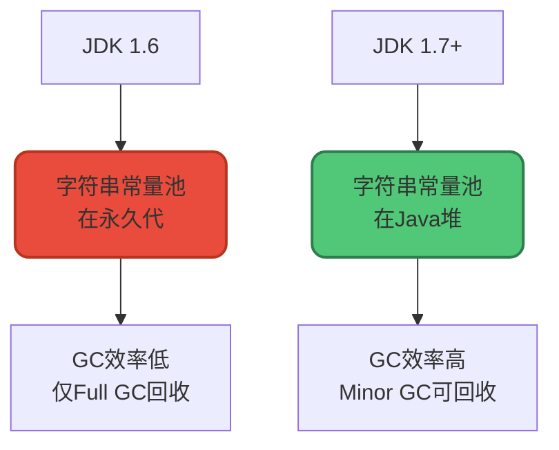

## 直接内存

### 核心概念

直接内存(Direct Memory)并**不是**虚拟机运行时数据区的一部分,也不是《Java虚拟机规范》中定义的内存区域。但这部分内存也被频繁使用,且可能导致`OutOfMemoryError`。

### NIO与直接内存

JDK 1.4引入的**NIO(New I/O)**,基于**通道(Channel)**和**缓冲区(Buffer)**,可以使用Native函数库直接分配堆外内存,通过一个存储在Java堆中的`DirectByteBuffer`对象作为这块内存的引用。

```java
// 直接内存示例
import java.nio.ByteBuffer;

public class DirectMemoryDemo {
    public static void main(String[] args) {
        // 分配1GB直接内存
        ByteBuffer buffer = ByteBuffer.allocateDirect(1024 * 1024 * 1024);
        System.out.println("直接内存分配成功");
        
        buffer.put((byte) 100);
        buffer.flip();
        System.out.println("读取数据: " + buffer.get());
    }
}
```

### 为什么使用直接内存?

直接内存的最大优势是**避免了Java堆和Native堆之间的数据复制**,在某些场景下能显著提升性能:

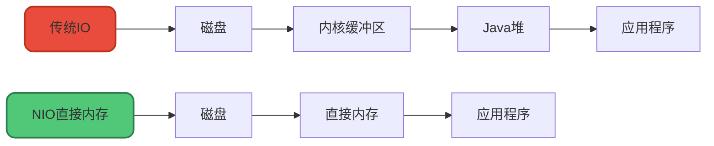

直接内存不受Java堆大小限制,但受本机总内存和处理器寻址空间限制。

### 堆外内存

堆外内存是指把内存对象分配在堆外的内存,直接由操作系统管理,能在一定程度上减少GC对应用程序的影响。

**直接内存是堆外内存的一种**,但不完全等价。堆外内存是更广泛的概念。

## 对象的创建过程

Java对象的创建是一个复杂而精妙的过程,建议能默写出五个步骤,并理解每步虚拟机做了什么。

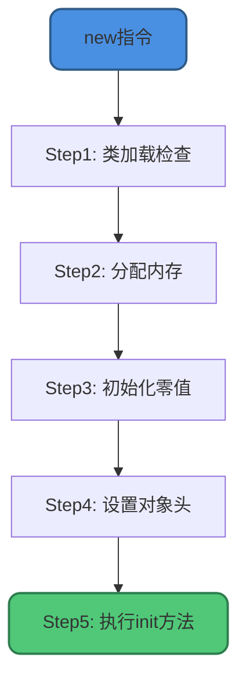

### Step1:类加载检查

虚拟机遇到`new`指令时,首先检查:

1. 这个指令的参数能否在常量池中定位到类的符号引用
2. 这个符号引用代表的类是否已被加载、解析和初始化

如果没有,必须先执行类加载过程。

```java
// new指令触发类加载检查
User user = new User();  // 如果User类未加载,先执行类加载
```

### Step2:分配内存

类加载检查通过后,为新对象分配内存。对象所需内存大小在类加载完成后就已确定。

**分配方式**取决于**Java堆是否规整**,而堆是否规整又取决于**GC收集器是否带压缩整理功能**:

#### 指针碰撞(Bump The Pointer)

- **适用**:堆内存规整(无内存碎片)
- **原理**:用过的内存放一边,未用的放另一边,中间一个指针作为分界。分配时只需移动指针即可
- **使用的GC**:Serial、ParNew

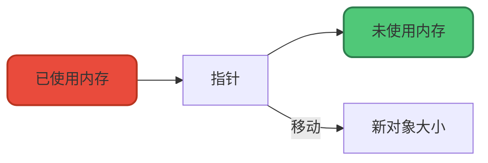

#### 空闲列表(Free List)

- **适用**:堆内存不规整(有内存碎片)
- **原理**:维护一个列表,记录哪些内存块可用。分配时从列表中找足够大的内存块
- **使用的GC**:CMS

### 并发安全问题

创建对象是非常频繁的操作,如何保证线程安全?虚拟机采用两种方式:

#### CAS + 失败重试

使用CAS(Compare And Swap)保证更新操作的原子性,失败则重试。

```java
// 伪代码
do {
    oldValue = memoryPointer;
    newValue = oldValue + objectSize;
} while (!CAS(memoryPointer, oldValue, newValue));
```

#### TLAB(Thread Local Allocation Buffer)

为每个线程在Eden区预先分配一小块内存,线程优先在自己的TLAB中分配对象,用完后再用CAS分配新的TLAB。

```java
// 启用TLAB(默认开启)
-XX:+UseTLAB

// 设置TLAB大小
-XX:TLABSize=256k
```

### Step3:初始化零值

内存分配完成后,虚拟机将分配的内存空间初始化为零值(不包括对象头)。

这保证了对象的实例字段在Java代码中不赋初始值就能直接使用,程序能访问到这些字段的零值。

```java
public class User {
    private int age;      // 初始化为0
    private String name;  // 初始化为null
    
    public void printAge() {
        System.out.println(age);  // 输出0,不会报错
    }
}
```

### Step4:设置对象头

虚拟机对对象进行必要的设置,这些信息存放在**对象头(Object Header)**:

- 对象是哪个类的实例
- 如何找到类的元数据信息
- 对象的哈希码
- 对象的GC分代年龄
- 锁状态标志
- ……

### Step5:执行init方法

从虚拟机视角,对象已经创建完成。但从Java程序视角,对象创建才刚开始。

执行`new`指令后会接着执行`<init>`方法,按程序员的意愿初始化对象,这样一个真正可用的对象才算完全创建出来。

```java
public class User {
    private String name;
    private int age;
    
    // <init>方法由构造方法生成
    public User(String name, int age) {
        this.name = name;  // Step5执行
        this.age = age;    // Step5执行
    }
}
```

## 对象的内存布局

在HotSpot虚拟机中,对象在内存中的布局分为三部分:

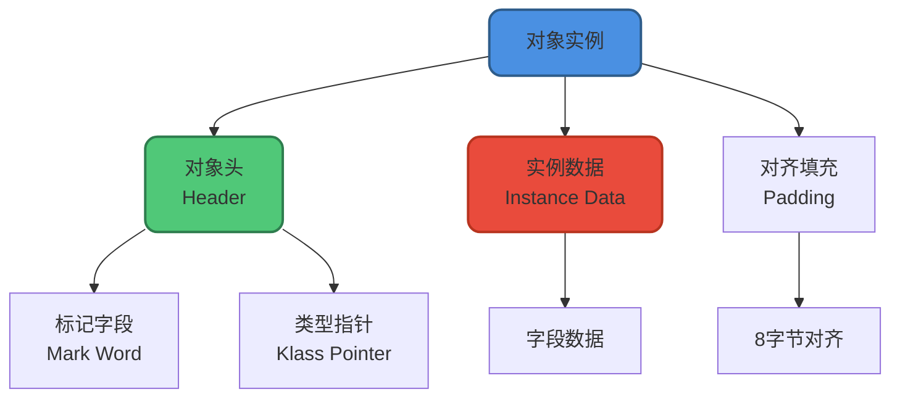

### 对象头

对象头包含两部分:

#### 标记字段(Mark Word)

存储对象自身的运行时数据:

- 哈希码(HashCode)
- GC分代年龄
- 锁状态标志
- 线程持有的锁
- 偏向线程ID
- 偏向时间戳

#### 类型指针(Klass Pointer)

对象指向它的类元数据的指针,虚拟机通过这个指针确定对象是哪个类的实例。

### 实例数据

对象真正存储的有效信息,即程序中定义的各种类型的字段内容。

### 对齐填充

不是必须的,仅起占位作用。HotSpot要求对象起始地址必须是8字节的整数倍,如果实例数据部分未对齐,就需要对齐填充补全。

```java
// 示例:对象内存布局
public class User {
    private int age;        // 4字节
    private String name;    // 引用4字节(开启指针压缩)
}

// 内存布局(64位JVM,开启指针压缩):
// 对象头: 12字节(Mark Word 8字节 + Klass Pointer 4字节)
// 实例数据: 8字节(age 4字节 + name引用 4字节)
// 对齐填充: 4字节(总共24字节,已是8的倍数,不需要填充)
```

## 对象的访问定位

建立对象就是为了使用对象,Java程序通过栈上的`reference`数据来操作堆上的具体对象。

对象访问方式由虚拟机实现决定,主流方式有两种:

### 句柄访问

如果使用句柄,Java堆中会划分出一块内存作为**句柄池**,reference中存储对象的句柄地址,句柄包含对象实例数据和类型数据的地址。

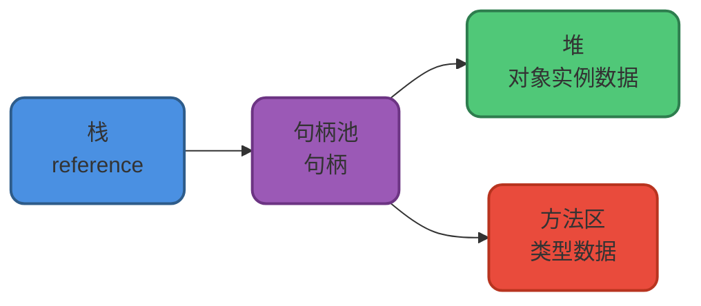

**优点**:对象移动时(GC时很常见),只需改变句柄中的实例数据指针,reference本身不需要修改。

### 直接指针访问

如果使用直接指针,reference中存储的直接就是对象地址,对象实例数据中包含类型数据的指针。

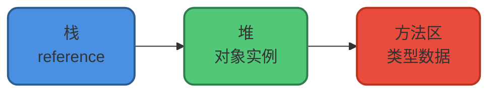

**优点**:速度快,节省了一次指针定位的时间开销。

**HotSpot虚拟机使用直接指针访问**。

## 堆与栈的区别

堆和栈是Java程序运行中的两大核心存储区域,它们的区别是面试高频考点:

| 维度 | 堆(Heap) | 栈(Stack) |
|------|----------|-----------|
| **内存位置** | JVM堆内存 | JVM栈内存 |
| **存储内容** | 对象实例 | 局部变量、方法调用 |
| **线程共享** | 所有线程共享 | 线程私有 |
| **内存管理** | GC自动回收 | 方法执行完自动释放 |
| **大小** | 通常几百MB到几GB | 通常几百KB到几MB |
| **访问速度** | 相对较慢 | 相对较快 |
| **异常类型** | OutOfMemoryError | StackOverflowError |

```java
public class HeapVsStackDemo {
    public static void main(String[] args) {
        int age = 25;                // 栈:局部变量
        User user = new User();      // 栈:引用,堆:对象实例
        user.setAge(age);            // 堆:修改对象字段
    }
}
```

## 总结

本文深入讲解了JVM运行时内存区域的核心知识:

1. **运行时数据区组成**:程序计数器、虚拟机栈、本地方法栈、堆、方法区、运行时常量池
2. **线程私有vs共享**:理解哪些区域是线程私有,哪些是线程共享
3. **堆的分代结构**:新生代、老年代、永久代/元空间
4. **对象分代晋升规则**:年龄阈值、动态年龄判断、大对象直接晋升
5. **方法区的演进**:永久代→元空间,解决了什么问题
6. **对象创建五步骤**:类加载检查、分配内存、初始化零值、设置对象头、执行init方法
7. **对象访问定位**:句柄访问vs直接指针访问

理解JVM内存模型是深入学习JVM调优、故障排查的基础,也是面试的重点考察内容。建议结合实际代码和调优经验,加深理解。
