# JVM垃圾回收机制深度解析

## 前言

垃圾回收(Garbage Collection,GC)是Java虚拟机自动内存管理的核心机制。它能够自动识别和回收不再使用的内存对象,避免手动管理内存带来的复杂性和潜在风险。本文将深入探讨JVM垃圾回收的各个方面,包括回收算法、分代策略、STW机制以及现代垃圾回收器使用的三色标记算法。

> 本文主要针对HotSpot虚拟机进行讲解,不同虚拟机实现可能存在差异。

## 垃圾回收算法

垃圾回收算法决定了JVM如何识别和清理无用对象。主流的垃圾回收算法包括标记-清除算法、复制算法和标记-整理算法。每种算法都有其独特的优势和适用场景。

### 标记-清除算法


标记-清除(Mark-Sweep)算法是最基础的垃圾回收算法,分为两个核心阶段:

**标记阶段**:从GC Roots出发,遍历整个对象引用图,标记所有可达的存活对象。这里需要注意的是,标记的是需要保留的对象,而不是垃圾对象。

**清除阶段**:遍历整个堆内存空间,回收所有未被标记的对象所占用的内存。

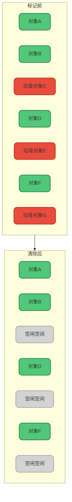

**优缺点分析**:

优点:
- 实现简单,逻辑清晰
- 不需要移动对象,执行速度较快

缺点:
- **内存碎片化严重**:清除后会产生大量不连续的内存碎片。虽然总的空闲内存足够,但可能无法分配较大的连续对象
- 存储效率降低:碎片过多会导致可用内存利用率下降

举个例子:假设清除后剩余1MB空闲内存,但这些内存分散在各个位置。当需要分配一个1MB的大对象时,虽然空闲内存总量足够,但因为不连续而无法完成分配,只能触发新的GC或抛出内存溢出异常。

### 复制算法


为了解决标记-清除算法的碎片化问题,复制算法应运而生。它的核心思想是将内存划分为大小相等的两块区域,每次只使用其中一块。

**工作流程**:
1. 对象优先在其中一块内存区域分配
2. 当这块内存即将用完时,触发垃圾回收
3. 将存活对象复制到另一块空闲内存区域,复制时按顺序紧密排列
4. 清空原来使用的内存区域,两块区域角色互换

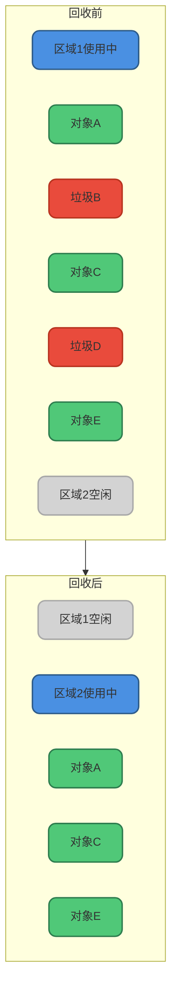

**优缺点分析**:

优点:
- 内存连续无碎片:存活对象紧密排列,完全避免碎片问题
- 分配效率高:只需移动空闲指针即可完成对象分配

缺点:
- **内存利用率低**:只能使用一半内存空间,造成严重浪费
- 复制开销大:当存活对象较多时,复制成本高昂
- 不适合老年代:老年代对象存活率高,复制操作代价过大

代码示例:

```java
/**
 * 电商订单处理系统示例
 * 大量临时订单对象在处理后即可回收,适合使用复制算法
 */
public class OrderProcessor {
    public void processOrders(List<Order> orders) {
        for (Order order : orders) {
            // 创建临时计算对象
            OrderCalculator calculator = new OrderCalculator(order);
            BigDecimal totalAmount = calculator.calculateTotal();
            
            // 生成临时验证对象
            OrderValidator validator = new OrderValidator();
            if (validator.validate(order)) {
                // 处理完成后,calculator和validator成为垃圾对象
                saveOrder(order, totalAmount);
            }
        }
        // 方法结束后大量临时对象可被回收
    }
}
```

### 标记-整理算法


标记-整理(Mark-Compact)算法结合了前两种算法的优点,特别适合老年代使用。它分为两个阶段:

**标记阶段**:与标记-清除算法相同,从GC Roots出发标记所有存活对象。

**整理阶段**:将所有存活对象向内存的一端移动,使它们紧密排列,然后清理边界以外的所有内存。

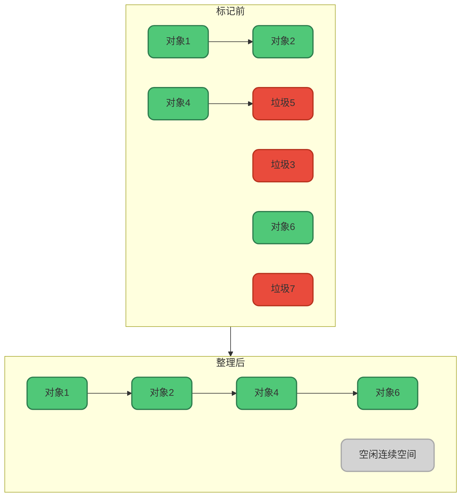

**优缺点分析**:

优点:
- 无内存碎片:对象紧密排列,剩余空间完全连续
- 内存利用率高:不像复制算法浪费一半空间
- 适合老年代:对象存活率高的场景下表现优异

缺点:
- **执行效率较低**:需要多次遍历和移动对象
- 更新引用开销:移动对象后需要更新所有指向它的引用

**算法性能对比**:

从时间效率看:标记-清除 < 复制 < 标记-整理
从空间利用看:标记-整理 > 标记-清除 > 复制
从碎片处理看:标记-整理 ≈ 复制 > 标记-清除

## 分代回收策略

现代垃圾回收器普遍采用分代回收策略,它基于一个重要的观察:**绝大多数对象的生命周期很短,只有少数对象会长期存活**。

### 为什么需要分代

根据对象生命周期的不同特征,JVM将堆内存划分为新生代和老年代:

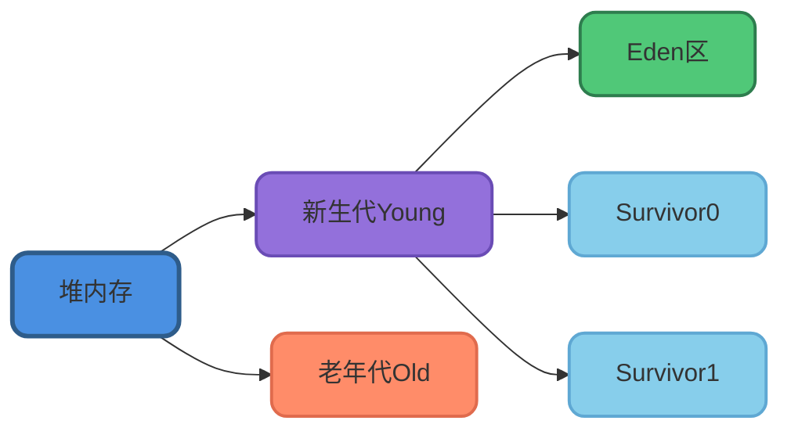

**新生代特点**:
- 对象朝生夕死,存活率低(通常小于10%)
- 垃圾回收频繁
- 使用复制算法最合适

**老年代特点**:
- 对象存活时间长,存活率高
- 垃圾回收频率低
- 使用标记-清除或标记-整理算法

### 新生代的复制算法优化

标准的复制算法会浪费50%内存,新生代通过巧妙的设计优化了这个问题:

- 将新生代划分为1个Eden区和2个Survivor区(S0和S1)
- 默认比例为Eden:S0:S1 = 8:1:1
- 每次只使用Eden区和其中一个Survivor区
- 回收时将存活对象复制到另一个Survivor区

这样内存利用率从50%提升到90%,大大降低了空间浪费。

代码示例:

```java
/**
 * 数据处理管道示例
 * 展示了大量短生命周期对象的处理场景
 */
public class DataPipeline {
    
    public void processStream(Stream<RawData> dataStream) {
        dataStream
            .map(raw -> {
                // 创建临时转换对象,使用后即成为垃圾
                DataTransformer transformer = new DataTransformer();
                return transformer.transform(raw);
            })
            .filter(data -> {
                // 创建临时过滤器对象
                DataFilter filter = new DataFilter();
                return filter.isValid(data);
            })
            .forEach(data -> {
                // 只有通过验证的数据对象会保存到老年代
                persistentStorage.save(data);
            });
        // 处理过程中的大量临时对象在新生代快速回收
    }
}
```

### 老年代的算法选择

老年代对象存活率高,选择标记-整理算法可以避免碎片,保证内存连续。但某些场景下,为了降低STW时间,也会使用标记-清除算法(如CMS收集器)。

## Stop The World机制

### 什么是STW

Stop-The-World(STW)是JVM在执行垃圾回收时的一种全局暂停机制。当STW发生时,所有应用线程都会被暂停,只有垃圾回收线程在工作。

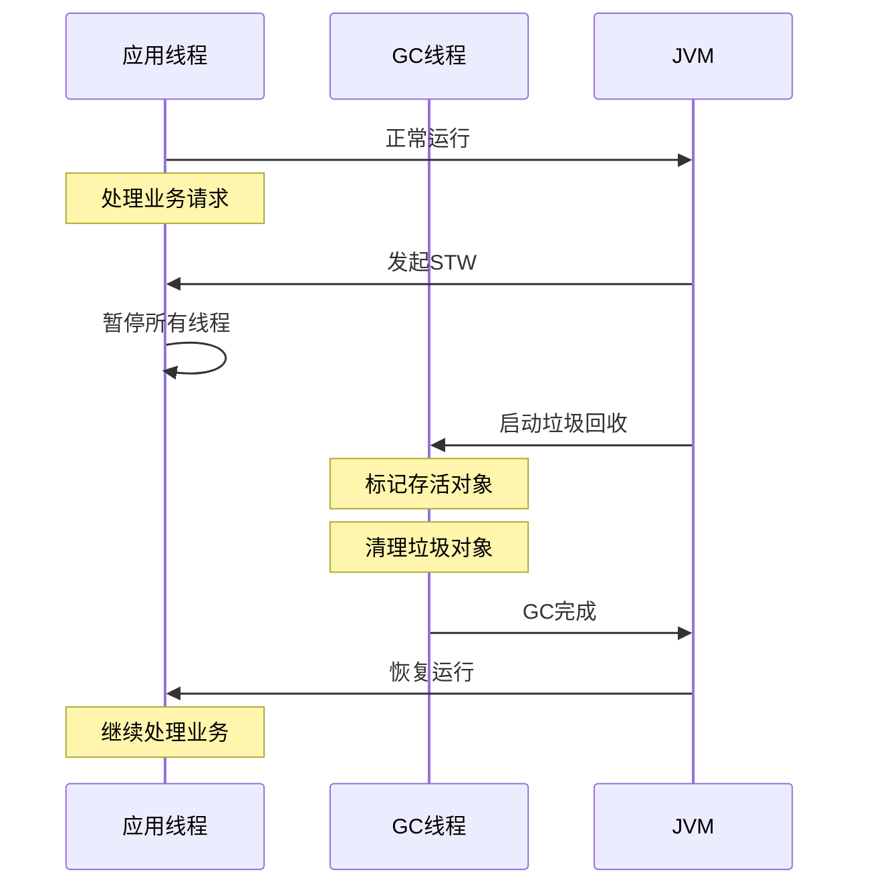

### 为什么需要STW

STW的必要性主要有两个原因:

**1. 保证垃圾回收的完整性**

如果不暂停应用线程,垃圾会持续产生,垃圾回收永远无法完成。就像在一个不断有人制造垃圾的房间里打扫卫生,永远也打扫不完。

**2. 防止对象引用关系变化导致的错误**

在并发环境下,应用线程可能会不断修改对象引用关系,这会导致两个严重问题:

**多标(False Positive)**:本应被回收的垃圾对象被错误标记为存活对象。

- 影响:产生浮动垃圾,占用额外内存,但下次GC可以清理
- 危害程度:较低,可以容忍

**漏标(False Negative)**:本应存活的对象被错误标记为垃圾并回收。

- 影响:正在使用的对象被误删,导致程序崩溃
- 危害程度:极高,不可接受

### STW的影响

STW会带来以下负面影响:

- **响应时间增加**:用户请求在STW期间无法得到处理,导致延迟增加
- **吞吐量下降**:暂停期间无法处理业务,系统QPS下降
- **性能不可预测**:STW时间不固定,导致性能波动

对于高响应性要求的应用(如在线交易系统、实时游戏),长时间的STW是不可接受的。

### 如何减少STW影响

**1. 选择合适的垃圾回收器**

现代垃圾回收器通过并发回收技术大幅降低STW时间:

- **CMS(Concurrent Mark-Sweep)**:大部分工作与应用线程并发执行
- **G1(Garbage-First)**:可预测的停顿时间
- **ZGC/Shenandoah**:亚毫秒级停顿时间

**2. 调优JVM参数**

- 合理设置堆大小(-Xms、-Xmx)
- 调整新生代和老年代比例
- 设置期望的最大停顿时间(-XX:MaxGCPauseMillis)

**3. 优化应用代码**

- 减少对象创建,复用对象
- 避免创建大对象
- 及时释放不再使用的对象引用

## 三色标记算法

### 算法背景

传统的可达性分析算法需要在整个标记过程中执行STW,这在大堆内存场景下会导致长时间的应用暂停。三色标记算法的引入,使得垃圾回收的大部分工作可以与应用线程并发执行,大幅降低了STW时间。

现代垃圾回收器如CMS、G1都采用三色标记算法作为核心标记机制。

### 三色定义

三色标记算法将对象分为三种状态,用不同颜色表示:

```mermaid
graph TB
    subgraph 颜色含义
        A[白色对象]
        B[灰色对象]
        C[黑色对象]
    end
    
    A -->|说明| D[未被标记的对象<br/>潜在的垃圾对象]
    B -->|说明| E[已标记但引用未扫描完<br/>正在处理的对象]
    C -->|说明| F[已标记且引用已扫描完<br/>确认存活的对象]
    
    style A fill:#F5F5F5,stroke:#BEBEBE,stroke-width:3px,rx:10,ry:10
    style B fill:#A9A9A9,stroke:#696969,stroke-width:3px,rx:10,ry:10
    style C fill:#2F4F4F,stroke:#1C1C1C,stroke-width:3px,rx:10,ry:10
    style D fill:#FFE4E1,stroke:#FF6B6B,stroke-width:2px,rx:10,ry:10
    style E fill:#E6E6FA,stroke:#9370DB,stroke-width:2px,rx:10,ry:10
    style F fill:#E0FFE0,stroke:#50C878,stroke-width:2px,rx:10,ry:10
```

**白色(White)**:
- 对象尚未被垃圾回收器访问
- GC开始时所有对象都是白色
- GC结束时仍为白色的对象会被回收

**灰色(Gray)**:
- 对象已被标记,但其引用的对象还未全部扫描
- 处于待处理队列中
- 标记过程中的工作集

**黑色(Black)**:
- 对象已被标记,且其所有引用对象都已扫描完毕
- 确认为存活对象
- 不会再被GC处理

### 标记过程

三色标记算法将垃圾回收分为三个阶段:

**阶段一:初始标记(Initial Mark)** - 需要STW

- 标记GC Roots直接引用的对象为灰色
- 其余对象保持白色
- 这个阶段非常短暂

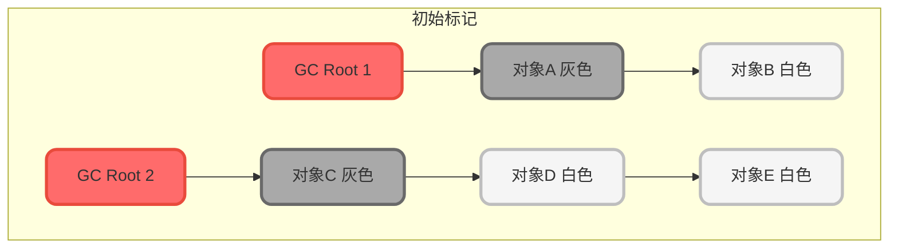

**阶段二:并发标记(Concurrent Mark)** - 不需要STW

- 从灰色对象开始,扫描其引用的对象
- 将引用的白色对象标记为灰色
- 当前对象的所有引用扫描完后,将其标记为黑色
- 重复直到没有灰色对象

这个阶段是最耗时的,但可以与应用线程并发执行,不会造成长时间停顿。

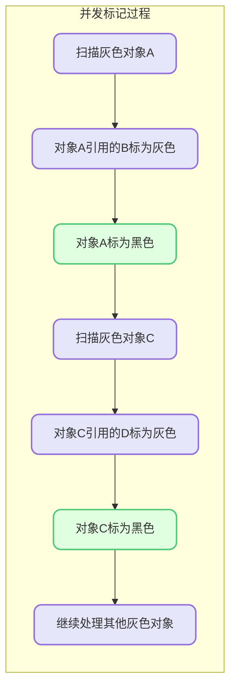

**阶段三:重新标记(Remark)** - 需要STW

- 修正并发标记期间引用关系变化导致的误标记
- 处理写屏障记录的变更对象
- 确保标记的准确性

这个阶段需要STW,但时间很短。

### 写屏障技术

在并发标记阶段,应用线程可能会修改对象引用关系。写屏障(Write Barrier)是一种在引用更新时自动触发的机制,用于记录引用变化。

```java
/**
 * 写屏障伪代码示例
 * 展示引用更新时如何记录变化
 */
public class WriteBarrierExample {
    
    // 应用代码
    public void updateReference(Node parent, Node newChild) {
        // 实际代码:parent.child = newChild;
        
        // JVM在底层插入写屏障代码
        writeBarrier(parent, parent.child, newChild);
        parent.child = newChild;
    }
    
    // 写屏障逻辑(JVM内部实现)
    private void writeBarrier(Object parent, Object oldRef, Object newRef) {
        if (gcInProgress) {
            // 记录引用变化到特殊队列
            recordReferenceChange(parent, newRef);
        }
    }
}
```

### 并发标记中的问题

虽然写屏障可以记录大部分引用变化,但并发标记仍可能出现问题:

**多标问题**:
- 现象:垃圾对象被错误标记为存活
- 原因:并发期间对象失去了所有引用,但已被标记
- 影响:产生浮动垃圾,下次GC清理即可
- 危害:较小,可接受

**漏标问题**:
- 现象:存活对象被错误标记为垃圾
- 原因:引用关系变化导致对象未被扫描
- 影响:存活对象被误删,程序崩溃
- 危害:严重,必须解决

## 漏标问题的解决方案

漏标问题的发生需要同时满足两个条件:

- 至少有一个黑色对象指向了白色对象(新建引用)
- 所有灰色对象删除了对该白色对象的引用(删除旧引用)

解决漏标的关键是破坏其中一个条件。主流方案有两种:

### 增量更新(Incremental Update)

**核心思想**:破坏第一个条件,记录黑色对象新增的引用。

当黑色对象新增对白色对象的引用时:

- 将这个引用关系记录下来
- 在重新标记阶段,以这些黑色对象为根重新扫描
- 确保新引用的白色对象能被标记为存活

```mermaid
graph TB
    subgraph 增量更新流程
        A[并发标记中<br/>黑色对象A]
        B[新增引用]
        C[白色对象B]
        D[记录A→B引用]
        E[重新标记阶段]
        F[从A重新扫描]
        G[B标记为灰色<br/>然后黑色]
        
        A --> B
        B --> C
        C --> D
        D --> E
        E --> F
        F --> G
    end
    
    style A fill:#2F4F4F,stroke:#1C1C1C,stroke-width:3px,rx:10,ry:10
    style C fill:#F5F5F5,stroke:#BEBEBE,stroke-width:3px,rx:10,ry:10
    style D fill:#FFE4B5,stroke:#FFA500,stroke-width:2px,rx:10,ry:10
    style F fill:#E6E6FA,stroke:#9370DB,stroke-width:2px,rx:10,ry:10
    style G fill:#E0FFE0,stroke:#50C878,stroke-width:2px,rx:10,ry:10
```

**优点**:逻辑简单,只需记录新增引用
**缺点**:需要重新扫描部分黑色对象,略微增加重新标记时间
**使用场景**:CMS收集器采用此方案

### 原始快照(Snapshot At The Beginning, SATB)

**核心思想**:破坏第二个条件,记录删除引用时的白色对象。

当灰色对象删除对白色对象的引用时:

- 在删除前将这个白色对象记录下来
- 在重新标记阶段,以这些白色对象为根重新扫描
- 确保这些对象及其引用链被正确标记

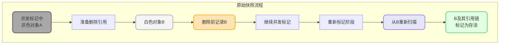

**优点**:基于GC开始时的快照,保证一致性
**缺点**:可能产生浮动垃圾(本应删除的对象被保留)
**使用场景**:G1收集器采用此方案

### 两种方案对比

| 特性 | 增量更新 | 原始快照 |
|------|----------|----------|
| 破坏条件 | 第一个(记录新增引用) | 第二个(记录删除引用) |
| 重新标记 | 扫描黑色对象 | 扫描白色对象 |
| 浮动垃圾 | 较少 | 较多 |
| 实现复杂度 | 较低 | 较高 |
| 典型应用 | CMS | G1、Shenandoah |

## 初始标记和重新标记为何需要STW

理解了三色标记算法后,我们来解释为什么初始标记和重新标记需要STW,而并发标记不需要。

### 初始标记必须STW的原因

初始标记阶段需要扫描GC Roots,而大多数GC Roots并不是普通对象:

- 虚拟机栈中的局部变量
- 本地方法栈中的引用
- 类静态属性
- 常量池引用
- 同步锁持有的对象

这些根引用位于特殊的内存区域,写屏障技术无法监控它们的变化。如果不STW,根引用可能在扫描过程中发生变化,导致初始标记结果不准确。

虽然这个阶段需要STW,但扫描速度很快,因为只标记直接引用的对象,不需要遍历整个对象图。

### 并发标记不需要STW

并发标记阶段遍历整个对象图,这是最耗时的阶段。通过写屏障技术,可以记录并发期间的引用变化,使这个阶段可以与应用线程并发执行,大幅降低停顿时间。

虽然并发标记可能产生一些误标记,但通过重新标记阶段可以修正。

### 重新标记必须STW的原因

重新标记是垃圾回收的最后确认阶段,它的任务是:

- 处理并发标记期间记录的所有引用变化
- 修正可能的漏标记问题
- 确保标记结果的完全准确

因为这是做最终决策的阶段,必须保证准确性。如果此时不STW,新的引用变化会持续产生,永远无法得到确定的标记结果。

好在并发标记已经完成了大部分工作,重新标记只需要处理增量变化,所以STW时间很短。

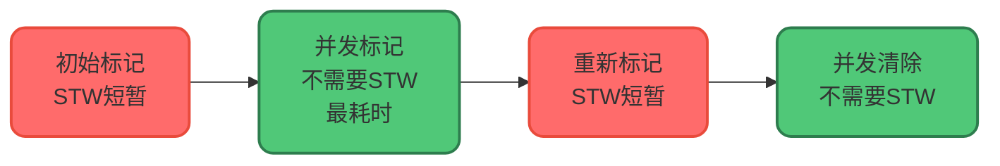

## 总结

本文深入探讨了JVM垃圾回收机制的核心内容:

- **垃圾回收算法**:标记-清除、复制、标记-整理各有优劣,适用于不同场景
- **分代回收策略**:基于对象生命周期特征,新生代使用复制算法,老年代使用标记-整理算法
- **STW机制**:保证垃圾回收的正确性,但会影响应用响应时间,需要通过选择合适的收集器来优化
- **三色标记算法**:实现并发标记,大幅降低STW时间,是现代垃圾回收器的核心技术
- **漏标问题解决**:通过增量更新或原始快照方案,确保并发标记的准确性

理解这些机制对于JVM性能调优、问题排查都至关重要。在实际应用中,应根据业务特点选择合适的垃圾回收器,并通过合理的参数配置来平衡吞吐量和响应时间。
