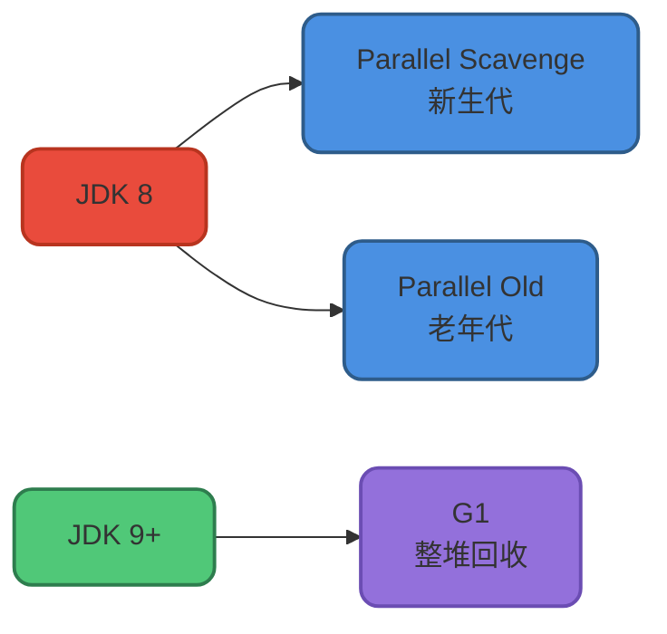
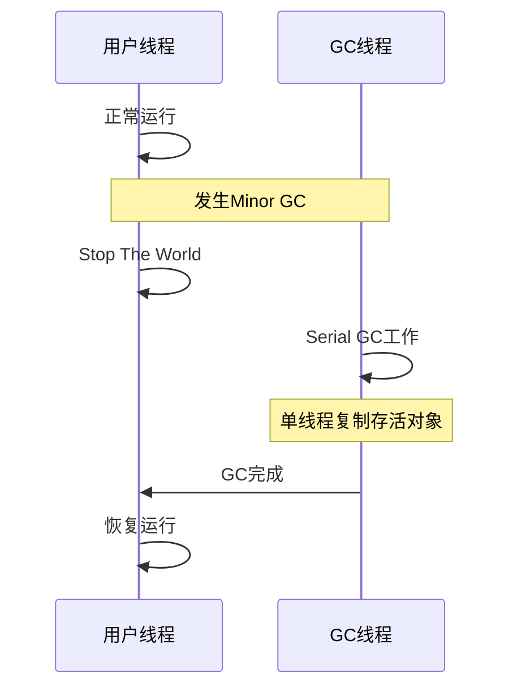
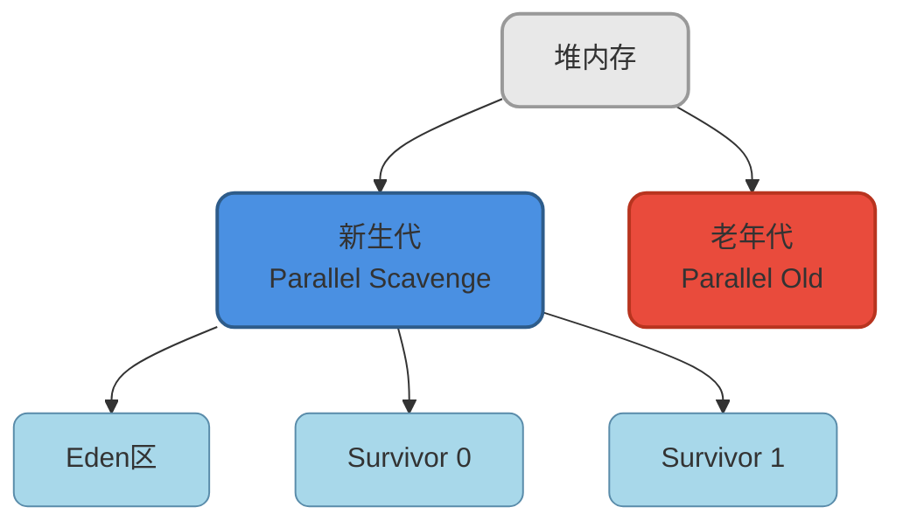
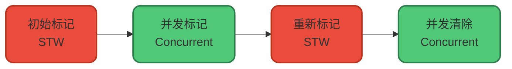
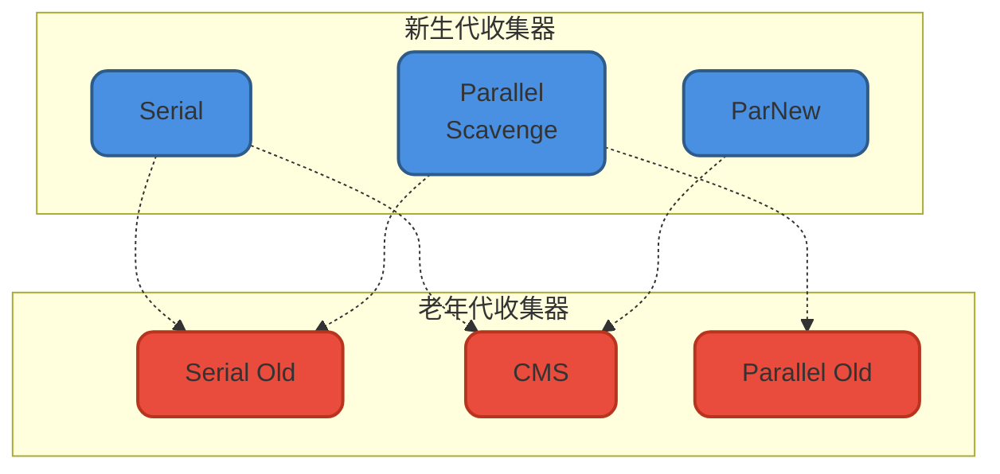
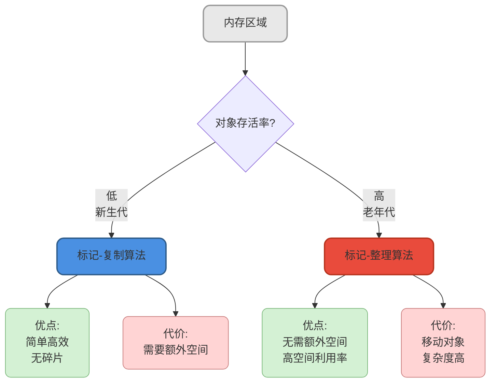

# 垃圾收集器详解

## 前言

在Java虚拟机的内存管理体系中,如果说垃圾收集算法是理论基础,那么垃圾收集器就是这些理论的具体落地实现。每种收集器都有其独特的设计目标和适用场景。

理解各种垃圾收集器的工作原理和特性,对于我们选择合适的GC策略、优化应用性能至关重要。本文将深入剖析HotSpot虚拟机中的主要垃圾收集器。

:::tip 重要说明
没有"最好"的垃圾收集器,只有最适合特定场景的收集器。正因如此,HotSpot虚拟机才会提供多种垃圾收集器供开发者选择。
:::

## JDK默认垃圾收集器

不同JDK版本使用的默认垃圾收集器是不同的,可以通过以下命令查看:

```bash
java -XX:+PrintCommandLineFlags -version
```

主要JDK版本的默认配置:



## 新生代收集器

### Serial收集器

Serial收集器是最基础、历史最悠久的单线程垃圾收集器。"单线程"有两层含义:

- 只使用一个CPU或一条收集线程完成垃圾回收
- 在进行垃圾收集时,必须暂停所有工作线程(Stop The World)

**核心特点:**

- **算法**: 标记-复制算法
- **工作模式**: 单线程串行
- **应用场景**: Client模式下的虚拟机
- **优势**: 简单高效,无线程交互开销



尽管存在Stop The World,但Serial收集器由于没有线程切换开销,在单核环境或小内存应用中依然有其价值。

### ParNew收集器

ParNew是Serial收集器的多线程并行版本,除了使用多线程进行垃圾收集外,其他行为与Serial完全一致。

**核心特点:**

- **算法**: 标记-复制算法
- **工作模式**: 多线程并行
- **应用场景**: Server模式,配合CMS使用
- **特殊性**: 是唯一能与CMS配合工作的新生代收集器

**并行与并发的区别:**

- **并行(Parallel)**: 多条GC线程同时工作,但用户线程处于等待状态
- **并发(Concurrent)**: GC线程与用户线程同时执行(可能交替执行)

### Parallel Scavenge收集器

Parallel Scavenge同样是基于标记-复制算法的多线程收集器,但它的关注点与其他收集器不同。

**核心特点:**

- **算法**: 标记-复制算法
- **工作模式**: 多线程并行
- **关注点**: 吞吐量优先
- **自适应调节**: 支持GC自适应调节策略

**吞吐量** = 用户代码运行时间 / (用户代码运行时间 + GC时间)

**JVM参数配置:**

```bash
# 使用Parallel收集器 + 老年代串行
-XX:+UseParallelGC

# 使用Parallel收集器 + 老年代并行
-XX:+UseParallelOldGC
```

JDK 8默认使用Parallel Scavenge + Parallel Old组合。验证方式:

```bash
$ java -XX:+PrintCommandLineFlags -version
-XX:InitialHeapSize=262921408 
-XX:MaxHeapSize=4206742528 
-XX:+PrintCommandLineFlags 
-XX:+UseCompressedClassPointers 
-XX:+UseCompressedOops 
-XX:+UseParallelGC
java version "1.8.0_211"
Java(TM) SE Runtime Environment (build 1.8.0_211-b12)
Java HotSpot(TM) 64-Bit Server VM (build 25.211-b12, mixed mode)
```

:::info 提示
指定`-XX:+UseParallelGC`会自动启用`-XX:+UseParallelOldGC`,可用`-XX:-UseParallelOldGC`禁用。
:::

**适用场景:**

Parallel Scavenge适合后台计算任务,不需要太多交互。通过提高吞吐量可以最高效地利用CPU时间,尽快完成计算任务。

## 老年代收集器

### Serial Old收集器

Serial Old是Serial收集器的老年代版本,同样是单线程收集器。

**核心特点:**

- **算法**: 标记-整理算法
- **工作模式**: 单线程串行
- **主要用途**: 
  - JDK 1.5及之前与Parallel Scavenge搭配使用
  - 作为CMS收集器的后备方案

### Parallel Old收集器

Parallel Old是Parallel Scavenge的老年代版本,在JDK 1.6中才开始提供。

**核心特点:**

- **算法**: 标记-整理算法
- **工作模式**: 多线程并行
- **应用场景**: 与Parallel Scavenge组合,注重吞吐量和CPU资源利用



### CMS收集器

CMS(Concurrent Mark Sweep)是一款以获取最短停顿时间为目标的收集器,非常符合注重用户体验的应用需求。

**核心特点:**

- **算法**: 标记-清除算法
- **工作模式**: 并发收集
- **设计目标**: 最短停顿时间
- **版本支持**: JDK 9标记为过时,JDK 14移除

**CMS工作流程:**

CMS的垃圾回收过程比前面的收集器更复杂,主要分为四个阶段:



各阶段详解:

**1. 初始标记(Initial Mark):**
- 短暂停顿,标记GC Roots直接关联的对象
- 速度很快

**2. 并发标记(Concurrent Mark):**
- 从GC Roots直接关联对象开始遍历整个对象图
- 耗时较长,但与用户线程并发执行
- 不保证实时性,因为用户线程可能持续更新引用

**3. 重新标记(Remark):**
- 修正并发标记期间因用户程序运行导致的标记变动
- 停顿时间通常比初始标记稍长,但远小于并发标记
- 需要STW

**4. 并发清除(Concurrent Sweep):**
- 清理标记为死亡的对象
- 与用户线程并发执行

**CMS的优缺点:**

优点:
- 并发收集,降低停顿时间
- 用户体验好

缺点:
- **CPU资源敏感**: 并发阶段占用部分CPU资源,降低应用吞吐量
- **无法处理浮动垃圾**: 并发清除阶段产生的新垃圾只能等下次GC清理
- **内存碎片问题**: 标记-清除算法会产生大量碎片,可能导致频繁Full GC

:::warning 版本提醒
CMS在Java 9中被标记为过时(deprecated),在Java 14中被正式移除。
:::

## 收集器组合关系

不同的垃圾收集器可以组合使用,但并非任意组合:



:::tip 组合说明
实线连接表示推荐组合,虚线表示可组合但不推荐。
:::

## 新生代与老年代收集器差异

新生代和老年代的收集器在设计上存在本质差异,这些差异源于两个区域对象的不同特征。

### 核心差异对比

| 维度 | 新生代收集器 | 老年代收集器 |
|------|------------|------------|
| **回收频率** | 频繁(Minor GC) | 较少(Major GC/Full GC) |
| **对象存活率** | 低(大部分朝生夕死) | 高(经过筛选的长期存活对象) |
| **主流算法** | 标记-复制 | 标记-整理/标记-清除 |
| **空间利用** | 牺牲部分空间(Survivor) | 追求高空间利用率 |
| **性能重点** | 回收速度 | 减少碎片、控制停顿 |

### 为什么新生代使用复制算法?

新生代对象特点是"朝生夕死",每次GC都有大量对象死亡,只需复制少量存活对象。典型的新生代回收场景:

```java
// 电商订单处理示例
public class OrderProcessor {
    public void processOrders() {
        for (int i = 0; i &lt; 10000; i++) {
            // 创建临时对象处理订单
            OrderRequest request = new OrderRequest();
            OrderValidator validator = new OrderValidator();
            
            // 处理完立即变成垃圾
            if (validator.validate(request)) {
                saveOrder(request);
            }
            // request和validator在循环外就可以回收
        }
    }
}
```

在上述代码中,每次循环创建的临时对象在循环结束后就成为垃圾,存活率极低。

### 为什么老年代使用整理算法?

老年代对象存活率高,如果使用复制算法需要复制大量对象,效率低下。而且老年代没有额外空间进行分配担保。

```java
// 缓存对象 - 长期存活在老年代
public class UserCacheManager {
    // 这些对象会长期存活
    private static Map&lt;String, UserProfile&gt; userCache = new ConcurrentHashMap&lt;&gt;();
    private static RedisClient redisClient = new RedisClient();
    private static DatabasePool dbPool = new DatabasePool(50);
    
    // 系统配置对象 - 几乎不会被回收
    private static SystemConfig config = SystemConfig.load();
}
```

这类对象会长期驻留在老年代,每次GC存活率都很高,使用标记-整理算法更合适。

### 算法选择的权衡



## 选择合适的垃圾收集器

不同的应用场景应该选择不同的垃圾收集器:

### 客户端应用
- **推荐**: Serial + Serial Old
- **原因**: 简单高效,内存占用小

### 服务端应用(吞吐量优先)
- **推荐**: Parallel Scavenge + Parallel Old  
- **适用**: 后台批处理、科学计算、大数据分析
- **特点**: 最大化CPU利用率

### 服务端应用(响应时间优先)
- **推荐**: ParNew + CMS(JDK 8)或G1(JDK 9+)
- **适用**: 互联网应用、Web服务
- **特点**: 减少停顿时间,提升用户体验

### 大内存应用
- **推荐**: G1或ZGC
- **适用**: 堆内存&gt;4GB的应用
- **特点**: 可预测停顿,内存整理

## 小结

本文详细介绍了HotSpot虚拟机中的主要垃圾收集器,包括它们的算法、特点和适用场景。关键要点:

- Serial/Serial Old: 单线程,适合客户端
- ParNew: Serial的多线程版本,配合CMS使用
- Parallel Scavenge/Old: 吞吐量优先,JDK 8默认
- CMS: 低停顿,已在JDK 14移除
- 新生代和老年代收集器采用不同算法,源于对象存活率差异

随着Java版本演进,G1已成为JDK 9+的默认收集器,而ZGC等新一代收集器也在不断发展。下一篇文章我们将深入探讨G1收集器的原理和优化策略。

## 参考资料

- 《深入理解Java虚拟机:JVM高级特性与最佳实践(第3版)》- 周志明
- The Java Virtual Machine Specification - Java SE 8 Edition
- OpenJDK官方文档
