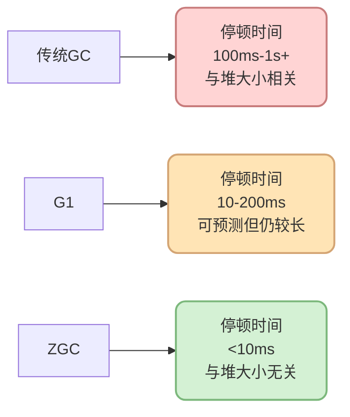
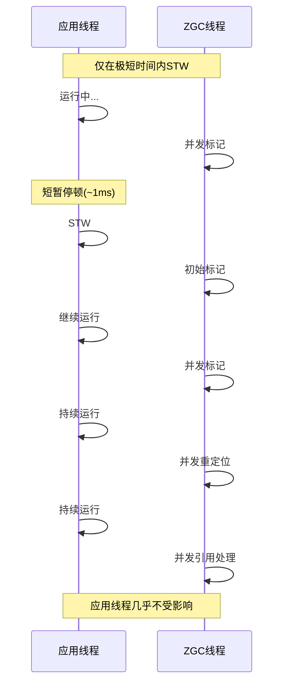
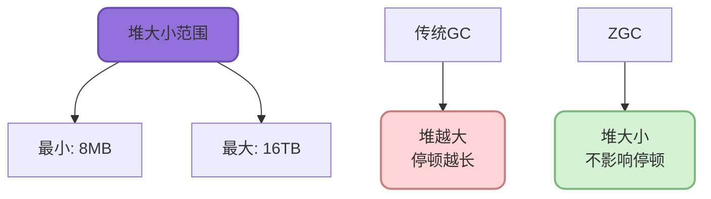
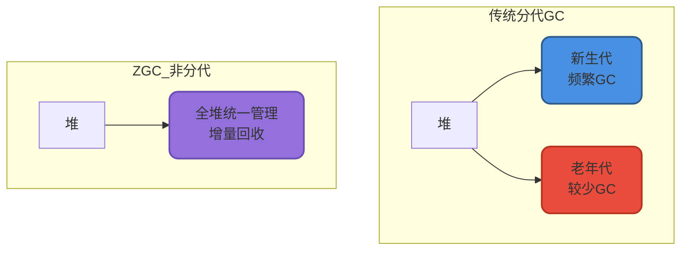
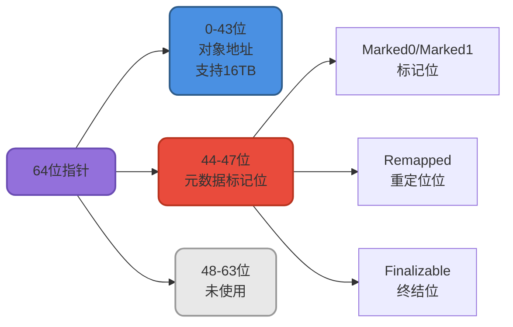
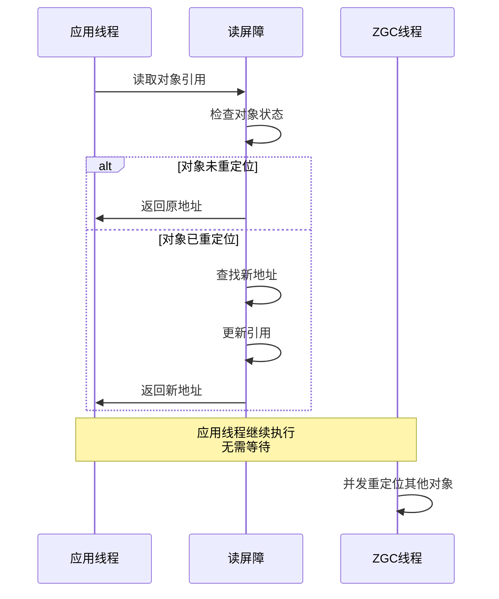
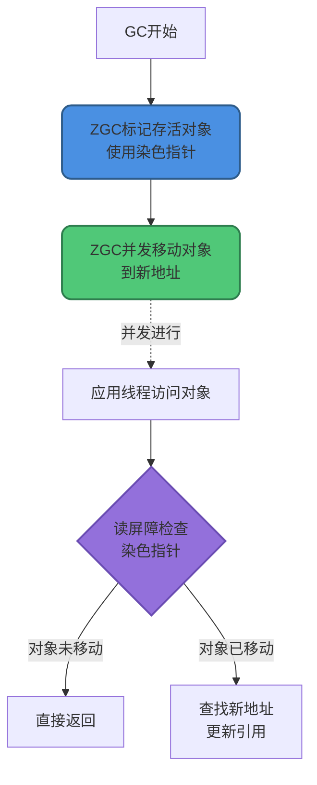
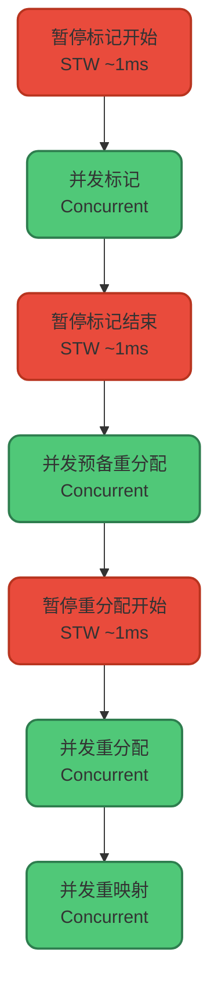

import PaidCTA from '@site/src/components/PaidCTA';

# ZGC低延迟垃圾收集器

## 前言

ZGC(Z Garbage Collector)是Oracle在JDK 11中引入的一款革命性的低延迟垃圾收集器,它的设计目标是将GC停顿时间控制在**10毫秒以内**,甚至可以达到**亚毫秒级别**,而且这个停顿时间不会随着堆大小的增加而增加。

ZGC代表了垃圾回收技术的最新发展方向,特别适合需要超大内存且对延迟极度敏感的应用场景。本文将深入探讨ZGC的核心特性、工作原理和使用场景。

:::tip 版本说明
- JDK 11-14: ZGC处于实验阶段
- JDK 15: ZGC正式可用(Production Ready)
- JDK 21: 引入分代ZGC,停顿时间缩短到1ms以内
- JDK 24: 删除非分代ZGC
:::

## ZGC的六大核心特性

### 1. 超低停顿时间

ZGC的首要设计目标是实现极低的停顿时间:



**关键点:**
- 目标停顿时间 &lt; 10ms
- JDK 21分代ZGC可达到 &lt; 1ms
- 停顿时间不随堆大小增加而增长

### 2. 高吞吐量

ZGC是并发垃圾收集器,大部分工作与应用线程并发执行:



**优势:**
- 应用线程停顿极短,CPU利用率高
- 适合对吞吐量有要求的场景

### 3. 完全兼容性

ZGC与现有Java应用程序完全兼容:

```java
// 无需修改任何代码
public class ExistingApplication {
    
    public static void main(String[] args) {
        // 原有代码完全不变
        ApplicationContext context = new ApplicationContext();
        Server server = new Server(8080);
        server.start();
    }
    
    // 只需在JVM启动参数中指定ZGC
    // java -XX:+UseZGC -Xmx16g Application
}
```

**特点:**
- 无需修改应用代码
- 无需调整对象分配策略
- 平滑迁移,风险低

### 4. 超大堆支持

ZGC可以处理从8MB到16TB的堆内存:



**适用场景:**

```java
// 超大内存缓存系统
public class MassiveCacheSystem {
    
    // 使用10TB堆内存
    // ZGC依然能保持<10ms的停顿
    private Map&lt;String, CacheEntry&gt; cache;
    
    public void initialize() {
        // 初始化超大缓存
        cache = new ConcurrentHashMap&lt;&gt;(100_000_000);
        
        // 加载数十亿条数据到内存
        loadBillionsOfEntries();
    }
}
```

### 5. 全堆回收(非分代)

ZGC最初采用全堆回收策略,不区分年轻代和老年代:



:::info JDK 21更新
JDK 21引入了[分代ZGC](https://openjdk.org/jeps/439),进一步优化性能。JDK 24中[删除了非分代ZGC](https://openjdk.org/jeps/490)。
:::

**启用分代ZGC(JDK 21+):**

```bash
java -XX:+UseZGC -XX:+ZGenerational -Xmx16g Application
```

### 6. 设计简洁

ZGC设计相对简洁,代码库较小,易于维护和扩展:

- 核心代码集中,逻辑清晰
- 更容易进行性能优化
- 缺陷修复周期短

## ZGC核心技术原理

ZGC能够实现如此低的停顿时间,主要依赖两项核心技术:

### 1. 染色指针(Colored Pointers)

ZGC使用64位指针的部分位来存储元数据:



**染色指针的优势:**

```java
// 概念示例(简化)
public class ColoredPointer {
    
    // 传统方式:需要额外的标记位图
    class TraditionalGC {
        Object obj;
        boolean marked;  // 需要额外存储
    }
    
    // ZGC方式:标记信息编码在指针中
    class ZGCPointer {
        long pointer;  // 地址+标记信息
        
        // 提取地址
        long getAddress() {
            return pointer &amp; 0x0000FFFFFFFFFFFFL;
        }
        
        // 检查标记
        boolean isMarked() {
            return (pointer &amp; MARKED_MASK) != 0;
        }
        
        // 设置标记
        void setMarked() {
            pointer |= MARKED_MASK;
        }
    }
}
```

**优势总结:**
- 无需额外的标记位图,节省内存
- 通过位运算快速判断对象状态
- 支持多种并发标记视图

### 2. 读屏障(Load Barrier)

ZGC使用读屏障技术实现并发的对象移动:



**工作原理示例:**

```java
// 读屏障伪代码
public class LoadBarrier {
    
    Object readField(Object obj, String fieldName) {
        // 1. 读取字段值(可能是旧地址)
        Object value = obj.getField(fieldName);
        
        // 2. 读屏障检查
        if (needsBarrier(value)) {
            // 检查对象是否已被重定位
            if (isRelocated(value)) {
                // 获取新地址
                Object newAddress = getForwardingAddress(value);
                
                // 更新字段为新地址
                obj.setField(fieldName, newAddress);
                
                return newAddress;
            }
        }
        
        return value;
    }
}
```

**读屏障的关键作用:**

- **并发移动**: GC可以在应用运行时移动对象
- **自愈性**: 应用线程自动修复过时的引用
- **低开销**: 只在对象访问时触发,成本可控

### 3. 技术协同工作

染色指针和读屏障配合实现并发回收:



## ZGC工作流程

ZGC的垃圾回收过程高度并发化:



### 各阶段详解

**1. 暂停标记开始(Pause Mark Start):**

<PaidCTA />