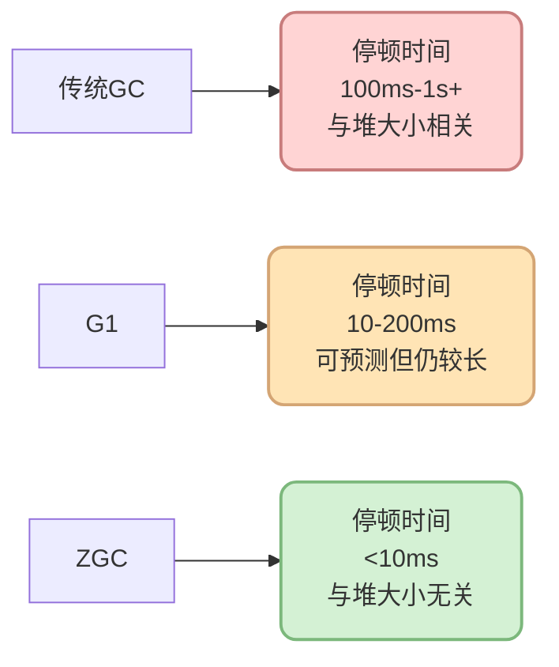
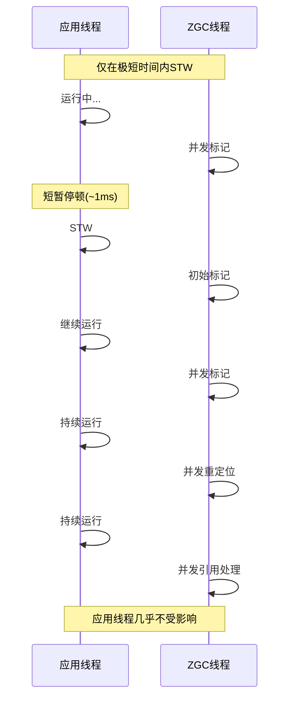

import PaidCTA from '@site/src/components/PaidCTA';

# ZGC低延迟垃圾收集器

## 前言

ZGC(Z Garbage Collector)是Oracle在JDK 11中引入的一款革命性的低延迟垃圾收集器,它的设计目标是将GC停顿时间控制在**10毫秒以内**,甚至可以达到**亚毫秒级别**,而且这个停顿时间不会随着堆大小的增加而增加。

ZGC代表了垃圾回收技术的最新发展方向,特别适合需要超大内存且对延迟极度敏感的应用场景。本文将深入探讨ZGC的核心特性、工作原理和使用场景。

:::tip 版本说明
- JDK 11-14: ZGC处于实验阶段
- JDK 15: ZGC正式可用(Production Ready)
- JDK 21: 引入分代ZGC,停顿时间缩短到1ms以内
- JDK 24: 删除非分代ZGC
:::

## ZGC的六大核心特性

### 1. 超低停顿时间

ZGC的首要设计目标是实现极低的停顿时间:



**关键点:**
- 目标停顿时间 &lt; 10ms
- JDK 21分代ZGC可达到 &lt; 1ms
- 停顿时间不随堆大小增加而增长

### 2. 高吞吐量

ZGC是并发垃圾收集器,大部分工作与应用线程并发执行:



**优势:**
- 应用线程停顿极短,CPU利用率高
- 适合对吞吐量有要求的场景

### 3. 完全兼容性

ZGC与现有Java应用程序完全兼容:

```java
// 无需修改任何代码
public class ExistingApplication {
    
    public static void main(String[] args) {
        // 原有代码完全不变
        ApplicationContext context = new ApplicationContext();
        Server server = new Server(8080);
        server.start();
    }
    
    // 只需在JVM启动参数中指定ZGC
    // java -XX:+UseZGC -Xmx16g Application
}
```

**特点:**
- 无需修改应用代码
- 无需调整对象分配策略
- 平滑迁移,风险低

### 4. 超大堆支持


<PaidCTA />