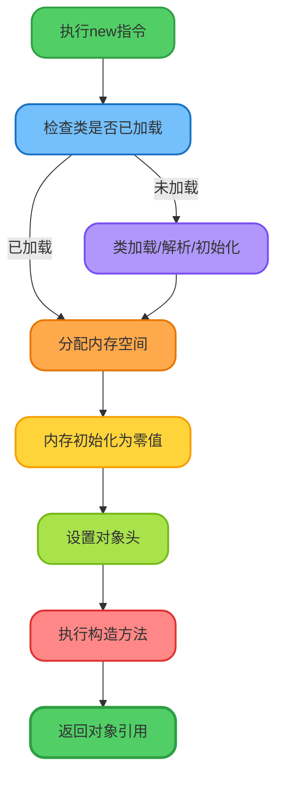
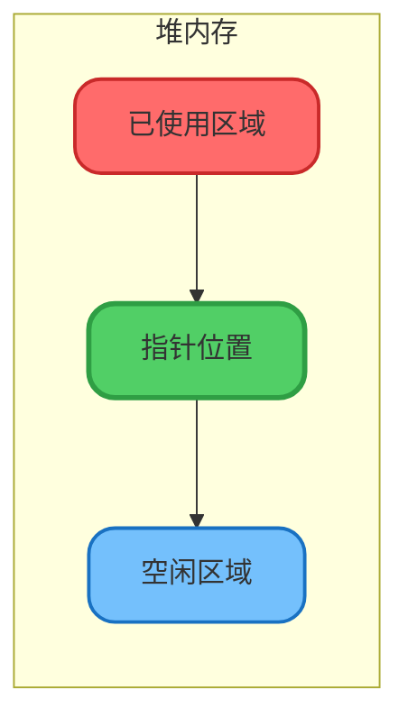
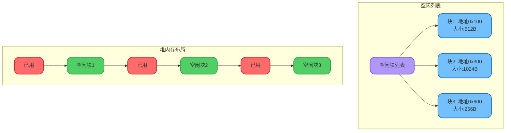
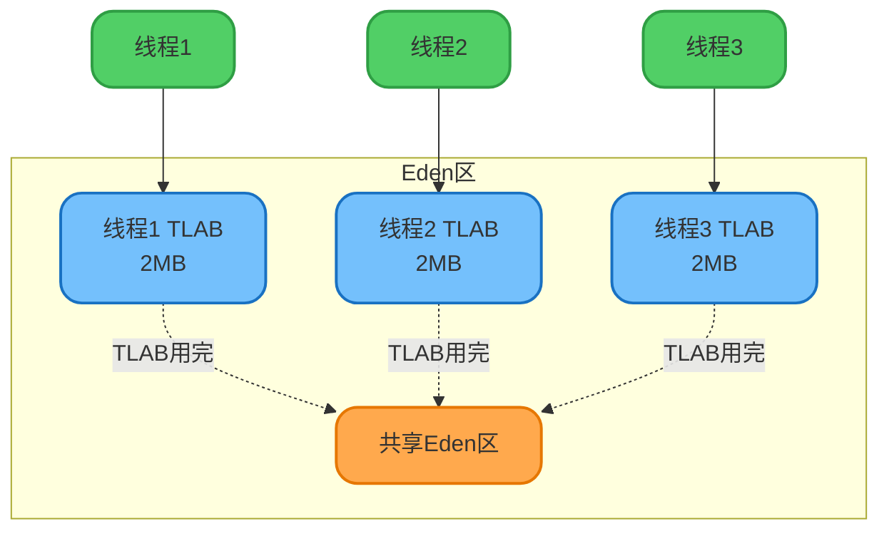
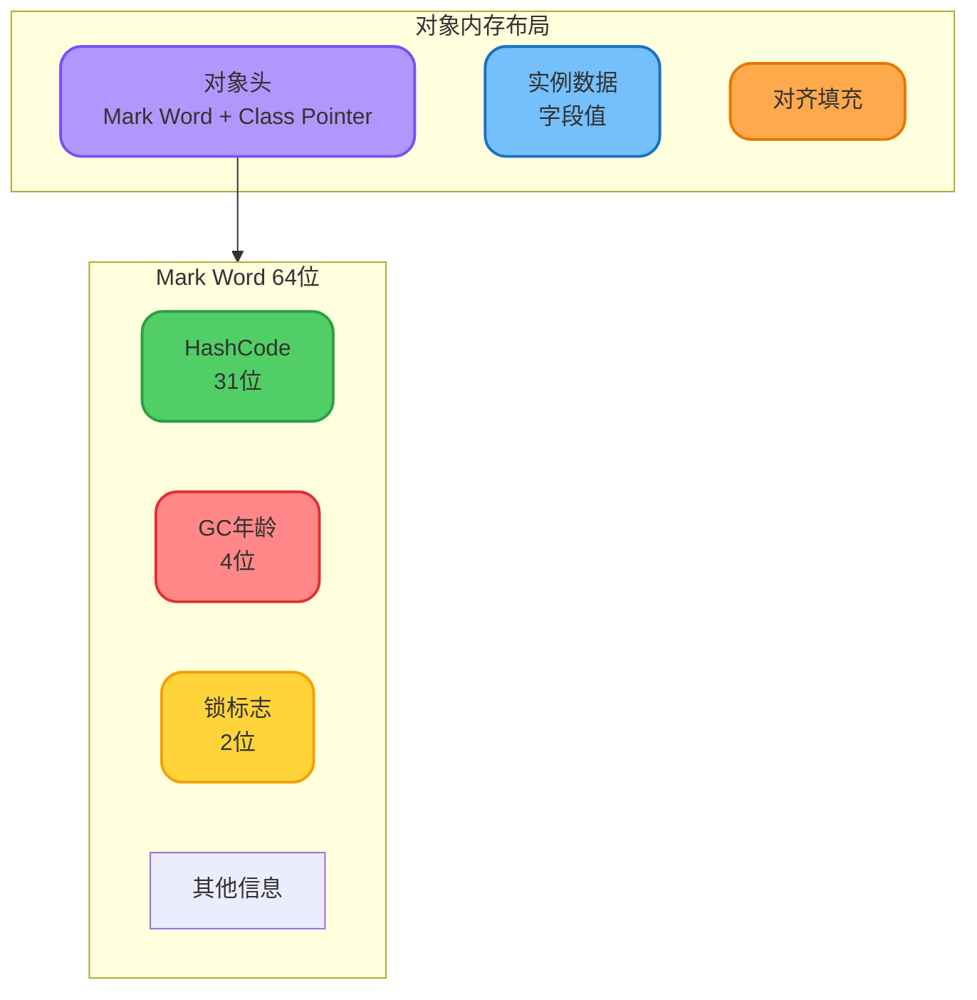
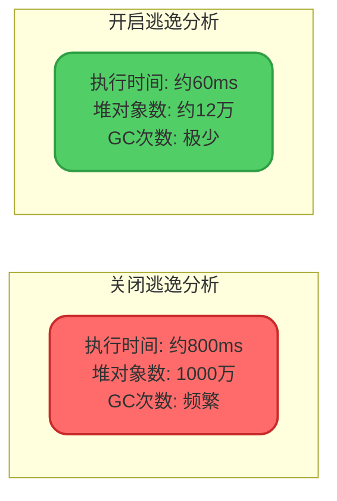
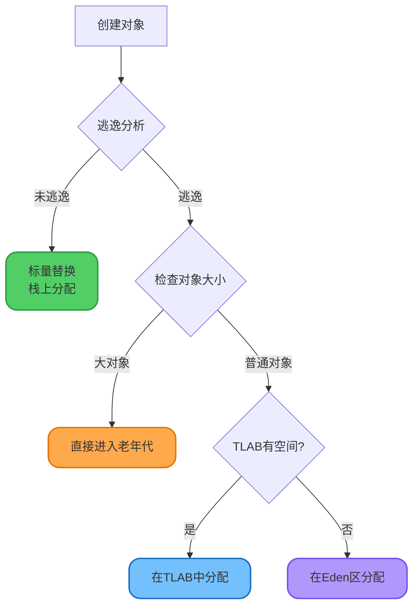

# 对象创建与内存分配策略

## JVM对象创建流程

当程序执行`new`关键字创建对象时,JVM会经历一系列复杂的步骤,确保对象被正确初始化并分配内存空间。



### 步骤1: 类加载检查

JVM首先检查`new`指令的参数能否在常量池中定位到类的符号引用,并验证该类是否已完成加载、解析和初始化。

```java
// 首次使用Product类时,会触发类加载
Product laptop = new Product("Laptop", 5000);
```

如果类尚未加载,JVM会先执行类加载流程(加载 → 验证 → 准备 → 解析 → 初始化)。

### 步骤2: 内存分配

通过类加载检查后,JVM在堆中为对象分配内存。内存分配方式取决于堆内存是否规整,主要有两种策略:

#### 指针碰撞(Bump the Pointer)

**适用场景**: 堆内存绝对规整(已使用内存和空闲内存严格分隔)

**原理**: 
- 维护一个指针,标记已用内存和空闲内存的分界点
- 分配内存时,指针向空闲区域移动对象所需大小
- 返回移动前的指针位置作为对象起始地址



**对应的GC算法**: 
- 标记-整理(Mark-Compact)算法
- 复制(Copying)算法

**对应的垃圾收集器**: Serial、ParNew等

#### 空闲列表(Free List)

**适用场景**: 堆内存不规整(已使用和空闲内存交错分布)

**原理**:
- JVM维护一个空闲内存块列表
- 记录每个空闲块的起始地址和大小
- 分配时查找足够大的空闲块
- 更新列表,标记该块已被使用



**对应的GC算法**: 标记-清除(Mark-Sweep)算法

**对应的垃圾收集器**: CMS等

#### 并发安全保障

对象创建是高频操作,在并发环境下,内存分配必须保证线程安全。HotSpot提供两种解决方案:

**方案1: CAS + 失败重试**

使用Compare-And-Swap(CAS)原子操作保证指针更新的线程安全。

```java
// CAS伪代码示意
do {
    oldPointer = heapPointer;
    newPointer = oldPointer + objectSize;
} while (!compareAndSwap(heapPointer, oldPointer, newPointer));
```

**方案2: TLAB(Thread Local Allocation Buffer)**

为每个线程在Eden区预先分配一小块私有内存(TLAB),线程在自己的TLAB中分配对象,无需同步。



**TLAB特点**:
- 默认开启(`-XX:+UseTLAB`)
- 默认大小为Eden区的1%
- TLAB用尽后,线程需要同步地在共享Eden区分配
- 减少同步开销,提升分配效率

### 步骤3: 内存初始化为零值

分配完内存后,JVM将对象内存空间初始化为零值(不包括对象头)。

```java
public class MemoryInitDemo {
    private int count;        // 自动初始化为0
    private String name;      // 自动初始化为null
    private boolean flag;     // 自动初始化为false
    private double price;     // 自动初始化为0.0
    
    public void printValues() {
        System.out.println(count);  // 输出0
        System.out.println(name);   // 输出null
        System.out.println(flag);   // 输出false
        System.out.println(price);  // 输出0.0
    }
}
```

这一步保证对象的实例字段在Java代码中可以不赋初值就直接使用,访问到的是零值。

### 步骤4: 设置对象头

JVM在对象头(Object Header)中存储对象的元数据信息:

**对象头内容**(以HotSpot为例):
- 对象所属类的元数据指针(Class Pointer)
- 哈希码(HashCode)
- GC分代年龄(Age)
- 锁状态标志(Lock Flags)
- 线程持有的锁信息
- 偏向线程ID(如果启用偏向锁)
- 偏向时间戳



### 步骤5: 执行构造方法

从JVM角度看,对象已经创建完成。但从Java程序角度,还需执行构造方法(`<init>`方法),完成程序员期望的初始化。

```java
public class Product {
    private String name;
    private int price;
    
    // 构造方法在此步骤执行
    public Product(String name, int price) {
        this.name = name;      // 程序员定义的初始化
        this.price = price;
        System.out.println("Product created: " + name);
    }
}
```

### 步骤6: 返回对象引用

构造方法执行完毕后,JVM将对象引用返回给程序,此后程序可通过该引用操作对象。

```java
Product laptop = new Product("Laptop", 5000);
// laptop变量持有对象引用,可通过它访问对象
laptop.getName();
```

## 对象内存分配优化

### 逃逸分析(Escape Analysis)

逃逸分析是JIT编译器的一项高级优化技术,用于判断对象的作用域是否会"逃逸"出方法或线程。

#### 逃逸类型

**方法逃逸**: 对象作为返回值或被外部方法引用

```java
// 发生方法逃逸
public Product createProduct() {
    Product product = new Product("Mouse", 100);
    return product; // 对象逃逸到方法外
}
```

**线程逃逸**: 对象被其他线程访问

```java
// 发生线程逃逸
public class ThreadEscape {
    private static Product sharedProduct;
    
    public void method() {
        Product product = new Product("Keyboard", 200);
        sharedProduct = product; // 对象可能被其他线程访问
    }
}
```

**无逃逸**: 对象仅在方法内使用

```java
// 未发生逃逸
public void processOrder() {
    Product product = new Product("Monitor", 1500);
    int total = product.getPrice() * 2;
    System.out.println("Total: " + total);
    // product对象仅在方法内使用,未逃逸
}
```

#### 逃逸分析的优化

JVM参数控制:
- `-XX:+DoEscapeAnalysis`: 开启逃逸分析(JDK 8默认开启)
- `-XX:-DoEscapeAnalysis`: 关闭逃逸分析

基于逃逸分析,JIT可进行以下优化:

### 标量替换(Scalar Replacement)

**标量**: 不可再分解的数据,如基本数据类型(int、long等)

**聚合量**: 可继续分解的数据,如对象

**标量替换原理**: 如果对象未逃逸,JIT会将对象拆解为若干成员变量(标量),直接使用局部变量代替对象。

```java
// 原始代码
public void calculate() {
    Point point = new Point(10, 20);
    int sum = point.x + point.y;
    System.out.println("Sum: " + sum);
}

class Point {
    int x;
    int y;
    
    Point(int x, int y) {
        this.x = x;
        this.y = y;
    }
}
```

经过标量替换优化后:

```java
// JIT优化后的等价代码(逻辑层面)
public void calculate() {
    int x = 10;  // 标量替换,无需创建Point对象
    int y = 20;
    int sum = x + y;
    System.out.println("Sum: " + sum);
}
```

**优势**:
- 减少堆内存分配
- 降低GC压力
- 提升执行效率

JVM参数:
- `-XX:+EliminateAllocations`: 开启标量替换(默认开启)
- `-XX:+PrintEliminateAllocations`: 打印标量替换信息

### 栈上分配(Stack Allocation)

**传统分配方式**: 对象在堆上分配,需要GC管理

**栈上分配**: 未逃逸对象直接在栈帧中分配,方法结束时自动释放

:::info 实现机制
HotSpot虚拟机的栈上分配本质上是通过**标量替换**实现的。将对象拆解为标量后,这些标量作为局部变量存储在栈帧的局部变量表中。
:::

#### 栈上分配验证实验

```java
public class StackAllocationTest {
    public static void main(String[] args) {
        long start = System.currentTimeMillis();
        for (int i = 0; i < 10000000; i++) {
            allocate();
        }
        long end = System.currentTimeMillis();
        System.out.println("Cost: " + (end - start) + " ms");
        
        // 让程序休眠,方便观察堆内存
        try {
            Thread.sleep(60000);
        } catch (InterruptedException e) {
            e.printStackTrace();
        }
    }
    
    private static void allocate() {
        Order order = new Order();
    }
    
    static class Order {
        private int id;
        private String name;
    }
}
```

**测试场景1: 关闭逃逸分析**

```bash
# JVM参数
-Xmx4G -Xms4G -XX:-DoEscapeAnalysis -XX:+PrintGCDetails
```

使用jmap查看堆中对象:

```bash
jps  # 获取进程ID
jmap -histo <pid>

# 输出结果(示例)
num     #instances         #bytes  class name
----------------------------------------------
1:      10000000        160000000  StackAllocationTest$Order
```

可以看到堆中创建了1000万个Order对象。

**测试场景2: 开启逃逸分析**

```bash
# JVM参数
-Xmx4G -Xms4G -XX:+DoEscapeAnalysis -XX:+PrintGCDetails
```

使用jmap查看堆中对象:

```bash
jmap -histo <pid>

# 输出结果(示例)
num     #instances         #bytes  class name
----------------------------------------------
1:         124536         1992576  StackAllocationTest$Order
```

堆中仅有约12万个对象,绝大部分对象通过标量替换优化,未在堆上分配。

**性能对比**:



### 对象是否一定在堆上分配?

**答案: 不一定**

在以下情况下,对象可能不在堆上分配:

1. **逃逸分析生效**: 未逃逸对象通过标量替换,在栈上分配
2. **JIT优化**: 编译器判断对象无需实际创建,直接消除分配

**默认情况**(无JIT优化): 所有对象在堆上分配

**优化后**: 
- 局部对象且未逃逸 → 栈上分配(通过标量替换)
- 大对象 → 可能直接在老年代分配
- TLAB满 → 在Eden区共享空间分配



## 性能调优建议

### 1. 合理使用TLAB

```bash
# 调整TLAB大小
-XX:TLABSize=256k

# 设置TLAB占Eden区的比例
-XX:TLABWasteTargetPercent=1  # 默认1%
```

### 2. 优化逃逸分析

```bash
# 确保逃逸分析开启(JDK 8+默认开启)
-XX:+DoEscapeAnalysis

# 开启标量替换
-XX:+EliminateAllocations
```

### 3. 减少对象逃逸

```java
// 不推荐: 对象逃逸
public Product getProduct() {
    Product product = new Product("Item", 100);
    return product;
}

// 推荐: 避免对象逃逸
public int calculatePrice(String name, int basePrice) {
    // 不创建对象,直接计算
    return basePrice * 2;
}
```

### 4. 监控对象分配

```bash
# 打印TLAB相关信息
-XX:+PrintTLAB

# 打印内存分配详情
-XX:+PrintGCDetails -XX:+PrintHeapAtGC
```

:::tip 实践建议
在高并发场景下,对象分配优化对性能影响显著。通过逃逸分析和标量替换,可以将大量短生命周期对象的分配从堆转移到栈,极大降低GC压力,提升应用吞吐量。
:::
