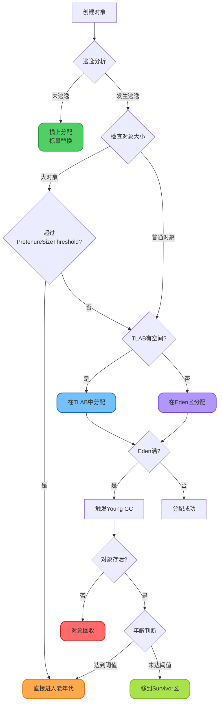
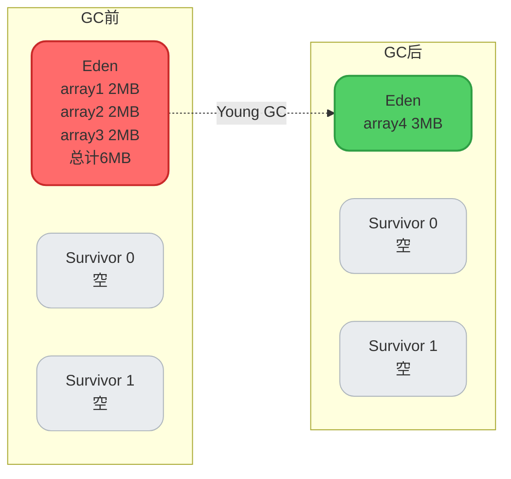
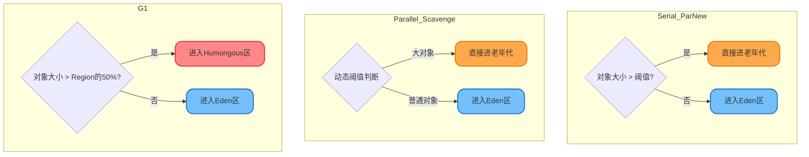
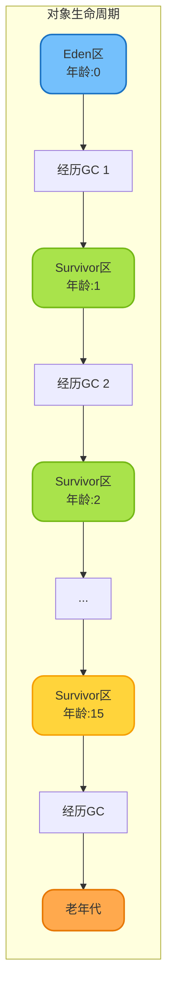
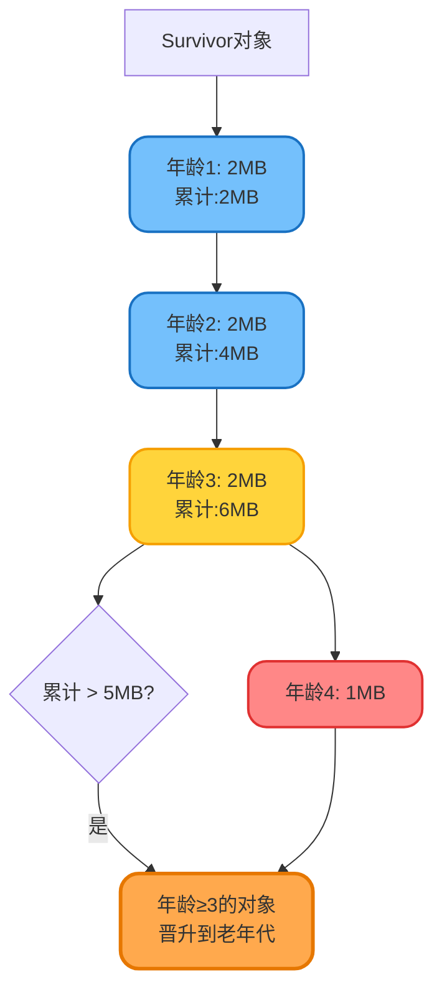
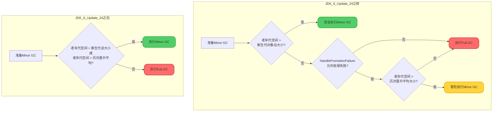
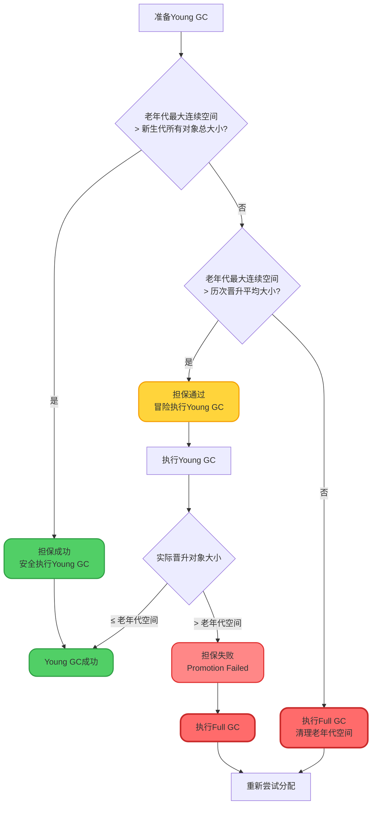
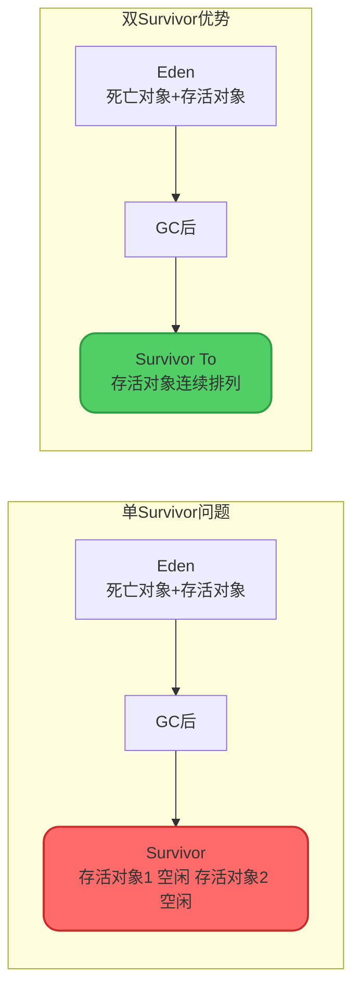
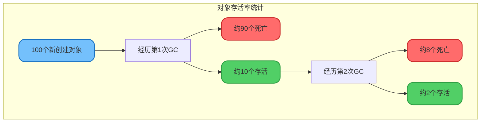

# 内存分配与回收原则

## 对象内存分配策略概述

JVM在为对象分配内存时,遵循一系列优化策略,这些策略旨在提高内存利用率、减少垃圾回收频率,并提升应用性能。



## 内存分配原则

### 1. 对象优先在Eden区分配

绝大多数情况下,新创建的对象首先在新生代的Eden区分配内存。

#### 基本分配流程

```java
public class EdenAllocationDemo {
    public static void main(String[] args) {
        // JVM参数: -Xms20M -Xmx20M -Xmn10M -XX:+PrintGCDetails -XX:SurvivorRatio=8
        // 堆大小20M,新生代10M,Eden:S0:S1 = 8:1:1,即Eden约8M
        
        byte[] array1 = new byte[2 * 1024 * 1024]; // 2MB,在Eden分配
        byte[] array2 = new byte[2 * 1024 * 1024]; // 2MB,在Eden分配
        byte[] array3 = new byte[2 * 1024 * 1024]; // 2MB,在Eden分配
        
        // 此时Eden已使用约6MB,还剩约2MB空间
        byte[] array4 = new byte[3 * 1024 * 1024]; // 3MB
        // Eden空间不足,触发Young GC
        // array1、array2、array3无引用,被回收
        // array4在Eden分配成功
    }
}
```

**运行结果分析**:

```
[GC (Allocation Failure) [PSYoungGen: 7127K->808K(9216K)] 7127K->6952K(19456K), 0.0034568 secs]
```

解读:
- `PSYoungGen: 7127K->808K(9216K)`: 新生代从7127K降到808K
- `7127K->6952K(19456K)`: 整个堆从7127K变为6952K
- `0.0034568 secs`: GC耗时3.4毫秒



#### Eden分配的优势

**优点**:
- 新生代GC速度快(复制算法)
- 大部分对象生命周期短,可快速回收
- 减少老年代的垃圾积累

**适用对象**:
- 临时对象(方法内局部变量)
- 生命周期短的业务对象
- 小对象(< PretenureSizeThreshold)

### 2. 大对象直接进入老年代

**大对象定义**: 需要大量连续内存空间的对象,如长字符串、大数组。

#### 大对象处理机制

大对象直接进入老年代是JVM的动态优化策略,旨在避免:
- Eden区频繁GC
- 对象在Survivor区之间来回复制(复制成本高)
- Survivor区空间不足

```java
public class LargeObjectDemo {
    public static void main(String[] args) {
        // JVM参数: -Xms20M -Xmx20M -XX:+PrintGCDetails
        // -XX:PretenureSizeThreshold=3145728 (3MB)
        
        // 创建4MB的大对象
        byte[] largeArray = new byte[4 * 1024 * 1024];
        // 超过阈值,直接在老年代分配,不触发Young GC
    }
}
```

:::warning 参数限制
`-XX:PretenureSizeThreshold`参数仅对Serial和ParNew收集器有效,对Parallel Scavenge收集器无效。Parallel Scavenge会根据运行时数据动态决定大对象阈值。
:::

#### 不同收集器的大对象处理

**Serial / ParNew收集器**:

```bash
# 显式设置大对象阈值为3MB
-XX:+UseParNewGC
-XX:PretenureSizeThreshold=3145728
```

**Parallel Scavenge收集器**:

- 无固定阈值参数
- 根据堆内存情况和历史数据动态决定
- 更智能但不可精确控制

**G1收集器**:

```bash
# G1根据Region大小决定
-XX:G1HeapRegionSize=4M  # 设置Region大小
# 对象大小超过Region的50%,进入Humongous区(特殊老年代区域)
```



#### 避免大对象的实践

```java
// ❌ 不推荐: 创建大字符串
public String processLargeData() {
    String result = "";
    for (int i = 0; i < 100000; i++) {
        result += "data_" + i; // 频繁创建大字符串
    }
    return result;
}

// ✅ 推荐: 使用StringBuilder
public String processLargeData() {
    StringBuilder sb = new StringBuilder(100000 * 10);
    for (int i = 0; i < 100000; i++) {
        sb.append("data_").append(i);
    }
    return sb.toString();
}

// ✅ 推荐: 分批处理大数组
public void processLargeArray() {
    int batchSize = 1024;
    int totalSize = 1024 * 1024;
    
    for (int i = 0; i < totalSize; i += batchSize) {
        byte[] batch = new byte[batchSize]; // 小批次处理
        process(batch);
        // batch在方法结束后可被快速回收
    }
}
```

### 3. 长期存活的对象进入老年代

JVM通过**对象年龄(Age)**机制,判断对象是否应晋升到老年代。

#### 对象年龄机制

**年龄计数**:
- 对象在Eden区创建,年龄为0
- 经历一次Young GC存活后,移到Survivor区,年龄设为1
- 在Survivor区每经历一次Young GC,年龄+1
- 年龄达到阈值时,晋升到老年代

```java
public class AgingDemo {
    // JVM参数: -XX:MaxTenuringThreshold=15 -XX:+PrintTenuringDistribution
    
    private static List<byte[]> keepAlive = new ArrayList<>();
    
    public static void main(String[] args) {
        // 创建对象并保持引用,使其经历多次GC
        for (int i = 0; i < 20; i++) {
            byte[] array = new byte[256 * 1024]; // 256KB
            keepAlive.add(array);
            
            // 触发Young GC
            byte[] temp = new byte[5 * 1024 * 1024]; // 5MB
            
            System.out.println("Round " + i + " completed");
        }
    }
}
```

**年龄阈值参数**:

```bash
# 设置最大晋升年龄(默认15)
-XX:MaxTenuringThreshold=15

# CMS收集器默认为6
-XX:+UseConcMarkSweepGC  # CMS默认MaxTenuringThreshold=6

# 打印对象年龄分布
-XX:+PrintTenuringDistribution
```

:::info 为什么最大年龄是15?
对象头的Mark Word中,GC年龄字段仅占4位,最大值为15(二进制1111)。
:::



#### 动态年龄判定

JVM并非严格按`MaxTenuringThreshold`晋升对象,而是采用**动态年龄判定**机制:

**判定规则**: 如果Survivor区中相同年龄所有对象的总大小 > Survivor空间 × `TargetSurvivorRatio`(默认50%),则将该年龄及以上的对象晋升到老年代。

```java
// HotSpot源码中的动态年龄计算逻辑(简化版)
int computeTenuringThreshold(Survivor survivor) {
    int maxThreshold = MaxTenuringThreshold;
    long targetSize = survivor.capacity() * TargetSurvivorRatio / 100;
    long cumulativeSize = 0;
    
    for (int age = 1; age <= maxThreshold; age++) {
        cumulativeSize += survivor.getSizeOfAge(age);
        
        // 累计大小超过目标大小,提前晋升
        if (cumulativeSize > targetSize) {
            return Math.min(age, maxThreshold);
        }
    }
    return maxThreshold;
}
```

**示例场景**:

假设:
- Survivor区大小: 10MB
- `TargetSurvivorRatio`: 50%
- 目标大小: 10MB × 50% = 5MB

对象年龄分布:
- 年龄1: 2MB
- 年龄2: 2MB
- 年龄3: 2MB (累计6MB > 5MB)
- 年龄4: 1MB

**结果**: 年龄阈值动态调整为3,年龄≥3的对象晋升到老年代。



**调整参数**:

```bash
# 设置Survivor目标使用率(默认50%)
-XX:TargetSurvivorRatio=60

# 降低值:对象更容易提前晋升,减少Survivor压力
# 提高值:对象在新生代停留更久,可能增加Young GC次数
```

### 4. 空间分配担保机制

**目的**: 确保在Minor GC之前,老年代有足够的空间容纳新生代可能晋升的所有对象。

#### 担保机制原理

空间分配担保是JVM在进行Minor GC前的一项安全检查机制。由于新生代采用复制算法,存活对象可能需要晋升到老年代,因此必须确保老年代有足够的空间来接收这些对象。

**为什么需要担保?**

在Minor GC发生前,JVM无法准确预知有多少对象会存活并晋升到老年代。如果贸然执行Minor GC,可能出现:
- Survivor区无法容纳所有存活对象
- 老年代空间不足以接收晋升对象
- 导致担保失败,触发Full GC

#### JDK版本差异

空间分配担保的检查策略在不同JDK版本中有所变化:

**JDK 6 Update 24之前的策略**:

1. **第一步检查**: 老年代最大可用连续空间 > 新生代所有对象总空间?
   - 是 → Minor GC安全,直接执行
   - 否 → 进入第二步

2. **第二步检查**: `-XX:HandlePromotionFailure`参数是否允许担保失败?
   - 否 → 直接执行Full GC
   - 是 → 进入第三步

3. **第三步检查**: 老年代最大可用连续空间 > 历次晋升到老年代对象的平均大小?
   - 是 → 冒险执行Minor GC(有风险)
   - 否 → 执行Full GC

```bash
# JDK 6中的参数配置
-XX:+HandlePromotionFailure  # 允许担保失败,进行风险评估
-XX:-HandlePromotionFailure  # 不允许担保失败,直接Full GC
```

**JDK 6 Update 24及以后的策略**:

`-XX:HandlePromotionFailure`参数被移除,采用更简化的检查规则:

- **检查条件**: 老年代连续空间 > 新生代对象总大小 **或** 老年代连续空间 > 历次晋升平均大小
  - 满足任一条件 → 执行Minor GC
  - 都不满足 → 执行Full GC

这种简化策略更加智能,无需手动配置参数,JVM自动进行风险评估。



#### 担保流程详解(现代JVM)



#### 历次晋升平均大小的计算

**统计维度**: JVM在运行过程中,会记录每次Minor GC后晋升到老年代的对象总大小。

**计算公式**:
```
历次晋升平均大小 = Σ(每次Minor GC的晋升对象大小) / Minor GC次数
```

**示例数据**:

| Minor GC次数 | 晋升对象大小 | 累计晋升大小 | 平均大小 |
|------------|------------|------------|--------|
| 1 | 5MB | 5MB | 5MB |
| 2 | 8MB | 13MB | 6.5MB |
| 3 | 6MB | 19MB | 6.3MB |
| 4 | 7MB | 26MB | 6.5MB |
| 5 | 9MB | 35MB | 7MB |

**使用场景**: 在第6次Minor GC前,JVM会用7MB作为历次晋升平均大小来判断老年代空间是否足够。

#### 担保成功与失败的场景

**场景1: 担保成功**

```java
public class GuaranteeSuccessDemo {
    public static void main(String[] args) {
        // JVM参数: -Xms20M -Xmx20M -Xmn10M -XX:+PrintGCDetails
        // 堆20M,新生代10M,老年代10M
        
        // 老年代当前可用空间: 10MB
        // 新生代对象总大小: 约8MB
        // 历次晋升平均: 2MB
        
        // 检查: 10MB > 8MB (满足条件)
        // 结果: 安全执行Minor GC
        
        byte[] array1 = new byte[2 * 1024 * 1024]; // 2MB
        byte[] array2 = new byte[2 * 1024 * 1024]; // 2MB
        byte[] array3 = new byte[2 * 1024 * 1024]; // 2MB
        
        // 触发Minor GC,担保成功
        byte[] array4 = new byte[4 * 1024 * 1024]; // 4MB
    }
}
```

**场景2: 担保失败,触发Full GC**

```java
public class GuaranteeFailureDemo {
    private static List<byte[]> oldGenObjects = new ArrayList<>();
    
    public static void main(String[] args) {
        // JVM参数: -Xms20M -Xmx20M -Xmn8M -XX:+PrintGCDetails
        // 堆20M,新生代8M,老年代12M
        
        // 先填满老年代大部分空间
        for (int i = 0; i < 5; i++) {
            byte[] old = new byte[2 * 1024 * 1024]; // 2MB
            oldGenObjects.add(old);
        }
        // 老年代已使用10MB,剩余2MB
        
        // 新生代创建对象
        byte[] young1 = new byte[2 * 1024 * 1024]; // 2MB
        byte[] young2 = new byte[2 * 1024 * 1024]; // 2MB
        byte[] young3 = new byte[2 * 1024 * 1024]; // 2MB
        
        // 检查: 老年代剩余2MB < 新生代6MB
        // 检查: 老年代剩余2MB < 历次晋升平均3MB
        // 结果: 先执行Full GC,清理老年代空间
        
        byte[] young4 = new byte[2 * 1024 * 1024]; // 2MB,触发GC
    }
}
```

#### 担保失败的后果

**Promotion Failed(晋升失败)**:
- Survivor区对象无法进入老年代
- 触发Full GC,整理老年代碎片
- 应用停顿时间延长

**预防措施**:

```java
// ❌ 导致频繁晋升失败的代码
public class PromotionFailureDemo {
    private static List<byte[]> cache = new ArrayList<>();
    
    public static void main(String[] args) {
        while (true) {
            // 持续创建对象,导致老年代快速填满
            for (int i = 0; i < 100; i++) {
                byte[] array = new byte[1024 * 1024]; // 1MB
                cache.add(array);
            }
            
            // 定期清理,但老年代已碎片化
            if (cache.size() > 500) {
                cache.subList(0, 250).clear();
            }
        }
    }
}

// ✅ 改进: 控制对象生命周期
public class ImprovedDemo {
    private static final int MAX_CACHE_SIZE = 100;
    private static LinkedHashMap<String, byte[]> cache = 
        new LinkedHashMap<String, byte[]>(MAX_CACHE_SIZE, 0.75f, true) {
            @Override
            protected boolean removeEldestEntry(Map.Entry eldest) {
                return size() > MAX_CACHE_SIZE;
            }
        };
    
    public static void main(String[] args) {
        // LRU缓存,自动淘汰老对象,减少老年代压力
        for (int i = 0; i < 10000; i++) {
            cache.put("key_" + i, new byte[1024 * 1024]);
        }
    }
}
```

#### JDK版本差异

**JDK 6**:

需要显式开启担保:

```bash
-XX:+HandlePromotionFailure
```

**JDK 7及以后**:

`HandlePromotionFailure`参数被移除,JVM自动进行智能担保检查,无需手动配置。

## Survivor区的必要性

### 为什么需要两个Survivor区?

如果只有一个Survivor区,会导致严重的问题:

**问题1: 内存碎片化**



**问题2: 无法实现复制算法**

复制算法需要两块相同大小的内存区域:
- From区: 保存上次GC存活的对象
- To区: 接收本次GC存活的对象

**双Survivor工作流程**:

```java
// 第一次Young GC
Eden(8MB) + Survivor0(1MB) -> Survivor1(1MB存活对象)
// Survivor0和Eden清空

// 第二次Young GC
Eden(8MB) + Survivor1(1MB) -> Survivor0(1MB存活对象)
// Survivor1和Eden清空

// 如此往复,始终保持一个Survivor为空
```

### Eden与Survivor的比例

**默认比例**: Eden:Survivor0:Survivor1 = 8:1:1

```bash
# 调整比例
-XX:SurvivorRatio=8  # Eden占新生代的8/(8+1+1) = 80%

# 示例: 新生代10MB
# Eden: 8MB
# Survivor0: 1MB
# Survivor1: 1MB
```

**为什么是8:1:1?**

基于大量实际应用的统计数据:
- 约90%的对象在第一次GC时就死亡
- Eden占80%可容纳大部分新对象
- 10%的Survivor区足以容纳存活对象



**极端情况处理**:

如果Survivor区无法容纳所有存活对象:

```java
// 触发空间分配担保
// 存活对象直接进入老年代
```

## 内存分配优化实践

### 1. 合理设置堆内存大小

```bash
# 初始堆大小和最大堆大小设置为相同值,避免动态扩容
-Xms4G -Xmx4G

# 新生代大小(建议占堆的1/3到1/2)
-Xmn2G

# 或使用比例设置
-XX:NewRatio=2  # 老年代:新生代 = 2:1
```

### 2. 调整对象晋升策略

```bash
# 降低晋升年龄,让长生命周期对象快速进入老年代
-XX:MaxTenuringThreshold=5

# 提高Survivor使用率阈值,减少提前晋升
-XX:TargetSurvivorRatio=70
```

### 3. 避免创建大对象

```java
// ✅ 推荐: 分批加载数据
public List<User> loadUsers(int offset, int limit) {
    return userRepository.findAll(offset, limit);
}

// 分页处理
for (int offset = 0; offset < totalCount; offset += 1000) {
    List<User> batch = loadUsers(offset, 1000);
    processBatch(batch);
}

// ❌ 不推荐: 一次性加载所有数据
List<User> allUsers = userRepository.findAll(); // 可能几十万条数据
```

### 4. 监控GC日志

```bash
# 开启详细GC日志
-XX:+PrintGCDetails
-XX:+PrintGCDateStamps
-XX:+PrintTenuringDistribution
-XX:+PrintGCApplicationStoppedTime
-Xloggc:/var/log/gc.log

# 分析工具推荐
# - GCEasy (在线分析)
# - GCViewer (本地工具)
# - JProfiler (商业工具)
```

### 5. 使用合适的垃圾收集器

```bash
# 低延迟优先: G1或ZGC
-XX:+UseG1GC -XX:MaxGCPauseMillis=200

# 高吞吐量优先: Parallel GC
-XX:+UseParallelGC -XX:GCTimeRatio=99

# 响应时间敏感: ZGC (JDK 11+)
-XX:+UseZGC -XX:ZCollectionInterval=5
```

## 常见内存问题诊断

### 频繁Young GC

**现象**: Young GC频率过高(每秒多次)

**原因**:
- Eden区过小
- 对象创建速率过高
- 无用对象未及时释放

**解决方案**:

```bash
# 增大新生代
-Xmn4G

# 优化代码,减少对象创建
# 使用对象池、缓存复用
```

### 频繁Full GC

**现象**: Full GC频繁(每小时多次)

**原因**:
- 老年代空间不足
- 大对象过多
- 内存泄漏

**解决方案**:

```bash
# 增大堆内存
-Xms8G -Xmx8G

# 调整新生代比例
-XX:NewRatio=1  # 老年代:新生代 = 1:1

# 使用内存分析工具定位泄漏
jmap -dump:live,format=b,file=heap.bin <pid>
```

### Promotion Failed

**现象**: 日志出现"promotion failed"

**原因**:
- 老年代碎片化
- 晋升对象过多

**解决方案**:

```bash
# 使用压缩式GC算法
-XX:+UseConcMarkSweepGC -XX:+UseCMSCompactAtFullCollection

# 或切换到G1
-XX:+UseG1GC
```

:::tip 最佳实践总结
1. **优先在Eden区分配**: 利用新生代GC的高效性
2. **控制大对象**: 避免大对象直接进入老年代
3. **合理设置晋升年龄**: 平衡新生代和老年代的压力
4. **监控空间分配担保**: 预防Promotion Failed
5. **定期分析GC日志**: 及时发现和解决内存问题
:::
