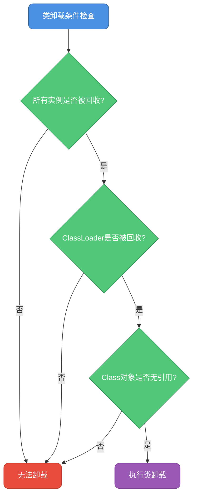
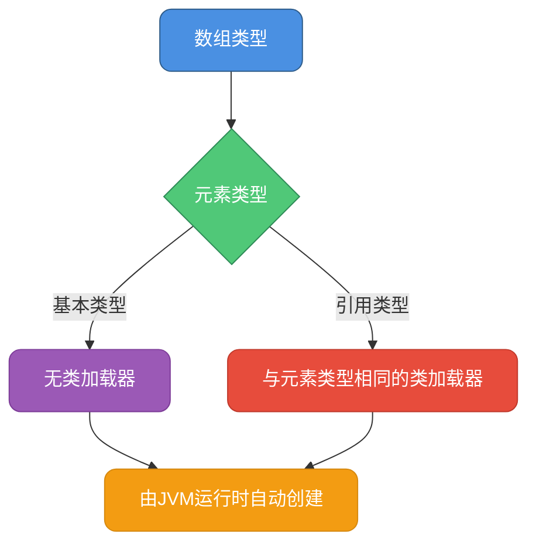

# 类的生命周期与加载时机

## 类的完整生命周期

在Java虚拟机中，每个类从被创建到最终被回收，都要经历一个完整的生命周期。这个过程可以分为三个主要阶段：**类的加载、类的使用、类的卸载**。


### 类加载阶段详解

类的加载阶段是整个生命周期的核心，它包含了五个子阶段：

#### 加载（Loading）
加载阶段主要完成三件事：
1. 通过类的全限定名获取该类的二进制字节流
2. 将字节流代表的静态存储结构转换为方法区的运行时数据结构
3. 在堆内存中生成一个代表这个类的`java.lang.Class`对象，作为访问方法区数据的入口

这个阶段开发者可以通过自定义类加载器来控制字节流的获取方式，比如从网络、数据库、甚至动态生成。

#### 验证（Verification）
验证阶段确保Class文件的字节流符合JVM规范，保证不会危害虚拟机安全。主要包括：
- **文件格式验证**：验证字节流是否符合Class文件格式规范
- **元数据验证**：对类的元数据信息进行语义分析
- **字节码验证**：通过数据流和控制流分析，确定程序语义合法
- **符号引用验证**：确保解析动作能正确执行

#### 准备（Preparation）
准备阶段为类的静态变量分配内存，并设置默认初始值。

```java
// 电商订单处理示例
public class OrderProcessor {
    // 准备阶段：orderCount = 0
    public static int orderCount = 100;
    
    // 准备阶段：maxRetryTimes = 3（final常量直接赋值）
    public static final int maxRetryTimes = 3;
    
    // 实例变量不在准备阶段分配
    private String orderId;
}
```

在准备阶段，`orderCount`会被赋值为0，而不是100。只有`final`修饰的`maxRetryTimes`会直接赋值为3。

#### 解析（Resolution）
解析阶段将常量池内的符号引用替换为直接引用。符号引用是用一组符号来描述引用目标，而直接引用是直接指向目标的指针或偏移量。

```java
// 支付系统示例
public class PaymentService {
    // 符号引用：com/example/payment/AlipayClient
    private AlipayClient alipayClient;
    
    public void processPayment(Order order) {
        // 方法调用的符号引用会被解析为直接引用
        alipayClient.pay(order.getAmount());
    }
}
```

#### 初始化（Initialization）
初始化阶段执行类构造器`<clinit>()`方法，真正执行类中定义的Java代码。

```java
// 库存管理系统示例
public class InventoryManager {
    // 静态变量
    public static int totalStock = 1000;
    
    // 静态代码块
    static {
        System.out.println("初始化库存管理系统");
        totalStock = loadStockFromDatabase();
    }
    
    private static int loadStockFromDatabase() {
        // 从数据库加载库存数据
        return 5000;
    }
}
```

初始化阶段，`totalStock`才会从0变为1000，然后执行静态代码块，最终值为5000。

### 类的使用阶段

类加载完成后，程序代码就可以使用该类了，包括：
- 创建类的实例对象
- 访问类的静态字段和静态方法
- 通过反射获取类的元数据信息

```java
// 用户服务示例
public class UserServiceDemo {
    public static void main(String[] args) {
        // 使用阶段：创建对象实例
        UserService userService = new UserService();
        
        // 使用阶段：调用实例方法
        User user = userService.getUserById(1001);
        
        // 使用阶段：访问静态方法
        int count = UserService.getTotalUsers();
    }
}
```

### 类的卸载阶段

当一个类满足以下条件时，会在Full GC期间从方法区被回收：

1. 该类的所有实例对象都已被GC回收
2. 加载该类的ClassLoader已经被GC回收
3. 该类对应的Class对象没有在任何地方被引用



**哪些类会被卸载？**

JVM自带的类加载器（Bootstrap、Extension、Application ClassLoader）加载的基础类永远不会被卸载，因为这些类加载器实例不会被回收。

但是自定义类加载器加载的类可能会被卸载，典型场景包括：
- **Tomcat热部署**：每次重新部署应用时，旧的类会被卸载
- **JSP动态编译**：JSP编译生成的临时类使用后会被卸载
- **SPI机制**：某些插件类在不使用时可能被卸载
- **动态代理**：运行时生成的代理类

```java
// Tomcat热部署场景示例
public class TomcatWebappDemo {
    public static void main(String[] args) throws Exception {
        // Tomcat为每个Web应用创建独立的ClassLoader
        WebappClassLoader webappLoader = new WebappClassLoader();
        
        // 加载应用类
        Class<?> servletClass = webappLoader.loadClass("com.example.MyServlet");
        
        // 重新部署时，旧的webappLoader和加载的类都会被卸载
        webappLoader = null;
        System.gc(); // 触发GC，类可能被卸载
    }
}
```

## 类的加载时机

Java类采用**延迟加载（Lazy Loading）**策略，只有在真正需要使用时才会被加载到内存中。这种设计提高了程序启动速度，减少了内存占用。

### 主动引用触发类加载

以下情况会主动触发类的加载和初始化：

#### 1. 创建类的实例对象

```java
// 电商购物车示例
public class ShoppingCartDemo {
    public static void main(String[] args) {
        // 使用new关键字创建对象，触发ShoppingCart类的加载和初始化
        ShoppingCart cart = new ShoppingCart();
        cart.addProduct(new Product("手机", 2999.0));
    }
}

class ShoppingCart {
    static {
        System.out.println("ShoppingCart类被初始化");
    }
    
    private List<Product> products = new ArrayList<>();
    
    public void addProduct(Product product) {
        products.add(product);
    }
}
```

#### 2. 访问类的静态变量或静态方法

```java
// 缓存管理示例
public class CacheManagerDemo {
    public static void main(String[] args) {
        // 访问静态变量，触发CacheManager类的加载和初始化
        int cacheSize = CacheManager.DEFAULT_CACHE_SIZE;
        
        // 调用静态方法，同样会触发类的加载
        CacheManager.clearCache();
    }
}

class CacheManager {
    static {
        System.out.println("CacheManager类被初始化");
    }
    
    public static final int DEFAULT_CACHE_SIZE = 1024;
    
    public static void clearCache() {
        System.out.println("清空缓存");
    }
}
```

**注意**：访问`final`修饰的编译期常量不会触发类的初始化：

```java
public class ConstantDemo {
    public static void main(String[] args) {
        // 访问编译期常量，不会触发Constants类初始化
        int value = Constants.MAX_VALUE;
    }
}

class Constants {
    static {
        System.out.println("这行不会被打印");
    }
    
    // 编译期常量，会被内联到调用处
    public static final int MAX_VALUE = 100;
}
```

#### 3. 使用反射机制访问类

```java
// 插件系统示例
public class PluginLoaderDemo {
    public static void main(String[] args) throws Exception {
        // 使用Class.forName()触发类的加载和初始化
        Class<?> pluginClass = Class.forName("com.example.PaymentPlugin");
        
        // 创建插件实例
        Object plugin = pluginClass.getDeclaredConstructor().newInstance();
        
        // 调用插件方法
        Method method = pluginClass.getMethod("execute");
        method.invoke(plugin);
    }
}

class PaymentPlugin {
    static {
        System.out.println("支付插件被加载");
    }
    
    public void execute() {
        System.out.println("执行支付操作");
    }
}
```

#### 4. JVM启动时加载主类

```java
// 应用程序入口
public class ApplicationMain {
    static {
        System.out.println("主类被初始化");
    }
    
    public static void main(String[] args) {
        // JVM启动时会先加载并初始化包含main方法的类
        System.out.println("应用程序启动");
    }
}
```

#### 5. 初始化子类时先初始化父类

```java
// 消息通知系统示例
public class NotificationDemo {
    public static void main(String[] args) {
        // 初始化EmailNotification时，会先初始化父类Notification
        EmailNotification notification = new EmailNotification();
    }
}

class Notification {
    static {
        System.out.println("父类Notification被初始化");
    }
}

class EmailNotification extends Notification {
    static {
        System.out.println("子类EmailNotification被初始化");
    }
}

// 输出：
// 父类Notification被初始化
// 子类EmailNotification被初始化
```

### 被动引用不触发类加载

以下情况不会触发类的初始化：

```java
// 被动引用示例
public class PassiveReferenceDemo {
    public static void main(String[] args) {
        // 1. 通过子类引用父类的静态字段，不会初始化子类
        System.out.println(Child.parentValue);
        
        // 2. 定义数组不会初始化数组元素类型
        Parent[] array = new Parent[10];
        
        // 3. 访问编译期常量不会初始化类
        System.out.println(Constants.COMPILE_TIME_CONSTANT);
    }
}

class Parent {
    static {
        System.out.println("父类初始化");
    }
    public static int parentValue = 100;
}

class Child extends Parent {
    static {
        System.out.println("子类初始化"); // 不会打印
    }
}
```

## 数组类的特殊加载机制

数组在Java中也是一种类型，但它的加载机制与普通类有很大区别。

### 数组类的创建规则

根据Java虚拟机规范：
> 数组类的Class对象不是由类加载器创建的，而是由Java运行时根据需要自动创建。数组类的类加载器与其元素类型的类加载器相同；如果元素类型是基本类型，则数组类没有类加载器。

```java
// 数组加载机制示例
public class ArrayLoadingDemo {
    public static void main(String[] args) {
        // 1. 对象数组：加载器与元素类型相同
        Student[] students = new Student[5];
        ClassLoader loader1 = students.getClass().getClassLoader();
        ClassLoader loader2 = Student.class.getClassLoader();
        System.out.println("对象数组加载器：" + loader1);
        System.out.println("Student类加载器：" + loader2);
        System.out.println("加载器相同：" + (loader1 == loader2));
        
        // 2. 基本类型数组：没有类加载器
        int[] numbers = new int[10];
        ClassLoader loader3 = numbers.getClass().getClassLoader();
        System.out.println("基本类型数组加载器：" + loader3); // null
        
        // 3. 多维数组
        Student[][] matrix = new Student[3][4];
        System.out.println("二维数组类型：" + matrix.getClass().getName());
        // 输出：[[Lcom.example.Student;
    }
}

class Student {
    private String name;
    private int age;
}
```

### 数组类型的命名规则

数组类型的全限定名有特殊格式：

```java
public class ArrayTypeNameDemo {
    public static void main(String[] args) {
        // 一维数组
        int[] intArray = new int[5];
        System.out.println(intArray.getClass().getName()); // [I
        
        String[] strArray = new String[5];
        System.out.println(strArray.getClass().getName()); // [Ljava.lang.String;
        
        // 二维数组
        double[][] doubleMatrix = new double[3][4];
        System.out.println(doubleMatrix.getClass().getName()); // [[D
        
        Object[][] objMatrix = new Object[2][3];
        System.out.println(objMatrix.getClass().getName()); // [[Ljava.lang.Object;
    }
}
```

数组类型命名规则：
- `[` 表示数组维度，几个`[`就是几维
- `L` + 类全名 + `;` 表示引用类型
- `I` 表示int，`D`表示double，`Z`表示boolean，以此类推



### 数组的初始化特点

```java
// 数组初始化示例
public class ArrayInitDemo {
    public static void main(String[] args) {
        // 创建数组时，元素类型的类会被加载但不一定初始化
        Product[] products = new Product[10];
        
        // 只有真正创建元素对象时，才会初始化元素类
        products[0] = new Product("笔记本电脑", 5999.0);
    }
}

class Product {
    static {
        System.out.println("Product类被初始化");
    }
    
    private String name;
    private double price;
    
    public Product(String name, double price) {
        this.name = name;
        this.price = price;
    }
}
```

## 类加载的线程安全性

类加载过程是线程安全的，JVM保证多个线程同时加载同一个类时，只有一个线程能够执行加载操作。

```java
// ClassLoader的loadClass方法（JDK源码）
protected Class<?> loadClass(String name, boolean resolve) 
        throws ClassNotFoundException {
    synchronized (getClassLoadingLock(name)) {
        // 1. 检查类是否已经加载
        Class<?> c = findLoadedClass(name);
        if (c == null) {
            // 2. 委派父类加载器加载
            // 3. 如果父类加载器无法加载，则自己加载
        }
        return c;
    }
}
```

通过`synchronized`关键字保证了同一个类只会被加载一次，这对于单例模式等场景非常重要：

```java
// 线程安全的类加载示例
public class ThreadSafeLoadingDemo {
    public static void main(String[] args) {
        // 多线程同时触发类加载
        for (int i = 0; i < 10; i++) {
            new Thread(() -> {
                // 所有线程看到的ConfigManager都是同一个Class对象
                ConfigManager.getInstance();
            }).start();
        }
    }
}

class ConfigManager {
    static {
        System.out.println("ConfigManager初始化，线程：" 
            + Thread.currentThread().getName());
    }
    
    private static final ConfigManager INSTANCE = new ConfigManager();
    
    private ConfigManager() {}
    
    public static ConfigManager getInstance() {
        return INSTANCE;
    }
}
```

## 总结

类的生命周期和加载时机是Java类加载机制的基础，理解这些概念对于：
- 优化应用启动性能
- 解决类加载相关问题
- 实现动态类加载和热部署
- 正确使用单例模式等设计模式

都有重要意义。记住核心要点：
1. 类加载采用延迟加载策略
2. 类加载过程是线程安全的
3. 数组类由JVM自动创建
4. 只有主动引用才触发类初始化
5. 满足条件的类会在Full GC时被卸载
