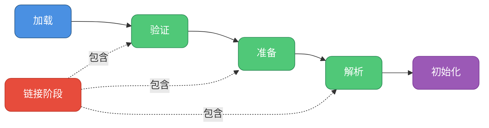
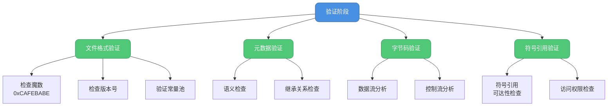
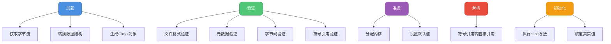

# 类加载详细流程解析

## 类加载的五个阶段

Java类的加载过程可以分为**加载（Loading）**、**链接（Linking）** 和 **初始化（Initialization）** 三个大阶段。其中链接阶段又细分为 **验证（Verification）** 、**准备（Preparation）** 和 **解析（Resolution）** 三个子阶段。



## 加载（Loading）阶段

加载阶段是整个类加载过程的第一步，JVM需要完成以下三件事：

### 1. 获取类的二进制字节流

通过类的全限定名获取定义该类的二进制字节流。这个过程非常灵活，可以从多种来源获取：

```java
// 示例：不同来源的类加载
public class MultiSourceLoadingDemo {
    public static void main(String[] args) throws Exception {
        // 1. 从JAR包中加载
        Class<?> clazz1 = Class.forName("com.mysql.jdbc.Driver");
        
        // 2. 从网络加载（自定义类加载器）
        NetworkClassLoader networkLoader = new NetworkClassLoader(
            "http://example.com/classes/");
        Class<?> clazz2 = networkLoader.loadClass("com.example.RemoteService");
        
        // 3. 运行时动态生成（代理模式）
        InvocationHandler handler = new MyInvocationHandler();
        UserService proxy = (UserService) Proxy.newProxyInstance(
            UserService.class.getClassLoader(),
            new Class[]{UserService.class},
            handler
        );
    }
}

// 网络类加载器示例
class NetworkClassLoader extends ClassLoader {
    private String baseUrl;
    
    public NetworkClassLoader(String baseUrl) {
        this.baseUrl = baseUrl;
    }
    
    @Override
    protected Class<?> findClass(String name) throws ClassNotFoundException {
        try {
            // 从网络获取字节流
            String path = baseUrl + name.replace('.', '/') + ".class";
            byte[] classData = downloadClassData(path);
            
            // 将字节流转换为Class对象
            return defineClass(name, classData, 0, classData.length);
        } catch (Exception e) {
            throw new ClassNotFoundException(name, e);
        }
    }
    
    private byte[] downloadClassData(String url) throws IOException {
        // 从网络下载类文件
        URLConnection connection = new URL(url).openConnection();
        InputStream input = connection.getInputStream();
        ByteArrayOutputStream output = new ByteArrayOutputStream();
        
        byte[] buffer = new byte[4096];
        int bytesRead;
        while ((bytesRead = input.read(buffer)) != -1) {
            output.write(buffer, 0, bytesRead);
        }
        
        return output.toByteArray();
    }
}
```

### 2. 转换为方法区的运行时数据结构

将字节流所代表的静态存储结构转换为方法区的运行时数据结构。这些数据包括：
- 类的完整限定名
- 类的访问修饰符（public、abstract等）
- 父类信息
- 接口信息
- 字段信息
- 方法信息
- 常量池

```java
// 方法区数据结构示例
public class MethodAreaDataDemo {
    public static void main(String[] args) throws Exception {
        Class<?> clazz = PaymentService.class;
        
        // 访问方法区中的类信息
        System.out.println("类名：" + clazz.getName());
        System.out.println("修饰符：" + Modifier.toString(clazz.getModifiers()));
        System.out.println("父类：" + clazz.getSuperclass().getName());
        
        // 访问字段信息
        Field[] fields = clazz.getDeclaredFields();
        for (Field field : fields) {
            System.out.println("字段：" + field.getName() + 
                             ", 类型：" + field.getType().getName());
        }
        
        // 访问方法信息
        Method[] methods = clazz.getDeclaredMethods();
        for (Method method : methods) {
            System.out.println("方法：" + method.getName());
        }
    }
}

class PaymentService {
    private String merchantId;
    private double balance;
    
    public void processPayment(Order order) {
        // 处理支付逻辑
    }
    
    public double getBalance() {
        return balance;
    }
}
```

### 3. 生成Class对象

在堆内存中生成一个代表这个类的`java.lang.Class`对象，作为访问方法区中这些数据的入口。

```java
// Class对象示例
public class ClassObjectDemo {
    public static void main(String[] args) {
        // 不同方式获取同一个Class对象
        ShoppingCart cart1 = new ShoppingCart();
        
        Class<?> clazz1 = cart1.getClass();
        Class<?> clazz2 = ShoppingCart.class;
        Class<?> clazz3 = null;
        try {
            clazz3 = Class.forName("com.example.ShoppingCart");
        } catch (ClassNotFoundException e) {
            e.printStackTrace();
        }
        
        // 三种方式获取的是同一个Class对象
        System.out.println(clazz1 == clazz2); // true
        System.out.println(clazz2 == clazz3); // true
    }
}

class ShoppingCart {
    private List<Product> items = new ArrayList<>();
    
    public void addItem(Product product) {
        items.add(product);
    }
}
```

## 验证（Verification）阶段

验证阶段确保Class文件的字节流符合JVM规范，保证这些信息不会危害虚拟机安全。

### 验证的四个步骤



### 1. 文件格式验证

验证字节流是否符合Class文件格式规范：

```java
// 文件格式验证示例（JVM内部逻辑）
public class FileFormatVerification {
    
    public void verifyClassFile(byte[] classData) {
        // 1. 验证魔数（前4个字节必须是0xCAFEBABE）
        if (!checkMagicNumber(classData)) {
            throw new ClassFormatError("Invalid magic number");
        }
        
        // 2. 验证版本号
        int minorVersion = readU2(classData, 4);
        int majorVersion = readU2(classData, 6);
        if (!isSupportedVersion(majorVersion, minorVersion)) {
            throw new UnsupportedClassVersionError(
                "Unsupported class version: " + majorVersion + "." + minorVersion);
        }
        
        // 3. 验证常量池标签
        if (!verifyConstantPool(classData)) {
            throw new ClassFormatError("Invalid constant pool");
        }
    }
    
    private boolean checkMagicNumber(byte[] data) {
        return data[0] == (byte) 0xCA &&
               data[1] == (byte) 0xFE &&
               data[2] == (byte) 0xBA &&
               data[3] == (byte) 0xBE;
    }
    
    private int readU2(byte[] data, int offset) {
        return ((data[offset] & 0xFF) << 8) | (data[offset + 1] & 0xFF);
    }
    
    private boolean isSupportedVersion(int major, int minor) {
        // Java 8 对应版本号 52
        // Java 11 对应版本号 55
        // Java 17 对应版本号 61
        return major >= 45 && major <= getCurrentJVMVersion();
    }
    
    private int getCurrentJVMVersion() {
        String version = System.getProperty("java.class.version");
        return Integer.parseInt(version.split("\\.")[0]);
    }
    
    private boolean verifyConstantPool(byte[] data) {
        // 验证常量池中的每个常量项
        return true;
    }
}
```

### 2. 元数据验证

对类的元数据信息进行语义分析：

```java
// 元数据验证示例
public class MetadataVerification {
    
    public void verifyMetadata(Class<?> clazz) throws VerifyError {
        // 1. 验证类必须有父类（除了Object类）
        if (clazz != Object.class && clazz.getSuperclass() == null) {
            throw new VerifyError("Class must have a superclass");
        }
        
        // 2. 验证final类不能有子类
        if (Modifier.isFinal(clazz.getModifiers()) && 
            hasSubclass(clazz)) {
            throw new VerifyError("Final class cannot be extended");
        }
        
        // 3. 验证不能继承final方法
        verifyFinalMethods(clazz);
        
        // 4. 验证接口实现
        verifyInterfaceImplementation(clazz);
    }
    
    private boolean hasSubclass(Class<?> clazz) {
        // 检查是否有子类（简化示例）
        return false;
    }
    
    private void verifyFinalMethods(Class<?> clazz) {
        Class<?> superClass = clazz.getSuperclass();
        if (superClass == null) return;
        
        // 检查是否重写了父类的final方法
        for (Method method : clazz.getDeclaredMethods()) {
            try {
                Method superMethod = superClass.getDeclaredMethod(
                    method.getName(), method.getParameterTypes());
                if (Modifier.isFinal(superMethod.getModifiers())) {
                    throw new VerifyError(
                        "Cannot override final method: " + method.getName());
                }
            } catch (NoSuchMethodException e) {
                // 不是重写方法，继续
            }
        }
    }
    
    private void verifyInterfaceImplementation(Class<?> clazz) {
        // 验证抽象类和接口的实现
        if (!Modifier.isAbstract(clazz.getModifiers())) {
            for (Class<?> iface : clazz.getInterfaces()) {
                for (Method method : iface.getMethods()) {
                    try {
                        clazz.getDeclaredMethod(method.getName(), 
                            method.getParameterTypes());
                    } catch (NoSuchMethodException e) {
                        throw new VerifyError(
                            "Class must implement interface method: " + 
                            method.getName());
                    }
                }
            }
        }
    }
}
```

### 3. 字节码验证

通过数据流和控制流分析，确定程序语义合法：

```java
// 字节码验证示例
public class BytecodeVerification {
    
    // 示例：验证方法的字节码
    public void verifyMethodBytecode(Method method) {
        // 1. 验证操作数栈深度不会溢出
        // 2. 验证局部变量表访问不会越界
        // 3. 验证指令的操作数类型匹配
        
        // 错误示例：类型不匹配
        // int a = "string";  // 编译期就会报错
        // 但字节码层面需要再次验证
    }
    
    // 正确的代码示例
    public void correctExample() {
        OrderService service = new OrderService();
        Order order = service.createOrder("ORD123", 99.99);
        
        if (order != null) {
            order.process();
        }
    }
    
    // 错误的字节码会被拒绝（假设通过字节码修改工具生成）
    // public void incorrectBytecode() {
    //     // 假设字节码被篡改，尝试将String赋值给int
    //     // 这会在字节码验证阶段被检测出来
    // }
}

class OrderService {
    public Order createOrder(String orderId, double amount) {
        return new Order(orderId, amount);
    }
}

class Order {
    private String orderId;
    private double amount;
    
    public Order(String orderId, double amount) {
        this.orderId = orderId;
        this.amount = amount;
    }
    
    public void process() {
        System.out.println("Processing order: " + orderId);
    }
}
```

### 4. 符号引用验证

验证符号引用的正确性，确保解析阶段能正常执行：

```java
// 符号引用验证示例
public class SymbolicReferenceVerification {
    
    public static void main(String[] args) {
        // 正确的符号引用
        PaymentProcessor processor = new PaymentProcessor();
        processor.process(new Transaction());
    }
}

class PaymentProcessor {
    // 符号引用验证会检查：
    // 1. Transaction类是否存在
    // 2. 当前类是否有权限访问Transaction类
    // 3. Transaction类是否有无参构造方法
    public void process(Transaction transaction) {
        transaction.execute();
    }
}

class Transaction {
    public void execute() {
        System.out.println("Executing transaction");
    }
}

// 如果Transaction类不存在，会抛出NoClassDefFoundError
// 如果execute方法不存在，会抛出NoSuchMethodError
// 如果没有访问权限，会抛出IllegalAccessError
```

## 准备（Preparation）阶段

准备阶段为类的静态变量分配内存，并设置默认初始值。

### 静态变量的内存分配

```java
// 准备阶段示例
public class PreparationPhaseDemo {
    
    // 准备阶段：分配内存并赋默认值
    public static int maxConnections = 100;        // 准备阶段赋值为0
    public static String appName = "MyApp";        // 准备阶段赋值为null
    public static boolean isDebugMode = true;      // 准备阶段赋值为false
    public static Object configObj = new Object(); // 准备阶段赋值为null
    
    // final常量：准备阶段直接赋值
    public static final int TIMEOUT = 3000;        // 准备阶段赋值为3000
    public static final String VERSION = "1.0.0";  // 准备阶段赋值为"1.0.0"
    
    // 实例变量：不在准备阶段处理
    private int instanceVar = 50;
    
    // 初始化阶段才会执行的代码
    static {
        System.out.println("初始化阶段执行");
        maxConnections = 100;  // 这时才真正赋值为100
    }
}
```

### 各种类型的默认值

```java
// 默认值示例
public class DefaultValuesDemo {
    
    public static void main(String[] args) {
        // 准备阶段后的值
        System.out.println("byte默认值: " + StaticFields.byteValue);      // 0
        System.out.println("short默认值: " + StaticFields.shortValue);    // 0
        System.out.println("int默认值: " + StaticFields.intValue);        // 0
        System.out.println("long默认值: " + StaticFields.longValue);      // 0
        System.out.println("float默认值: " + StaticFields.floatValue);    // 0.0
        System.out.println("double默认值: " + StaticFields.doubleValue);  // 0.0
        System.out.println("char默认值: " + (int)StaticFields.charValue); // 0
        System.out.println("boolean默认值: " + StaticFields.boolValue);   // false
        System.out.println("引用默认值: " + StaticFields.objValue);        // null
    }
}

class StaticFields {
    public static byte byteValue = 10;
    public static short shortValue = 20;
    public static int intValue = 30;
    public static long longValue = 40L;
    public static float floatValue = 50.5f;
    public static double doubleValue = 60.6;
    public static char charValue = 'A';
    public static boolean boolValue = true;
    public static Object objValue = new Object();
    
    // 在初始化阶段才会真正赋值
}
```

## 解析（Resolution）阶段

解析阶段将常量池内的符号引用替换为直接引用。

### 符号引用与直接引用的区别

**符号引用（Symbolic Reference）**：用一组符号来描述引用目标，与内存布局无关。
**直接引用（Direct Reference）**：直接指向目标的指针、相对偏移量或间接定位到目标的句柄。

```java
// 符号引用和直接引用示例
public class ReferenceDemo {
    
    public static void main(String[] args) {
        // 编译时：使用符号引用 "com/example/EmailService"
        // 运行时解析阶段：转换为直接引用（内存地址）
        EmailService emailService = new EmailService();
        
        // 方法调用的符号引用
        // 编译时：符号引用 "sendEmail:(Ljava/lang/String;)V"
        // 运行时：直接引用到方法表中的具体位置
        emailService.sendEmail("user@example.com");
    }
}

class EmailService {
    // 字段的符号引用
    // 编译时：符号引用 "smtpServer:Ljava/lang/String;"
    // 运行时：直接引用到字段的偏移量
    private String smtpServer = "smtp.example.com";
    
    public void sendEmail(String recipient) {
        System.out.println("发送邮件到：" + recipient);
        System.out.println("使用服务器：" + smtpServer);
    }
}
```

### 解析过程详解

```java
// 解析过程示例
public class ResolutionProcessDemo {
    
    public static void main(String[] args) {
        // 创建订单管理器实例
        OrderManager manager = new OrderManager();
        
        // 调用方法
        manager.createOrder(new Customer("张三"), 1299.99);
    }
}

class OrderManager {
    // 字段引用解析
    private OrderValidator validator = new OrderValidator();
    private PaymentGateway gateway = new PaymentGateway();
    
    public void createOrder(Customer customer, double amount) {
        // 方法调用解析过程：
        // 1. 在常量池中找到 OrderValidator.validate 的符号引用
        // 2. 解析为 OrderValidator 类在方法表中的偏移量
        // 3. 直接跳转到该方法执行
        if (validator.validate(customer, amount)) {
            gateway.processPayment(amount);
            System.out.println("订单创建成功");
        }
    }
}

class OrderValidator {
    public boolean validate(Customer customer, double amount) {
        return customer != null && amount > 0;
    }
}

class PaymentGateway {
    public void processPayment(double amount) {
        System.out.println("处理支付：" + amount + "元");
    }
}

class Customer {
    private String name;
    
    public Customer(String name) {
        this.name = name;
    }
}
```

### 解析的目标类型

解析主要针对7类符号引用：

```java
// 7类符号引用示例
public class SevenSymbolicReferences {
    
    public static void main(String[] args) throws Exception {
        // 1. 类或接口的符号引用
        Class<?> clazz = CustomerService.class;
        
        // 2. 字段的符号引用
        Field field = CustomerService.class.getDeclaredField("customerCount");
        
        // 3. 类方法的符号引用
        Method method1 = CustomerService.class.getMethod("getCustomerById", int.class);
        
        // 4. 接口方法的符号引用
        Method method2 = PaymentService.class.getMethod("pay", double.class);
        
        // 5. 方法类型的符号引用（MethodType）
        MethodType mt = MethodType.methodType(String.class, int.class);
        
        // 6. 方法句柄的符号引用（MethodHandle）
        MethodHandles.Lookup lookup = MethodHandles.lookup();
        MethodHandle mh = lookup.findVirtual(
            CustomerService.class, 
            "getCustomerById",
            MethodType.methodType(Customer.class, int.class)
        );
        
        // 7. 调用点限定符（InvokeDynamic相关）
        // Lambda表达式和动态语言支持会用到
        Runnable lambda = () -> System.out.println("Lambda表达式");
    }
}

interface PaymentService {
    void pay(double amount);
}

class CustomerService {
    private static int customerCount = 0;
    
    public Customer getCustomerById(int id) {
        return new Customer("Customer" + id);
    }
}
```

### 方法表与直接引用

```java
// 方法表解析示例
public class MethodTableDemo {
    
    public static void main(String[] args) {
        Animal animal = new Dog();
        
        // 虚方法调用：需要根据实际类型在方法表中查找
        animal.makeSound(); // 输出: 汪汪汪
        
        // 方法表结构（简化）：
        // Dog方法表:
        // [0] Object.toString()
        // [1] Object.equals()
        // [2] Object.hashCode()
        // [3] Animal.eat()
        // [4] Dog.makeSound()  <- 重写了父类方法
        // [5] Dog.wagTail()
    }
}

class Animal {
    public void eat() {
        System.out.println("动物在吃东西");
    }
    
    public void makeSound() {
        System.out.println("动物发出声音");
    }
}

class Dog extends Animal {
    @Override
    public void makeSound() {
        System.out.println("汪汪汪");
    }
    
    public void wagTail() {
        System.out.println("摇尾巴");
    }
}
```

## 初始化（Initialization）阶段

初始化是类加载的最后一步，执行类构造器`<clinit>()`方法。

### `<clinit>()`方法的特点

```java
// 类初始化示例
public class InitializationDemo {
    
    public static void main(String[] args) {
        System.out.println("主类开始执行");
        
        // 触发DatabaseConfig类的初始化
        String url = DatabaseConfig.DB_URL;
        
        System.out.println("主类执行结束");
    }
}

class DatabaseConfig {
    // 静态变量赋值语句会被收集到<clinit>()中
    public static String DB_URL = "jdbc:mysql://localhost:3306/mydb";
    public static String DB_USER = "root";
    public static String DB_PASSWORD;
    
    // 静态代码块也会被收集到<clinit>()中
    static {
        System.out.println("DatabaseConfig类初始化");
        DB_PASSWORD = loadPasswordFromConfig();
        initializeConnectionPool();
    }
    
    // 再一个静态代码块
    static {
        System.out.println("初始化完成");
    }
    
    private static String loadPasswordFromConfig() {
        // 从配置文件加载密码
        return "password123";
    }
    
    private static void initializeConnectionPool() {
        System.out.println("初始化数据库连接池");
    }
}

// 输出顺序：
// 主类开始执行
// DatabaseConfig类初始化
// 初始化数据库连接池
// 初始化完成
// 主类执行结束
```

### 初始化顺序

```java
// 初始化顺序示例
public class InitializationOrderDemo {
    
    public static void main(String[] args) {
        System.out.println("创建子类实例");
        Child child = new Child();
    }
}

class Parent {
    // 1. 父类静态变量
    public static int parentStaticVar = initParentStaticVar();
    
    // 2. 父类静态代码块
    static {
        System.out.println("2. 父类静态代码块");
    }
    
    // 5. 父类实例变量
    public int parentInstanceVar = initParentInstanceVar();
    
    // 6. 父类实例代码块
    {
        System.out.println("6. 父类实例代码块");
    }
    
    // 7. 父类构造方法
    public Parent() {
        System.out.println("7. 父类构造方法");
    }
    
    private static int initParentStaticVar() {
        System.out.println("1. 父类静态变量初始化");
        return 100;
    }
    
    private int initParentInstanceVar() {
        System.out.println("5. 父类实例变量初始化");
        return 200;
    }
}

class Child extends Parent {
    // 3. 子类静态变量
    public static int childStaticVar = initChildStaticVar();
    
    // 4. 子类静态代码块
    static {
        System.out.println("4. 子类静态代码块");
    }
    
    // 8. 子类实例变量
    public int childInstanceVar = initChildInstanceVar();
    
    // 9. 子类实例代码块
    {
        System.out.println("9. 子类实例代码块");
    }
    
    // 10. 子类构造方法
    public Child() {
        System.out.println("10. 子类构造方法");
    }
    
    private static int initChildStaticVar() {
        System.out.println("3. 子类静态变量初始化");
        return 300;
    }
    
    private int initChildInstanceVar() {
        System.out.println("8. 子类实例变量初始化");
        return 400;
    }
}

// 完整输出：
// 创建子类实例
// 1. 父类静态变量初始化
// 2. 父类静态代码块
// 3. 子类静态变量初始化
// 4. 子类静态代码块
// 5. 父类实例变量初始化
// 6. 父类实例代码块
// 7. 父类构造方法
// 8. 子类实例变量初始化
// 9. 子类实例代码块
// 10. 子类构造方法
```

### 初始化的线程安全性

```java
// 线程安全的初始化示例
public class ThreadSafeInitDemo {
    
    public static void main(String[] args) {
        // 启动10个线程同时触发Singleton类的初始化
        for (int i = 0; i < 10; i++) {
            new Thread(() -> {
                Singleton instance = Singleton.getInstance();
                System.out.println(instance);
            }, "Thread-" + i).start();
        }
    }
}

// 单例模式：利用类初始化的线程安全性
class Singleton {
    // 静态内部类只有在被使用时才会初始化
    private static class Holder {
        static {
            System.out.println("Holder类初始化，线程：" + 
                Thread.currentThread().getName());
        }
        
        // JVM保证这个初始化过程是线程安全的
        private static final Singleton INSTANCE = new Singleton();
    }
    
    private Singleton() {
        System.out.println("Singleton构造方法，线程：" + 
            Thread.currentThread().getName());
    }
    
    public static Singleton getInstance() {
        // 第一次调用时才触发Holder类的初始化
        return Holder.INSTANCE;
    }
}

// 输出：只有一个线程会执行初始化
// Holder类初始化，线程：Thread-0
// Singleton构造方法，线程：Thread-0
```

## 总结

类加载的五个阶段各有职责：



理解类加载的详细流程对于：
- 排查类加载相关问题
- 优化应用启动性能
- 实现自定义类加载器
- 理解Java安全机制

都有重要意义。
