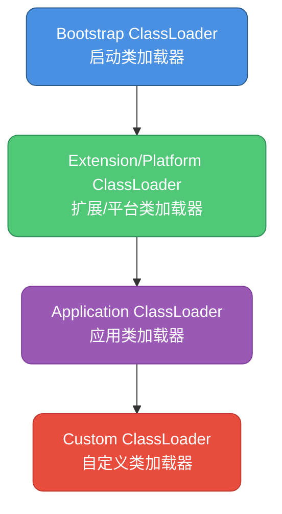
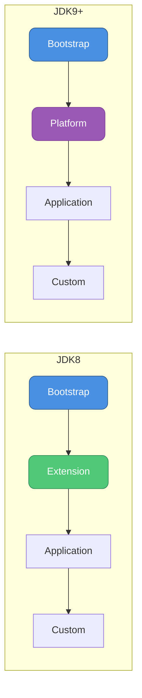
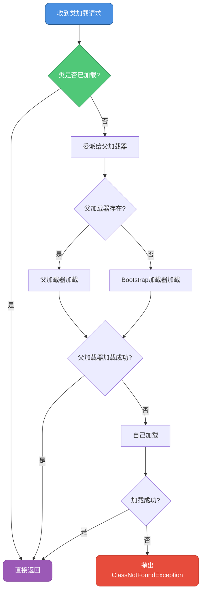
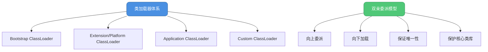

# 类加载器与双亲委派机制

## Java类加载器体系

在Java虚拟机的视角下，类加载器可以分为两大类：**启动类加载器（Bootstrap ClassLoader）**和**其他类加载器**。启动类加载器使用C++实现，是JVM的一部分；其他类加载器使用Java实现，继承自`java.lang.ClassLoader`抽象类。



## JDK 8及之前的类加载器

### 1. 启动类加载器（Bootstrap ClassLoader）

启动类加载器是最顶层的类加载器，负责加载Java核心类库。

**加载路径**：
- `<JAVA_HOME>/lib` 目录
- `-Xbootclasspath` 参数指定的路径

**加载的类库**：
- `rt.jar`（Java运行时核心类）
- `resources.jar`
- `charsets.jar`
- 其他JVM识别的核心类库

```java
// 启动类加载器示例
public class BootstrapClassLoaderDemo {
    
    public static void main(String[] args) {
        // Java核心类由启动类加载器加载
        ClassLoader loader1 = String.class.getClassLoader();
        ClassLoader loader2 = ArrayList.class.getClassLoader();
        ClassLoader loader3 = HashMap.class.getClassLoader();
        
        // 启动类加载器在Java中表示为null
        System.out.println("String类的加载器: " + loader1);     // null
        System.out.println("ArrayList类的加载器: " + loader2);  // null
        System.out.println("HashMap类的加载器: " + loader3);    // null
        
        // 查看启动类加载器加载的路径
        System.out.println("\n启动类加载器加载的路径:");
        String bootClassPath = System.getProperty("sun.boot.class.path");
        for (String path : bootClassPath.split(File.pathSeparator)) {
            System.out.println(path);
        }
    }
}
```

### 2. 扩展类加载器（Extension ClassLoader）

扩展类加载器由`sun.misc.Launcher$ExtClassLoader`实现，负责加载Java扩展类库。

**加载路径**：
- `<JAVA_HOME>/lib/ext` 目录
- `java.ext.dirs` 系统属性指定的路径

```java
// 扩展类加载器示例
public class ExtensionClassLoaderDemo {
    
    public static void main(String[] args) {
        // 获取扩展类加载器
        ClassLoader extClassLoader = ClassLoader.getSystemClassLoader().getParent();
        System.out.println("扩展类加载器: " + extClassLoader);
        
        // 扩展类加载器加载的类
        try {
            // 假设有一个扩展类在lib/ext目录下
            Class<?> clazz = extClassLoader.loadClass("javax.crypto.Cipher");
            System.out.println("Cipher类的加载器: " + clazz.getClassLoader());
        } catch (ClassNotFoundException e) {
            e.printStackTrace();
        }
        
        // 查看扩展类加载器的加载路径
        System.out.println("\n扩展类加载器加载的路径:");
        String extDirs = System.getProperty("java.ext.dirs");
        for (String path : extDirs.split(File.pathSeparator)) {
            System.out.println(path);
        }
    }
}
```

### 3. 应用类加载器（Application ClassLoader）

应用类加载器由`sun.misc.Launcher$AppClassLoader`实现，也称为系统类加载器。

**加载路径**：
- 用户类路径（ClassPath）
- `-cp` 或 `-classpath` 参数指定的路径

```java
// 应用类加载器示例
public class ApplicationClassLoaderDemo {
    
    public static void main(String[] args) {
        // 获取应用类加载器
        ClassLoader appClassLoader = ClassLoader.getSystemClassLoader();
        System.out.println("应用类加载器: " + appClassLoader);
        
        // 自定义类由应用类加载器加载
        ClassLoader currentLoader = ApplicationClassLoaderDemo.class.getClassLoader();
        System.out.println("当前类的加载器: " + currentLoader);
        
        // 查看类路径
        System.out.println("\n类路径:");
        String classPath = System.getProperty("java.class.path");
        for (String path : classPath.split(File.pathSeparator)) {
            System.out.println(path);
        }
        
        // 加载自定义类
        try {
            Class<?> userClass = appClassLoader.loadClass("com.example.UserService");
            System.out.println("\nUserService类加载成功");
            System.out.println("UserService的加载器: " + userClass.getClassLoader());
        } catch (ClassNotFoundException e) {
            System.out.println("UserService类未找到");
        }
    }
}

// 用户自定义的业务类
package com.example;

class UserService {
    public void login(String username, String password) {
        System.out.println("用户登录: " + username);
    }
    
    public void register(User user) {
        System.out.println("用户注册: " + user.getName());
    }
}

class User {
    private String name;
    private String email;
    
    public User(String name, String email) {
        this.name = name;
        this.email = email;
    }
    
    public String getName() {
        return name;
    }
}
```

## JDK 9及以后的类加载器

JDK 9引入了模块化系统（Jigsaw），类加载器体系发生了变化。

### 平台类加载器（Platform ClassLoader）

在JDK 9中，扩展类加载器被重命名为**平台类加载器**，实现类改为`jdk.internal.loader.ClassLoaders$PlatformClassLoader`。

**主要变化**：
- 不再从`lib/ext`目录加载类
- 负责加载Java平台模块系统的非核心模块
- 加载模块路径下的平台模块

```java
// JDK 9+ 平台类加载器示例
public class PlatformClassLoaderDemo {
    
    public static void main(String[] args) {
        // 获取平台类加载器
        ClassLoader platformClassLoader = ClassLoader.getPlatformClassLoader();
        System.out.println("平台类加载器: " + platformClassLoader);
        
        // 平台类加载器加载的模块
        try {
            // java.sql模块中的类由平台类加载器加载
            Class<?> driverManager = Class.forName("java.sql.DriverManager");
            System.out.println("DriverManager的加载器: " + 
                driverManager.getClassLoader());
            
            // java.xml模块中的类
            Class<?> document = Class.forName("org.w3c.dom.Document");
            System.out.println("Document的加载器: " + 
                document.getClassLoader());
        } catch (ClassNotFoundException e) {
            e.printStackTrace();
        }
        
        // 查看平台类加载器的父加载器
        System.out.println("\n平台类加载器的父加载器: " + 
            platformClassLoader.getParent());
    }
}
```

### JDK版本差异对比

```java
// JDK版本差异示例
public class JDKVersionDifferenceDemo {
    
    public static void main(String[] args) {
        System.out.println("当前JDK版本: " + System.getProperty("java.version"));
        
        // 获取各级类加载器
        ClassLoader systemLoader = ClassLoader.getSystemClassLoader();
        ClassLoader parentLoader = systemLoader.getParent();
        
        System.out.println("\n类加载器层次结构:");
        System.out.println("应用类加载器: " + systemLoader);
        System.out.println("父加载器: " + parentLoader);
        
        // JDK 9+特有方法
        if (isJDK9Plus()) {
            System.out.println("\n使用JDK 9+特性:");
            ClassLoader platformLoader = ClassLoader.getPlatformClassLoader();
            System.out.println("平台类加载器: " + platformLoader);
            
            // 模块信息
            Module module = String.class.getModule();
            System.out.println("String类所在模块: " + module.getName());
        } else {
            System.out.println("\n使用JDK 8特性:");
            System.out.println("扩展类目录: " + System.getProperty("java.ext.dirs"));
        }
    }
    
    private static boolean isJDK9Plus() {
        String version = System.getProperty("java.version");
        String[] parts = version.split("\\.");
        int majorVersion = Integer.parseInt(parts[0]);
        return majorVersion >= 9;
    }
}
```



## 双亲委派模型

双亲委派模型（Parents Delegation Model）是Java类加载器的核心工作机制。

### 双亲委派的工作原理



### 双亲委派源码分析

```java
// ClassLoader.loadClass()源码分析
public abstract class ClassLoader {
    
    private final ClassLoader parent;
    
    protected Class<?> loadClass(String name, boolean resolve)
            throws ClassNotFoundException {
        // 同步锁，保证线程安全
        synchronized (getClassLoadingLock(name)) {
            // 1. 检查类是否已经被加载
            Class<?> c = findLoadedClass(name);
            
            if (c == null) {
                try {
                    // 2. 委派给父类加载器
                    if (parent != null) {
                        // 父加载器不为null，委派给父加载器
                        c = parent.loadClass(name, false);
                    } else {
                        // 父加载器为null，委派给启动类加载器
                        c = findBootstrapClassOrNull(name);
                    }
                } catch (ClassNotFoundException e) {
                    // 父加载器抛出异常，说明无法加载
                }
                
                // 3. 父加载器无法加载，自己尝试加载
                if (c == null) {
                    c = findClass(name);
                }
            }
            
            if (resolve) {
                resolveClass(c);
            }
            
            return c;
        }
    }
    
    // 子类需要重写此方法来实现自己的加载逻辑
    protected Class<?> findClass(String name) throws ClassNotFoundException {
        throw new ClassNotFoundException(name);
    }
}
```

### 双亲委派示例

```java
// 双亲委派实际运行示例
public class ParentsDelegationDemo {
    
    public static void main(String[] args) throws Exception {
        // 创建自定义类加载器
        MyClassLoader loader = new MyClassLoader();
        
        // 尝试加载不同的类
        System.out.println("=== 加载Java核心类 ===");
        Class<?> stringClass = loader.loadClass("java.lang.String");
        System.out.println("String类的加载器: " + stringClass.getClassLoader());
        // 输出: null (由Bootstrap ClassLoader加载)
        
        System.out.println("\n=== 加载自定义类 ===");
        Class<?> customClass = loader.loadClass("com.example.MyService");
        System.out.println("MyService类的加载器: " + customClass.getClassLoader());
        // 输出: MyClassLoader实例
    }
}

// 自定义类加载器
class MyClassLoader extends ClassLoader {
    
    private String classPath;
    
    public MyClassLoader() {
        this.classPath = "/custom/classes/";
    }
    
    @Override
    protected Class<?> findClass(String name) throws ClassNotFoundException {
        System.out.println("MyClassLoader尝试加载: " + name);
        
        try {
            // 将类名转换为文件路径
            String fileName = classPath + name.replace('.', '/') + ".class";
            
            // 读取类文件
            byte[] classData = loadClassData(fileName);
            
            if (classData == null) {
                throw new ClassNotFoundException(name);
            }
            
            // 将字节数组转换为Class对象
            return defineClass(name, classData, 0, classData.length);
        } catch (IOException e) {
            throw new ClassNotFoundException(name, e);
        }
    }
    
    private byte[] loadClassData(String fileName) throws IOException {
        File file = new File(fileName);
        if (!file.exists()) {
            return null;
        }
        
        try (FileInputStream fis = new FileInputStream(file);
             ByteArrayOutputStream baos = new ByteArrayOutputStream()) {
            
            byte[] buffer = new byte[4096];
            int bytesRead;
            while ((bytesRead = fis.read(buffer)) != -1) {
                baos.write(buffer, 0, bytesRead);
            }
            
            return baos.toByteArray();
        }
    }
}
```

### 双亲委派的执行流程

```java
// 双亲委派执行流程演示
public class DelegationFlowDemo {
    
    public static void main(String[] args) throws Exception {
        // 创建多级自定义类加载器
        CustomClassLoader loader1 = new CustomClassLoader("Loader1");
        CustomClassLoader loader2 = new CustomClassLoader("Loader2", loader1);
        CustomClassLoader loader3 = new CustomClassLoader("Loader3", loader2);
        
        System.out.println("=== 使用loader3加载类 ===\n");
        Class<?> clazz = loader3.loadClass("com.example.TestClass");
        
        System.out.println("\n最终加载器: " + clazz.getClassLoader());
    }
}

class CustomClassLoader extends ClassLoader {
    
    private String name;
    
    public CustomClassLoader(String name) {
        this.name = name;
    }
    
    public CustomClassLoader(String name, ClassLoader parent) {
        super(parent);
        this.name = name;
    }
    
    @Override
    protected Class<?> loadClass(String className, boolean resolve)
            throws ClassNotFoundException {
        System.out.println(name + " 收到加载请求: " + className);
        
        // 调用父类的loadClass，执行双亲委派
        Class<?> clazz = super.loadClass(className, resolve);
        
        System.out.println(name + " 加载完成: " + className);
        return clazz;
    }
    
    @Override
    protected Class<?> findClass(String className) throws ClassNotFoundException {
        System.out.println(name + " 执行findClass: " + className);
        
        // 简化示例：实际应该读取class文件
        if (className.equals("com.example.TestClass")) {
            byte[] classData = generateTestClassData();
            return defineClass(className, classData, 0, classData.length);
        }
        
        throw new ClassNotFoundException(className);
    }
    
    private byte[] generateTestClassData() {
        // 这里应该返回真实的class文件字节数据
        // 为了演示，返回空数组
        return new byte[0];
    }
    
    @Override
    public String toString() {
        return "CustomClassLoader(" + name + ")";
    }
}

// 输出示例：
// Loader3 收到加载请求: com.example.TestClass
// Loader2 收到加载请求: com.example.TestClass
// Loader1 收到加载请求: com.example.TestClass
// Loader1 执行findClass: com.example.TestClass
// Loader1 加载完成: com.example.TestClass
// Loader2 加载完成: com.example.TestClass
// Loader3 加载完成: com.example.TestClass
// 最终加载器: CustomClassLoader(Loader1)
```

## 双亲委派的优势

### 1. 保证类的唯一性

```java
// 类唯一性示例
public class ClassUniquenessDemo {
    
    public static void main(String[] args) throws Exception {
        // 不同的类加载器加载同一个类
        ClassLoader loader1 = new MyClassLoader();
        ClassLoader loader2 = new MyClassLoader();
        
        Class<?> class1 = loader1.loadClass("java.lang.String");
        Class<?> class2 = loader2.loadClass("java.lang.String");
        
        // 由于双亲委派，最终都由Bootstrap ClassLoader加载
        System.out.println("class1 == class2: " + (class1 == class2)); // true
        System.out.println("class1的加载器: " + class1.getClassLoader());
        System.out.println("class2的加载器: " + class2.getClassLoader());
        
        // 创建实例
        Object obj1 = class1.getDeclaredConstructor().newInstance();
        Object obj2 = class2.getDeclaredConstructor().newInstance();
        
        // 类型检查
        System.out.println("obj1 instanceof String: " + (obj1 instanceof String));
        System.out.println("obj2 instanceof String: " + (obj2 instanceof String));
    }
}
```

### 2. 保护核心类库

```java
// 核心类库保护示例
public class CoreLibProtectionDemo {
    
    public static void main(String[] args) {
        // 尝试自定义一个java.lang.String类
        // 由于双亲委派，永远会加载JDK的String类，而不是自定义的
        
        String str = new String("Hello");
        System.out.println("String类的加载器: " + str.getClass().getClassLoader());
        
        // 即使在classpath下放置自定义的java.lang.String.class
        // 也会被双亲委派机制拦截，优先加载JDK的String类
    }
}

// 假设我们创建了一个恶意的String类（这个类不会被加载）
package java.lang;

public class String {
    // 恶意代码
    static {
        System.out.println("这是恶意的String类");
        // 尝试破坏系统
    }
}
```

## 类加载器之间的关系

### 组合关系而非继承关系

很多人误以为类加载器之间是继承关系，实际上是**组合关系**。

```java
// 类加载器关系示例
public class ClassLoaderRelationshipDemo {
    
    public static void main(String[] args) {
        ClassLoader appLoader = ClassLoader.getSystemClassLoader();
        ClassLoader extLoader = appLoader.getParent();
        ClassLoader bootLoader = extLoader.getParent();
        
        System.out.println("应用类加载器: " + appLoader);
        System.out.println("扩展类加载器: " + extLoader);
        System.out.println("启动类加载器: " + bootLoader); // null
        
        // 查看ClassLoader源码中的parent字段
        System.out.println("\nClassLoader通过parent字段维护父加载器关系");
    }
}

// ClassLoader中的组合关系
public abstract class ClassLoader {
    
    // 通过组合方式持有父加载器的引用
    private final ClassLoader parent;
    
    protected ClassLoader(ClassLoader parent) {
        this.parent = parent;
    }
    
    protected ClassLoader() {
        // 默认使用系统类加载器作为父加载器
        this(getSystemClassLoader());
    }
    
    public final ClassLoader getParent() {
        return parent;
    }
}
```

### 为什么使用组合而非继承

```java
// 组合优于继承示例
public class CompositionVsInheritanceDemo {
    
    public static void main(String[] args) {
        // 使用组合的好处
        
        // 1. 灵活性：可以动态改变父加载器
        DynamicClassLoader loader1 = new DynamicClassLoader(
            ClassLoader.getSystemClassLoader()
        );
        
        // 2. 解耦：不同的类加载器可以有不同的父加载器
        CustomClassLoader loader2 = new CustomClassLoader(loader1);
        CustomClassLoader loader3 = new CustomClassLoader(
            ClassLoader.getSystemClassLoader()
        );
        
        System.out.println("loader2的父加载器: " + loader2.getParent());
        System.out.println("loader3的父加载器: " + loader3.getParent());
    }
}

// 使用组合的类加载器
class DynamicClassLoader extends ClassLoader {
    
    public DynamicClassLoader(ClassLoader parent) {
        super(parent);
    }
    
    @Override
    protected Class<?> findClass(String name) throws ClassNotFoundException {
        // 自定义加载逻辑
        return super.findClass(name);
    }
}
```

## loadClass与findClass的区别

### loadClass方法

`loadClass`方法实现了双亲委派模型的完整逻辑，**不建议重写**。

```java
// loadClass示例（不推荐重写）
public class LoadClassDemo {
    
    public static void main(String[] args) throws Exception {
        // loadClass方法会执行完整的双亲委派流程
        ClassLoader loader = new StandardClassLoader();
        
        Class<?> clazz = loader.loadClass("com.example.UserService");
        System.out.println("类加载成功: " + clazz.getName());
    }
}

class StandardClassLoader extends ClassLoader {
    
    // 不重写loadClass，使用默认的双亲委派实现
    
    @Override
    protected Class<?> findClass(String name) throws ClassNotFoundException {
        System.out.println("StandardClassLoader.findClass: " + name);
        
        // 实现自定义的类加载逻辑
        byte[] classData = loadClassData(name);
        return defineClass(name, classData, 0, classData.length);
    }
    
    private byte[] loadClassData(String name) {
        // 加载类文件的字节数据
        return new byte[0];
    }
}
```

### findClass方法

`findClass`方法是留给子类实现的，**推荐重写此方法**。

```java
// findClass示例（推荐重写）
public class FindClassDemo {
    
    public static void main(String[] args) throws Exception {
        // 创建自定义类加载器，只重写findClass
        EncryptedClassLoader loader = new EncryptedClassLoader();
        
        Class<?> clazz = loader.loadClass("com.example.EncryptedService");
        Object instance = clazz.getDeclaredConstructor().newInstance();
        
        Method method = clazz.getMethod("execute");
        method.invoke(instance);
    }
}

// 加载加密类文件的类加载器
class EncryptedClassLoader extends ClassLoader {
    
    private String classPath = "/encrypted/classes/";
    
    @Override
    protected Class<?> findClass(String name) throws ClassNotFoundException {
        try {
            // 1. 读取加密的class文件
            byte[] encryptedData = readEncryptedClassFile(name);
            
            // 2. 解密
            byte[] classData = decrypt(encryptedData);
            
            // 3. 定义类
            return defineClass(name, classData, 0, classData.length);
        } catch (Exception e) {
            throw new ClassNotFoundException(name, e);
        }
    }
    
    private byte[] readEncryptedClassFile(String name) throws IOException {
        String fileName = classPath + name.replace('.', '/') + ".encrypted";
        
        try (FileInputStream fis = new FileInputStream(fileName);
             ByteArrayOutputStream baos = new ByteArrayOutputStream()) {
            
            byte[] buffer = new byte[4096];
            int bytesRead;
            while ((bytesRead = fis.read(buffer)) != -1) {
                baos.write(buffer, 0, bytesRead);
            }
            
            return baos.toByteArray();
        }
    }
    
    private byte[] decrypt(byte[] encryptedData) {
        // 简单的XOR解密（实际应使用更安全的算法）
        byte[] decrypted = new byte[encryptedData.length];
        byte key = (byte) 0x5A;
        
        for (int i = 0; i < encryptedData.length; i++) {
            decrypted[i] = (byte) (encryptedData[i] ^ key);
        }
        
        return decrypted;
    }
}
```

### 使用建议

```java
// 类加载器实现建议
public class ClassLoaderBestPractice {
    
    public static void main(String[] args) {
        // 1. 如果不想打破双亲委派，只重写findClass
        GoodClassLoader goodLoader = new GoodClassLoader();
        
        // 2. 如果想打破双亲委派，重写loadClass
        BreakDelegationLoader breakLoader = new BreakDelegationLoader();
    }
}

// 推荐：保持双亲委派模型
class GoodClassLoader extends ClassLoader {
    
    @Override
    protected Class<?> findClass(String name) throws ClassNotFoundException {
        // 只实现自己的加载逻辑
        // loadClass方法会处理双亲委派
        return super.findClass(name);
    }
}

// 不推荐：除非有特殊需求
class BreakDelegationLoader extends ClassLoader {
    
    @Override
    protected Class<?> loadClass(String name, boolean resolve)
            throws ClassNotFoundException {
        // 完全自定义加载流程，破坏双亲委派
        // 应谨慎使用
        synchronized (getClassLoadingLock(name)) {
            Class<?> c = findLoadedClass(name);
            if (c == null) {
                // 先自己尝试加载
                try {
                    c = findClass(name);
                } catch (ClassNotFoundException e) {
                    // 自己加载失败，再委派给父加载器
                    c = super.loadClass(name, resolve);
                }
            }
            return c;
        }
    }
    
    @Override
    protected Class<?> findClass(String name) throws ClassNotFoundException {
        // 自定义加载逻辑
        return super.findClass(name);
    }
}
```

## 总结

类加载器体系和双亲委派机制是Java类加载的核心：



关键要点：
1. 类加载器之间是组合关系，不是继承关系
2. JDK 9将扩展类加载器改为平台类加载器
3. 双亲委派保证了类的唯一性和核心类库的安全性
4. 推荐重写`findClass`而不是`loadClass`
5. 只有在特殊场景下才需要打破双亲委派
