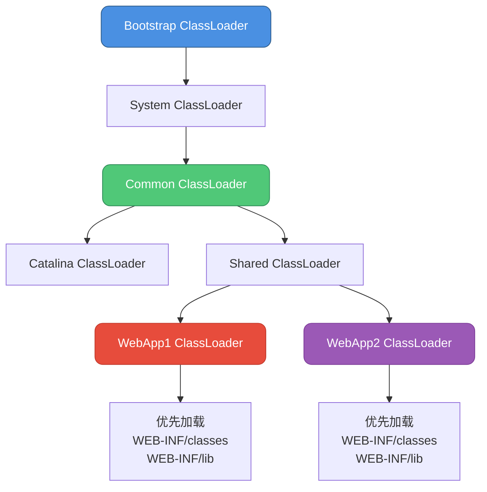
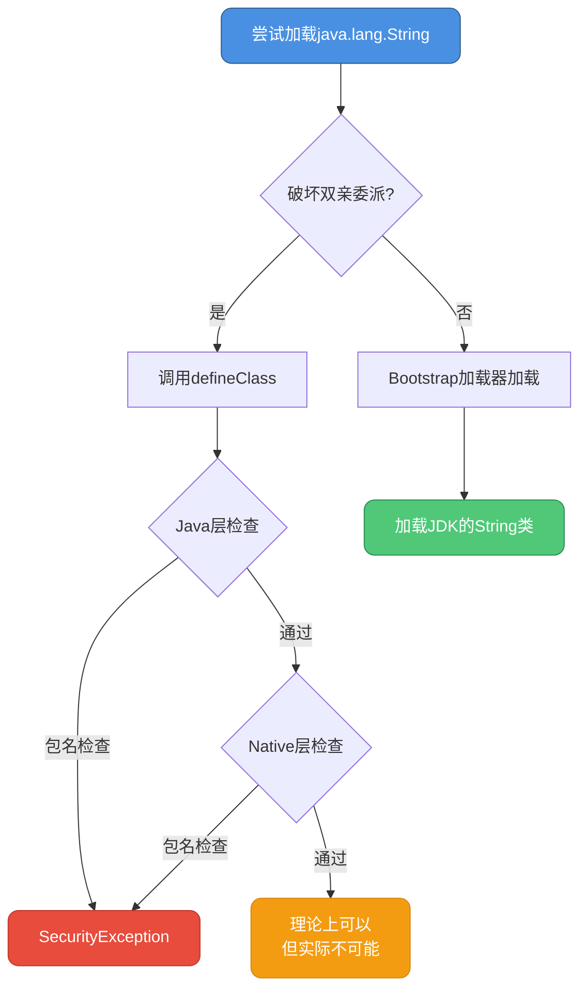
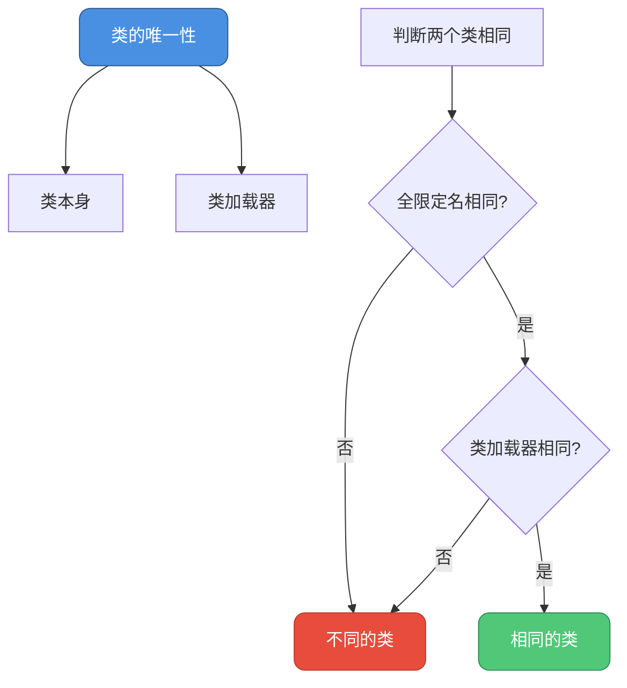

# 双亲委派破坏与安全机制

## 破坏双亲委派模型

虽然双亲委派模型为Java类加载提供了良好的安全性和稳定性，但在某些特殊场景下，我们需要打破这个模型。

### 如何破坏双亲委派

破坏双亲委派的核心是**重写`ClassLoader`的`loadClass()`方法**，改变类加载的委派流程。

```java
// 破坏双亲委派示例
public class BreakParentsDelegationDemo {
    
    public static void main(String[] args) throws Exception {
        // 创建破坏双亲委派的类加载器
        BreakDelegationClassLoader loader = new BreakDelegationClassLoader();
        
        // 加载自定义类
        Class<?> clazz = loader.loadClass("com.example.CustomService");
        System.out.println("类加载器: " + clazz.getClassLoader());
        
        // 创建实例并调用方法
        Object instance = clazz.getDeclaredConstructor().newInstance();
        Method method = clazz.getMethod("execute");
        method.invoke(instance);
    }
}

// 破坏双亲委派的类加载器
class BreakDelegationClassLoader extends ClassLoader {
    
    private String classPath = "/custom/classes/";
    
    @Override
    protected Class<?> loadClass(String name, boolean resolve)
            throws ClassNotFoundException {
        
        synchronized (getClassLoadingLock(name)) {
            // 1. 检查类是否已加载
            Class<?> c = findLoadedClass(name);
            
            if (c == null) {
                // 对于java.开头的类，仍然委派给父加载器
                if (name.startsWith("java.")) {
                    c = getParent().loadClass(name);
                } else {
                    // 2. 先自己尝试加载（破坏双亲委派）
                    try {
                        c = findClass(name);
                        System.out.println("使用自定义加载器加载: " + name);
                    } catch (ClassNotFoundException e) {
                        // 3. 自己加载失败，再委派给父加载器
                        c = super.loadClass(name, resolve);
                    }
                }
            }
            
            if (resolve) {
                resolveClass(c);
            }
            
            return c;
        }
    }
    
    @Override
    protected Class<?> findClass(String name) throws ClassNotFoundException {
        try {
            String fileName = classPath + name.replace('.', '/') + ".class";
            byte[] classData = loadClassData(fileName);
            
            if (classData == null) {
                throw new ClassNotFoundException(name);
            }
            
            return defineClass(name, classData, 0, classData.length);
        } catch (IOException e) {
            throw new ClassNotFoundException(name, e);
        }
    }
    
    private byte[] loadClassData(String fileName) throws IOException {
        File file = new File(fileName);
        if (!file.exists()) {
            return null;
        }
        
        try (FileInputStream fis = new FileInputStream(file);
             ByteArrayOutputStream baos = new ByteArrayOutputStream()) {
            
            byte[] buffer = new byte[4096];
            int bytesRead;
            while ((bytesRead = fis.read(buffer)) != -1) {
                baos.write(buffer, 0, bytesRead);
            }
            
            return baos.toByteArray();
        }
    }
}
```

## 破坏双亲委派的典型场景

### 1. JDK历史兼容性

JDK 1.2之前没有双亲委派模型，为了向前兼容，允许重写`loadClass()`方法。

```java
// JDK 1.0/1.1兼容示例
public class LegacyClassLoaderDemo {
    
    public static void main(String[] args) {
        // JDK 1.0/1.1时代的类加载器
        LegacyClassLoader loader = new LegacyClassLoader();
        
        System.out.println("这种方式在JDK 1.2之后不推荐使用");
    }
}

// 老式类加载器（JDK 1.0/1.1风格）
class LegacyClassLoader extends ClassLoader {
    
    // JDK 1.0/1.1时代直接重写loadClass
    @Override
    protected Class<?> loadClass(String name, boolean resolve)
            throws ClassNotFoundException {
        
        // 老式做法：直接加载，不考虑双亲委派
        Class<?> c = findLoadedClass(name);
        if (c == null) {
            c = findClass(name);
        }
        
        if (resolve) {
            resolveClass(c);
        }
        
        return c;
    }
    
    @Override
    protected Class<?> findClass(String name) throws ClassNotFoundException {
        // 加载逻辑
        return super.findClass(name);
    }
}
```

### 2. SPI机制

Java的SPI（Service Provider Interface）机制需要基础类加载应用层的实现类，违背了双亲委派原则。

```java
// SPI机制示例
public class SPIDemo {
    
    public static void main(String[] args) {
        // JDBC驱动加载示例
        
        // DriverManager在rt.jar中，由Bootstrap ClassLoader加载
        // 但它需要加载厂商提供的Driver实现（在classpath中）
        
        try {
            // 方式1：传统方式（破坏双亲委派）
            Class.forName("com.mysql.cj.jdbc.Driver");
            
            // 方式2：SPI方式（使用线程上下文类加载器）
            Connection conn = DriverManager.getConnection(
                "jdbc:mysql://localhost:3306/test",
                "root",
                "password"
            );
            
            System.out.println("数据库连接成功");
        } catch (Exception e) {
            e.printStackTrace();
        }
    }
}

// 线程上下文类加载器示例
class ThreadContextClassLoaderDemo {
    
    public static void main(String[] args) {
        // 获取当前线程的上下文类加载器
        ClassLoader contextLoader = Thread.currentThread().getContextClassLoader();
        System.out.println("线程上下文类加载器: " + contextLoader);
        
        // DriverManager使用线程上下文类加载器加载驱动
        demonstrateDriverManager();
    }
    
    private static void demonstrateDriverManager() {
        // DriverManager的源码逻辑（简化版）
        ClassLoader callerCL = Thread.currentThread().getContextClassLoader();
        
        // 使用上下文类加载器加载驱动
        ServiceLoader<Driver> loadedDrivers = ServiceLoader.load(
            Driver.class, 
            callerCL
        );
        
        for (Driver driver : loadedDrivers) {
            System.out.println("加载的驱动: " + driver.getClass().getName());
        }
    }
}

// 自定义SPI服务接口
interface PaymentService {
    void pay(double amount);
}

// SPI实现类1
class AlipayService implements PaymentService {
    @Override
    public void pay(double amount) {
        System.out.println("支付宝支付: " + amount + "元");
    }
}

// SPI实现类2
class WechatPayService implements PaymentService {
    @Override
    public void pay(double amount) {
        System.out.println("微信支付: " + amount + "元");
    }
}

// SPI加载示例
class SPILoadDemo {
    
    public static void main(String[] args) {
        // 使用ServiceLoader加载SPI实现
        ServiceLoader<PaymentService> services = ServiceLoader.load(PaymentService.class);
        
        for (PaymentService service : services) {
            service.pay(99.99);
        }
    }
}
```

### 3. Tomcat类加载机制

Tomcat需要实现应用隔离，每个Web应用使用独立的类加载器。

```java
// Tomcat类加载器结构示例
public class TomcatClassLoaderDemo {
    
    public static void main(String[] args) {
        demonstrateTomcatStructure();
    }
    
    private static void demonstrateTomcatStructure() {
        /*
         * Tomcat类加载器层次结构：
         * 
         *       Bootstrap ClassLoader
         *              ↑
         *       System ClassLoader
         *              ↑
         *       Common ClassLoader (Tomcat/lib)
         *              ↑
         *       Catalina ClassLoader (Tomcat核心类)
         *              ↑
         *       Shared ClassLoader (所有应用共享)
         *         ↗         ↖
         *   WebApp1 CL    WebApp2 CL
         */
        
        System.out.println("Tomcat类加载器特点：");
        System.out.println("1. 每个Web应用有独立的WebappClassLoader");
        System.out.println("2. 优先加载WEB-INF/classes和WEB-INF/lib");
        System.out.println("3. 实现应用间的类隔离");
    }
}

// 模拟Tomcat的WebappClassLoader
class WebappClassLoader extends ClassLoader {
    
    private String webappPath;
    
    public WebappClassLoader(String webappPath, ClassLoader parent) {
        super(parent);
        this.webappPath = webappPath;
    }
    
    @Override
    protected Class<?> loadClass(String name, boolean resolve)
            throws ClassNotFoundException {
        
        synchronized (getClassLoadingLock(name)) {
            Class<?> clazz = findLoadedClass(name);
            
            if (clazz == null) {
                try {
                    // 1. 先从Bootstrap ClassLoader加载
                    if (name.startsWith("java.")) {
                        clazz = findSystemClass(name);
                    } else {
                        // 2. 尝试从Web应用的/WEB-INF/classes加载
                        clazz = findClassInWebapp(name);
                    }
                } catch (ClassNotFoundException e) {
                    // 3. 加载失败，委派给父加载器
                    clazz = super.loadClass(name, resolve);
                }
            }
            
            if (resolve) {
                resolveClass(clazz);
            }
            
            return clazz;
        }
    }
    
    private Class<?> findClassInWebapp(String name) throws ClassNotFoundException {
        String classFile = webappPath + "/WEB-INF/classes/" + 
                          name.replace('.', '/') + ".class";
        
        try {
            byte[] classData = loadClassData(classFile);
            return defineClass(name, classData, 0, classData.length);
        } catch (IOException e) {
            throw new ClassNotFoundException(name, e);
        }
    }
    
    private byte[] loadClassData(String classFile) throws IOException {
        // 从文件加载类数据
        File file = new File(classFile);
        if (!file.exists()) {
            throw new IOException("Class file not found: " + classFile);
        }
        
        try (FileInputStream fis = new FileInputStream(file);
             ByteArrayOutputStream baos = new ByteArrayOutputStream()) {
            
            byte[] buffer = new byte[4096];
            int bytesRead;
            while ((bytesRead = fis.read(buffer)) != -1) {
                baos.write(buffer, 0, bytesRead);
            }
            
            return baos.toByteArray();
        }
    }
}

// Tomcat应用隔离示例
class TomcatAppIsolationDemo {
    
    public static void main(String[] args) throws Exception {
        // 创建两个Web应用的类加载器
        WebappClassLoader webapp1Loader = new WebappClassLoader(
            "/tomcat/webapps/app1", 
            ClassLoader.getSystemClassLoader()
        );
        
        WebappClassLoader webapp2Loader = new WebappClassLoader(
            "/tomcat/webapps/app2",
            ClassLoader.getSystemClassLoader()
        );
        
        // 两个应用可以使用不同版本的相同类
        Class<?> class1 = webapp1Loader.loadClass("com.example.UserService");
        Class<?> class2 = webapp2Loader.loadClass("com.example.UserService");
        
        // 即使类名相同，但由不同的类加载器加载，被视为不同的类
        System.out.println("class1 == class2: " + (class1 == class2)); // false
        System.out.println("app1的UserService加载器: " + class1.getClassLoader());
        System.out.println("app2的UserService加载器: " + class2.getClassLoader());
    }
}
```



### 4. OSGi模块化

OSGi实现了网状的类加载器结构，完全打破了双亲委派模型。

```java
// OSGi类加载示例（简化版）
public class OSGiClassLoaderDemo {
    
    public static void main(String[] args) {
        // OSGi的类加载顺序：
        // 1. 检查是否是java.*包，委派给父加载器
        // 2. 检查是否在导入包列表中，委派给导出该包的Bundle
        // 3. 检查是否在自己的Bundle中
        // 4. 检查是否在Fragment Bundle中
        // 5. 查找是否在动态导入列表中
        
        System.out.println("OSGi实现了模块化的类加载机制");
    }
}

// 模拟OSGi Bundle类加载器
class BundleClassLoader extends ClassLoader {
    
    private String bundleName;
    private List<BundleClassLoader> importedBundles = new ArrayList<>();
    private Set<String> exportedPackages = new HashSet<>();
    
    public BundleClassLoader(String bundleName) {
        this.bundleName = bundleName;
    }
    
    public void addImport(BundleClassLoader bundle) {
        importedBundles.add(bundle);
    }
    
    public void addExport(String packageName) {
        exportedPackages.add(packageName);
    }
    
    @Override
    protected Class<?> loadClass(String name, boolean resolve)
            throws ClassNotFoundException {
        
        synchronized (getClassLoadingLock(name)) {
            // 1. 检查是否已加载
            Class<?> c = findLoadedClass(name);
            
            if (c == null) {
                // 2. java.*包委派给父加载器
                if (name.startsWith("java.")) {
                    c = getParent().loadClass(name);
                } else {
                    // 3. 检查导入的包
                    String packageName = getPackageName(name);
                    c = loadFromImportedBundles(name, packageName);
                    
                    // 4. 在自己的Bundle中查找
                    if (c == null) {
                        try {
                            c = findClass(name);
                        } catch (ClassNotFoundException e) {
                            // 继续查找
                        }
                    }
                    
                    // 5. 委派给父加载器
                    if (c == null) {
                        c = super.loadClass(name, resolve);
                    }
                }
            }
            
            if (resolve) {
                resolveClass(c);
            }
            
            return c;
        }
    }
    
    private Class<?> loadFromImportedBundles(String className, String packageName) {
        for (BundleClassLoader bundle : importedBundles) {
            if (bundle.exportsPackage(packageName)) {
                try {
                    return bundle.loadClass(className);
                } catch (ClassNotFoundException e) {
                    // 继续查找下一个Bundle
                }
            }
        }
        return null;
    }
    
    private boolean exportsPackage(String packageName) {
        return exportedPackages.contains(packageName);
    }
    
    private String getPackageName(String className) {
        int lastDot = className.lastIndexOf('.');
        return lastDot > 0 ? className.substring(0, lastDot) : "";
    }
    
    @Override
    protected Class<?> findClass(String name) throws ClassNotFoundException {
        // 在Bundle内查找类
        return super.findClass(name);
    }
}

// OSGi Bundle示例
class OSGiBundleDemo {
    
    public static void main(String[] args) throws Exception {
        // 创建两个Bundle
        BundleClassLoader bundleA = new BundleClassLoader("BundleA");
        BundleClassLoader bundleB = new BundleClassLoader("BundleB");
        
        // BundleA导出com.example.api包
        bundleA.addExport("com.example.api");
        
        // BundleB导入com.example.api包
        bundleB.addImport(bundleA);
        
        // BundleB可以使用BundleA导出的类
        Class<?> clazz = bundleB.loadClass("com.example.api.UserService");
        System.out.println("成功加载: " + clazz.getName());
    }
}
```

## 破坏双亲委派后能重写String类吗？

答案是：**不能！**即使破坏了双亲委派模型，也无法重写`java.lang.String`等核心类。

### defineClass()的安全检查

```java
// defineClass安全检查示例
public class DefineClassSecurityDemo {
    
    public static void main(String[] args) {
        MaliciousClassLoader loader = new MaliciousClassLoader();
        
        try {
            // 尝试加载恶意的java.lang.String类
            Class<?> clazz = loader.loadClass("java.lang.String");
            System.out.println("永远不会执行到这里");
        } catch (SecurityException e) {
            System.out.println("安全检查失败: " + e.getMessage());
        } catch (ClassNotFoundException e) {
            e.printStackTrace();
        }
    }
}

// 恶意类加载器
class MaliciousClassLoader extends ClassLoader {
    
    @Override
    protected Class<?> loadClass(String name, boolean resolve)
            throws ClassNotFoundException {
        
        // 跳过双亲委派，直接自己加载
        if (name.equals("java.lang.String")) {
            byte[] maliciousCode = generateMaliciousStringClass();
            
            try {
                // 尝试定义java.lang.String类
                return defineClass(name, maliciousCode, 0, maliciousCode.length);
            } catch (SecurityException e) {
                System.out.println("被安全机制拦截: " + e.getMessage());
                throw e;
            }
        }
        
        return super.loadClass(name, resolve);
    }
    
    private byte[] generateMaliciousStringClass() {
        // 生成恶意的String类字节码
        return new byte[0];
    }
}
```

### preDefineClass()的包名检查

`ClassLoader.defineClass()`方法会调用`preDefineClass()`进行包名检查：

```java
// ClassLoader源码分析
public abstract class ClassLoader {
    
    protected final Class<?> defineClass(String name, byte[] b, int off, int len,
                                        ProtectionDomain protectionDomain)
            throws ClassFormatError {
        // 执行预检查
        protectionDomain = preDefineClass(name, protectionDomain);
        
        String source = defineClassSourceLocation(protectionDomain);
        
        // 调用native方法定义类
        Class<?> c = defineClass1(name, b, off, len, protectionDomain, source);
        
        postDefineClass(c, protectionDomain);
        return c;
    }
    
    // 预检查方法
    private ProtectionDomain preDefineClass(String name,
                                           ProtectionDomain pd) {
        // 检查类名是否有效
        if (!checkName(name))
            throw new NoClassDefFoundError("IllegalName: " + name);
        
        // 禁止定义java.开头的类
        if ((name != null) && name.startsWith("java.")) {
            throw new SecurityException(
                "Prohibited package name: " +
                name.substring(0, name.lastIndexOf('.')));
        }
        
        if (pd == null) {
            pd = defaultDomain;
        }
        
        if (name != null) checkCerts(name, pd.getCodeSource());
        
        return pd;
    }
}
```

### native层的二次检查

即使绕过了Java层的检查，native层仍会进行检查：

```java
// JVM native代码检查（C++）
/*
 * SystemDictionary::resolve_from_stream方法片段
 */
class SystemDictionaryCheck {
    
    public void demonstrateNativeCheck() {
        /*
         * C++代码逻辑（简化）：
         * 
         * const char* pkg = "java/";
         * if (!class_loader.is_null() &&
         *     parsed_name != NULL &&
         *     !strncmp((const char*)parsed_name->bytes(), pkg, strlen(pkg))) {
         *     
         *     // 抛出SecurityException
         *     char* message = "Prohibited package name: java.xxx";
         *     Exceptions::_throw_msg(vmSymbols::java_lang_SecurityException(), message);
         * }
         */
        
        System.out.println("JVM native层会检查包名，禁止加载java.开头的类");
    }
}
```

### 安全机制演示

```java
// 完整的安全机制演示
public class SecurityMechanismDemo {
    
    public static void main(String[] args) {
        System.out.println("=== 尝试1：破坏双亲委派加载String ===");
        testBreakDelegation();
        
        System.out.println("\n=== 尝试2：直接defineClass ===");
        testDirectDefine();
        
        System.out.println("\n=== 尝试3：绕过defineClass ===");
        testBypassDefine();
    }
    
    private static void testBreakDelegation() {
        try {
            BreakDelegationLoader loader = new BreakDelegationLoader();
            Class<?> clazz = loader.loadClass("java.lang.String");
            // 永远不会执行，会抛出SecurityException
        } catch (Exception e) {
            System.out.println("失败：" + e.getClass().getSimpleName() + 
                             " - " + e.getMessage());
        }
    }
    
    private static void testDirectDefine() {
        try {
            DirectDefineLoader loader = new DirectDefineLoader();
            byte[] classData = new byte[100]; // 假设的String类数据
            
            // 直接调用defineClass
            Method method = ClassLoader.class.getDeclaredMethod(
                "defineClass", 
                String.class, byte[].class, int.class, int.class
            );
            method.setAccessible(true);
            method.invoke(loader, "java.lang.String", classData, 0, classData.length);
        } catch (Exception e) {
            System.out.println("失败：" + e.getCause().getClass().getSimpleName() + 
                             " - " + e.getCause().getMessage());
        }
    }
    
    private static void testBypassDefine() {
        System.out.println("即使能绕过defineClass，native层仍会检查");
        System.out.println("JVM的多层防护确保了核心类的安全性");
    }
}

class BreakDelegationLoader extends ClassLoader {
    @Override
    protected Class<?> loadClass(String name, boolean resolve) 
            throws ClassNotFoundException {
        if (name.equals("java.lang.String")) {
            // 尝试自己加载
            return findClass(name);
        }
        return super.loadClass(name, resolve);
    }
    
    @Override
    protected Class<?> findClass(String name) throws ClassNotFoundException {
        byte[] data = new byte[100];
        return defineClass(name, data, 0, data.length);
    }
}

class DirectDefineLoader extends ClassLoader {
    // 用于反射调用defineClass
}
```



## 类的唯一性判断

在JVM中，判断两个类是否相同需要满足两个条件：

### 类的唯一性规则

```java
// 类唯一性判断示例
public class ClassUniquenessDemo {
    
    public static void main(String[] args) throws Exception {
        // 规则：类的唯一性 = 类本身 + 类加载器
        
        // 1. 同一个类加载器加载的相同类
        ClassLoader loader1 = new CustomClassLoader("Loader1");
        Class<?> class1a = loader1.loadClass("com.example.User");
        Class<?> class1b = loader1.loadClass("com.example.User");
        
        System.out.println("同一加载器，相同类:");
        System.out.println("class1a == class1b: " + (class1a == class1b)); // true
        
        // 2. 不同类加载器加载的相同类
        ClassLoader loader2 = new CustomClassLoader("Loader2");
        Class<?> class2 = loader2.loadClass("com.example.User");
        
        System.out.println("\n不同加载器，相同类:");
        System.out.println("class1a == class2: " + (class1a == class2)); // false
        System.out.println("class1a.equals(class2): " + class1a.equals(class2)); // false
        
        // 3. 实例的类型检查
        Object obj1 = class1a.getDeclaredConstructor().newInstance();
        Object obj2 = class2.getDeclaredConstructor().newInstance();
        
        System.out.println("\n实例类型检查:");
        System.out.println("obj1的类: " + obj1.getClass());
        System.out.println("obj2的类: " + obj2.getClass());
        System.out.println("obj1 instanceof class1a: " + class1a.isInstance(obj1)); // true
        System.out.println("obj1 instanceof class2: " + class2.isInstance(obj1));   // false
    }
}

class CustomClassLoader extends ClassLoader {
    private String name;
    
    public CustomClassLoader(String name) {
        this.name = name;
    }
    
    @Override
    public String toString() {
        return "CustomClassLoader(" + name + ")";
    }
}
```

### 类型转换异常

不同类加载器加载的相同类会导致类型转换异常：

```java
// 类型转换异常示例
public class ClassCastExceptionDemo {
    
    public static void main(String[] args) throws Exception {
        // 创建两个独立的类加载器
        IsolatedClassLoader loader1 = new IsolatedClassLoader("path1");
        IsolatedClassLoader loader2 = new IsolatedClassLoader("path2");
        
        // 加载相同的类
        Class<?> orderClass1 = loader1.loadClass("com.example.Order");
        Class<?> orderClass2 = loader2.loadClass("com.example.Order");
        
        // 创建实例
        Object order1 = orderClass1.getDeclaredConstructor().newInstance();
        Object order2 = orderClass2.getDeclaredConstructor().newInstance();
        
        System.out.println("order1的类加载器: " + order1.getClass().getClassLoader());
        System.out.println("order2的类加载器: " + order2.getClass().getClassLoader());
        
        try {
            // 尝试类型转换
            Method method = orderClass1.getMethod("setOrder", orderClass1);
            method.invoke(order1, order2); // ClassCastException
        } catch (InvocationTargetException e) {
            System.out.println("\n异常: " + e.getCause().getClass().getSimpleName());
            System.out.println("原因: 不同类加载器加载的类被视为不同类型");
        }
    }
}

class IsolatedClassLoader extends ClassLoader {
    private String path;
    
    public IsolatedClassLoader(String path) {
        this.path = path;
    }
    
    @Override
    public String toString() {
        return "IsolatedClassLoader(" + path + ")";
    }
}

// 业务类示例
package com.example;

class Order {
    private String orderId;
    private double amount;
    
    public void setOrder(Order other) {
        this.orderId = other.orderId;
        this.amount = other.amount;
    }
}
```

### 类命名空间

每个类加载器都有自己的命名空间，同一个类在不同命名空间中是不同的类。

```java
// 类命名空间示例
public class ClassNamespaceDemo {
    
    public static void main(String[] args) throws Exception {
        // 创建隔离的类命名空间
        NamespaceClassLoader namespace1 = new NamespaceClassLoader("NS1");
        NamespaceClassLoader namespace2 = new NamespaceClassLoader("NS2");
        
        // 在不同命名空间中加载相同的类
        Class<?> productClass1 = namespace1.defineProductClass();
        Class<?> productClass2 = namespace2.defineProductClass();
        
        System.out.println("命名空间1的Product类: " + productClass1);
        System.out.println("命名空间2的Product类: " + productClass2);
        System.out.println("是否相同: " + (productClass1 == productClass2)); // false
        
        // 创建实例
        Object product1 = productClass1.getDeclaredConstructor().newInstance();
        Object product2 = productClass2.getDeclaredConstructor().newInstance();
        
        // 设置字段值
        setField(productClass1, product1, "name", "商品A");
        setField(productClass2, product2, "name", "商品B");
        
        System.out.println("\n命名空间1的商品: " + getField(productClass1, product1, "name"));
        System.out.println("命名空间2的商品: " + getField(productClass2, product2, "name"));
        
        // 演示类型隔离
        demonstrateIsolation(productClass1, product1, product2);
    }
    
    private static void setField(Class<?> clazz, Object obj, String fieldName, Object value)
            throws Exception {
        Field field = clazz.getDeclaredField(fieldName);
        field.setAccessible(true);
        field.set(obj, value);
    }
    
    private static Object getField(Class<?> clazz, Object obj, String fieldName)
            throws Exception {
        Field field = clazz.getDeclaredField(fieldName);
        field.setAccessible(true);
        return field.get(obj);
    }
    
    private static void demonstrateIsolation(Class<?> clazz, Object obj1, Object obj2) {
        System.out.println("\n=== 类型隔离演示 ===");
        System.out.println("obj1是clazz的实例: " + clazz.isInstance(obj1)); // true
        System.out.println("obj2是clazz的实例: " + clazz.isInstance(obj2)); // false
    }
}

class NamespaceClassLoader extends ClassLoader {
    private String namespace;
    
    public NamespaceClassLoader(String namespace) {
        this.namespace = namespace;
    }
    
    public Class<?> defineProductClass() {
        // 简化：生成Product类的字节码
        String className = "com.example.Product";
        byte[] classData = generateProductClassData();
        
        return defineClass(className, classData, 0, classData.length);
    }
    
    private byte[] generateProductClassData() {
        // 实际应该生成真实的字节码
        // 这里简化处理
        return new byte[0];
    }
    
    @Override
    public String toString() {
        return "NamespaceClassLoader(" + namespace + ")";
    }
}
```



## 总结

双亲委派的破坏与安全机制体现了Java类加载的灵活性和安全性：

**可以做的**：
1. 破坏双亲委派模型（特殊场景）
2. 实现类隔离（Tomcat、OSGi）
3. 实现热部署和插件化

**不能做的**：
1. 重写`java.*`包下的核心类
2. 绕过JVM的安全检查
3. 破坏类的命名空间隔离

**核心原则**：
1. 类的唯一性 = 全限定名 + 类加载器
2. 不同类加载器加载的相同类是不同的类
3. JVM通过多层检查保护核心类库
4. 只在必要时才破坏双亲委派模型
