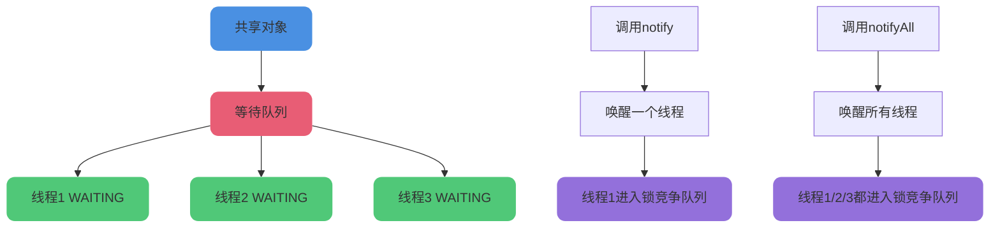

# 线程通信与协作机制

## 线程间的核心方法

### sleep()和wait()的区别

sleep()和wait()都可以使线程暂停执行,但它们有本质区别:

#### 使用场景不同

- **sleep()方法**: 可以在任何地方使用
- **wait()方法**: 只能在同步方法或同步块中使用

#### 锁释放行为不同

- **sleep()方法**: 不会释放对象锁
- **wait()方法**: 会释放对象锁

#### 线程状态不同

- **sleep()方法**: 线程进入TIMED_WAITING状态,指定时间后自动恢复
- **wait()方法**: 线程进入WAITING状态,必须等待其他线程调用notify()/notifyAll()唤醒

#### 所属类不同

- **sleep()方法**: 定义在Thread类中,因为它不需要释放锁,针对的是线程本身
- **wait()方法**: 定义在Object类中,因为Java锁的目标是对象,wait需要释放锁,所以针对的是对象

```java
public class WaitSleepExample {
    private static final Object lock = new Object();
    
    public static void main(String[] args) {
        // sleep示例
        Thread sleepThread = new Thread(() -&gt; {
            System.out.println("sleep线程开始");
            try {
                Thread.sleep(2000);
            } catch (InterruptedException e) {
                e.printStackTrace();
            }
            System.out.println("sleep线程结束");
        });
        
        // wait示例
        Thread waitThread = new Thread(() -&gt; {
            synchronized (lock) {
                System.out.println("wait线程开始");
                try {
                    lock.wait(2000);
                } catch (InterruptedException e) {
                    e.printStackTrace();
                }
                System.out.println("wait线程结束");
            }
        });
        
        sleepThread.start();
        waitThread.start();
    }
}
```

### notify()和notifyAll()的区别

当线程调用wait()方法后,必须等待其他线程调用notify()或notifyAll()才能从等待队列中移出。

#### 唤醒范围不同

- **notify()**: 只唤醒一个处于wait状态的线程
- **notifyAll()**: 唤醒所有处于wait状态的线程



#### 执行机制

被notify()/notifyAll()唤醒的线程只是进入锁竞争队列,并不表示立即获得CPU开始执行。因为wait()被调用时,线程已经释放了对象锁。

唤醒后的线程需要:

- 先竞争锁
- 竞争到锁后才有机会被CPU调度执行

虽然notifyAll()能唤醒所有线程让它们竞争锁,但最终也只有一个线程能获得锁并执行。

```java
public class NotifyExample {
    private static final Object lock = new Object();
    
    public static void main(String[] args) throws InterruptedException {
        // 创建3个等待线程
        for (int i = 1; i &lt;= 3; i++) {
            final int taskId = i;
            new Thread(() -&gt; {
                synchronized (lock) {
                    try {
                        System.out.println("任务" + taskId + "开始等待");
                        lock.wait();
                        System.out.println("任务" + taskId + "被唤醒");
                    } catch (InterruptedException e) {
                        e.printStackTrace();
                    }
                }
            }).start();
        }
        
        Thread.sleep(1000);
        
        synchronized (lock) {
            System.out.println("使用notify唤醒一个线程");
            lock.notify();  // 只唤醒一个
        }
        
        Thread.sleep(1000);
        
        synchronized (lock) {
            System.out.println("使用notifyAll唤醒所有线程");
            lock.notifyAll();  // 唤醒所有
        }
    }
}
```

#### 所属类

notify()和notifyAll()也定义在Object类中,因为它们操作的是对象的等待队列。

### run()和start()的区别

创建线程后,需要调用start()方法启动线程。**start()是启动线程的入口**。

如果直接调用run()方法,会在当前线程中直接执行run()方法,不会创建新线程,无法实现多线程效果。

```java
public class RunStartExample {
    public static void main(String[] args) {
        Thread t1 = new Thread(() -&gt; {
            System.out.println("t1线程名: " + Thread.currentThread().getName());
        }, "任务线程1");

        Thread t2 = new Thread(() -&gt; {
            System.out.println("t2线程名: " + Thread.currentThread().getName());
        }, "任务线程2");

        t1.start();  // 输出: t1线程名: 任务线程1
        t2.run();    // 输出: t2线程名: main
    }
}
```

## 线程编排技术

### CompletableFuture简介

Java 8引入了CompletableFuture,提供了强大的Future扩展功能,可以简化异步编程的复杂性,提供函数式编程能力,通过回调处理计算结果,并支持CompletableFuture的转换和组合。

CompletableFuture实现了Future接口,可以通过get()方法阻塞获取结果,但更推荐使用回调方式。

```java
import java.util.concurrent.CompletableFuture;
import java.util.concurrent.ExecutionException;

public class CompletableFutureExample {
    public static void main(String[] args) throws ExecutionException, InterruptedException {
        // 异步执行任务
        CompletableFuture&lt;String&gt; future = CompletableFuture.supplyAsync(() -&gt; {
            System.out.println("数据加载任务开始");
            try {
                Thread.sleep(2000);
            } catch (InterruptedException e) {
                e.printStackTrace();
            }
            return "加载完成: 用户数据";
        });
        
        // 任务完成后的回调
        future.thenAccept(result -&gt; {
            System.out.println("收到结果: " + result);
        });
        
        System.out.println("主线程继续执行其他任务");
        
        // 等待异步任务完成
        future.get();
    }
}
```

### 使用CompletableFuture进行线程编排

CompletableFuture可以轻松实现多个异步任务的编排:

```java
import java.util.concurrent.CompletableFuture;

public class TaskOrchestration {
    public static void main(String[] args) {
        // 串行编排
        CompletableFuture&lt;Void&gt; serialTasks = CompletableFuture
            .runAsync(() -&gt; System.out.println("步骤1: 用户身份验证"))
            .thenRun(() -&gt; System.out.println("步骤2: 加载用户配置"))
            .thenRun(() -&gt; System.out.println("步骤3: 初始化用户界面"));
        
        serialTasks.join();
        
        // 并行编排
        CompletableFuture&lt;String&gt; task1 = CompletableFuture.supplyAsync(() -&gt; {
            System.out.println("并行任务1: 查询订单数据");
            return "订单数据";
        });
        
        CompletableFuture&lt;String&gt; task2 = CompletableFuture.supplyAsync(() -&gt; {
            System.out.println("并行任务2: 查询库存数据");
            return "库存数据";
        });
        
        // 等待所有任务完成
        CompletableFuture&lt;Void&gt; allTasks = CompletableFuture.allOf(task1, task2);
        allTasks.join();
        
        System.out.println("所有任务执行完成");
    }
}
```

## 线程顺序执行的实现方式

### 问题场景

如何保证三个线程T1、T2、T3按顺序执行?核心思路是让线程之间能够通信或排队。

实现通信的方式:

- join方法
- CountDownLatch
- CyclicBarrier
- Semaphore

实现排队的方式:

- 线程池
- CompletableFuture

### 使用join方法

Thread类的join()方法可以让当前线程等待调用join()的线程执行完毕。

```java
public class JoinExample {
    public static void main(String[] args) {
        final Thread dataClean = new Thread(() -&gt; {
            System.out.println(Thread.currentThread().getName() + " 清洗数据");
        }, "数据清洗线程");

        final Thread dataTransform = new Thread(() -&gt; {
            try {
                dataClean.join();  // 等待数据清洗完成
            } catch (InterruptedException e) {
                e.printStackTrace();
            }
            System.out.println(Thread.currentThread().getName() + " 转换数据");
        }, "数据转换线程");

        Thread dataLoad = new Thread(() -&gt; {
            try {
                dataTransform.join();  // 等待数据转换完成
            } catch (InterruptedException e) {
                e.printStackTrace();
            }
            System.out.println(Thread.currentThread().getName() + " 加载数据");
        }, "数据加载线程");

        dataLoad.start();
        dataTransform.start();
        dataClean.start();
    }
}
```

输出结果:

```
数据清洗线程 清洗数据
数据转换线程 转换数据
数据加载线程 加载数据
```

### 使用CountDownLatch

CountDownLatch是Java并发库的同步辅助类,允许一个或多个线程等待其他线程完成操作。

```java
import java.util.concurrent.CountDownLatch;

public class CountDownLatchExample {
    public static void main(String[] args) throws InterruptedException {
        CountDownLatch latch1 = new CountDownLatch(1);
        CountDownLatch latch2 = new CountDownLatch(1);
        CountDownLatch latch3 = new CountDownLatch(1);

        Thread step1 = new Thread(new Worker(latch1, "步骤1: 准备环境"));
        step1.start();
        latch1.await();

        Thread step2 = new Thread(new Worker(latch2, "步骤2: 初始化配置"));
        step2.start();
        latch2.await();

        Thread step3 = new Thread(new Worker(latch3, "步骤3: 启动服务"));
        step3.start();
        latch3.await();
    }
}

class Worker implements Runnable {
    private CountDownLatch latch;
    private String taskName;

    public Worker(CountDownLatch latch, String taskName) {
        this.latch = latch;
        this.taskName = taskName;
    }

    @Override
    public void run() {
        try {
            Thread.sleep(1000);
            System.out.println(taskName + " 执行完成");
        } catch (InterruptedException e) {
            e.printStackTrace();
        } finally {
            latch.countDown();
        }
    }
}
```

### 使用CyclicBarrier

CyclicBarrier允许多个线程在栅栏处等待,直到所有线程都到达后才继续执行。

```java
import java.util.concurrent.BrokenBarrierException;
import java.util.concurrent.CyclicBarrier;

public class CyclicBarrierExample {
    public static void main(String[] args) throws InterruptedException, BrokenBarrierException {
        CyclicBarrier barrier = new CyclicBarrier(2);

        Thread phase1 = new Thread(new Phase(barrier, "阶段1: 数据收集"));
        phase1.start();
        barrier.await();

        Thread phase2 = new Thread(new Phase(barrier, "阶段2: 数据分析"));
        phase2.start();
        barrier.await();

        Thread phase3 = new Thread(new Phase(barrier, "阶段3: 生成报告"));
        phase3.start();
        barrier.await();
    }
}

class Phase implements Runnable {
    private CyclicBarrier barrier;
    private String phaseName;

    public Phase(CyclicBarrier barrier, String phaseName) {
        this.barrier = barrier;
        this.phaseName = phaseName;
    }

    @Override
    public void run() {
        try {
            Thread.sleep(1000);
            System.out.println(phaseName + " 执行完成");
            barrier.await();
        } catch (Exception e) {
            e.printStackTrace();
        }
    }
}
```

### 使用Semaphore

Semaphore(信号量)可以控制同时访问资源的线程数量。

```java
import java.util.concurrent.Semaphore;

public class SemaphoreExample {
    public static void main(String[] args) throws InterruptedException {
        Semaphore semaphore = new Semaphore(1);

        semaphore.acquire();

        Thread stage1 = new Thread(new Stage(semaphore, "阶段1: 验证输入"));
        stage1.start();

        semaphore.acquire();

        Thread stage2 = new Thread(new Stage(semaphore, "阶段2: 处理业务"));
        stage2.start();

        semaphore.acquire();

        Thread stage3 = new Thread(new Stage(semaphore, "阶段3: 返回结果"));
        stage3.start();
    }
}

class Stage implements Runnable {
    private Semaphore semaphore;
    private String stageName;

    public Stage(Semaphore semaphore, String stageName) {
        this.semaphore = semaphore;
        this.stageName = stageName;
    }

    @Override
    public void run() {
        try {
            Thread.sleep(1000);
            System.out.println(stageName + " 执行完成");
        } catch (InterruptedException e) {
            e.printStackTrace();
        } finally {
            semaphore.release();
        }
    }
}
```

### 使用线程池

线程池内部使用队列存储任务,任务按提交顺序执行。创建只有一个线程的线程池,可以保证任务顺序执行。

```java
import java.util.concurrent.ExecutorService;
import java.util.concurrent.Executors;

public class ThreadPoolExample {
    public static void main(String[] args) {
        ExecutorService executor = Executors.newSingleThreadExecutor();

        executor.submit(new Task("任务1: 下载文件"));
        executor.submit(new Task("任务2: 解压文件"));
        executor.submit(new Task("任务3: 安装程序"));

        executor.shutdown();
    }
}

class Task implements Runnable {
    private String taskName;

    public Task(String taskName) {
        this.taskName = taskName;
    }

    @Override
    public void run() {
        try {
            Thread.sleep(1000);
            System.out.println(taskName + " 执行完成");
        } catch (InterruptedException e) {
            e.printStackTrace();
        }
    }
}
```

### 使用CompletableFuture

CompletableFuture提供了优雅的异步编程方式,可以轻松实现任务编排。

```java
import java.util.concurrent.CompletableFuture;
import java.util.concurrent.ExecutionException;

public class CompletableFutureSequence {
    public static void main(String[] args) throws ExecutionException, InterruptedException {
        // 方式1: 逐个等待
        CompletableFuture&lt;Void&gt; future1 = CompletableFuture.runAsync(new Task("流程1: 参数校验"));
        future1.join();

        CompletableFuture&lt;Void&gt; future2 = CompletableFuture.runAsync(new Task("流程2: 权限验证"));
        future2.join();

        CompletableFuture&lt;Void&gt; future3 = CompletableFuture.runAsync(new Task("流程3: 执行操作"));
        future3.join();
        
        System.out.println("所有流程执行完成");
    }
}
```

优化版本:

```java
import java.util.concurrent.CompletableFuture;
import java.util.concurrent.ExecutionException;

public class CompletableFutureChain {
    public static void main(String[] args) throws ExecutionException, InterruptedException {
        CompletableFuture&lt;Void&gt; chain = CompletableFuture
            .runAsync(new Task("步骤1: 连接数据库"))
            .thenRun(new Task("步骤2: 执行查询"))
            .thenRun(new Task("步骤3: 关闭连接"));
        
        chain.get();
        System.out.println("任务链执行完成");
    }
}
```

:::tip 最佳实践
- join方法: 简单直接,适合简单的线程依赖场景
- CountDownLatch/CyclicBarrier/Semaphore: 适合复杂的线程协调场景
- 线程池: 适合大量任务需要顺序执行的场景,可以复用线程
- CompletableFuture: 适合异步编排场景,代码更优雅,可读性更好
:::
