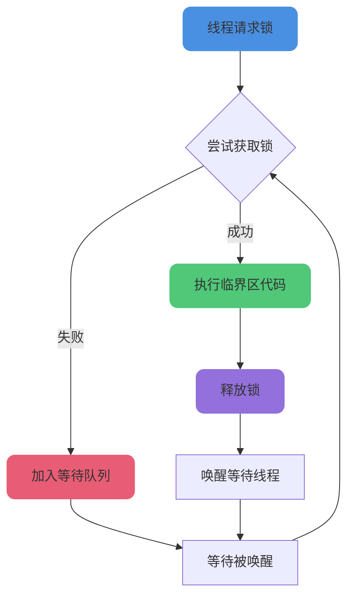
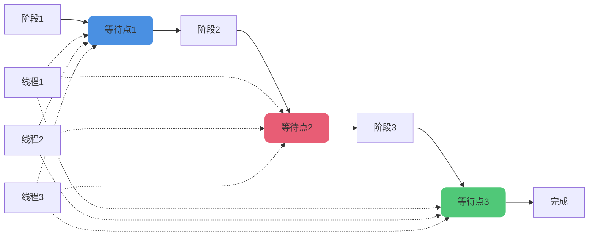
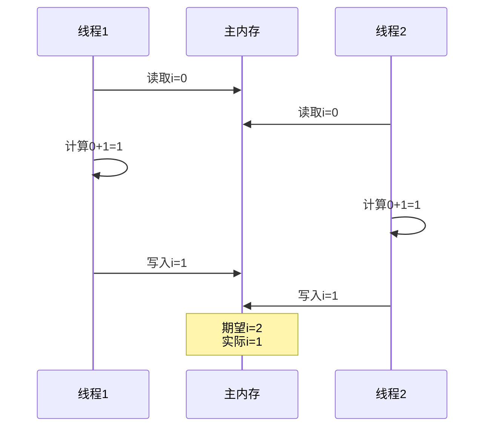

# 线程同步与数据一致性

## 线程同步的实现方式

**线程同步是指让多个线程按照顺序访问同一个共享资源,避免因并发冲突导致的问题**。主要有以下几种实现方式:

### synchronized关键字

synchronized是Java中最基本的线程同步机制,可以修饰代码块或方法,保证同一时间只有一个线程访问该代码块或方法,其他线程需要等待锁的释放。

```java
public class SynchronizedExample {
    private int counter = 0;
    
    // 修饰方法
    public synchronized void incrementMethod() {
        counter++;
    }
    
    // 修饰代码块
    public void incrementBlock() {
        synchronized (this) {
            counter++;
        }
    }
    
    // 静态同步方法
    public static synchronized void staticMethod() {
        System.out.println("静态同步方法");
    }
}
```

synchronized的特点:

- 互斥性: 同一时间只有一个线程能获得锁
- 可见性: 锁释放时会将修改刷新到主内存
- 可重入: 同一线程可以多次获取同一个锁
- 自动释放: 代码块执行完自动释放锁

### ReentrantLock

ReentrantLock是一个可重入的互斥锁,与synchronized功能类似,但更灵活,支持公平锁、可中断锁、多个条件变量等高级功能。

```java
import java.util.concurrent.locks.ReentrantLock;

public class ReentrantLockExample {
    private final ReentrantLock lock = new ReentrantLock();
    private int sharedData = 0;
    
    public void updateData() {
        lock.lock();
        try {
            sharedData++;
            System.out.println("数据更新: " + sharedData);
        } finally {
            lock.unlock();  // 必须在finally中释放锁
        }
    }
    
    // 尝试获取锁
    public boolean tryUpdate() {
        if (lock.tryLock()) {
            try {
                sharedData++;
                return true;
            } finally {
                lock.unlock();
            }
        }
        return false;
    }
}
```

ReentrantLock的优势:

- 可以设置公平/非公平策略
- 支持可中断的锁获取
- 支持尝试非阻塞获取锁
- 可以绑定多个条件变量(Condition)



### Semaphore信号量

Semaphore允许多个线程同时访问共享资源,但限制访问的线程数量。可以用于控制并发访问的线程数,避免系统资源被过度占用。

```java
import java.util.concurrent.Semaphore;

public class SemaphoreExample {
    // 允许3个线程同时访问
    private final Semaphore semaphore = new Semaphore(3);
    
    public void accessResource(String threadName) throws InterruptedException {
        semaphore.acquire();  // 获取许可
        try {
            System.out.println(threadName + " 开始访问资源");
            Thread.sleep(2000);  // 模拟资源访问
            System.out.println(threadName + " 访问完成");
        } finally {
            semaphore.release();  // 释放许可
        }
    }
    
    public static void main(String[] args) {
        SemaphoreExample example = new SemaphoreExample();
        
        for (int i = 1; i &lt;= 10; i++) {
            final int taskId = i;
            new Thread(() -&gt; {
                try {
                    example.accessResource("任务-" + taskId);
                } catch (InterruptedException e) {
                    e.printStackTrace();
                }
            }).start();
        }
    }
}
```

应用场景:

- 限流: 控制同时访问某个资源的线程数
- 连接池: 限制数据库连接数
- 资源管理: 管理有限的系统资源

### CountDownLatch倒计时门闩

CountDownLatch允许一个或多个线程等待其他线程执行完毕后再执行,用于线程之间的协调和通信。

```java
import java.util.concurrent.CountDownLatch;

public class CountDownLatchExample {
    public static void main(String[] args) throws InterruptedException {
        final int workerCount = 5;
        CountDownLatch latch = new CountDownLatch(workerCount);
        
        // 创建5个工作线程
        for (int i = 1; i &lt;= workerCount; i++) {
            final int workerId = i;
            new Thread(() -&gt; {
                try {
                    System.out.println("工作线程" + workerId + " 开始执行");
                    Thread.sleep(1000 * workerId);
                    System.out.println("工作线程" + workerId + " 执行完成");
                } catch (InterruptedException e) {
                    e.printStackTrace();
                } finally {
                    latch.countDown();  // 完成后计数减1
                }
            }).start();
        }
        
        System.out.println("主线程等待所有工作线程完成");
        latch.await();  // 等待计数归零
        System.out.println("所有工作线程已完成,主线程继续执行");
    }
}
```

特点:

- 计数器只能使用一次,不能重置
- 适合一次性的同步场景
- 常用于主线程等待多个子线程完成

### CyclicBarrier循环屏障

CyclicBarrier允许多个线程在一个栅栏处等待,直到所有线程都到达栅栏位置后,才会继续执行。

```java
import java.util.concurrent.BrokenBarrierException;
import java.util.concurrent.CyclicBarrier;

public class CyclicBarrierExample {
    public static void main(String[] args) {
        final int threadCount = 4;
        CyclicBarrier barrier = new CyclicBarrier(threadCount, () -&gt; {
            System.out.println("所有线程已到达屏障点,开始下一阶段");
        });
        
        for (int i = 1; i &lt;= threadCount; i++) {
            final int threadId = i;
            new Thread(() -&gt; {
                try {
                    System.out.println("线程" + threadId + " 准备中");
                    Thread.sleep(1000 * threadId);
                    System.out.println("线程" + threadId + " 到达屏障点");
                    
                    barrier.await();  // 等待其他线程
                    
                    System.out.println("线程" + threadId + " 继续执行");
                } catch (InterruptedException | BrokenBarrierException e) {
                    e.printStackTrace();
                }
            }).start();
        }
    }
}
```

与CountDownLatch的区别:

- CyclicBarrier可以重复使用,CountDownLatch不能
- CyclicBarrier是线程之间相互等待,CountDownLatch是一个或多个线程等待其他线程
- CyclicBarrier可以设置屏障点动作

### Phaser分阶段协调器

Phaser是一种更灵活的多线程同步工具,支持动态注册和注销参与者,可以控制各个参与者的到达和离开。

```java
import java.util.concurrent.Phaser;

public class PhaserExample {
    public static void main(String[] args) {
        Phaser phaser = new Phaser(3);  // 3个参与者
        
        for (int i = 1; i &lt;= 3; i++) {
            final int threadId = i;
            new Thread(() -&gt; {
                System.out.println("线程" + threadId + " 第1阶段开始");
                phaser.arriveAndAwaitAdvance();  // 等待第1阶段完成
                
                System.out.println("线程" + threadId + " 第2阶段开始");
                phaser.arriveAndAwaitAdvance();  // 等待第2阶段完成
                
                System.out.println("线程" + threadId + " 第3阶段开始");
                phaser.arriveAndAwaitAdvance();  // 等待第3阶段完成
                
                System.out.println("线程" + threadId + " 全部完成");
            }).start();
        }
    }
}
```

Phaser的优势:

- 支持动态调整参与者数量
- 可以监控每个阶段的完成情况
- 比CyclicBarrier更灵活



## 保证i++操作的正确性

### i++的线程安全问题

在多线程环境下,`i++`操作不是原子的,它包含三个步骤:

- 读取i的值
- 将i的值加1
- 将新值写回i



要保证多线程下`i++`的正确性,需要考虑:

- **可见性**: 一个线程修改后,其他线程能看到
- **原子性**: 操作不可被中断
- **有序性**: 操作按预期顺序执行

### 解决方案

#### 使用AtomicInteger

AtomicInteger通过CAS操作保证原子性:

```java
import java.util.concurrent.atomic.AtomicInteger;

public class AtomicIntegerExample {
    private static AtomicInteger counter = new AtomicInteger(0);
    
    public static void increment() {
        counter.incrementAndGet();  // 原子操作
    }
    
    public static void main(String[] args) throws InterruptedException {
        Thread[] threads = new Thread[10];
        
        for (int i = 0; i &lt; 10; i++) {
            threads[i] = new Thread(() -&gt; {
                for (int j = 0; j &lt; 1000; j++) {
                    increment();
                }
            });
            threads[i].start();
        }
        
        for (Thread thread : threads) {
            thread.join();
        }
        
        System.out.println("最终结果: " + counter.get());  // 输出: 10000
    }
}
```

#### 使用synchronized

synchronized关键字可以保证原子性、可见性和有序性:

```java
public class SynchronizedCounter {
    private static int counter = 0;
    
    public static synchronized void increment() {
        counter++;
    }
    
    // 或者使用同步代码块
    public static void incrementBlock() {
        synchronized (SynchronizedCounter.class) {
            counter++;
        }
    }
    
    public static void main(String[] args) throws InterruptedException {
        Thread[] threads = new Thread[10];
        
        for (int i = 0; i &lt; 10; i++) {
            threads[i] = new Thread(() -&gt; {
                for (int j = 0; j &lt; 1000; j++) {
                    increment();
                }
            });
            threads[i].start();
        }
        
        for (Thread thread : threads) {
            thread.join();
        }
        
        System.out.println("最终结果: " + counter);  // 输出: 10000
    }
}
```

#### 使用ReentrantLock

ReentrantLock提供了显式的锁控制:

```java
import java.util.concurrent.locks.Lock;
import java.util.concurrent.locks.ReentrantLock;

public class ReentrantLockCounter {
    private int counter = 0;
    private Lock lock = new ReentrantLock();
    
    public void increment() {
        lock.lock();
        try {
            counter++;
        } finally {
            lock.unlock();
        }
    }
    
    public int getCounter() {
        return counter;
    }
    
    public static void main(String[] args) throws InterruptedException {
        ReentrantLockCounter counter = new ReentrantLockCounter();
        Thread[] threads = new Thread[10];
        
        for (int i = 0; i &lt; 10; i++) {
            threads[i] = new Thread(() -&gt; {
                for (int j = 0; j &lt; 1000; j++) {
                    counter.increment();
                }
            });
            threads[i].start();
        }
        
        for (Thread thread : threads) {
            thread.join();
        }
        
        System.out.println("最终结果: " + counter.getCounter());  // 输出: 10000
    }
}
```

### 为什么volatile不能保证i++的正确性

volatile关键字只能保证可见性和有序性,**不能保证原子性**。

```java
public class VolatileCounter {
    private volatile static int counter = 0;
    
    public static void increment() {
        counter++;  // 不是原子操作
    }
    
    public static void main(String[] args) throws InterruptedException {
        Thread[] threads = new Thread[10];
        
        for (int i = 0; i &lt; 10; i++) {
            threads[i] = new Thread(() -&gt; {
                for (int j = 0; j &lt; 1000; j++) {
                    increment();
                }
            });
            threads[i].start();
        }
        
        for (Thread thread : threads) {
            thread.join();
        }
        
        System.out.println("最终结果: " + counter);  // 结果小于10000
    }
}
```

虽然volatile保证了可见性,但`counter++`包含读-改-写三个步骤,不是原子操作,多个线程可能读到相同的值,导致最终结果小于期望值。

:::tip 最佳实践
- 简单计数场景: 优先使用AtomicInteger,性能好且代码简洁
- 需要更复杂的同步逻辑: 使用synchronized或ReentrantLock
- 只需要可见性保证: 使用volatile
- 大量读少量写: 考虑使用ReadWriteLock
:::
