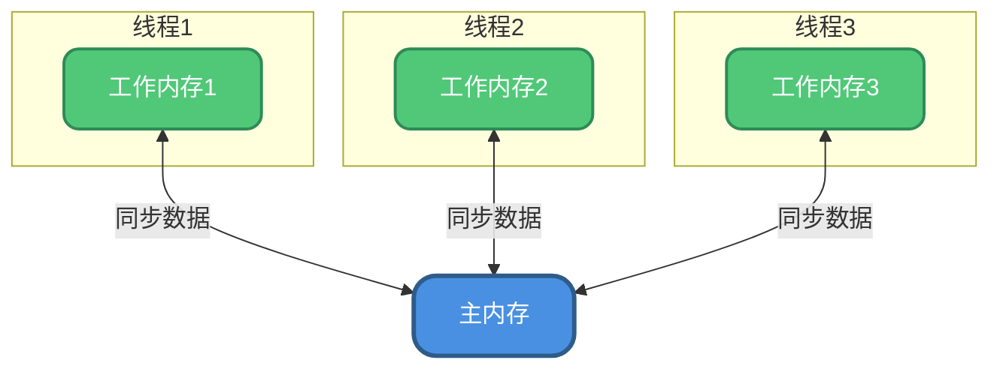
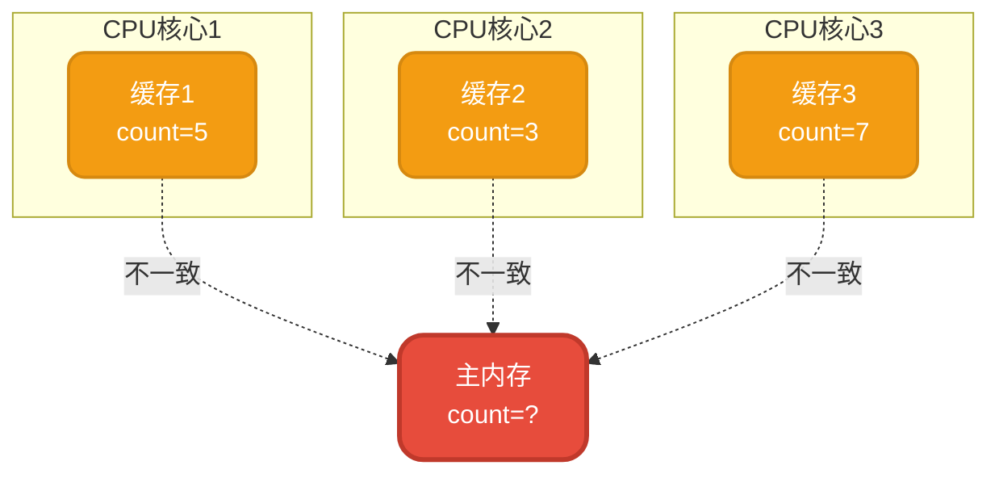
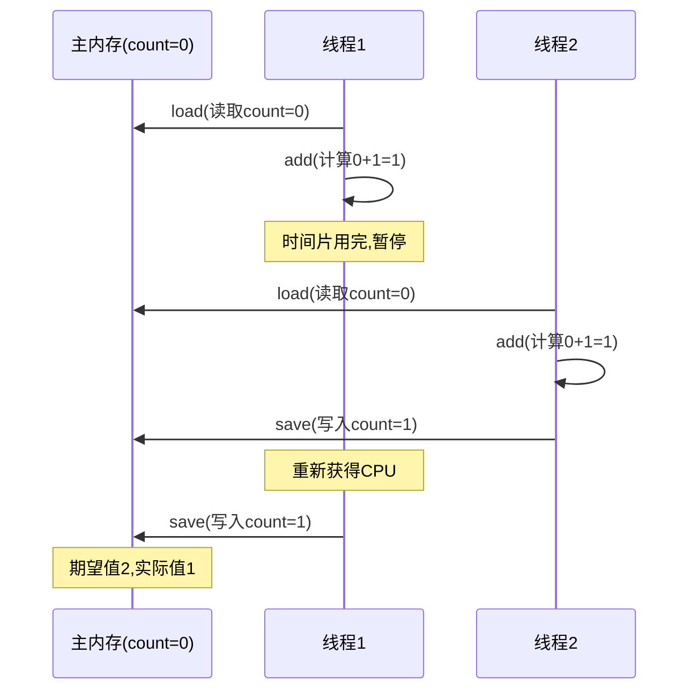
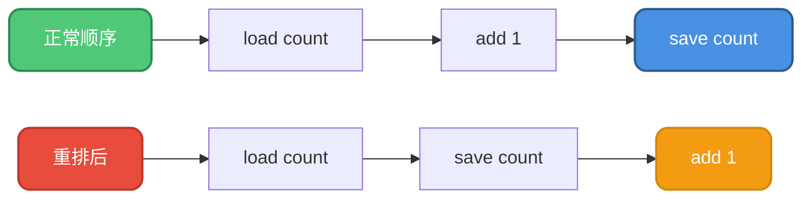
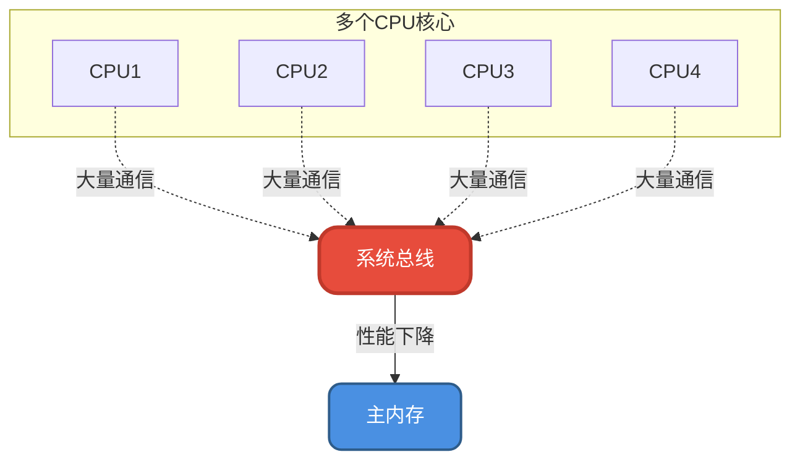

# Java内存模型核心原理

## 什么是Java内存模型

Java程序需要运行在Java虚拟机之上,**Java内存模型(Java Memory Model, JMM)是一种符合内存模型规范的机制,它屏蔽了各种硬件和操作系统的访问差异,保证了Java程序在各种平台下对内存的访问都能达到一致的效果**。

:::tip 重要提示
正确的叫法是"Java内存模型",而不是"JVM内存模型"。JVM内存结构指的是堆、栈、方法区等,而Java内存模型则专注于并发相关的内存访问规范。如果面试官问"JVM内存模型",建议明确确认是在问哪一个概念。
:::

目前主流使用的是从JDK 5开始的新内存模型,主要由JSR-133规范描述。

### JMM的核心机制

Java内存模型规定:
- **所有共享变量都存储在主内存中**
- **每个线程都有自己的工作内存**,保存了该线程使用到的变量的主内存副本
- 线程对变量的所有操作必须在工作内存中进行,不能直接读写主内存
- 不同线程之间无法直接访问对方的工作内存
- 线程间变量传递需要通过主内存来完成数据同步

JMM的作用就是规范工作内存和主内存之间的数据同步过程,包括**如何同步**以及**何时同步**。它的目标是解决多线程通过共享内存通信时可能出现的本地内存数据不一致、编译器指令重排序、处理器乱序执行等问题。

## 并发编程面临的三大问题

### 缓存一致性与可见性问题

随着计算机硬件的发展,CPU与主存之间增加了多级缓存来提升性能。在多线程场景下,这会带来缓存一致性问题。

**单线程环境**: CPU核心的缓存独占,不会出现访问冲突。

**单核CPU多线程**: 虽然多个线程会访问共享数据,但由于任何时刻只有一个线程在执行,缓存不会失效,也不会出现访问冲突。

**多核CPU多线程**: 每个核都有独立的缓存,当多个线程分别在不同核心上执行并访问同一共享变量时,每个核心会在各自缓存中保留一份副本。由于多核可以并行执行,就可能出现多个线程同时写各自缓存的情况,导致各缓存间的数据不一致。

### CPU时间片与原子性问题

现代操作系统都是多用户多任务分时系统。对于单CPU计算机,同一时间只能执行一件事,为了看起来像"同时执行多件事",操作系统将CPU时间划分成时间片,轮流分配给各个任务。

如果某个任务在时间片结束前没有完成,就必须进入就绪状态放弃CPU,等待下一轮调度。这就像一个电话亭,每个用户只能使用规定时长,时间到了还没打完电话就要重新排队。

**原子性问题**指的是多线程场景中,如果操作不能保证原子性,会导致处理结果与预期不一致。

以经典的 `count++` 操作为例,它实际包含三个步骤:
1. `load` - 从主内存读取count的值
2. `add` - 执行加1操作  
3. `save` - 将结果写回主内存

在多线程环境下,如果线程A执行完`load`和`add`后时间片耗尽,此时线程B也读取了count的原始值并完成自增,那么两次自增操作可能只让count增加1。

:::info 并发中的原子性 vs 数据库事务中的原子性
原子性概念在不同领域有不同含义:
- **数据库事务**: 通过提交和回滚保证操作要么全部执行,要么全部不执行
- **并发编程**: 强调操作的不可分割性,在执行完之前不能被其他线程中断,且不涉及回滚机制
:::

### 指令重排与有序性问题

为了提高性能,处理器可能会对输入代码进行优化和乱序执行。例如 `load -> add -> save` 可能被优化成 `load -> save -> add`,这显然不是我们期望的执行顺序。

继续以 `count++` 为例,即使满足了原子性,如果没有满足有序性,得到的结果也可能不符合预期:

## 内存模型的解决方案

硬件升级带来的并发问题不能通过废除优化技术来解决,那样就是因噎废食。为了在保留优化的同时解决并发问题,引入了**内存模型**的概念。

内存模型定义了共享内存系统中多线程程序读写操作行为的规范,通过这些规则来规范内存的读写操作,从而保证指令执行的正确性。它与处理器、缓存、并发、编译器都有关系。

内存模型解决并发问题主要采用两种方式:
1. **限制处理器优化** - 禁止某些可能导致问题的优化
2. **使用内存屏障** - 通过特殊指令保证操作顺序

## Java内存模型的实现

Java提供了一系列与并发处理相关的关键字,如 `volatile`、`synchronized`、`final`、`concurrent` 包等。这些是JMM封装了底层实现后提供给开发者使用的原语。

开发者在编写多线程代码时,可以直接使用这些关键字来控制并发,无需关心底层的编译器优化、缓存一致性等复杂问题。

### 原子性保障

Java通过 `monitorenter` 和 `monitorexit` 两个字节码指令来保证原子性。`synchronized` 关键字就是基于这两个指令实现的。

### 可见性保障

JMM通过在变量修改后将新值同步回主内存,在变量读取前从主内存刷新变量值的方式来实现可见性:

- **volatile**: 被修饰的变量在修改后立即同步到主内存,每次使用前从主内存刷新
- **synchronized**: 同步块结束时会将变量同步到主内存
- **final**: 一旦初始化完成,其他线程就能看到final字段的值

### 有序性保障

Java中可以使用 `synchronized` 和 `volatile` 来保证多线程操作的有序性:

- **volatile**: 禁止指令重排序
- **synchronized**: 保证同一时刻只允许一条线程执行,自然就保证了有序性

## As-If-Serial语义

As-if-serial语义是针对单线程的一个重要原则:**不管怎么重排序,单线程程序的执行结果不能被改变**。编译器和处理器无论如何优化,都必须遵守这个语义。

这个语义保证了在单线程环境中,即使发生了指令重排,开发者也无需关心,因为最终结果一定是正确的。而在多线程环境中,则需要依赖happens-before原则来保证有序性。

由于 `synchronized` 修饰的代码同一时间只能被同一线程访问,相当于单线程执行,所以遵循as-if-serial语义,可以保证其有序性。

## 总线嗅探与总线风暴

### 总线嗅探机制

在多处理器系统中,**总线嗅探(Bus Snooping)是一种用于维护缓存一致性的通信机制**。每个处理器都会监视系统总线上的数据传输,如果发现数据与自己相关,就会采取相应的操作。

这种机制能够:
- 减少数据冲突和锁竞争
- 提高系统的并行性和效率
- 自动维护多个缓存间的数据一致性

### 总线风暴问题

当多个处理器同时竞争总线资源时,会产生大量的总线通信,从而导致**总线风暴(Bus Storm)**:

**总线风暴的影响**:
- 显著降低系统性能
- 可能导致系统响应缓慢甚至崩溃
- 浪费大量总线带宽

### JMM的应对策略

为了解决缓存一致性和总线风暴问题,Java内存模型提供了多种同步机制:

1. **synchronized关键字** - 通过互斥锁减少不必要的缓存同步
2. **ReentrantLock** - 提供更灵活的锁机制
3. **volatile关键字** - 精确控制变量的可见性
4. **Atomic类** - 使用CAS操作减少锁竞争

这些机制能够在保证线程安全的同时,通过减少总线通信来提高系统性能和并发度。

## 总结

Java内存模型是理解Java并发编程的基础:

1. **JMM定义了线程和主内存之间的抽象关系**,规范了共享变量的访问规则
2. **并发编程面临三大问题**: 可见性、原子性、有序性
3. **JMM提供了完整的解决方案**: 通过volatile、synchronized等关键字和happens-before原则来保障并发安全
4. **As-if-serial语义保证单线程环境的正确性**,而多线程环境依赖happens-before原则
5. **总线嗅探机制维护缓存一致性**,但需要注意避免总线风暴

理解JMM有助于我们更好地编写高效、正确的并发程序。
