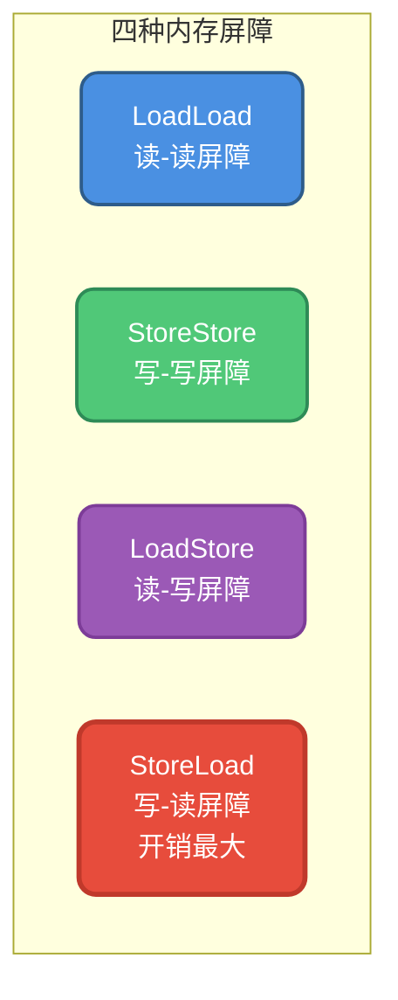
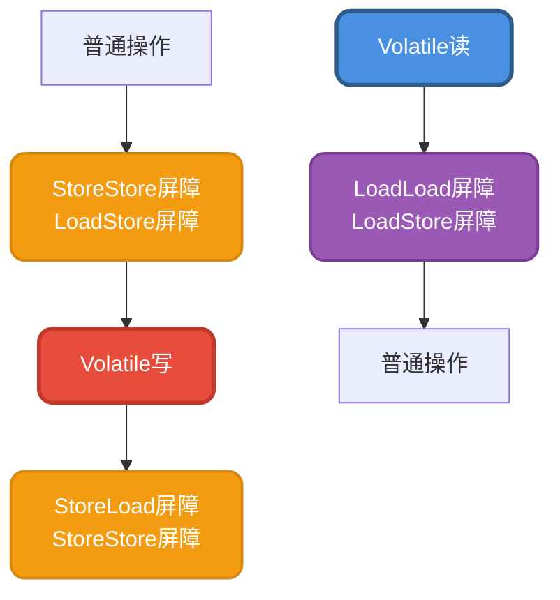
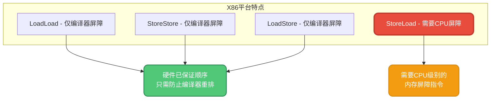
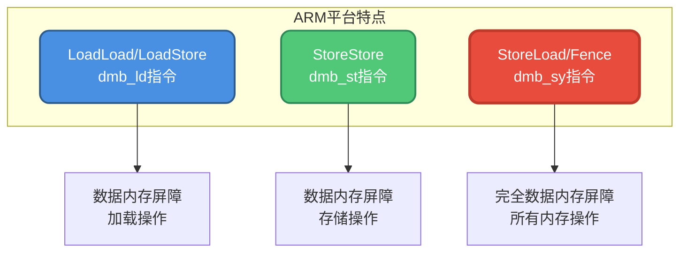
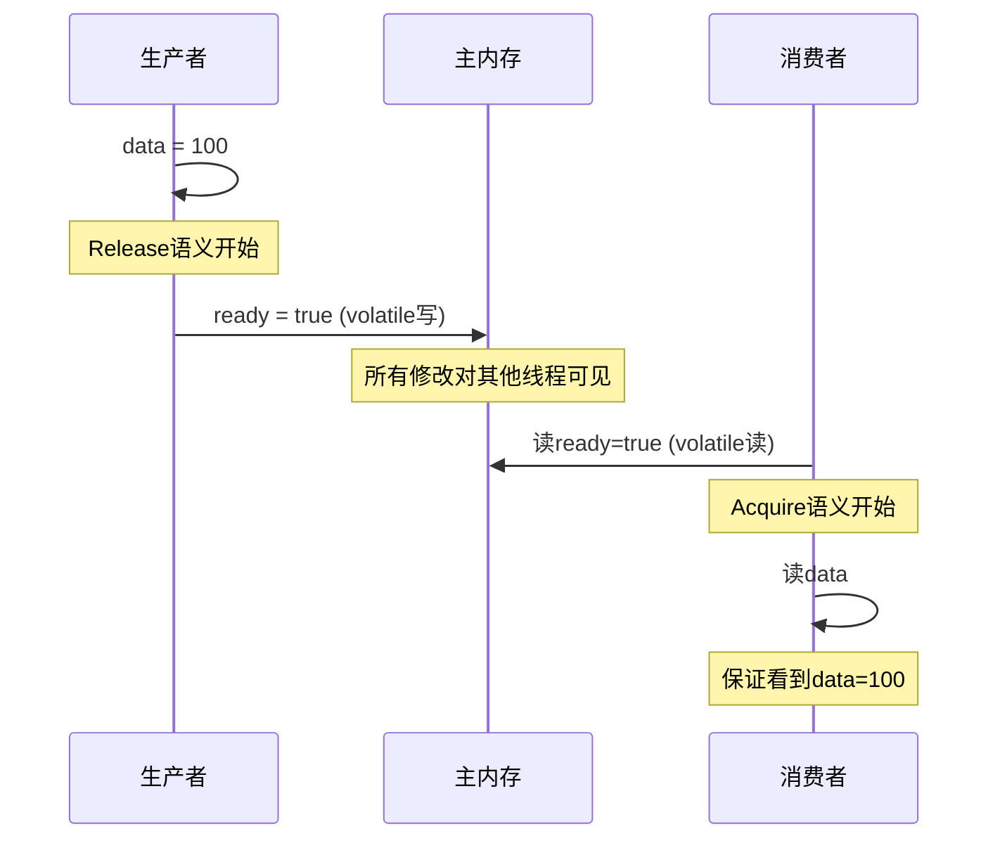
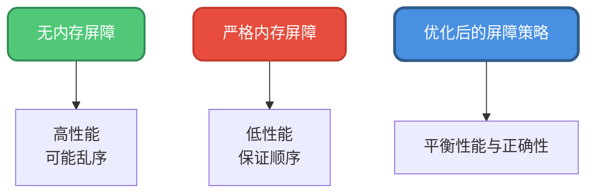

# 内存屏障与指令重排

## 什么是内存屏障

**内存屏障(Memory Barrier)是一种CPU指令**,它可以防止CPU及编译器对指令序列进行重排序,从而保证代码执行过程中对内存的读写操作按照程序员的意愿进行。

在Java中,为了保证volatile变量的可见性和禁止指令重排序,JVM会在生成的字节码中插入内存屏障指令来实现这些语义。

:::info 推荐阅读
关于内存屏障的底层实现,可以参考Doug Lea的经典文章: [JSR-133 Cookbook for Compiler Writers](https://gee.cs.oswego.edu/dl/jmm/cookbook.html)
:::

## 四种基本内存屏障

Java内存模型定义了四种基本的内存屏障类型,用于控制不同类型操作之间的顺序关系。

### LoadLoad屏障

**指令序列**: `Load1; LoadLoad; Load2`

**语义**: 确保Load1的数据加载先于Load2及所有后续加载指令的加载操作。

```java
public class LoadLoadExample {
    private int x;
    private int y;
    
    public void readData() {
        int a = x;  // Load1
        // LoadLoad屏障
        int b = y;  // Load2
        // 保证读取x一定在读取y之前完成
    }
}
```


### StoreStore屏障

**指令序列**: `Store1; StoreStore; Store2`

**语义**: 确保Store1的数据对其他处理器可见(刷新到内存)先于Store2及所有后续存储指令的存储操作。

```java
public class StoreStoreExample {
    private int x;
    private int y;
    
    public void writeData() {
        x = 10;  // Store1
        // StoreStore屏障
        y = 20;  // Store2
        // 保证x的写入在y的写入之前对其他线程可见
    }
}
```


### LoadStore屏障

**指令序列**: `Load1; LoadStore; Store2`

**语义**: 确保Load1的数据加载先于Store2及所有后续存储指令将数据刷新到主内存。

```java
public class LoadStoreExample {
    private int source;
    private int target;
    
    public void transferData() {
        int temp = source;  // Load1
        // LoadStore屏障
        target = temp;  // Store2
        // 保证读取source在写入target之前完成
    }
}
```

### StoreLoad屏障

**指令序列**: `Store1; StoreLoad; Load2`

**语义**: 确保Store1的数据对其他处理器可见(刷新到主内存)先于Load2及所有后续加载指令的加载操作。

```java
public class StoreLoadExample {
    private int flag;
    private int data;
    
    public void publish() {
        flag = 1;  // Store1
        // StoreLoad屏障(最重的屏障)
        int temp = data;  // Load2
        // 保证flag的写入对其他处理器可见后才读取data
    }
}
```

:::warning 性能开销
StoreLoad是所有屏障中开销最大的,因为它需要完全刷新写缓冲区并等待其他处理器的缓存失效操作完成。
:::



## Volatile变量的内存屏障策略

### 理论上的完整策略

如果要做到最严格的内存屏障保护,对于volatile变量的访问,应该这样添加屏障:

**在volatile写操作前**:
- 添加StoreStore屏障
- 添加LoadStore屏障

**在volatile写操作后**:
- 添加StoreLoad屏障
- 添加StoreStore屏障

**在volatile读操作后**:
- 添加LoadLoad屏障
- 添加LoadStore屏障

```java
// 理论上的完整屏障插入
普通变量写操作
// StoreStore屏障
// LoadStore屏障

volatile变量写  // volatile write

// StoreLoad屏障
// StoreStore屏障

// --------

volatile变量读  // volatile read

// LoadLoad屏障
// LoadStore屏障
普通变量读操作
```



这些定义可以在JDK源码的 `MemoryBarriers.java` 中找到。

### 实际优化策略

然而,正如Doug Lea所说:"很难找到一个'最佳'位置使得最大限度地减少执行屏障的总数"。在不同的操作系统和硬件平台上,内存屏障的具体实现也不尽相同,有些操作系统能够天然保证某些操作不会被重排序。

因此,在实际实现中会做优化,尽可能减少屏障数量以提高性能。

## 不同平台的实现差异

内存屏障在JDK中的定义位于 `orderAccess.hpp`:

```java
class OrderAccess : public AllStatic {
 public:
  // 基本屏障
  static void loadload();
  static void storestore();
  static void loadstore();
  static void storeload();
  
  // 复合屏障
  static void acquire();  // 获取语义
  static void release();  // 释放语义
  static void fence();    // 全屏障
}
```

不同操作系统和CPU架构有各自的实现。下面对比几种主流平台:

### X86平台实现

X86架构的内存模型相对较强,天然提供了一些有序性保证:

```java
// X86平台的实现
inline void OrderAccess::loadload()   { compiler_barrier(); }
inline void OrderAccess::storestore() { compiler_barrier(); }
inline void OrderAccess::loadstore()  { compiler_barrier(); }
inline void OrderAccess::storeload()  { fence(); }

inline void OrderAccess::acquire()    { compiler_barrier(); }
inline void OrderAccess::release()    { compiler_barrier(); }
```



对于X86平台,只有StoreLoad需要特殊处理:

```java
inline void OrderAccess::fence() {
#ifdef AMD64
  StubRoutines_fence();
#else
  __asm {
    lock add dword ptr [esp], 0;  // 使用lock前缀指令
  }
#endif
  compiler_barrier();
}
```

:::tip X86的优势
X86的强内存模型意味着大部分内存屏障只需要编译器屏障即可,这大大降低了性能开销。
:::

### ARM平台实现

ARM架构采用弱内存模型,需要更多的显式屏障:

```java
// ARM平台的实现
inline void OrderAccess::loadload()   { dmb_ld(); }
inline void OrderAccess::loadstore()  { dmb_ld(); }
inline void OrderAccess::acquire()    { dmb_ld(); }

inline void OrderAccess::storestore() { dmb_st(); }

inline void OrderAccess::storeload()  { dmb_sy(); }
inline void OrderAccess::release()    { dmb_sy(); }
inline void OrderAccess::fence()      { dmb_sy(); }
```



ARM需要使用不同的DMB(Data Memory Barrier)指令:
- `dmb_ld`: 数据内存屏障-加载
- `dmb_st`: 数据内存屏障-存储
- `dmb_sy`: 数据内存屏障-完全同步

### 平台对比总结

| 屏障类型 | X86 | ARM | 说明 |
|---------|-----|-----|------|
| LoadLoad | compiler_barrier | dmb_ld | X86硬件保证 |
| StoreStore | compiler_barrier | dmb_st | X86硬件保证 |
| LoadStore | compiler_barrier | dmb_ld | X86硬件保证 |
| StoreLoad | fence() | dmb_sy | 都需CPU指令 |

:::info 术语说明
- **no-op**: 空操作,表示操作系统已天然支持,无需额外指令
- **acquire**: 获取语义,不允许后面的读写向前越过屏障(挡后不挡前)
- **release**: 释放语义,不允许前面的读写向后越过屏障(挡前不挡后)
- **fence**: 全屏障,双向阻止重排序
:::

## Acquire和Release语义

在理解内存屏障时,acquire和release是两个重要概念:

### Acquire语义

**acquire相当于在Load后面加上LoadLoad和LoadStore屏障**。

```java
// acquire语义
volatile int data = sharedData;  // volatile read with acquire
// LoadLoad屏障
// LoadStore屏障
int local = data;
```


作用:阻止后面的内存操作重排到acquire之前。

### Release语义

**release相当于在Store前面加上LoadStore和StoreStore屏障**。

```java
// release语义
int temp = localData;
// LoadStore屏障
// StoreStore屏障
sharedData = temp;  // volatile write with release
```


作用:阻止前面的内存操作重排到release之后。

### Acquire-Release配对使用

```java
public class AcquireReleaseExample {
    private volatile boolean ready = false;
    private int data;
    
    // 生产者线程
    public void producer() {
        data = 100;
        // StoreStore屏障
        ready = true;  // volatile write (release语义)
    }
    
    // 消费者线程
    public void consumer() {
        if (ready) {  // volatile read (acquire语义)
            // LoadLoad屏障
            // LoadStore屏障
            int value = data;  // 保证能看到data=100
        }
    }
}
```



## 内存屏障的性能影响

### 为什么需要优化

虽然内存屏障能够保证正确性,但它会带来性能开销:

1. **禁止指令重排** - 减少了编译器和CPU的优化空间
2. **强制缓存同步** - 需要刷新缓存和写缓冲区
3. **等待操作完成** - StoreLoad需要等待之前的写操作对所有处理器可见



### 优化策略

1. **利用硬件特性** - X86平台充分利用其强内存模型
2. **减少屏障数量** - 在保证正确性的前提下尽量少加屏障
3. **选择合适的屏障类型** - 优先使用开销小的屏障
4. **批量操作** - 将多个操作合并,减少屏障插入次数

## 实际应用示例

### 示例1: 双重检查锁定

```java
public class Singleton {
    private volatile static Singleton instance;
    
    public static Singleton getInstance() {
        if (instance == null) {  // 第一次检查,无需加锁
            synchronized (Singleton.class) {
                if (instance == null) {  // 第二次检查
                    instance = new Singleton();
                    // volatile写会插入内存屏障
                    // 保证对象完全初始化后才对其他线程可见
                }
            }
        }
        return instance;
    }
}
```

volatile在这里的作用:
- 防止 `new Singleton()` 指令重排
- 确保对象完全初始化后才发布

### 示例2: 生产者-消费者模式

```java
public class ProducerConsumer {
    private volatile boolean hasData = false;
    private int buffer;
    
    // 生产者
    public void produce(int value) {
        buffer = value;
        // StoreStore屏障(release语义)
        hasData = true;  // volatile写
    }
    
    // 消费者
    public int consume() {
        while (!hasData) {  // volatile读
            // LoadLoad和LoadStore屏障(acquire语义)
        }
        return buffer;  // 保证能读到最新的buffer值
    }
}
```

## 总结

内存屏障是实现Java内存模型的关键机制:

1. **四种基本屏障** - LoadLoad、StoreStore、LoadStore、StoreLoad,用于控制不同类型操作的顺序
2. **Volatile的屏障策略** - 在volatile读写操作前后插入适当的内存屏障,保证可见性和有序性
3. **平台差异优化** - 不同平台根据硬件特性采用不同的实现策略,X86可以省略大部分屏障
4. **Acquire-Release语义** - 提供了一种高效的同步机制,acquire阻止后续操作前移,release阻止前序操作后移
5. **性能权衡** - 在保证正确性的前提下,尽量减少内存屏障的使用以提高性能

理解内存屏障有助于深入理解volatile、synchronized等并发关键字的实现原理,但在日常开发中,我们通常只需要正确使用这些高级抽象,而无需直接操作内存屏障。
