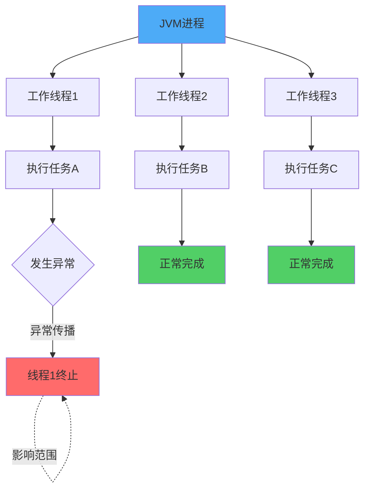
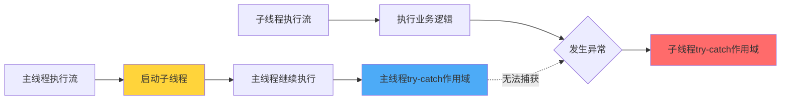

import PaidCTA from '@site/src/components/PaidCTA';

# 线程异常处理机制

## 线程异常的独立性

在Java多线程编程中，每个线程都是独立的执行单元，拥有各自的调用栈和执行上下文。当某个线程内部发生异常时，这个异常只会影响当前线程的执行流程，不会波及到其他线程或导致整个JVM进程终止。

这种设计保证了Java应用的健壮性。假设在一个Web服务器中，每个HTTP请求由独立的线程处理，如果某个请求处理过程中出现了空指针异常，该异常只会导致这个特定请求失败，而不会影响其他正在处理的请求，服务器依然可以继续为其他用户提供服务。

### 线程异常不终止进程的原因

Java虚拟机将异常分为两大类：Exception（异常）和Error（错误）。对于Exception类型的异常，JVM认为这些是可恢复的、预期内的错误情况，因此不会因为单个线程抛出Exception而终止整个进程。

线程异常的隔离机制主要基于以下几点：

1. **独立的执行上下文**：每个线程维护自己的程序计数器、虚拟机栈和本地方法栈，异常信息存储在线程私有的栈帧中
2. **异常传播边界**：未捕获的异常只会在当前线程的调用栈中向上传播，直到线程的run方法结束
3. **线程生命周期管理**：线程因异常终止后，JVM会清理该线程的资源，但其他线程继续正常运行



### 异常处理的最佳实践

在实际开发中，建议在线程执行的核心逻辑中主动使用try-catch块来捕获和处理异常。这样不仅可以记录错误信息，还能执行必要的资源清理操作，避免资源泄漏。

```java
public class OrderProcessingTask implements Runnable {
    private final String orderId;
    
    public OrderProcessingTask(String orderId) {
        this.orderId = orderId;
    }
    
    @Override
    public void run() {
        DatabaseConnection conn = null;
        try {
            conn = DatabasePool.getConnection();
            // 处理订单业务逻辑
            processOrder(orderId, conn);
            conn.commit();
        } catch (DatabaseException e) {
            // 记录异常日志
            Logger.error("订单处理失败: " + orderId, e);
            if (conn != null) {
                conn.rollback();
            }
        } finally {
            // 释放数据库连接
            if (conn != null) {
                conn.close();
            }
        }
    }
    
    private void processOrder(String orderId, DatabaseConnection conn) {
        // 订单处理逻辑
        conn.executeUpdate("UPDATE orders SET status = 'processing' WHERE id = ?", orderId);
        // 更多业务逻辑...
    }
}
```

## 跨线程异常传播的限制

在多线程环境中，主线程无法直接通过try-catch块捕获子线程内部抛出的异常。这是由于线程之间的执行是异步且独立的，主线程执行到启动子线程的代码后会继续向下执行，而子线程在另一个执行流中运行。

### 异步执行导致的异常隔离

当主线程调用子线程的start()方法后，两个线程进入并发执行状态。主线程的try-catch块只能捕获其自身调用栈中抛出的异常，无法跨越线程边界捕获子线程的异常。

```java
public class PaymentService {
    public static void main(String[] args) {
        Thread paymentThread = new Thread(() -> {
            try {
                // 模拟支付处理
                double amount = calculateAmount(1000, 0);
                System.out.println("支付金额: " + amount);
            } catch (ArithmeticException e) {
                System.out.println("支付线程捕获到计算异常");
                throw e; // 重新抛出异常
            }
        });

        try {
            // 主线程启动支付线程
            paymentThread.start();
        } catch (Exception e) {
            // 这里无法捕获到支付线程中的异常
            System.out.println("主线程捕获到异常");
        }

        System.out.println("主线程继续执行后续业务逻辑");
    }
    
    private static double calculateAmount(double price, int quantity) {
        return price / quantity; // 当quantity为0时抛出ArithmeticException
    }
}
```

执行结果：
```
支付线程捕获到计算异常
主线程继续执行后续业务逻辑
```

从输出可以看出，支付线程中发生的异常完全被隔离在该线程内部，主线程无法感知也无法捕获。



## 跨线程异常捕获的实现方案

虽然主线程无法直接捕获子线程异常，但在实际应用中，我们常常需要监控和处理子线程的异常情况。Java提供了多种机制来实现这一需求。

<PaidCTA />