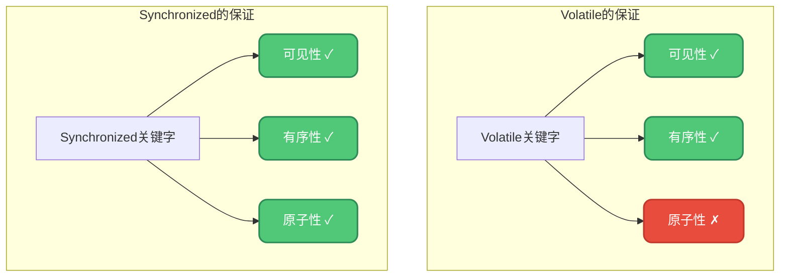
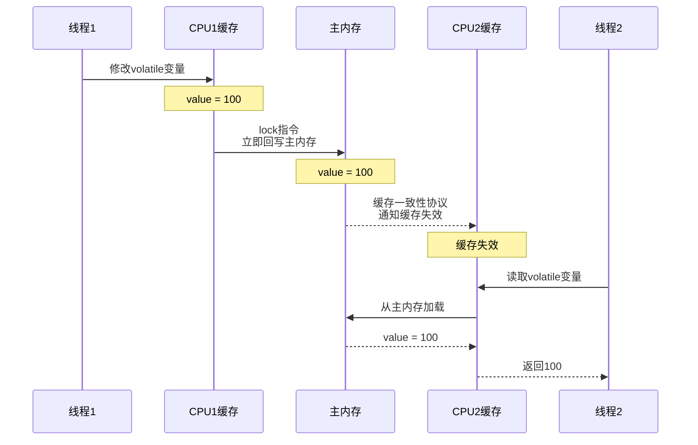
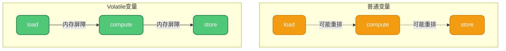
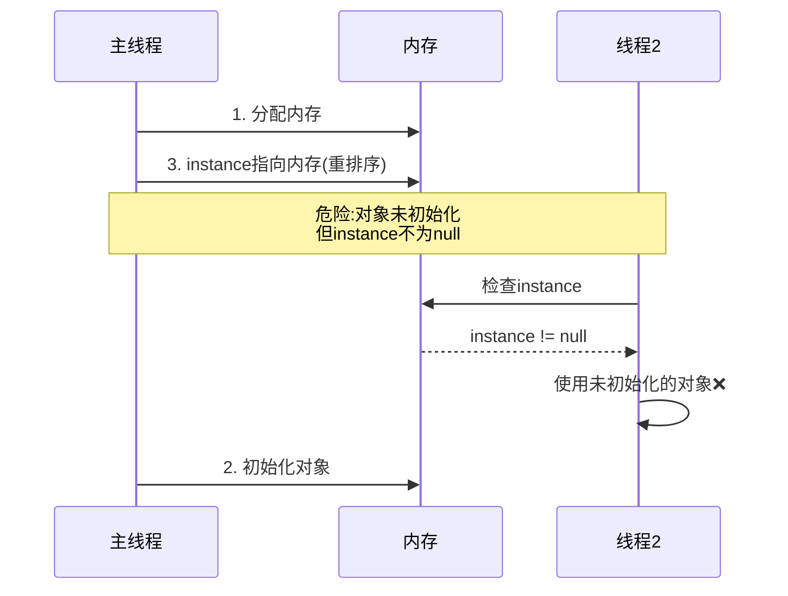
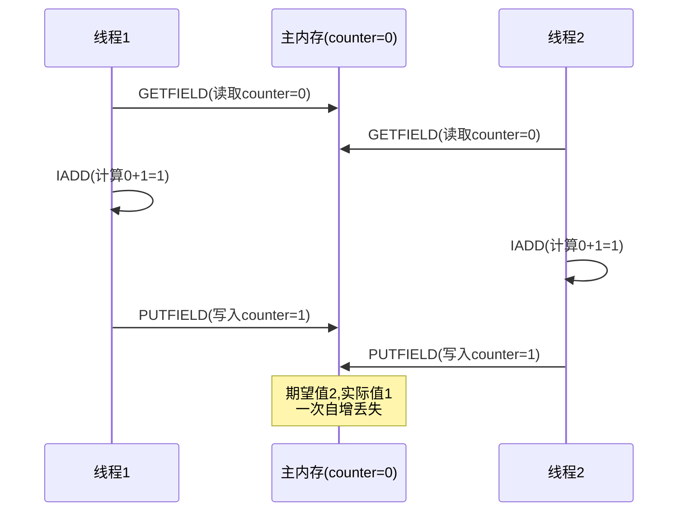
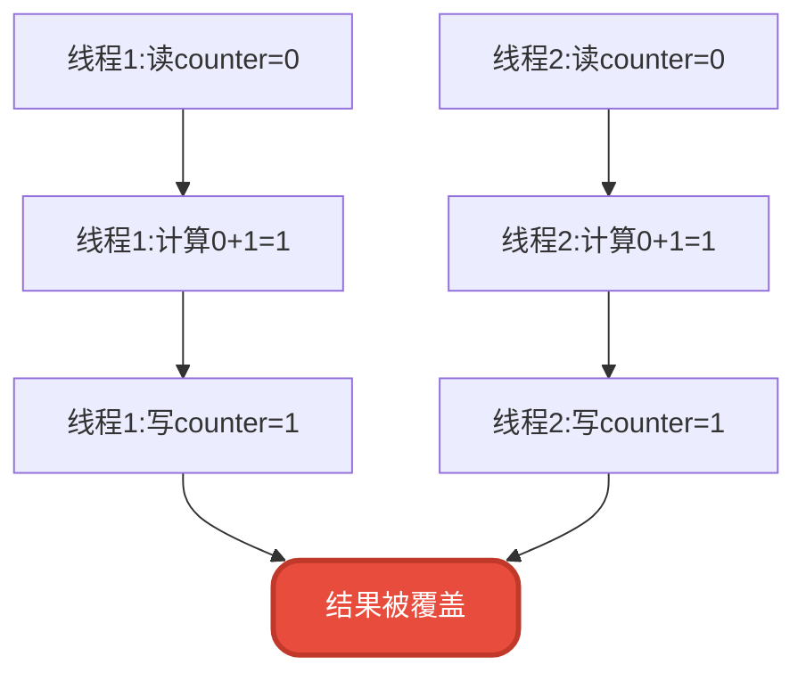
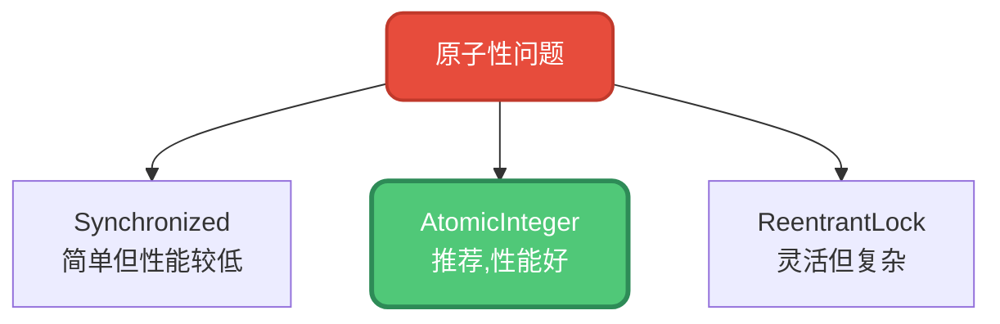
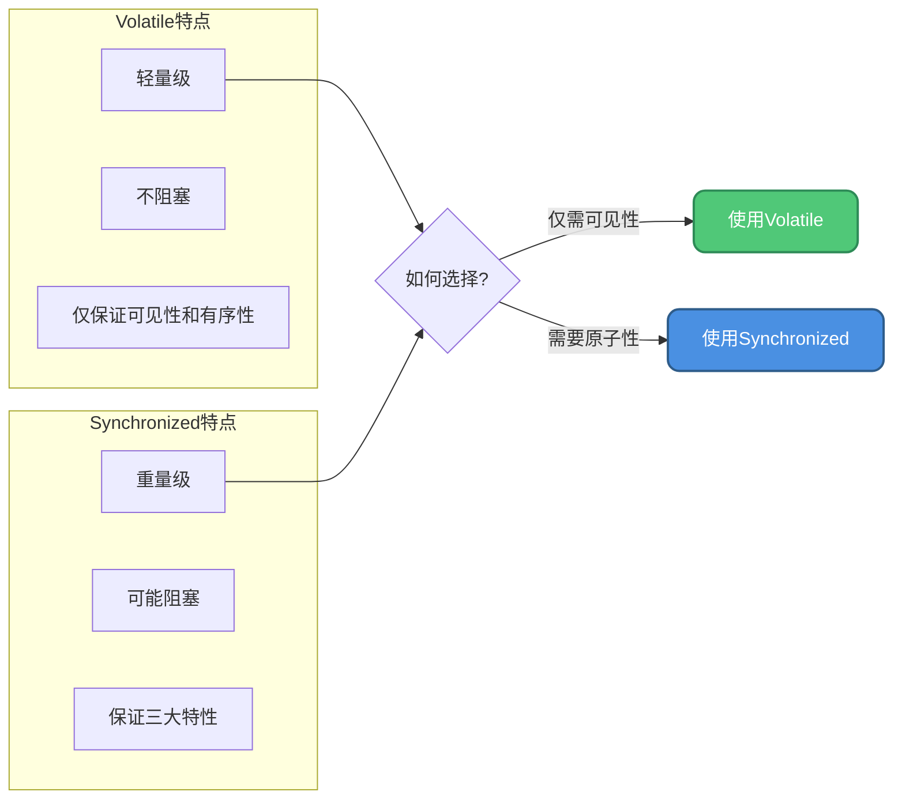
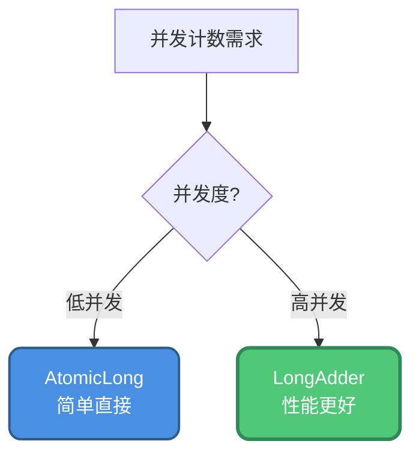

# Volatile关键字深入解析

## Volatile概述

`volatile` 是Java并发编程中的一个重要关键字,通常被称为"轻量级的synchronized"。与synchronized不同,**volatile是一个变量修饰符,只能用来修饰变量,无法修饰方法及代码块**。

```java
public class VolatileExample {
    private volatile int counter = 0;  // 使用volatile修饰变量
    private volatile boolean flag = false;
}
```

volatile的使用非常简单,只需要在声明可能被多线程同时访问的变量时添加该修饰符即可。但是,**volatile在线程安全方面有其局限性:它可以保证有序性和可见性,但不能保证原子性**。



## Volatile如何保证可见性

### 可见性机制

当对volatile变量进行写操作时,**JVM会向处理器发送一条带有lock前缀的指令,将缓存中的变量值立即回写到系统主内存**。

根据缓存一致性协议(如MESI),当一个处理器检测到其缓存的变量被其他处理器修改,就会将自己缓存中的该变量值置为无效,下次访问时必须从主内存重新读取。



### 实际应用示例

```java
public class VisibilityDemo {
    private volatile boolean running = true;
    
    public void startTask() {
        new Thread(() -> {
            System.out.println("任务开始执行...");
            while (running) {
                // 执行任务
                // 由于running是volatile,能及时看到主线程的修改
            }
            System.out.println("任务停止");
        }).start();
    }
    
    public void stopTask() {
        running = false;  // 修改立即对其他线程可见
    }
}
```

如果 `running` 不使用volatile修饰,工作线程可能会一直在自己的缓存中读取到 `true`,导致无法停止。

## Volatile如何保证有序性

### 禁止指令重排

普通变量只能保证在依赖赋值结果的地方获得正确的结果,不能保证赋值操作的顺序与程序代码执行顺序一致。

**volatile通过内存屏障来禁止指令重排**,保证代码严格按照先后顺序执行。被volatile修饰的变量的操作会严格按照 `load -> compute -> store` 的顺序执行。

```java
public class OrderingDemo {
    private int normalVar = 0;
    private volatile int volatileVar = 0;
    
    // 普通变量:可能重排序
    public void normalOperation() {
        int a = normalVar;  // 可能与下一行重排
        int b = normalVar + 1;
    }
    
    // volatile变量:严格按序执行
    public void volatileOperation() {
        int a = volatileVar;  // load
        int b = a + 1;        // compute
        volatileVar = b;      // store
        // 保证严格按照这个顺序执行
    }
}
```



### 双重检查锁定必须使用Volatile

这是volatile保证有序性的经典应用场景:

```java
public class Singleton {
    // 必须使用volatile
    private volatile static Singleton instance;
    
    private Singleton() {}
    
    public static Singleton getInstance() {
        if (instance == null) {  // 第一次检查
            synchronized (Singleton.class) {
                if (instance == null) {  // 第二次检查
                    instance = new Singleton();
                }
            }
        }
        return instance;
    }
}
```

**为什么必须使用volatile?**

`new Singleton()` 实际包含三个步骤:
1. 分配内存空间
2. 初始化对象
3. 将instance指向内存地址

如果没有volatile,步骤2和3可能被重排序,导致其他线程看到未完全初始化的对象:



使用volatile后,内存屏障阻止重排序,保证对象完全初始化后才对其他线程可见。

## Volatile为什么不能保证原子性

### 原子性的定义

**synchronized能保证原子性**,因为被修饰的代码在进入前加锁,只要没执行完,其他线程无法获得锁来执行这段代码,从而保证内部代码的完整执行。

**volatile不能保证原子性**,因为它不是锁机制,没有做任何保证原子性的处理。

### 经典反例: i++操作

```java
public class AtomicityProblem {
    volatile int counter = 0;

    public void increment() {
        counter++;  // 非原子操作
    }

    public static void main(String[] args) throws InterruptedException {
        AtomicityProblem demo = new AtomicityProblem();
        
        // 创建10个线程,每个线程执行1000次自增
        Thread[] threads = new Thread[10];
        for (int j = 0; j < 10; j++) {
            threads[j] = new Thread(() -> {
                for (int i = 0; i < 1000; i++) {
                    demo.increment();
                }
            });
            threads[j].start();
        }
        
        // 等待所有线程执行完成
        for (Thread thread : threads) {
            thread.join();
        }
        
        // 期望结果:10000,实际结果:可能小于10000
        System.out.println("最终结果: " + demo.counter);
    }
}
```

运行这段代码,你会发现结果几乎不可能是10000,这就是因为 `counter++` 不是原子操作。

### 问题分析

`counter++` 实际被拆分成3个步骤:

1. **GETFIELD**: 从主内存读取counter的原始值
2. **IADD**: 执行加1操作
3. **PUTFIELD**: 将结果写回主内存



虽然volatile保证了每次读写都是从主内存进行,但无法保证这三个操作的整体原子性。当多个线程并发执行时,就会出现写覆盖的问题。



### 解决方案

对于需要保证原子性的操作,有以下几种解决方案:

#### 方案1: 使用Synchronized

```java
public class SynchronizedSolution {
    private int counter = 0;
    
    public synchronized void increment() {
        counter++;  // synchronized保证原子性
    }
}
```

#### 方案2: 使用原子类

```java
public class AtomicSolution {
    private AtomicInteger counter = new AtomicInteger(0);
    
    public void increment() {
        counter.incrementAndGet();  // 原子操作
    }
}
```

#### 方案3: 使用Lock

```java
public class LockSolution {
    private int counter = 0;
    private final Lock lock = new ReentrantLock();
    
    public void increment() {
        lock.lock();
        try {
            counter++;
        } finally {
            lock.unlock();
        }
    }
}
```



## Volatile的适用场景

### 适合使用Volatile的场景

#### 场景1: 状态标志

```java
public class StatusFlag {
    private volatile boolean shutdown = false;
    
    public void doWork() {
        while (!shutdown) {
            // 执行工作
        }
    }
    
    public void shutdown() {
        shutdown = true;
    }
}
```

#### 场景2: 一次性安全发布

```java
public class SafePublish {
    private volatile Configuration config;
    
    public void initialize() {
        Configuration temp = new Configuration();
        temp.loadFromFile();
        config = temp;  // 一次性发布,保证其他线程看到完整对象
    }
    
    public Configuration getConfig() {
        return config;
    }
}
```

#### 场景3: 独立观察

```java
public class SensorMonitor {
    private volatile int temperature;
    
    // 传感器线程写入
    public void updateTemperature(int value) {
        temperature = value;
    }
    
    // 监控线程读取
    public void checkTemperature() {
        if (temperature > 100) {
            System.out.println("温度过高警报!");
        }
    }
}
```

### 不适合使用Volatile的场景

#### 场景1: 需要原子操作

```java
// ❌ 错误:volatile不能保证原子性
public class WrongUsage {
    private volatile int count = 0;
    
    public void increment() {
        count++;  // 非原子操作,会有并发问题
    }
}

// ✓ 正确:使用AtomicInteger
public class CorrectUsage {
    private AtomicInteger count = new AtomicInteger(0);
    
    public void increment() {
        count.incrementAndGet();  // 原子操作
    }
}
```

#### 场景2: 复合状态依赖

```java
// ❌ 错误:多个volatile变量之间的操作非原子
public class WrongComposite {
    private volatile int lower = 0;
    private volatile int upper = 10;
    
    // 非原子操作
    public void setRange(int l, int u) {
        lower = l;
        upper = u;
        // 可能出现lower > upper的中间状态
    }
}

// ✓ 正确:使用同步
public class CorrectComposite {
    private int lower = 0;
    private int upper = 10;
    
    public synchronized void setRange(int l, int u) {
        lower = l;
        upper = u;
    }
}
```

## Volatile vs Synchronized对比

| 特性 | Volatile | Synchronized |
|-----|----------|--------------|
| **原子性** | ✗ 不保证 | ✓ 保证 |
| **可见性** | ✓ 保证 | ✓ 保证 |
| **有序性** | ✓ 保证 | ✓ 保证 |
| **使用方式** | 修饰变量 | 修饰方法/代码块 |
| **性能开销** | 低 | 较高(涉及锁) |
| **阻塞性** | 不阻塞 | 可能阻塞 |
| **适用场景** | 简单状态标志 | 复杂临界区 |



## 性能优化建议

### 原子类家族

对于简单的原子操作,优先使用JUC包提供的原子类:

```java
public class AtomicComparison {
    // 基本类型原子类
    private AtomicInteger intCounter = new AtomicInteger(0);
    private AtomicLong longCounter = new AtomicLong(0);
    private AtomicBoolean flag = new AtomicBoolean(false);
    
    // 数组类型原子类
    private AtomicIntegerArray intArray = new AtomicIntegerArray(10);
    
    // 引用类型原子类
    private AtomicReference<User> userRef = new AtomicReference<>();
    
    public void performOperations() {
        intCounter.incrementAndGet();
        longCounter.addAndGet(100);
        flag.compareAndSet(false, true);
        intArray.getAndIncrement(0);
    }
}
```

### LongAdder: 更高性能的计数器

在高并发计数场景下,`LongAdder` 比 `AtomicLong` 性能更好:

```java
public class HighConcurrencyCounter {
    // 推荐:高并发下性能更好
    private LongAdder counter = new LongAdder();
    
    public void increment() {
        counter.increment();
    }
    
    public long getCount() {
        return counter.sum();
    }
}
```



**LongAdder原理**:
- 内部维护多个计数单元
- 不同线程操作不同单元,减少竞争
- 读取时汇总所有单元的值

## 总结

Volatile是Java并发编程中的重要工具:

1. **保证可见性** - 通过缓存一致性协议和lock指令,确保修改立即对其他线程可见
2. **保证有序性** - 通过内存屏障禁止指令重排,确保操作按序执行
3. **不保证原子性** - 这是最容易被误用的地方,复合操作必须使用其他同步机制
4. **适用场景明确** - 状态标志、一次性发布等简单场景适合使用volatile
5. **性能优势** - 比synchronized轻量,但功能也更受限

**使用建议**:
- ✓ 状态标志使用volatile
- ✓ 原子操作使用AtomicXxx
- ✓ 高并发计数使用LongAdder
- ✓ 复杂同步使用synchronized或Lock

理解volatile的特性和局限性,才能在并发编程中正确使用它。
