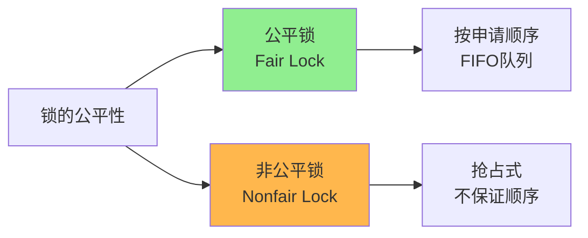
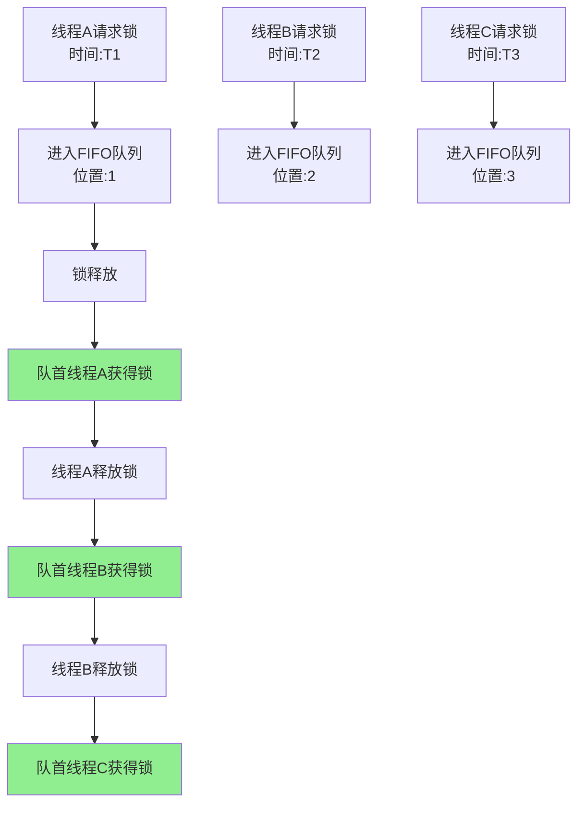
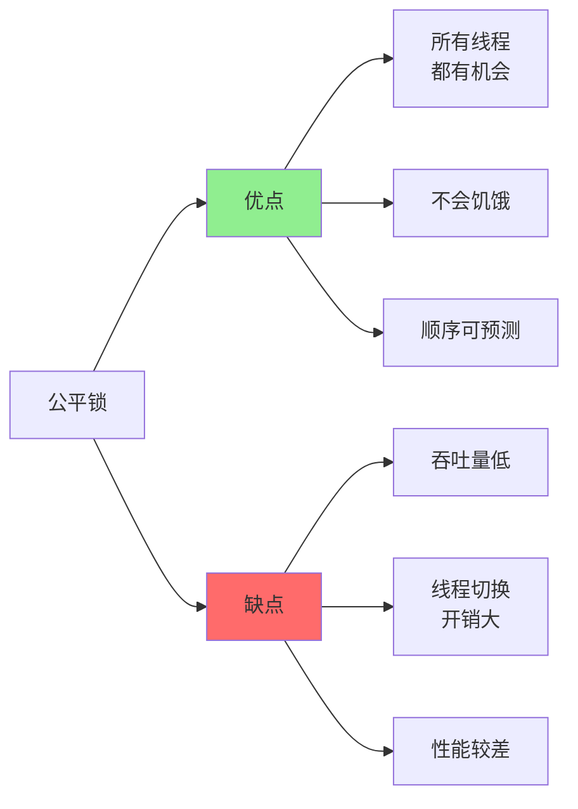
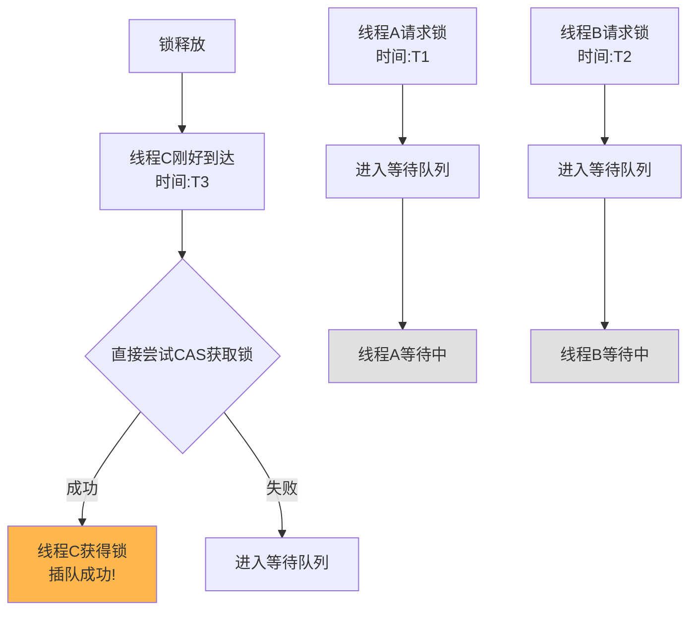
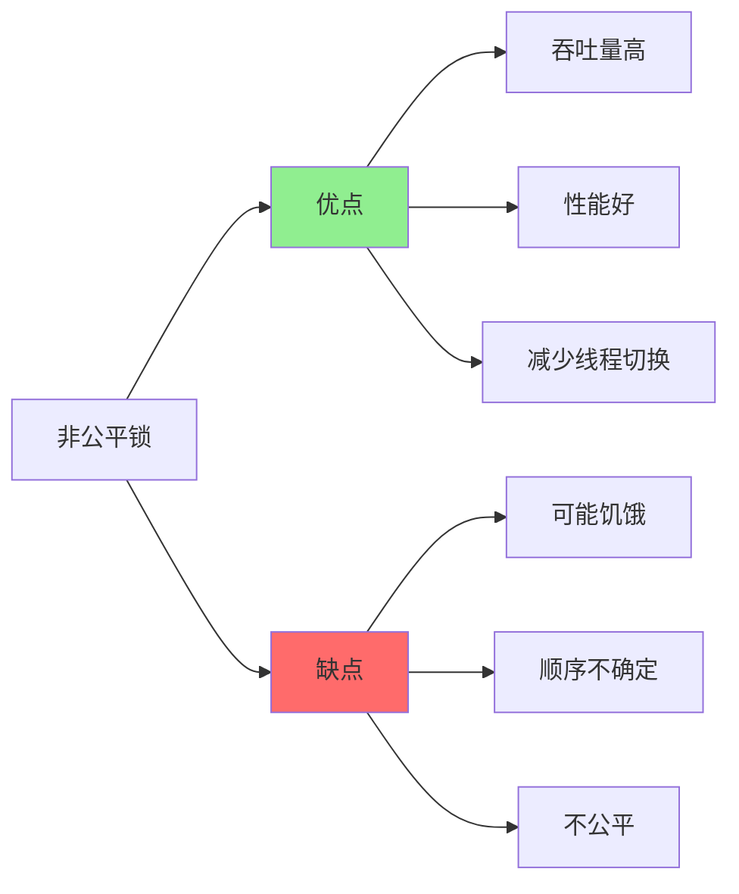
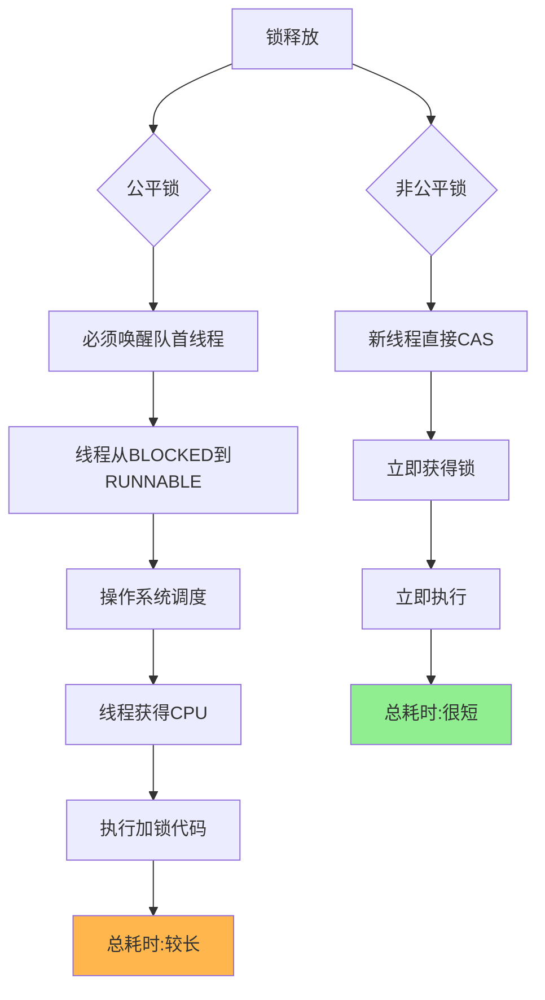
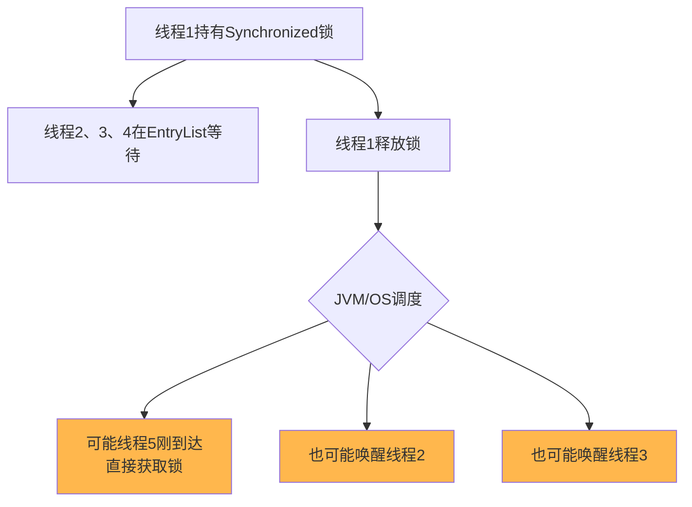
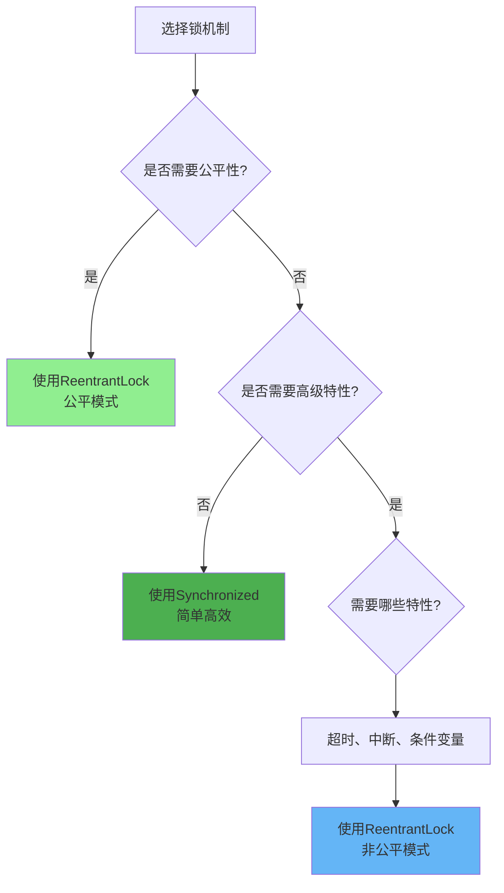

# 锁的公平性与竞争机制

## 公平锁与非公平锁概述

在多线程环境下,当多个线程竞争同一把锁时,如何决定哪个线程获得锁,这就涉及到锁的公平性问题。



## 公平锁:先到先得

### 公平锁的定义

**公平锁保证等待锁的线程按照请求锁的时间顺序获取锁,遵循先进先出(FIFO)原则**。

```java
import java.util.concurrent.locks.ReentrantLock;

public class FairLockDemo {
    // 创建公平锁
    private final ReentrantLock fairLock = new ReentrantLock(true);
    
    public void accessResource() {
        fairLock.lock();
        try {
            String threadName = Thread.currentThread().getName();
            System.out.println(threadName + " 获得锁,时间: " 
                + System.currentTimeMillis());
            
            // 模拟业务处理
            Thread.sleep(100);
        } catch (InterruptedException e) {
            e.printStackTrace();
        } finally {
            fairLock.unlock();
        }
    }
}
```

### 公平锁的工作流程



### 公平锁的核心实现

ReentrantLock公平锁的核心源码(简化版):

```java
static final class FairSync extends Sync {
    
    final void lock() {
        // 直接调用acquire,不会插队
        acquire(1);
    }
    
    protected final boolean tryAcquire(int acquires) {
        final Thread current = Thread.currentThread();
        int c = getState();
        
        if (c == 0) {
            // 关键:检查队列中是否有等待的线程
            if (!hasQueuedPredecessors() &&
                compareAndSetState(0, acquires)) {
                setExclusiveOwnerThread(current);
                return true;
            }
        }
        else if (current == getExclusiveOwnerThread()) {
            // 可重入
            int nextc = c + acquires;
            if (nextc < 0)
                throw new Error("Maximum lock count exceeded");
            setState(nextc);
            return true;
        }
        return false;
    }
    
    // 检查AQS队列中是否有等待线程
    public final boolean hasQueuedPredecessors() {
        Node t = tail;
        Node h = head;
        Node s;
        return h != t &&
            ((s = h.next) == null || s.thread != Thread.currentThread());
    }
}
```

**关键点**:
- `hasQueuedPredecessors()`方法检查AQS队列中是否有等待线程
- 只有队列为空或当前线程是队首时,才允许获取锁
- 保证了先到先得的公平性

### 公平锁的优缺点



**优点**:
- **避免饥饿**: 保证每个线程都能获得锁,不会有线程永远等待
- **顺序明确**: 执行顺序可预测,便于调试和理解
- **公平性**: 符合直觉,先到的先执行

**缺点**:
- **吞吐量下降**: 维护FIFO队列需要额外开销
- **唤醒开销**: 严格按顺序唤醒,增加了上下文切换
- **性能较差**: 在高并发场景下性能明显低于非公平锁

### 公平锁的适用场景

公平锁适合以下场景:

1. **业务有严格的顺序要求**:
```java
public class OrderProcessor {
    private final ReentrantLock lock = new ReentrantLock(true);
    
    // 按照订单提交顺序处理
    public void processOrder(String orderId) {
        lock.lock();
        try {
            System.out.println("处理订单: " + orderId);
            // 订单处理逻辑
        } finally {
            lock.unlock();
        }
    }
}
```

2. **防止线程饥饿**: 确保所有线程都有执行机会

3. **需要可预测的执行顺序**: 调试或测试场景

## 非公平锁:抢占式获取

### 非公平锁的定义

**非公平锁不保证线程获取锁的顺序,允许新到达的线程"插队"直接竞争锁**。

```java
import java.util.concurrent.locks.ReentrantLock;

public class NonfairLockDemo {
    // 创建非公平锁(默认)
    private final ReentrantLock nonfairLock = new ReentrantLock();
    
    public void accessResource() {
        nonfairLock.lock();
        try {
            String threadName = Thread.currentThread().getName();
            System.out.println(threadName + " 获得锁,时间: " 
                + System.currentTimeMillis());
            
            Thread.sleep(100);
        } catch (InterruptedException e) {
            e.printStackTrace();
        } finally {
            nonfairLock.unlock();
        }
    }
}
```

### 非公平锁的工作流程



### 非公平锁的核心实现

ReentrantLock非公平锁的核心源码(简化版):

```java
static final class NonfairSync extends Sync {
    
    final void lock() {
        // 关键:直接尝试CAS获取锁,不检查队列
        if (compareAndSetState(0, 1))
            setExclusiveOwnerThread(Thread.currentThread());
        else
            acquire(1); // CAS失败才进入队列
    }
    
    protected final boolean tryAcquire(int acquires) {
        return nonfairTryAcquire(acquires);
    }
}

final boolean nonfairTryAcquire(int acquires) {
    final Thread current = Thread.currentThread();
    int c = getState();
    
    if (c == 0) {
        // 关键:不检查队列,直接CAS获取
        if (compareAndSetState(0, acquires)) {
            setExclusiveOwnerThread(current);
            return true;
        }
    }
    else if (current == getExclusiveOwnerThread()) {
        // 可重入
        int nextc = c + acquires;
        if (nextc < 0)
            throw new Error("Maximum lock count exceeded");
        setState(nextc);
        return true;
    }
    return false;
}
```

**关键点**:
- `lock()`方法首先直接CAS尝试获取锁,不检查队列
- CAS成功则直接获得锁,实现"插队"
- CAS失败才进入队列等待

### 非公平锁的优缺点



**优点**:
- **高吞吐量**: 减少了线程切换和调度开销
- **性能优秀**: 在高并发下表现更好
- **避免唤醒延迟**: 新线程可能在等待线程被唤醒前获得锁

**缺点**:
- **可能饥饿**: 某些线程可能长时间获取不到锁
- **不可预测**: 无法预知线程的执行顺序
- **不公平**: 不符合先来先服务的直觉

### 为什么非公平锁性能更好



性能差异的根本原因:

1. **线程状态切换**:
   - 公平锁:BLOCKED → RUNNABLE → RUNNING(需要操作系统介入)
   - 非公平锁:可能直接获取,无需状态切换

2. **上下文切换开销**:
   - 公平锁:严格按队列唤醒,增加上下文切换
   - 非公平锁:减少不必要的线程切换

3. **缓存利用**:
   - 刚释放锁的线程,其CPU缓存可能还有效
   - 如果新线程刚好到达,可以利用热缓存,提升性能

## 公平锁 vs 非公平锁对比

### 详细对比表

| 对比维度 | 公平锁 | 非公平锁 |
|---------|-------|---------|
| 获取顺序 | 严格FIFO | 允许插队 |
| 实现复杂度 | 需维护队列顺序 | 实现相对简单 |
| 吞吐量 | 较低 | 较高 |
| 线程切换 | 频繁 | 较少 |
| 饥饿可能 | 不会饥饿 | 可能饥饿 |
| 适用场景 | 顺序要求严格 | 高并发高性能 |
| Java默认 | 非默认 | Synchronized、ReentrantLock默认 |

### 性能测试对比

```java
public class LockPerformanceTest {
    private static final int THREAD_COUNT = 100;
    private static final int ITERATIONS = 10000;
    
    // 公平锁测试
    public static long testFairLock() {
        ReentrantLock lock = new ReentrantLock(true);
        long startTime = System.currentTimeMillis();
        
        CountDownLatch latch = new CountDownLatch(THREAD_COUNT);
        for (int i = 0; i < THREAD_COUNT; i++) {
            new Thread(() -> {
                for (int j = 0; j < ITERATIONS; j++) {
                    lock.lock();
                    try {
                        // 模拟业务操作
                    } finally {
                        lock.unlock();
                    }
                }
                latch.countDown();
            }).start();
        }
        
        try {
            latch.await();
        } catch (InterruptedException e) {
            e.printStackTrace();
        }
        
        return System.currentTimeMillis() - startTime;
    }
    
    // 非公平锁测试
    public static long testNonfairLock() {
        ReentrantLock lock = new ReentrantLock(false);
        // ... 同样的测试逻辑
        return 0;
    }
}
```

典型测试结果(实际结果因环境而异):
- 公平锁耗时: 约3500ms
- 非公平锁耗时: 约2000ms
- **性能差距: 非公平锁快约40-50%**

## Synchronized的公平性

### Synchronized是非公平锁

前面章节提到,Synchronized是一种非公平锁:

```java
public class SynchronizedFairnessTest {
    private final Object lock = new Object();
    
    public void accessResource() {
        synchronized(lock) {
            System.out.println(Thread.currentThread().getName() 
                + " 获得锁");
            try {
                Thread.sleep(10);
            } catch (InterruptedException e) {
                e.printStackTrace();
            }
        }
    }
    
    public static void main(String[] args) {
        SynchronizedFairnessTest test = new SynchronizedFairnessTest();
        
        // 启动10个线程
        for (int i = 0; i < 10; i++) {
            new Thread(() -> test.accessResource(), 
                "Thread-" + i).start();
        }
    }
}
```

输出可能是:
```
Thread-0 获得锁
Thread-5 获得锁  // 不按顺序
Thread-2 获得锁
Thread-7 获得锁
...
```

### Synchronized非公平的体现



Synchronized的非公平性体现在:

1. **JVM层面不保证顺序**: Monitor的EntryList不是严格的FIFO队列

2. **操作系统调度的不确定性**: 线程从BLOCKED到RUNNABLE的时间不确定

3. **性能优先**: 减少线程切换开销,提高吞吐量

### 如何实现公平的Synchronized

如果业务必须保证公平性,可以自己实现:

```java
public class FairSynchronized {
    private final Object lock = new Object();
    private final Queue<Thread> waitQueue = 
        new LinkedBlockingQueue<>();
    private volatile Thread currentThread = null;
    
    public void fairLock() throws InterruptedException {
        Thread thread = Thread.currentThread();
        waitQueue.offer(thread);
        
        synchronized(lock) {
            while (waitQueue.peek() != thread || 
                   currentThread != null) {
                lock.wait();
            }
            
            waitQueue.poll();
            currentThread = thread;
        }
    }
    
    public void fairUnlock() {
        synchronized(lock) {
            currentThread = null;
            lock.notifyAll();
        }
    }
}
```

但这种实现复杂且性能差,不如直接使用ReentrantLock的公平模式。

## 锁的选择建议



### 选择原则

1. **默认选择**: 优先使用Synchronized,简单且性能好

2. **需要公平性**: 使用`new ReentrantLock(true)`

3. **需要超时/中断**: 使用ReentrantLock的高级特性

4. **读多写少**: 考虑ReadWriteLock或StampedLock

5. **性能关键**: 非公平锁性能更好,优先选择

### 实际案例

```java
public class LockSelectionExample {
    
    // 场景1:简单计数器 -> Synchronized
    private int counter = 0;
    
    public synchronized void increment() {
        counter++;
    }
    
    // 场景2:需要公平性 -> 公平ReentrantLock
    private final ReentrantLock fairLock = new ReentrantLock(true);
    
    public void processInOrder() {
        fairLock.lock();
        try {
            // 按顺序处理
        } finally {
            fairLock.unlock();
        }
    }
    
    // 场景3:需要超时 -> ReentrantLock
    private final ReentrantLock timeoutLock = new ReentrantLock();
    
    public boolean tryProcess(long timeout) 
            throws InterruptedException {
        if (timeoutLock.tryLock(timeout, TimeUnit.SECONDS)) {
            try {
                // 处理逻辑
                return true;
            } finally {
                timeoutLock.unlock();
            }
        }
        return false;
    }
}
```

## 核心要点总结

1. **公平锁**: 按FIFO顺序获取锁,避免饥饿,但性能较差
2. **非公平锁**: 允许插队,性能好,但可能导致饥饿
3. **性能差距**: 非公平锁性能通常比公平锁高40-50%
4. **Synchronized**: 是非公平锁,JVM和OS不保证获取顺序
5. **ReentrantLock**: 可选公平或非公平模式,默认非公平
6. **选择建议**: 除非业务明确需要公平性,否则优先选择非公平锁
7. **实现机制**: 公平锁检查队列,非公平锁直接CAS尝试
