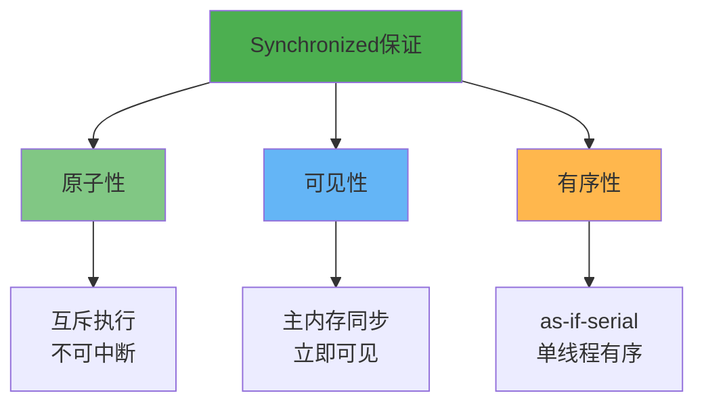
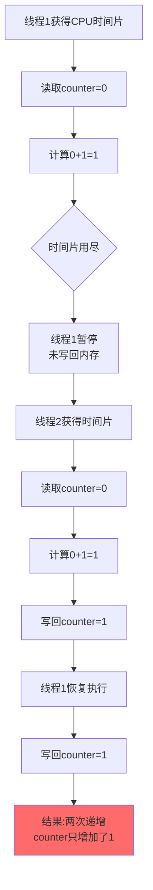
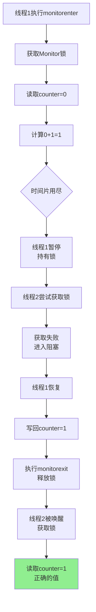
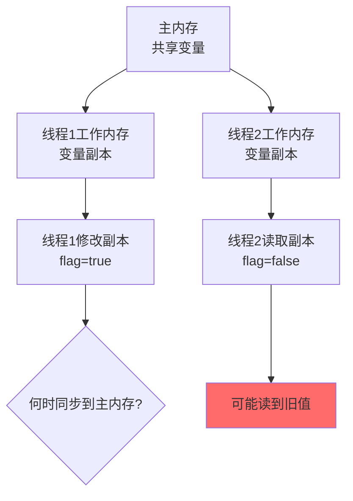
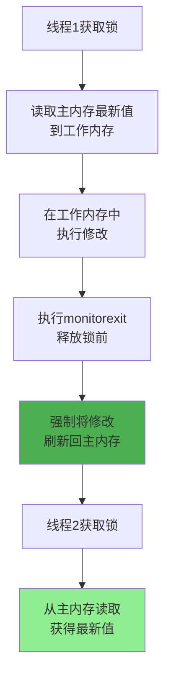
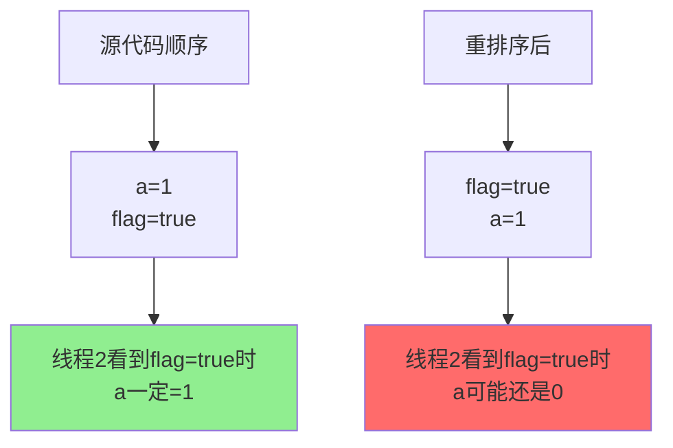
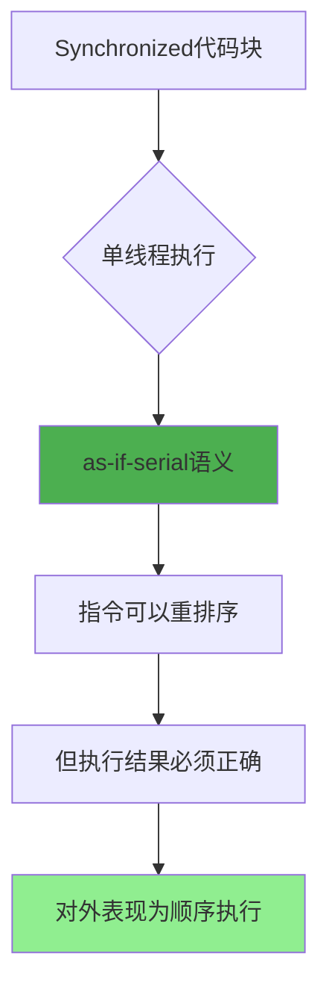
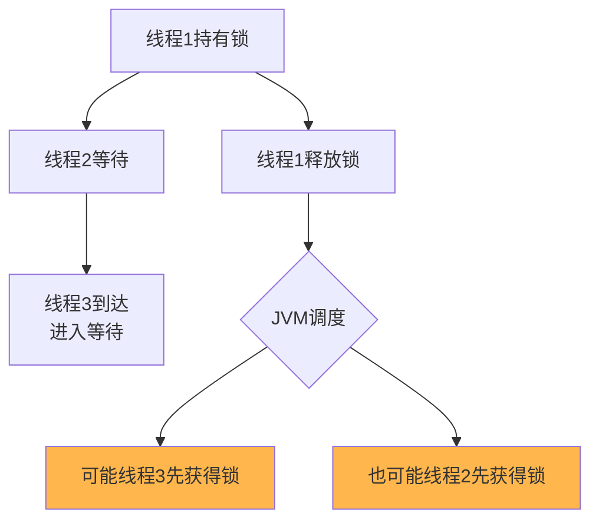
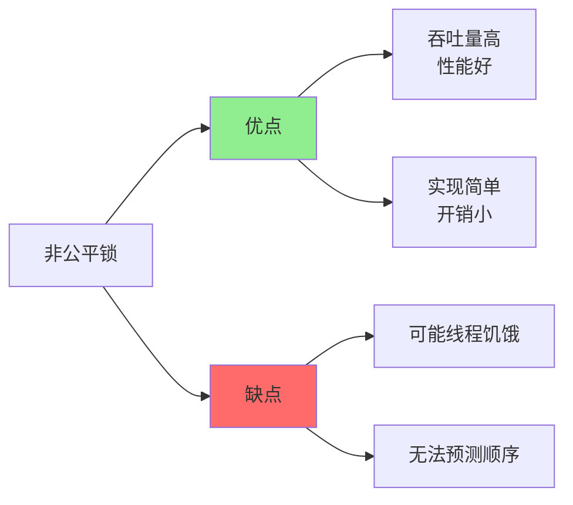
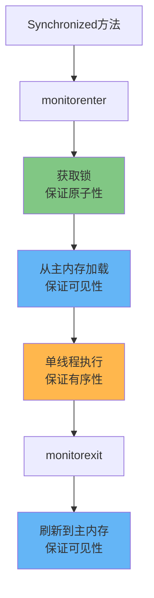

# Synchronized并发特性保证

## 并发编程的三大特性

在多线程编程中,为了保证程序的正确性,需要解决三个核心问题:原子性、可见性、有序性。Synchronized关键字能够同时保证这三个特性。



## 原子性保证

### 什么是原子性

**原子性是指一个操作是不可分割的,要么全部执行,要么完全不执行,中间状态对外不可见**。

在并发场景下,原子性问题的根源在于CPU时间片轮转:

```java
public class AtomicityProblem {
    private int counter = 0;
    
    // 非原子操作
    public void increment() {
        counter++; // 实际包含三步:读取、计算、写入
    }
}
```



这就是典型的原子性问题:操作被中断,导致最终结果不正确。

### Synchronized如何保证原子性

Synchronized通过**Monitor监视器的互斥机制**保证原子性:

```java
public class AtomicitySolution {
    private int counter = 0;
    
    // 使用synchronized保证原子性
    public synchronized void increment() {
        counter++; // 整个操作变为原子操作
    }
}
```



**原子性保证的核心机制**:

1. **monitorenter指令**: 线程进入同步块前必须获取Monitor锁
2. **互斥性**: 同一时刻只有一个线程能持有锁并执行同步代码
3. **不可中断性**: 即使线程失去CPU时间片,锁不会释放
   - 其他线程无法获取锁,无法执行同步代码
   - 当前线程重新获得CPU时间片后继续执行
4. **monitorexit指令**: 代码执行完成后释放锁,保证操作完整性

### 原子性与数据库ACID的区别

很多人混淆并发编程的原子性和数据库ACID的原子性,实际上二者有本质区别:

| 对比维度 | 并发编程原子性 | 数据库ACID原子性 |
|---------|-------------|----------------|
| 定义 | 操作不可中断,中间状态对外不可见 | 事务要么全部成功,要么全部失败 |
| 关注点 | CPU时间片切换导致的操作中断 | 事务执行过程中的故障恢复 |
| 实现机制 | 锁机制保证互斥执行 | 日志和回滚机制保证一致性 |
| 作用范围 | 单个操作或代码块 | 一组数据库操作 |

示例说明:

```java
// 并发编程原子性
public synchronized void transfer(int amount) {
    balance -= amount; // 这一行操作的原子性
}

// 数据库ACID原子性
public void transferMoney(Account from, Account to, int amount) {
    beginTransaction();
    try {
        from.withdraw(amount);  // 操作1
        to.deposit(amount);     // 操作2
        commit(); // 两个操作要么都成功,要么都失败
    } catch (Exception e) {
        rollback();
    }
}
```

## 可见性保证

### 什么是可见性

**可见性是指当一个线程修改了共享变量的值,其他线程能够立即感知到这个修改**。

可见性问题源于Java内存模型(JMM):



每个线程都有自己的工作内存,保存了主内存中变量的副本。线程对变量的操作都在工作内存中进行,可能出现以下问题:

1. 线程1修改了变量,但未及时刷新到主内存
2. 线程2从主内存读取变量到工作内存,读到的是旧值
3. 导致线程2感知不到线程1的修改

### Synchronized如何保证可见性

Synchronized通过**内存屏障和缓存一致性协议**保证可见性:

```java
public class VisibilityDemo {
    private boolean ready = false;
    private int data = 0;
    
    // 写线程
    public synchronized void writer() {
        data = 42;
        ready = true; // 修改共享变量
    } // 解锁时强制刷新到主内存
    
    // 读线程
    public synchronized void reader() {
        // 加锁时强制从主内存读取最新值
        if (ready) {
            System.out.println("数据: " + data);
        }
    }
}
```



**可见性保证的核心机制**:

1. **加锁时的内存同步**:
   - 线程执行monitorenter时,会清空工作内存中的变量副本
   - 强制从主内存重新读取最新值
   - 保证读取到其他线程的最新修改

2. **解锁时的内存同步**:
   - 线程执行monitorexit前,必须将工作内存中的修改刷新到主内存
   - 这是JMM规定的强制要求
   - 保证修改对后续线程可见

3. **Happens-Before规则**:
   - 解锁操作happens-before后续的加锁操作
   - 前一个线程的解锁操作的结果,对后一个线程的加锁操作可见

### 可见性保证的实例验证

```java
public class VisibilityTest {
    private int sharedValue = 0;
    
    public synchronized void updateValue() {
        sharedValue = 100;
        System.out.println("写线程: 设置sharedValue = 100");
    } // monitorexit:强制刷新到主内存
    
    public synchronized void readValue() {
        // monitorenter:强制从主内存读取
        System.out.println("读线程: sharedValue = " + sharedValue);
    }
}
```

即使存在CPU缓存,由于Synchronized的内存屏障机制,读线程总能读到写线程的最新修改。

## 有序性保证

### 什么是有序性

**有序性是指程序执行的顺序按照代码的先后顺序执行**。

有序性问题源于两个层面的优化:

1. **编译器优化**: 编译器可能调整指令顺序以提高性能
2. **处理器优化**: CPU可能乱序执行指令,只保证最终结果一致

```java
public class ReorderingProblem {
    private int a = 0;
    private boolean flag = false;
    
    // 线程1
    public void writer() {
        a = 1;           // 操作1
        flag = true;     // 操作2
        // 可能被重排序为: flag=true; a=1;
    }
    
    // 线程2
    public void reader() {
        if (flag) {      // 操作3
            int i = a;   // 操作4
            // 如果发生重排序,可能读到a=0
        }
    }
}
```



### Synchronized如何保证有序性

Synchronized通过**as-if-serial语义**保证有序性:

```java
public class OrderingDemo {
    private int a = 0;
    private boolean flag = false;
    
    public synchronized void writer() {
        a = 1;           // 操作1
        flag = true;     // 操作2
    } // 单线程语义:操作1一定在操作2之前完成
    
    public synchronized void reader() {
        if (flag) {      // 操作3
            int i = a;   // 操作4
            // 保证读到a=1
        }
    }
}
```

**as-if-serial语义**:不管编译器和处理器如何重排序,单线程程序的执行结果不能被改变。



**有序性保证的核心机制**:

1. **单线程视角**: Synchronized保证同一时刻只有一个线程执行
   - 从单线程的角度看,所有操作都是顺序执行的
   - as-if-serial语义确保单线程内的执行结果正确

2. **多线程视角**: 虽然可能发生指令重排
   - 但重排不会影响单线程的执行结果
   - 其他线程观察到的总是完整的、一致的状态

3. **内存屏障**: Synchronized隐含的内存屏障限制了部分重排序
   - monitorenter后的读写不会被重排到monitorenter之前
   - monitorexit前的读写不会被重排到monitorexit之后

### 扩展:跨线程的有序性

```java
public class CrossThreadOrdering {
    private int x = 0;
    private int y = 0;
    private int a = 0;
    private int b = 0;
    
    // 不使用synchronized:可能出现a=0,b=0的情况
    public void unsafeWrite() {
        // 线程1
        x = 1;  // 1
        a = y;  // 2
        
        // 线程2
        y = 1;  // 3
        b = x;  // 4
        // 由于重排序,可能1和2交换,3和4交换
        // 导致a=0,b=0
    }
    
    // 使用synchronized:保证有序性
    public synchronized void safeWrite() {
        // 单线程顺序执行,不会出现a=0,b=0
        x = 1;
        a = y;
    }
}
```

## Synchronized的非公平性

### 公平性的定义

**公平锁保证等待时间最长的线程优先获取锁,按照请求锁的顺序分配**。相反,非公平锁不保证FIFO顺序。

### Synchronized的非公平特性

Synchronized在实现上并未遵循先来先服务(FIFO)原则,是一种**非公平锁**:

```java
public class NonFairLockDemo {
    
    public synchronized void accessResource() {
        String threadName = Thread.currentThread().getName();
        System.out.println(threadName + " 获得锁,时间: " 
            + System.currentTimeMillis());
        
        try {
            Thread.sleep(100); // 模拟业务处理
        } catch (InterruptedException e) {
            e.printStackTrace();
        }
    }
}
```



### 为什么Synchronized是非公平的

1. **性能优先**: 非公平锁通常比公平锁有更高的吞吐量
   - 维护FIFO队列需要额外的数据结构和同步开销
   - 唤醒等待线程和切换上下文需要时间
   - 非公平锁减少了这些开销

2. **JVM调度的不确定性**:
   - 线程从BLOCKED状态到RUNNABLE状态需要时间
   - JVM和操作系统的调度器并不保证顺序
   - 刚到达的线程可能在等待线程被唤醒前获取锁

3. **设计简化**: 不需要维护等待队列的严格顺序
   - 简化了锁的实现
   - 降低了代码复杂度

### 非公平性的实际表现

```java
public class FairnessTest {
    private final Object lock = new Object();
    
    public void testFairness() throws InterruptedException {
        // 启动10个线程竞争锁
        for (int i = 0; i < 10; i++) {
            final int threadNum = i;
            new Thread(() -> {
                synchronized (lock) {
                    System.out.println("线程" + threadNum + 
                        " 获得锁,时间:" + System.currentTimeMillis());
                    try {
                        Thread.sleep(50);
                    } catch (InterruptedException e) {
                        e.printStackTrace();
                    }
                }
            }, "Thread-" + i).start();
            
            Thread.sleep(10); // 确保线程按顺序启动
        }
    }
}
```

输出可能是:

```
线程0 获得锁,时间:1701234567890
线程5 获得锁,时间:1701234567940  // 后启动的线程先获得锁
线程1 获得锁,时间:1701234567990
线程7 获得锁,时间:1701234568040  // 顺序不确定
...
```

### 非公平锁的优缺点



**优点**:
- **高吞吐量**: 减少了线程切换和唤醒的开销
- **实现简单**: 不需要维护复杂的等待队列

**缺点**:
- **可能饥饿**: 某些线程可能长时间获取不到锁
- **不确定性**: 无法预测线程获取锁的顺序

### 何时需要公平锁

在实际开发中,大多数情况下非公平锁是更好的选择。但以下场景可能需要公平锁:

1. **严格的业务顺序要求**: 如按照用户请求顺序处理
2. **避免饥饿**: 确保所有线程都有机会执行
3. **可预测性要求**: 需要明确的执行顺序

此时应考虑使用ReentrantLock的公平模式:

```java
import java.util.concurrent.locks.ReentrantLock;

public class FairLockExample {
    // 创建公平锁
    private final ReentrantLock fairLock = new ReentrantLock(true);
    
    public void accessResource() {
        fairLock.lock();
        try {
            // 业务逻辑
            System.out.println(Thread.currentThread().getName() + " 执行");
        } finally {
            fairLock.unlock();
        }
    }
}
```

## 并发特性保证的综合应用

```java
public class ComprehensiveDemo {
    private int balance = 1000;
    private boolean initialized = false;
    
    // 同时保证原子性、可见性、有序性
    public synchronized void withdraw(int amount) {
        // 原子性:整个方法作为一个不可分割的操作
        if (!initialized) {
            initialize();
            initialized = true;
        }
        
        // 可见性:balance的修改对其他线程立即可见
        if (balance >= amount) {
            balance -= amount;
            System.out.println("取款" + amount + 
                ",余额:" + balance);
        }
        
        // 有序性:在单线程视角下,操作顺序符合代码顺序
    } // monitorexit:刷新到主内存,保证可见性
    
    private void initialize() {
        // 初始化逻辑
        System.out.println("账户初始化");
    }
}
```



## 核心要点总结

1. **原子性**: 通过Monitor的互斥机制,保证同步代码不可分割地执行
2. **可见性**: 通过内存屏障,加锁时读取最新值,解锁时刷新修改到主内存
3. **有序性**: 通过as-if-serial语义,保证单线程视角下的顺序执行
4. **非公平性**: Synchronized不保证FIFO顺序,但提供更高的性能
5. **综合保证**: Synchronized能够同时满足并发编程的三大特性
6. **性能权衡**: 非公平设计牺牲了公平性,换取了更高的吞吐量
7. **实际应用**: 理解这些特性有助于正确使用Synchronized解决并发问题
