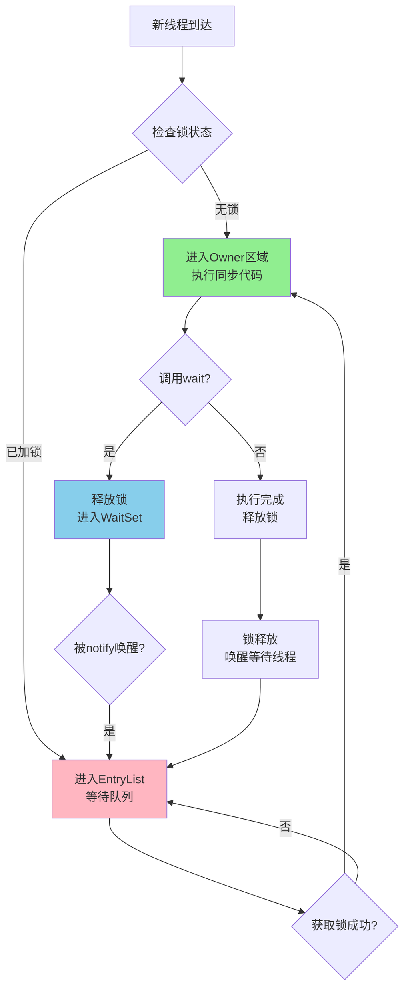
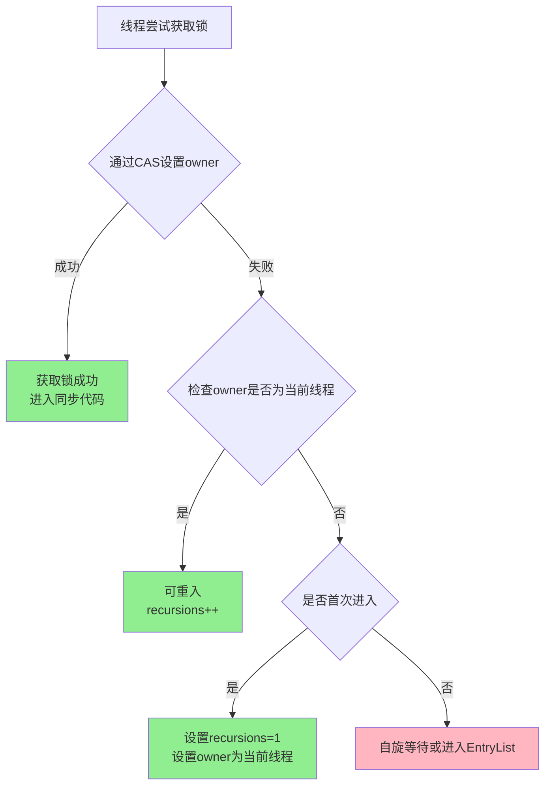
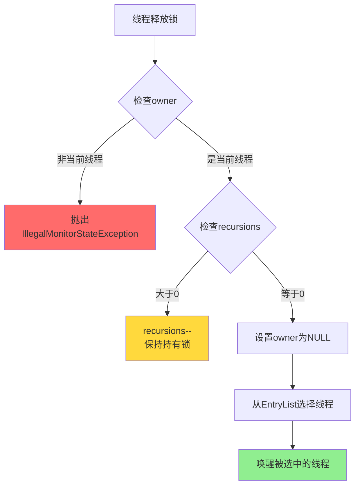
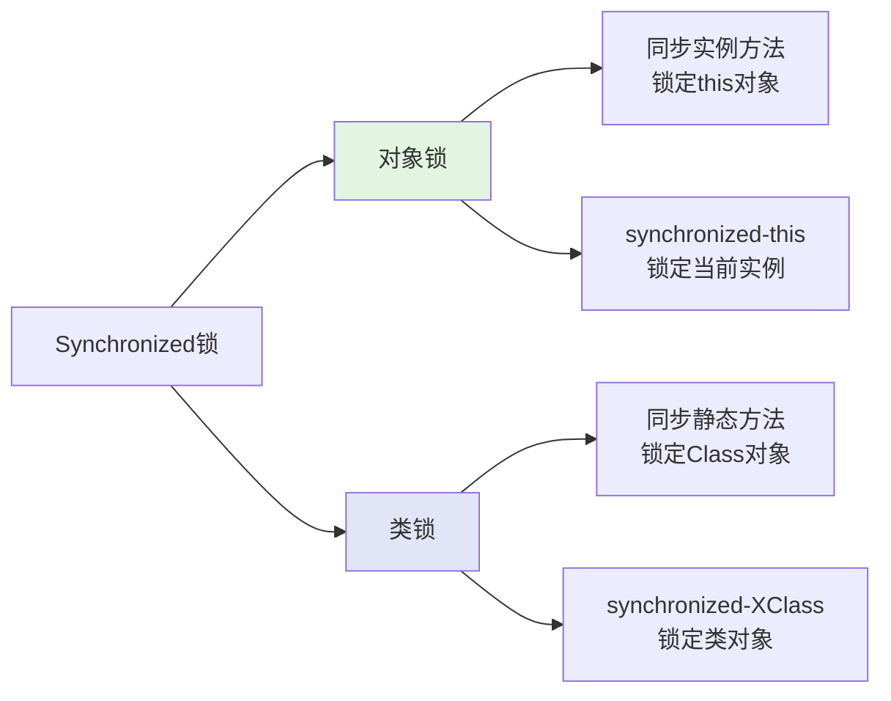
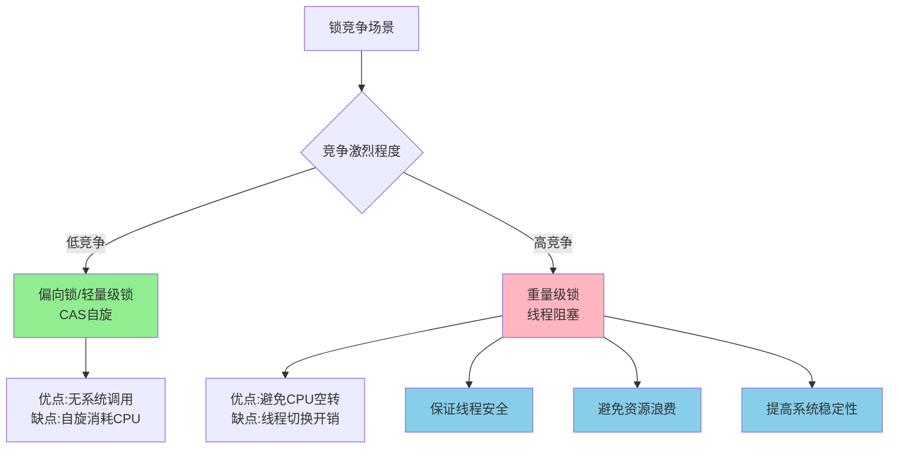

# Synchronized实现原理与核心机制

## Synchronized的基本特性

Synchronized是Java中用于实现线程同步的核心关键字,具有以下重要特征:

- **互斥性**: 同一时刻只允许一个线程持有锁并执行同步代码
- **阻塞性**: 未获得锁的线程必须阻塞等待,直到锁被释放
- **可重入性**: 同一线程可以多次获取已持有的锁,避免自身死锁

## Synchronized的使用方式

### 同步实例方法

```java
public class AccountService {
    private int balance = 1000;
    
    // 同步实例方法,锁定的是当前对象实例
    public synchronized void withdraw(int amount) {
        if (balance >= amount) {
            balance -= amount;
            System.out.println("取款成功,余额: " + balance);
        }
    }
}
```

### 同步静态方法

```java
public class ConfigManager {
    private static Properties config = new Properties();
    
    // 同步静态方法,锁定的是类对象
    public static synchronized void updateConfig(String key, String value) {
        config.setProperty(key, value);
        System.out.println("配置更新: " + key + "=" + value);
    }
}
```

### 同步代码块(对象锁)

```java
public class OrderProcessor {
    private final Object lock = new Object();
    
    public void processOrder(String orderId) {
        // 锁定特定对象
        synchronized (lock) {
            System.out.println("处理订单: " + orderId);
            // 订单处理逻辑
        }
    }
}
```

### 同步代码块(类锁)

```java
public class GlobalCounter {
    
    public void incrementGlobal() {
        // 锁定类对象
        synchronized (GlobalCounter.class) {
            System.out.println("全局计数器递增");
            // 全局计数逻辑
        }
    }
}
```

## 底层实现机制

### 字节码层面的实现

Synchronized在字节码层面有两种不同的实现方式:

**同步方法**通过方法访问标志`ACC_SYNCHRONIZED`实现。当线程调用同步方法时:
1. 检查方法是否包含`ACC_SYNCHRONIZED`标志
2. 如果有,则尝试获取监视器锁
3. 获取成功后执行方法体
4. 方法结束时自动释放监视器锁
5. 即使方法抛出异常,监视器锁也会被正确释放

**同步代码块**使用`monitorenter`和`monitorexit`指令实现:
- `monitorenter`: 尝试获取对象的监视器锁,将锁计数器+1
- `monitorexit`: 释放监视器锁,将锁计数器-1
- 当计数器为0时,锁完全释放,其他线程可以竞争获取

## Monitor监视器机制

### Monitor的概念模型

Monitor可以理解为一个特殊的房间,这个房间同一时刻只允许一个线程进入:



Monitor机制包含三个关键区域:

- **Entry Set(入口集)**: 等待获取锁的线程队列
- **Owner(持有者)**: 当前持有锁的线程
- **Wait Set(等待集)**: 调用wait()方法后等待通知的线程集合

### Monitor的核心数据结构

Monitor在HotSpot虚拟机中通过ObjectMonitor类实现,其核心属性包括:

- `_owner`: 指向持有锁的线程
- `_EntryList`: 阻塞等待锁的线程队列
- `_WaitSet`: 调用wait()后等待的线程集合
- `_recursions`: 记录锁的重入次数
- `_count`: 记录线程获取锁的次数

### 获取锁的流程



线程获取Monitor锁的详细步骤:

1. **快速路径**: 使用CAS操作尝试将`_owner`从NULL设置为当前线程
   - 成功: 获取锁,继续执行
   - 失败: 说明锁已被占用,进入下一步

2. **重入检查**: 判断当前线程是否已持有该锁
   - 如果`_owner`等于当前线程,说明是重入,`_recursions`递增
   - 否则进入竞争流程

3. **竞争流程**: 线程进入`_EntryList`等待队列
   - 通过自旋或阻塞等待锁释放
   - 当锁释放时,从等待队列中选择一个线程唤醒

### 释放锁的流程



释放Monitor锁的关键步骤:

1. **合法性检查**: 确认当前线程是锁的持有者
2. **重入计数处理**: 
   - 如果`_recursions > 0`,递减计数,保持锁持有状态
   - 如果`_recursions == 0`,准备释放锁
3. **唤醒等待线程**: 从`_EntryList`中根据策略选择线程唤醒
4. **状态重置**: 将`_owner`设置为NULL,锁完全释放

## Synchronized锁定的对象

很多开发者容易混淆Synchronized到底锁定的是什么。**核心原则是:Synchronized始终锁定的是对象**。

### 实例方法锁定实例对象

```java
public class TaskProcessor implements Runnable {
    
    public synchronized void executeTask() {
        try {
            Thread.sleep(1000);
            System.out.println(Thread.currentThread().getName() + 
                " 执行时间: " + System.currentTimeMillis());
        } catch (InterruptedException e) {
            e.printStackTrace();
        }
    }
    
    @Override
    public void run() {
        executeTask();
    }
}

// 测试代码
public static void main(String[] args) {
    // 每个线程持有不同的TaskProcessor实例
    for (int i = 0; i < 5; i++) {
        TaskProcessor processor = new TaskProcessor();
        new Thread(processor, "Thread-" + i).start();
    }
}
```

输出结果显示所有线程几乎同时执行,因为**每个线程锁定的是不同的对象实例**:

```
Thread-0 执行时间: 1701234567890
Thread-1 执行时间: 1701234567890
Thread-2 执行时间: 1701234567891
Thread-3 执行时间: 1701234567891
Thread-4 执行时间: 1701234567891
```

### 静态方法锁定类对象

```java
public class GlobalTaskProcessor implements Runnable {
    
    public static synchronized void executeTask() {
        try {
            Thread.sleep(1000);
            System.out.println(Thread.currentThread().getName() + 
                " 执行时间: " + System.currentTimeMillis());
        } catch (InterruptedException e) {
            e.printStackTrace();
        }
    }
    
    @Override
    public void run() {
        executeTask();
    }
}

// 测试代码
public static void main(String[] args) {
    // 多个线程调用静态同步方法
    for (int i = 0; i < 5; i++) {
        GlobalTaskProcessor processor = new GlobalTaskProcessor();
        new Thread(processor, "Thread-" + i).start();
    }
}
```

输出结果显示线程串行执行,因为**所有线程锁定的是同一个类对象**:

```
Thread-0 执行时间: 1701234567890
Thread-1 执行时间: 1701234568891
Thread-2 执行时间: 1701234569892
Thread-3 执行时间: 1701234570893
Thread-4 执行时间: 1701234571894
```

### 对象锁与类锁的区别



**核心区别**:
- **对象锁**: 每个实例都有独立的锁,不同实例间互不影响
- **类锁**: 整个类只有一个类对象,所有线程共享同一把锁

## 重量级锁的性能特点

Synchronized本质上是一种重量级锁,涉及操作系统层面的线程调度:

### 重量级锁的开销

1. **用户态到内核态的切换**: 
   - 线程阻塞和唤醒需要操作系统介入
   - 状态切换消耗大量处理器时间
   - 对于简单同步操作,状态切换时间可能超过业务代码执行时间

2. **线程调度开销**:
   - 线程在Entry Set中等待时处于BLOCKED状态
   - 需要操作系统调度器管理线程队列
   - 线程唤醒和上下文切换带来额外开销

### 为什么仍需要重量级锁



重量级锁在以下场景中不可或缺:

1. **高并发竞争**: 多个线程同时竞争锁时,轻量级锁的自旋会导致CPU资源浪费,阻塞机制更高效

2. **保证线程安全**: 通过阻塞机制确保同一时刻只有一个线程访问临界资源,避免数据竞争

3. **避免CPU空转**: 在锁持有时间较长的场景下,阻塞比自旋更节省CPU资源

4. **系统稳定性**: 重量级锁能够处理各种复杂的并发场景,保证系统的可靠性

类比理解: 食堂窗口买早餐,只有一个窗口营业:
- **无竞争**: 直接购买,无需排队(偏向锁优化)
- **少量竞争**: 在窗口前等待片刻(轻量级锁自旋)
- **大量竞争**: 必须排队取号等候(重量级锁阻塞)

排队机制看似效率低,但在人多时反而能保证秩序,避免拥挤和混乱,这就是重量级锁存在的意义。

## 核心要点总结

1. Synchronized通过Monitor监视器机制实现线程同步
2. 同步方法使用ACC_SYNCHRONIZED标志,同步代码块使用monitorenter/monitorexit指令
3. Monitor包含EntryList、Owner、WaitSet三个核心区域
4. Synchronized始终锁定对象,区分为对象锁和类锁
5. 重量级锁虽然有性能开销,但在高并发场景下仍然必需
6. 可重入特性通过递增计数器实现,避免自身死锁
