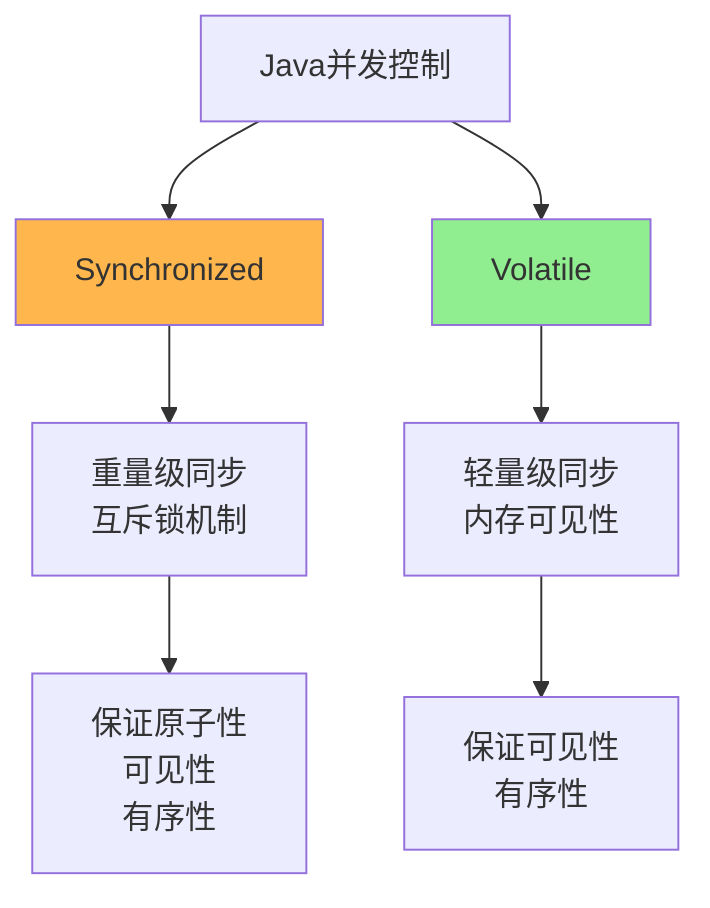
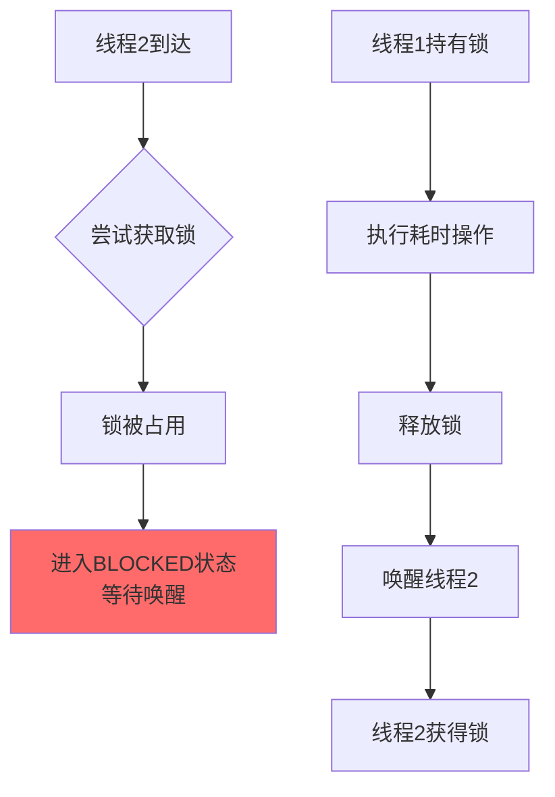
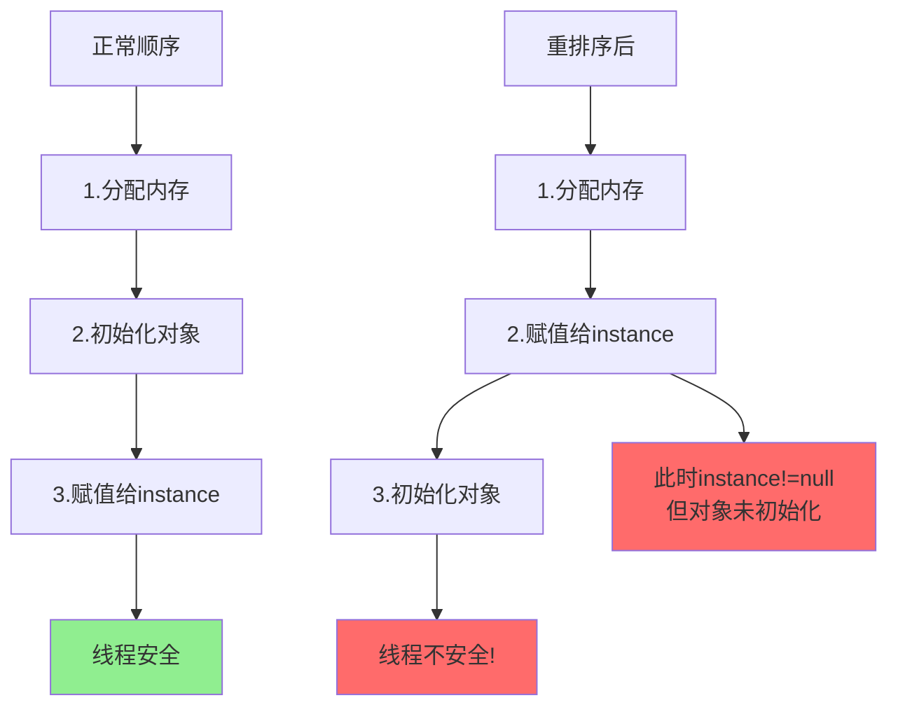
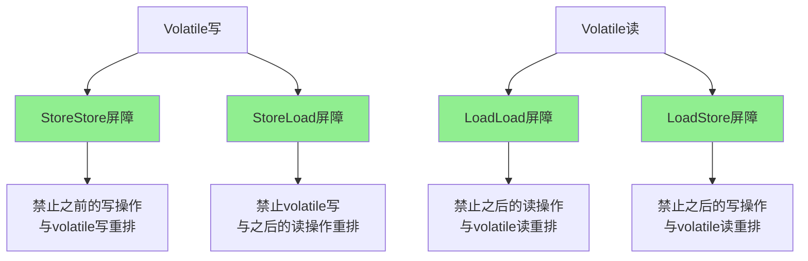
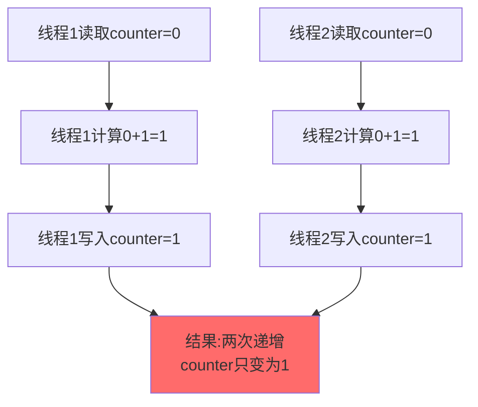
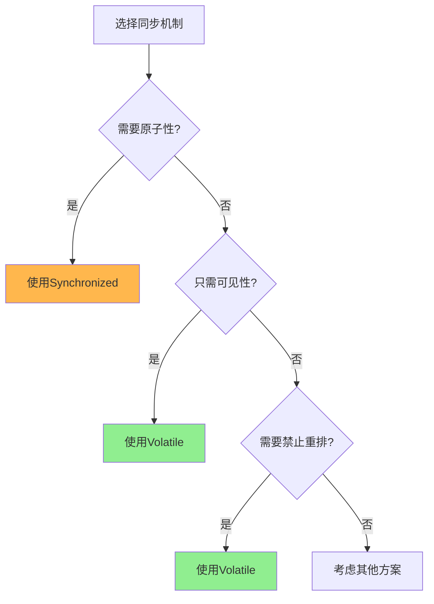

# Volatile与Synchronized对比分析

## 两种同步机制概述

Volatile和Synchronized都是Java提供的并发控制机制,但它们的设计目标和适用场景有很大不同。



## Synchronized的局限性

### 性能损耗

虽然JDK 1.6对Synchronized进行了大量优化(偏向锁、轻量级锁、锁消除等),但它本质上仍然是一种锁机制,存在性能开销:

```java
public class SynchronizedOverhead {
    private int counter = 0;
    
    // 即使是简单操作,也需要加锁解锁
    public synchronized void increment() {
        counter++; // 简单操作
    }
}
```

**性能开销来源**:
1. **加锁解锁过程**: 需要执行monitorenter和monitorexit指令
2. **锁竞争处理**: 未获得锁的线程需要阻塞或自旋
3. **Monitor对象管理**: 需要维护Monitor数据结构
4. **可能的线程切换**: 用户态和内核态的切换开销

即使经过优化,在某些场景下,Synchronized仍比Volatile慢得多。

### 阻塞特性

Synchronized是一种**阻塞锁**,未获得锁的线程必须等待:

```java
public class BlockingExample {
    private final Object lock = new Object();
    
    public void method1() {
        synchronized(lock) {
            // 线程1持有锁,执行耗时操作
            heavyOperation();
        }
    }
    
    public void method2() {
        synchronized(lock) {
            // 线程2被阻塞,进入BLOCKED状态
            // 必须等待线程1释放锁
        }
    }
}
```



**阻塞的问题**:
- 线程进入BLOCKED状态,不消耗CPU,但也无法做其他工作
- 需要操作系统调度,涉及用户态和内核态切换
- 频繁的阻塞和唤醒会降低系统性能

而Volatile是无锁的,不会导致线程阻塞。

## Volatile的优势

### 轻量级同步

Volatile是一种轻量级的同步机制,基于内存屏障实现,无需加锁:

```java
public class VolatileExample {
    private volatile boolean flag = false;
    private int data = 0;
    
    // 写线程:无需加锁
    public void writer() {
        data = 42;
        flag = true; // volatile写,插入StoreStore屏障
    }
    
    // 读线程:无需加锁
    public void reader() {
        if (flag) { // volatile读,插入LoadLoad屏障
            System.out.println("数据: " + data);
        }
    }
}
```

**Volatile的性能优势**:
- **无锁开销**: 不需要加锁解锁,避免了Monitor的开销
- **不会阻塞**: 读写操作都不会导致线程阻塞
- **硬件支持**: 利用CPU的内存屏障指令,性能接近普通变量

```java
// 性能对比示例
public class PerformanceComparison {
    private volatile int volatileCounter = 0;
    private int syncCounter = 0;
    
    // Volatile:快速读取
    public int getVolatileCounter() {
        return volatileCounter; // 几乎无开销
    }
    
    // Synchronized:需要加锁
    public synchronized int getSyncCounter() {
        return syncCounter; // 需要monitorenter/monitorexit
    }
}
```

根据实际测试,Volatile变量的读操作性能与普通变量几乎无差别,写操作虽然需要插入内存屏障,但仍远快于Synchronized。

### 禁止指令重排

Volatile的一个重要附加功能是**禁止指令重排序**,这在某些场景下是Synchronized无法替代的。

#### 双重检查锁定(DCL)问题

这是一个经典的需要Volatile的场景:

```java
public class Singleton {
    // 错误:没有volatile
    private static Singleton instance;
    
    public static Singleton getInstance() {
        if (instance == null) { // 第一次检查
            synchronized (Singleton.class) {
                if (instance == null) { // 第二次检查
                    instance = new Singleton(); // 可能发生指令重排!
                }
            }
        }
        return instance;
    }
}
```

**问题分析**: `instance = new Singleton()`不是原子操作,包含三个步骤:

1. 分配内存空间
2. 在内存空间上初始化对象
3. 将内存地址赋值给instance变量

可能被重排序为:

1. 分配内存空间
2. 将内存地址赋值给instance变量(对象未初始化!)
3. 在内存空间上初始化对象



如果发生重排序:

```java
// 线程1执行getInstance()
if (instance == null) {
    synchronized (Singleton.class) {
        if (instance == null) {
            // 步骤1:分配内存
            // 步骤2:instance指向内存(但对象未初始化!)
            // 此时线程2进入...
        }
    }
}

// 线程2执行getInstance()
if (instance == null) { // instance != null,检查通过
    // 直接返回instance
    // 但此时对象还未初始化!
    return instance; // 返回不完整的对象,可能导致NPE
}
```

**解决方案**: 使用volatile禁止指令重排

```java
public class Singleton {
    // 正确:使用volatile
    private static volatile Singleton instance;
    
    public static Singleton getInstance() {
        if (instance == null) {
            synchronized (Singleton.class) {
                if (instance == null) {
                    instance = new Singleton();
                    // volatile保证:
                    // 1. 初始化完成后才会赋值
                    // 2. 赋值后立即对其他线程可见
                }
            }
        }
        return instance;
    }
}
```

Volatile的内存屏障确保:
1. **写屏障**: 对象初始化完成后,才会将引用赋值给instance
2. **读屏障**: 读取instance时,能看到完整的对象

### Volatile禁止重排的机制



Volatile通过插入内存屏障,禁止特定的指令重排序:

1. **写操作**:
   - 在volatile写之前插入StoreStore屏障
   - 在volatile写之后插入StoreLoad屏障
   - 确保普通写不会重排到volatile写之后

2. **读操作**:
   - 在volatile读之后插入LoadLoad屏障
   - 在volatile读之后插入LoadStore屏障
   - 确保普通读不会重排到volatile读之前

## Synchronized vs Volatile对比

### 功能对比

| 特性 | Synchronized | Volatile |
|------|-------------|----------|
| 原子性 | 保证 | **不保证** |
| 可见性 | 保证 | 保证 |
| 有序性 | 保证(as-if-serial) | 保证(禁止重排) |
| 实现机制 | Monitor互斥锁 | 内存屏障 |
| 阻塞性 | 阻塞锁 | 非阻塞 |
| 性能 | 较重 | 轻量 |
| 适用范围 | 方法、代码块 | 变量 |

### 原子性对比

```java
public class AtomicityComparison {
    private volatile int volatileCounter = 0;
    private int syncCounter = 0;
    
    // Volatile:不保证原子性
    public void incrementVolatile() {
        volatileCounter++; // 非原子操作!
        // 包含:读取、加1、写入三个步骤
        // volatile只保证可见性,不保证原子性
    }
    
    // Synchronized:保证原子性
    public synchronized void incrementSync() {
        syncCounter++; // 原子操作
        // 整个方法互斥执行
    }
}
```

**并发测试**:

```java
public static void main(String[] args) throws InterruptedException {
    AtomicityComparison demo = new AtomicityComparison();
    
    // 1000个线程,每个递增1000次
    for (int i = 0; i < 1000; i++) {
        new Thread(() -> {
            for (int j = 0; j < 1000; j++) {
                demo.incrementVolatile();
                demo.incrementSync();
            }
        }).start();
    }
    
    Thread.sleep(5000);
    
    System.out.println("Volatile计数器: " + demo.volatileCounter);
    System.out.println("Synchronized计数器: " + demo.syncCounter);
}
```

输出:
```
Volatile计数器: 987234  // 小于1000000,丢失更新!
Synchronized计数器: 1000000  // 正确
```

**原因**: Volatile的`volatileCounter++`不是原子操作:



### 性能对比

```java
public class PerformanceTest {
    private volatile boolean volatileFlag = false;
    private boolean syncFlag = false;
    private final Object lock = new Object();
    
    // Volatile读:性能接近普通变量
    public boolean readVolatile() {
        return volatileFlag;
    }
    
    // Synchronized读:需要加锁
    public boolean readSync() {
        synchronized(lock) {
            return syncFlag;
        }
    }
}
```

性能测试结果(10亿次读操作):
- Volatile读: 约100ms
- Synchronized读: 约3000ms
- **Volatile性能是Synchronized的30倍**

### 适用场景对比



**Volatile适用场景**:

1. **状态标志**:
```java
public class StatusFlag {
    private volatile boolean running = true;
    
    // 写线程
    public void stop() {
        running = false; // 简单赋值,原子操作
    }
    
    // 读线程
    public void work() {
        while (running) {
            // 执行任务
        }
    }
}
```

2. **双重检查锁定**:
```java
private static volatile Singleton instance;
```

3. **读多写少**:
```java
public class Configuration {
    private volatile Properties config;
    
    // 读多
    public String getProperty(String key) {
        return config.getProperty(key);
    }
    
    // 写少
    public synchronized void reload() {
        config = loadFromFile();
    }
}
```

**Synchronized适用场景**:

1. **复合操作**:
```java
public synchronized void increment() {
    counter++; // 需要原子性
}
```

2. **多个变量的一致性**:
```java
public synchronized void transfer(int amount) {
    balance -= amount;
    otherBalance += amount;
    // 两个操作必须原子执行
}
```

3. **等待/通知机制**:
```java
public synchronized void waitForCondition() throws InterruptedException {
    while (!condition) {
        wait(); // Volatile不支持wait/notify
    }
}
```

## 为什么有了Synchronized还需要Volatile

综合来看,Volatile的存在主要有以下几个原因:

### 1. 性能优势

对于不需要原子性的场景,Volatile提供了极致的性能:

```java
public class LightweightSync {
    // 场景:状态标志,只需要可见性
    private volatile boolean ready = false;
    
    // 写线程
    public void setReady() {
        // 准备工作...
        ready = true; // Volatile写,性能远超synchronized
    }
    
    // 读线程
    public void doWork() {
        while (!ready) {
            // 等待ready变为true
        }
        // 执行工作
    }
}
```

如果使用Synchronized:

```java
public class HeavyweightSync {
    private boolean ready = false;
    
    public synchronized void setReady() {
        ready = true; // 性能比volatile慢很多
    }
    
    public synchronized boolean isReady() {
        return ready; // 每次读取都要加锁
    }
}
```

### 2. 禁止指令重排

这是Volatile的独特能力,Synchronized虽然也能保证有序性,但机制不同:

- **Synchronized**: 通过as-if-serial语义,保证单线程视角下的有序性
- **Volatile**: 通过内存屏障,直接禁止特定的指令重排序

某些场景下,必须用Volatile:

```java
public class InitializationOrder {
    private Map<String, String> config;
    private volatile boolean initialized = false;
    
    public void init() {
        config = new HashMap<>();
        config.put("key1", "value1");
        config.put("key2", "value2");
        // 确保config完全初始化后,才设置标志
        initialized = true; // volatile禁止重排
    }
    
    public String getConfig(String key) {
        if (initialized) {
            // 确保能看到完整的config
            return config.get(key);
        }
        return null;
    }
}
```

### 3. 避免过度同步

不是所有场景都需要互斥:

```java
public class SharedState {
    // 多个线程读取,偶尔一个线程写入
    private volatile int sharedValue;
    
    // 大量线程并发读取,无需加锁
    public int getValue() {
        return sharedValue; // 高性能读取
    }
    
    // 写入较少,可以接受非原子性
    public void setValue(int value) {
        sharedValue = value; // 立即可见
    }
}
```

如果用Synchronized,会导致读操作也要加锁,大幅降低并发度。

## 组合使用

很多场景下,Volatile和Synchronized需要配合使用:

```java
public class CombinedUsage {
    private volatile boolean flag = false;
    private final Object lock = new Object();
    private List<String> data = new ArrayList<>();
    
    // Volatile用于状态标志
    public void setFlag() {
        flag = true;
    }
    
    // Synchronized用于保护复杂操作
    public void addData(String item) {
        synchronized(lock) {
            data.add(item);
        }
    }
    
    // 组合使用
    public void process() {
        if (flag) { // Volatile读,高性能检查
            synchronized(lock) { // 复杂操作加锁
                data.clear();
            }
        }
    }
}
```

## 核心要点总结

1. **Volatile**: 轻量级,保证可见性和有序性,不保证原子性
2. **Synchronized**: 重量级,保证原子性、可见性、有序性
3. **性能**: Volatile远快于Synchronized,尤其是读操作
4. **阻塞**: Synchronized会阻塞,Volatile不会
5. **指令重排**: Volatile通过内存屏障禁止重排,Synchronized通过as-if-serial保证
6. **适用场景**: Volatile用于状态标志、DCL;Synchronized用于复合操作、互斥访问
7. **选择原则**: 能用Volatile就用Volatile,需要原子性才用Synchronized
8. **组合使用**: 两者可以配合,发挥各自优势
